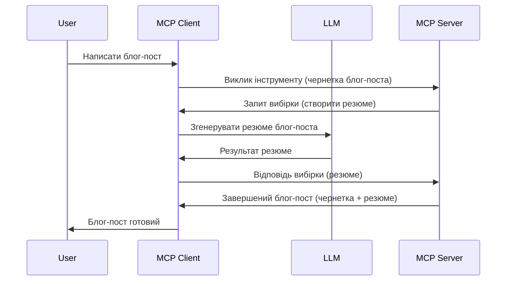

# Вибірка – делегування функцій Клієнту

Іноді потрібна співпраця MCP Клієнта та MCP Сервера для досягнення спільної мети. Можливий випадок, коли Сервер потребує допомоги LLM, який розташований на клієнті. У такій ситуації слід використовувати вибірку.

Давайте розглянемо кілька кейсів і як побудувати рішення з використанням вибірки.

## Огляд

У цьому уроці ми зосередимось на поясненні, коли і де використовувати Вибірку та як її налаштувати.

## Цілі навчання

У цій главі ми:

- Пояснимо, що таке Вибірка і коли її слід використовувати.
- Покажемо, як налаштувати Вибірку в MCP.
- Наведемо приклади використання Вибірки на практиці.

## Що таке Вибірка і навіщо її використовувати?

Вибірка – це просунута функція, яка працює таким чином:


### Запит вибірки

Отже, тепер у нас є загальна картина правдоподібного сценарію, поговоримо про запит вибірки, який сервер надсилає назад клієнту. Ось як такий запит може виглядати у форматі JSON-RPC:

```json
{
  "jsonrpc": "2.0",
  "id": 1,
  "method": "sampling/createMessage",
  "params": {
    "messages": [
      {
        "role": "user",
        "content": {
          "type": "text",
          "text": "Create a blog post summary of the following blog post: <BLOG POST>"
        }
      }
    ],
    "modelPreferences": {
      "hints": [
        {
          "name": "claude-3-sonnet"
        }
      ],
      "intelligencePriority": 0.8,
      "speedPriority": 0.5
    },
    "systemPrompt": "You are a helpful assistant.",
    "maxTokens": 100
  }
}
```

Тут варто звернути увагу на кілька моментів:

- Prompt, в полі content -> text, — наш prompt, інструкція для LLM узагальнити вміст блогу.
- **modelPreferences**. Цей розділ саме про переваги, рекомендації щодо конфігурації LLM. Користувач може прийняти ці рекомендації або змінити їх. У цьому випадку є рекомендації щодо моделі, швидкості та пріоритету інтелекту.
- **systemPrompt** – це ваш звичайний системний prompt, що задає особистість LLM і надає інструкції.
- **maxTokens** — ще одна властивість, яка вказує, скільки токенів рекомендується використовувати для цього завдання.

### Відповідь вибірки

Це відповідь, яку MCP Клієнт відправляє назад MCP Серверу, результат виклику LLM клієнтом, очікування відповіді та формування повідомлення. Ось як це виглядає у форматі JSON-RPC:

```json
{
  "jsonrpc": "2.0",
  "id": 1,
  "result": {
    "role": "assistant",
    "content": {
      "type": "text",
      "text": "Here's your abstract <ABSTRACT>"
    },
    "model": "gpt-5",
    "stopReason": "endTurn"
  }
}
```

Зверніть увагу, що відповідь є абстрактом посту, як ми й просили. Також зауважте, що використана `model` не та, про яку ми просили, а "gpt-5" замість "claude-3-sonnet". Це ілюструє, що користувач може змінити свою думку щодо використання, а ваш запит на вибірку — це рекомендація.

Отже, тепер, коли ми розуміємо основний потік і корисне завдання типу «створення блогу + абстракт», подивимося, що потрібно зробити, щоб це запрацювало.

### Типи повідомлень

Повідомлення вибірки не обмежуються лише текстом, також можна надсилати зображення і аудіо. Ось як відрізняється JSON-RPC:

**Текст**

```json
{
  "type": "text",
  "text": "The message content"
}
```

**Вміст зображення**

```json
{
  "type": "image",
  "data": "base64-encoded-image-data",
  "mimeType": "image/jpeg"
}
```

**Аудіовміст**

```json
{
  "type": "audio",
  "data": "base64-encoded-audio-data",
  "mimeType": "audio/wav"
}
```

> NOTE: для детальнішої інформації про Вибірку перегляньте [офіційну документацію](https://modelcontextprotocol.io/specification/2025-06-18/client/sampling)

## Як налаштувати Вибірку у клієнті

> Примітка: якщо ви створюєте лише сервер, тут робити майже нічого не потрібно.

У клієнті треба вказати наступну функцію так:

```json
{
  "capabilities": {
    "sampling": {}
  }
}
```

Після цього вона буде врахована при ініціалізації вашого вибраного клієнта з сервером.

## Приклад використання Вибірки – створення допису в блозі

Давайте разом пропишемо сервер вибірки, для цього потрібно:

1. Створити інструмент на Сервері.
1. Цей інструмент має створити запит вибірки.
1. Інструмент повинен чекати відповіді на запит вибірки клієнта.
1. Потім має бути створений результат інструмента.

Розглянемо код крок за кроком:

### -1- Створіть інструмент

**python**

```python
@mcp.tool()
async def create_blog(title: str, content: str, ctx: Context[ServerSession, None]) -> str:
    """Create a blog post and generate a summary"""

```

### -2- Створіть запит вибірки

Розширте ваш інструмент таким кодом:

**python**

```python
post = BlogPost(
        id=len(posts) + 1,
        title=title,
        content=content,
        abstract=""
    )

prompt = f"Create an abstract of the following blog post: title: {title} and draft: {content} "

result = await ctx.session.create_message(
        messages=[
            SamplingMessage(
                role="user",
                content=TextContent(type="text", text=prompt),
            )
        ],
        max_tokens=100,
)

```

### -3- Очікуйте відповідь і поверніть її

**python**

```python
post.abstract = result.content.text

posts.append(post)

# повернути повний продукт
return json.dumps({
    "id": post.title,
    "abstract": post.abstract
})
```

### -4- Повний код

**python**

```python
from starlette.applications import Starlette
from starlette.routing import Mount, Host

from mcp.server.fastmcp import Context, FastMCP

from mcp.server.session import ServerSession
from mcp.types import SamplingMessage, TextContent

import json


from uuid import uuid4
from typing import List
from pydantic import BaseModel


mcp = FastMCP("Blog post generator")

# app = FastAPI()

posts = []

class BlogPost(BaseModel):
    id: int
    title: str
    content: str
    abstract: str

posts: List[BlogPost] = []

@mcp.tool()
async def create_blog(title: str, content: str, ctx: Context[ServerSession, None]) -> str:
    """Create a blog post and generate a summary"""

    post = BlogPost(
        id=len(posts) + 1,
        title=title,
        content=content,
        abstract=""
    )

    prompt = f"Create an abstract of the following blog post: title: {title} and draft: {content} "

    result = await ctx.session.create_message(
        messages=[
            SamplingMessage(
                role="user",
                content=TextContent(type="text", text=prompt),
            )
        ],
        max_tokens=100,
    )

    post.abstract = result.content.text

    posts.append(post)

    # повернути повний допис у блозі
    return json.dumps({
        "id": post.title,
        "abstract": post.abstract
    })

if __name__ == "__main__":
    print("Starting server...")
    # mcp.run()
    mcp.run(transport="streamable-http")

# запустити додаток за допомогою: python server.py
```

### -5- Тестування у Visual Studio Code

Щоб протестувати в Visual Studio Code, виконайте:

1. Запустіть сервер у терміналі
1. Додайте його до *mcp.json* (і переконайтеся, що він запущений), наприклад так:

   ```json
   "servers": {
      "blog-server": {
        "type": "http",
        "url": "http://localhost:8000/mcp"
      }
   }
   ```

1. Введіть prompt:

   ```text
   create a blog post named "Where Python comes from", the content is "Python is actually named after Monty Python Flying Circus"
   ```

1. Дозвольте виконання вибірки. При першому тесті з'явиться додатковий діалог, який слід прийняти, після чого відкриється звичайний діалог для запуску інструмента.

1. Перевірте результати. Ви побачите результати гарно відображені у GitHub Copilot Chat, а також можете переглянути сирцю JSON-відповідь.

**Бонус**. Інтеграція Visual Studio Code має чудову підтримку вибірки. Ви можете налаштувати доступ до Вибірки для вашого встановленого сервера так:

1. Перейдіть до розділу розширень.
1. Оберіть значок шестерні для вашого встановленого сервера у секції "MCP SERVERS - INSTALLED".
1. Виберіть "Configure Model Access", тут ви можете обрати, які моделі GitHub Copilot може використовувати при вибірці. Також можна подивитися всі останні запити вибірки, вибравши "Show Sampling requests".

## Завдання

У цьому завданні ви створите трохи іншу Вибірку — інтеграцію для генерації опису продукту. Ось ваш сценарій:

**Сценарій**: працівник бек-офісу інтернет-магазину потребує допомоги, бо дуже довго створювати описи продуктів. Ваше завдання — створити рішення, де можна викликати інструмент "create_product" з аргументами "title" та "keywords", який має згенерувати повний продукт, включно з полем "description", що заповнюватиметься LLM клієнта.

TIP: використайте знання, отримані раніше, щоб побудувати цей сервер і його інструмент, застосовуючи запит вибірки.

## Рішення

[Solution](./solution/README.md)

## Основні висновки

Вибірка — потужна функція, що дозволяє серверу делегувати завдання клієнту, коли потрібна допомога LLM.

## Що далі

- [Розділ 4 – Практична реалізація](../../04-PracticalImplementation/README.md)

---

<!-- CO-OP TRANSLATOR DISCLAIMER START -->
**Відмова від відповідальності**:  
Цей документ було перекладено за допомогою сервісу AI перекладу [Co-op Translator](https://github.com/Azure/co-op-translator). Хоча ми прагнемо до точності, просимо враховувати, що автоматизовані переклади можуть містити помилки або неточності. Оригінальний документ на рідній мові слід вважати авторитетним джерелом. Для критичної інформації рекомендується професійний людський переклад. Ми не несемо відповідальності за будь-які непорозуміння або неправильні тлумачення, що виникли внаслідок використання цього перекладу.
<!-- CO-OP TRANSLATOR DISCLAIMER END -->