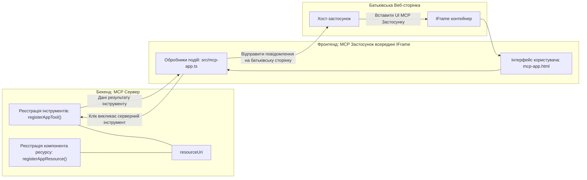

# MCP Apps

MCP Apps — це нова парадигма у MCP. Ідея полягає в тому, що ви не лише повертаєте дані у відповідь на виклик інструменту, а й надаєте інформацію про те, як з цими даними слід взаємодіяти. Це означає, що результати інструментів тепер можуть містити інформацію про інтерфейс користувача. Але навіщо це потрібно? Уявіть, як ви працюєте сьогодні. Ви, ймовірно, використовуєте результати MCP Server, розміщуючи якийсь фронтенд перед ним — це код, який потрібно писати та підтримувати. Іноді це саме те, що потрібно, але іноді було б чудово, якби ви могли просто додати фрагмент інформації, який є автономним і містить все — від даних до інтерфейсу користувача.

## Огляд

Цей урок надає практичні поради щодо MCP Apps, як розпочати роботу з ними та як інтегрувати їх у ваші існуючі веб-додатки. MCP Apps — це дуже новий додаток до стандарту MCP.

## Цілі навчання

Після завершення цього уроку ви зможете:

- Пояснити, що таке MCP Apps.
- Коли варто використовувати MCP Apps.
- Створювати та інтегрувати власні MCP Apps.

## MCP Apps — як це працює

Ідея MCP Apps полягає в тому, щоб надати відповідь, яка фактично є компонентом для відображення. Такий компонент може мати як візуальні елементи, так і інтерактивність, наприклад, натискання кнопок, введення користувачем тощо. Почнемо з серверної частини та нашого MCP Server. Для створення MCP App компонента потрібно створити інструмент, а також ресурс додатку. Ці дві частини пов’язані через resourceUri.

Ось приклад. Спробуємо візуалізувати, що саме задіяне і яка частина за що відповідає:

```text
server.ts -- responsible for registering tools and the component as a UI component
src/
  mcp-app.ts -- wiring up event handlers
mcp-app.html -- the user interface
```

Ця візуалізація описує архітектуру створення компонента та його логіки.


Тепер спробуємо описати відповідальності бекенда і фронтенда відповідно.

### Бекенд

Є дві речі, які потрібно виконати:

- Зареєструвати інструменти, з якими ви хочете взаємодіяти.
- Визначити компонент.

**Реєстрація інструменту**

```typescript
registerAppTool(
    server,
    "get-time",
    {
      title: "Get Time",
      description: "Returns the current server time.",
      inputSchema: {},
      _meta: { ui: { resourceUri } }, // Пов’язує цей інструмент з його ресурсом інтерфейсу користувача
    },
    async () => {
      const time = new Date().toISOString();
      return { content: [{ type: "text", text: time }] };
    },
  );

```

Наведений вище код описує поведінку, де він відкриває інструмент `get-time`. Він не приймає вхідних параметрів, але повертає поточний час. Ми маємо можливість визначити `inputSchema` для інструментів, де потрібно приймати введення користувача.

**Реєстрація компонента**

У тому ж файлі потрібно також зареєструвати компонент:

```typescript
const resourceUri = "ui://get-time/mcp-app.html";

// Зареєструвати ресурс, який повертає зібраний HTML/JavaScript для інтерфейсу користувача.
registerAppResource(
  server,
  resourceUri,
  resourceUri,
  { mimeType: RESOURCE_MIME_TYPE },
  async () => {
    const html = await fs.readFile(path.join(DIST_DIR, "mcp-app.html"), "utf-8");

    return {
    contents: [
        { uri: resourceUri, mimeType: RESOURCE_MIME_TYPE, text: html },
    ],
    };
  },
);
```

Зверніть увагу, як ми вказуємо `resourceUri` для зв’язку компонента з його інструментами. Цікавий також callback, у якому ми завантажуємо UI-файл і повертаємо компонент.

### Фронтенд компонента

Як і з бекендом, тут є дві частини:

- Фронтенд, написаний чистим HTML.
- Код, який обробляє події та визначає, що робити, наприклад викликати інструменти або надсилати повідомлення батьківському вікну.

**Інтерфейс користувача**

Поглянемо на інтерфейс користувача.

```html
<!-- mcp-app.html -->
<!DOCTYPE html>
<html lang="en">
  <head>
    <meta charset="UTF-8" />
    <title>Get Time App</title>
  </head>
  <body>
    <p>
      <strong>Server Time:</strong> <code id="server-time">Loading...</code>
    </p>
    <button id="get-time-btn">Get Server Time</button>
    <script type="module" src="/src/mcp-app.ts"></script>
  </body>
</html>
```

**Підключення подій**

Остання частина — це підключення подій. Це означає, що ми визначаємо, яка частина нашого UI потребує обробників подій і що робити, якщо події виникають:

```typescript
// mcp-app.ts

import { App } from "@modelcontextprotocol/ext-apps";

// Отримати посилання на елементи
const serverTimeEl = document.getElementById("server-time")!;
const getTimeBtn = document.getElementById("get-time-btn")!;

// Створити екземпляр додатку
const app = new App({ name: "Get Time App", version: "1.0.0" });

// Обробляти результати інструменту від сервера. Встановити перед `app.connect()`, щоб уникнути
// пропуску початкового результату інструменту.
app.ontoolresult = (result) => {
  const time = result.content?.find((c) => c.type === "text")?.text;
  serverTimeEl.textContent = time ?? "[ERROR]";
};

// Підключити натискання кнопки
getTimeBtn.addEventListener("click", async () => {
  // `app.callServerTool()` дозволяє інтерфейсу користувача запитувати актуальні дані з сервера
  const result = await app.callServerTool({ name: "get-time", arguments: {} });
  const time = result.content?.find((c) => c.type === "text")?.text;
  serverTimeEl.textContent = time ?? "[ERROR]";
});

// Підключитися до хоста
app.connect();
```

Як ви бачите з наведеного вище, це звичайний код для прив’язки елементів DOM до подій. Варто звернути увагу на виклик `callServerTool`, який виконує виклик інструменту на бекенді.

## Робота з введенням користувача

Поки що ми бачили компонент з кнопкою, що при натисканні викликає інструмент. Давайте додамо більше елементів UI, наприклад поле введення, і спробуємо надіслати аргументи до інструменту. Реалізуємо функціонал FAQ. Ось як це повинно працювати:

- Має бути кнопка та поле введення, де користувач вводить ключове слово для пошуку, наприклад "Shipping". Це має викликати інструмент на бекенді, який шукає у FAQ.
- Інструмент, який підтримує вказаний пошук у FAQ.

Спочатку додамо потрібну підтримку на бекенді:

```typescript
const faq: { [key: string]: string } = {
    "shipping": "Our standard shipping time is 3-5 business days.",
    "return policy": "You can return any item within 30 days of purchase.",
    "warranty": "All products come with a 1-year warranty covering manufacturing defects.",
  }

registerAppTool(
    server,
    "get-faq",
    {
      title: "Search FAQ",
      description: "Searches the FAQ for relevant answers.",
      inputSchema: zod.object({
        query: zod.string().default("shipping"),
      }),
      _meta: { ui: { resourceUri: faqResourceUri } }, // Зв’язує цей інструмент з його ресурсом інтерфейсу користувача
    },
    async ({ query }) => {
      const answer: string = faq[query.toLowerCase()] || "Sorry, I don't have an answer for that.";
      return { content: [{ type: "text", text: answer }] };
    },
  );
```

Тут ми бачимо, як заповнюємо `inputSchema` і задаємо для нього схему `zod` наступним чином:

```typescript
inputSchema: zod.object({
  query: zod.string().default("shipping"),
})
```

У наведеній схемі ми оголошуємо, що є вхідний параметр `query` і що він необов’язковий із значенням за замовчуванням "shipping".

Отже, перейдемо до *mcp-app.html*, щоб побачити, який UI потрібно створити:

```html
<div class="faq">
    <h1>FAQ response</h1>
    <p>FAQ Response: <code id="faq-response">Loading...</code></p>
    <input type="text" id="faq-query" placeholder="Enter FAQ query" />
    <button id="get-faq-btn">Get FAQ Response</button>
  </div>
```

Чудово, тепер у нас є поле введення та кнопка. Переходимо до *mcp-app.ts*, щоб підключити події:

```typescript
const getFaqBtn = document.getElementById("get-faq-btn")!;
const faqQueryInput = document.getElementById("faq-query") as HTMLInputElement;

getFaqBtn.addEventListener("click", async () => {
  const query = faqQueryInput.value;
  const result = await app.callServerTool({ name: "get-faq", arguments: { query } });
  const faq = result.content?.find((c) => c.type === "text")?.text;
  faqResponseEl.textContent = faq ?? "[ERROR]";
});
```

У наведеному коді ми:

- Створюємо посилання на інтерактивні елементи UI.
- Обробляємо натискання кнопки, щоб отримати значення поля введення. Також викликаємо `app.callServerTool()` із `name` та `arguments`, передаючи `query` як значення.

Коли ви викликаєте `callServerTool`, насправді надсилається повідомлення до батьківського вікна, а те вікно викликає MCP Server.

### Спробуйте це

Після спроби ми тепер повинні побачити таке:


а ось як це працює з введенням типу "warranty":


Щоб запустити цей код, перейдіть до [розділу з кодом](./code/README.md)

## Тестування у Visual Studio Code

Visual Studio Code має чудову підтримку MCP Apps і, мабуть, є одним із найпростіших способів тестування MCP Apps. Щоб використовувати Visual Studio Code, додайте сервер у *mcp.json* наступним чином:

```json
"my-mcp-server-7178eca7": {
    "url": "http://localhost:3001/mcp",
    "type": "http"
  }
```

Потім запустіть сервер, ви повинні змогти спілкуватися зі своїм MCP App через чат-вікно, якщо у вас встановлений GitHub Copilot.

Ви можете активувати це за допомогою підказки, наприклад "#get-faq":


І так само, як ви запускали через веб-браузер, воно відображається так:


## Завдання

Створіть гру "камінь, ножиці, папір". Вона повинна містити таке:

Інтерфейс користувача:

- випадаючий список із варіантами
- кнопку для підтвердження вибору
- мітку, що показує, хто що вибрав і хто виграв

Сервер:

- має бути інструмент rock paper scissor, який приймає введення "choice". Він повинен також генерувати вибір комп’ютера і визначати переможця.

## Рішення

[Рішення](./assignment/README.md)

## Резюме

Ми ознайомилися з новою парадигмою MCP Apps. Це нова парадигма, яка дозволяє MCP Server не лише мати думку щодо даних, але й про те, як ці дані слід відображати.

Крім того, ми дізналися, що ці MCP Apps розміщуються в IFrame, і для спілкування з MCP Server вони мають надсилати повідомлення батьківському веб-додатку. Існує кілька бібліотек як для чистого JavaScript, так і для React та інших, що спрощують цю комунікацію.

## Основні висновки

Ось чому ви навчилися:

- MCP Apps — новий стандарт, який корисний, коли потрібно надіслати як дані, так і функції UI.
- Ці додатки запускаються в IFrame з міркувань безпеки.

## Що далі

- [Розділ 4](../../04-PracticalImplementation/README.md)

---

<!-- CO-OP TRANSLATOR DISCLAIMER START -->
**Відмова від відповідальності**:  
Цей документ було перекладено за допомогою службового перекладача на базі ШІ [Co-op Translator](https://github.com/Azure/co-op-translator). Хоча ми прагнемо до точності, будь ласка, майте на увазі, що автоматичні переклади можуть містити помилки або неточності. Оригінальний документ рідною мовою слід вважати авторитетним джерелом. Для важливої інформації рекомендується професійний людський переклад. Ми не несемо відповідальності за будь-які непорозуміння або неправильні тлумачення, що виникли внаслідок використання цього перекладу.
<!-- CO-OP TRANSLATOR DISCLAIMER END -->