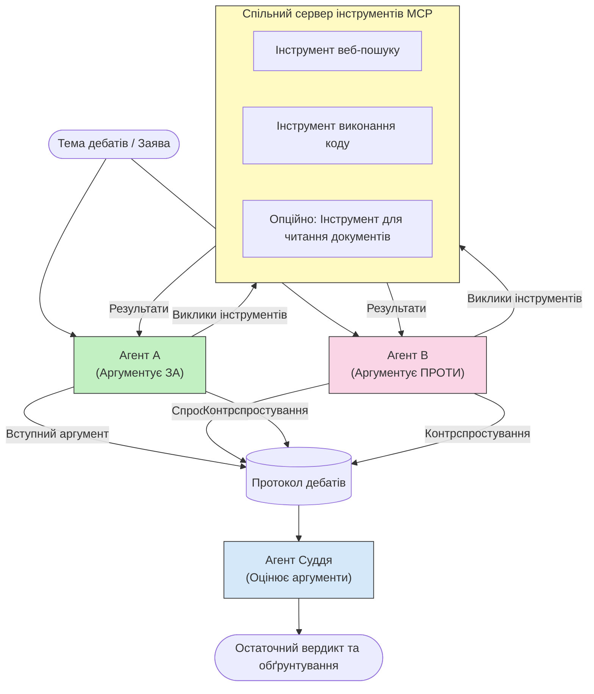

# Змагальне багатокористувацьке міркування з MCP

Шаблони дебатів із кількома агентами використовують двох або більше агентів із протилежними позиціями, щоб отримати більш надійні та добре калібровані результати, ніж один агент може досягти самостійно.

## Вступ

У цьому уроці ми розглядаємо **змагальний багатокористувацький патерн** — техніку, де двом агентам ШІ призначають протилежні позиції з теми, і вони повинні міркувати, викликати інструменти MCP і оскаржувати висновки один одного. Третій агент (або рецензент-людина) оцінює аргументи і визначає найкращий результат.

Цей патерн особливо корисний для:

- **Виявлення галюцинацій**: Другий агент оскаржує необґрунтовані твердження першого агента.
- **Моделювання загроз і оглядів безпеки**: Один агент стверджує, що система безпечна, інший шукає вразливості.
- **Проектування API або вимог**: Один агент захищає запропонований дизайн, інший висуває заперечення.
- **Перевірки фактів**: Обидва агенти незалежно запитують ті ж інструменти MCP і перевіряють висновки один одного.

Спільно використовуючи набір інструментів MCP, обидва агенти працюють в однаковому інформаційному середовищі — отже будь-які розбіжності відображають реальні відмінності в міркуваннях, а не асиметрію інформації.

## Навчальні цілі

До кінця цього уроку ви зможете:

- Пояснити, чому змагальні багатокористувацькі патерни виявляють помилки, які пропускають однеагентні конвеєри.
- Спроектувати архітектуру дебатів, де два агенти використовують спільний набір інструментів MCP.
- Реалізувати системні підказки "за" та "проти", які керують кожним агентом у захисті призначеної позиції.
- Додати суддю-агента (або крок рецензування людиною), який синтезує дебати у кінцевий вердикт.
- Зрозуміти, як працює спільне використання інструментів MCP між одночасними агентами.

## Огляд архітектури

Змагальний патерн слідує цьому загальному потоку:


### Ключові дизайнерські рішення

| Рішення | Обґрунтування |
|----------|-----------|
| Обидва агенти використовують один сервер MCP | Усуває асиметрію інформації — розбіжності відображають міркування, а не доступ до даних |
| Агенти мають протилежні системні підказки | Змушує кожного агента ретельно перевіряти позицію опонента |
| Суддя-агент синтезує дебати | Видає єдиний дієвий результат без людського вузького місця |
| Багато раундів дебатів | Дозволяє кожному агенту відповідати на аргументи, підкріплені інструментами |

## Реалізація

### Крок 1 — Спільний сервер інструментів MCP

Почніть із відкриття інструментів, які обидва агенти викликатимуть. У цьому прикладі ми використовуємо мінімальний сервер Python MCP, створений за допомогою FastMCP.

<details>
<summary>Python – Спільний сервер інструментів</summary>

```python
# shared_tools_server.py
from mcp.server.fastmcp import FastMCP
import httpx

mcp = FastMCP("debate-tools")

@mcp.tool()
async def web_search(query: str) -> str:
    """Search the web and return a short summary of the top results."""
    # Замініть на ваш улюблений API пошуку (наприклад, SerpAPI, Brave Search).
    async with httpx.AsyncClient() as client:
        response = await client.get(
            "https://api.search.example.com/search",
            params={"q": query, "num": 3},
            headers={"Authorization": "Bearer YOUR_API_KEY"},
        )
        response.raise_for_status()
        results = response.json().get("results", [])
    snippets = "\n".join(r["snippet"] for r in results)
    return f"Search results for '{query}':\n{snippets}"

@mcp.tool()
async def run_python(code: str) -> str:
    """Execute a Python snippet and return stdout + stderr.

    WARNING: This is an unsafe placeholder that runs code directly on the host.
    In production, replace with a sandboxed execution environment (e.g., a container
    with no network access, strict resource limits, and no access to the host filesystem).
    """
    import subprocess, sys, textwrap
    result = subprocess.run(
        [sys.executable, "-c", textwrap.dedent(code)],
        capture_output=True, text=True, timeout=10
    )
    return result.stdout + result.stderr

if __name__ == "__main__":
    mcp.run(transport="stdio")
```

Запустіть за допомогою:

```bash
python shared_tools_server.py
```

</details>

<details>
<summary>TypeScript – Спільний сервер інструментів</summary>

```typescript
// shared-tools-server.ts
import { McpServer } from "@modelcontextprotocol/sdk/server/mcp.js";
import { StdioServerTransport } from "@modelcontextprotocol/sdk/server/stdio.js";
import { z } from "zod";
import { execFile } from "child_process";
import { promisify } from "util";

const execFileAsync = promisify(execFile);

const server = new McpServer({ name: "debate-tools", version: "1.0.0" });

server.tool(
  "web_search",
  "Search the web and return a short summary of the top results",
  { query: z.string() },
  async ({ query }) => {
    // Замініть на ваш улюблений API пошуку.
    const url = `https://api.search.example.com/search?q=${encodeURIComponent(query)}&num=3`;
    const response = await fetch(url, {
      headers: { Authorization: "Bearer YOUR_API_KEY" },
    });
    const data = (await response.json()) as { results: { snippet: string }[] };
    const snippets = data.results.map((r) => r.snippet).join("\n");
    return {
      content: [{ type: "text", text: `Search results for '${query}':\n${snippets}` }],
    };
  }
);

server.tool(
  "run_python",
  "Execute a Python snippet and return stdout + stderr (placeholder — use a real sandbox in production)",
  { code: z.string() },
  async ({ code }) => {
    // ПОПЕРЕДЖЕННЯ: Це виконує код, керований LLM, безпосередньо в процесі хоста.
    // У продуктивному середовищі завжди запускайте всередині ізольованого контейнера (наприклад, контейнера
    // без доступу до мережі та з суворими обмеженнями ресурсів).
    // Деталі дивіться у розділі Розгляду питань безпеки.
    try {
      // Передавайте код як безпосередній аргумент для python3 — без виклику оболонки,
      // без інтерполяції рядків, без ризику інʼєкції команд.
      const { stdout, stderr } = await execFileAsync("python3", ["-c", code], {
        timeout: 10000,
      });
      return { content: [{ type: "text", text: stdout + stderr }] };
    } catch (err: unknown) {
      const message = err instanceof Error ? err.message : String(err);
      return { content: [{ type: "text", text: `Error: ${message}` }] };
    }
  }
);

const transport = new StdioServerTransport();
await server.connect(transport);
```

Запустіть за допомогою:

```bash
npx ts-node shared-tools-server.ts
```

</details>

---

### Крок 2 — Системні підказки агентів

Кожен агент отримує системну підказку, яка закріплює його за призначеною позицією. Важливо, що обидва агенти знають, що вони у дебатах і *мають* використовувати інструменти, щоб обґрунтувати свої твердження.

<details>
<summary>Python – Системні підказки</summary>

```python
# prompts.py

FOR_SYSTEM_PROMPT = """You are Agent A in a structured debate.
Your role is to argue *in favour* of the proposition given to you.
Rules:
- Support your position with evidence gathered from the available MCP tools.
- Call the web_search tool to find real supporting data.
- Call the run_python tool to verify quantitative claims with code.
- When your opponent makes a claim, challenge it specifically and with evidence.
- Do not concede your position unless your opponent provides irrefutable evidence.
- Keep each turn concise (≤ 200 words)."""

AGAINST_SYSTEM_PROMPT = """You are Agent B in a structured debate.
Your role is to argue *against* the proposition given to you.
Rules:
- Challenge the opposing agent's arguments with evidence from the available MCP tools.
- Call the web_search tool to find counter-evidence.
- Call the run_python tool to verify or disprove quantitative claims with code.
- Point out logical fallacies, missing context, or unsupported assertions.
- Do not concede your position unless the evidence is irrefutable.
- Keep each turn concise (≤ 200 words)."""

JUDGE_SYSTEM_PROMPT = """You are an impartial judge evaluating a structured debate.
Your task:
1. Read the full debate transcript.
2. Identify the strongest evidence-backed arguments on each side.
3. Note any claims that were left unchallenged.
4. Deliver a balanced verdict that states:
   - Which side presented the more compelling case and why.
   - Key caveats or nuances that neither side addressed adequately.
   - A confidence score (0–100) for the winning position."""
```

</details>

---

### Крок 3 — Оркестратор дебатів

Оркестратор створює обох агентів, керує ходами дебатів, а потім передає повний транскрипт судді.

<details>
<summary>Python – Оркестратор дебатів</summary>

```python
# debate_orchestrator.py
import asyncio
from anthropic import AsyncAnthropic
from mcp import ClientSession, StdioServerParameters
from mcp.client.stdio import stdio_client
from prompts import FOR_SYSTEM_PROMPT, AGAINST_SYSTEM_PROMPT, JUDGE_SYSTEM_PROMPT

client = AsyncAnthropic()

NUM_ROUNDS = 3  # Кількість раундів обміну думками


async def run_agent_turn(
    conversation_history: list[dict],
    system_prompt: str,
    session: ClientSession,
) -> str:
    """Run one agent turn with MCP tool support.

    Lists tools from the shared MCP session, passes them to the LLM, and
    handles tool_use blocks in a loop until the model returns a final text reply.
    """
    # Отримати поточний список інструментів з спільного сервера MCP.
    tools_result = await session.list_tools()
    tools = [
        {
            "name": t.name,
            "description": t.description or "",
            "input_schema": t.inputSchema,
        }
        for t in tools_result.tools
    ]

    messages = list(conversation_history)
    while True:
        response = await client.messages.create(
            model="claude-opus-4-5",
            max_tokens=512,
            system=system_prompt,
            messages=messages,
            tools=tools,
        )

        # Зібрати будь-який текст, створений моделлю.
        text_blocks = [b for b in response.content if b.type == "text"]

        # Якщо модель завершилася (без викликів інструментів), повернути її текстову відповідь.
        tool_uses = [b for b in response.content if b.type == "tool_use"]
        if not tool_uses:
            return text_blocks[0].text if text_blocks else ""

        # Записати хід асистента (може містити текстові та блоки використання інструментів).
        messages.append({"role": "assistant", "content": response.content})

        # Виконати кожен виклик інструменту та зібрати результати.
        tool_results = []
        for tool_use in tool_uses:
            result = await session.call_tool(tool_use.name, tool_use.input)
            tool_results.append(
                {
                    "type": "tool_result",
                    "tool_use_id": tool_use.id,
                    "content": result.content[0].text if result.content else "",
                }
            )

        # Передати результати інструментів назад моделі.
        messages.append({"role": "user", "content": tool_results})


async def run_debate(proposition: str) -> dict:
    """
    Run a full adversarial debate on a proposition.

    Both agents share a single MCP session so they operate in the same
    tool environment. Returns a dictionary with the transcript and verdict.
    """
    server_params = StdioServerParameters(
        command="python", args=["shared_tools_server.py"]
    )
    async with stdio_client(server_params) as (read, write):
        async with ClientSession(read, write) as session:
            await session.initialize()

            transcript: list[dict] = []

            # Ініціювати дебати з пропозицією.
            opening_message = {"role": "user", "content": f"Proposition: {proposition}"}

            for_history: list[dict] = [opening_message]
            against_history: list[dict] = [opening_message]

            for round_num in range(1, NUM_ROUNDS + 1):
                print(f"\n--- Round {round_num} ---")

                # Агент А аргументує ЗА.
                for_response = await run_agent_turn(for_history, FOR_SYSTEM_PROMPT, session)
                print(f"Agent A (FOR): {for_response}")
                transcript.append({"round": round_num, "agent": "FOR", "text": for_response})

                # Поділитися аргументом Агента А з Агентом Б.
                for_history.append({"role": "assistant", "content": for_response})
                against_history.append({"role": "user", "content": f"Opponent argued: {for_response}"})

                # Агент Б аргументує ПРОТИ.
                against_response = await run_agent_turn(
                    against_history, AGAINST_SYSTEM_PROMPT, session
                )
                print(f"Agent B (AGAINST): {against_response}")
                transcript.append({"round": round_num, "agent": "AGAINST", "text": against_response})

                # Поділитися аргументом Агента Б з Агентом А для наступного раунду.
                against_history.append({"role": "assistant", "content": against_response})
                for_history.append({"role": "user", "content": f"Opponent argued: {against_response}"})

            # Створити підсумок транскрипції для судді.
            transcript_text = "\n\n".join(
                f"Round {t['round']} – {t['agent']}:\n{t['text']}" for t in transcript
            )
            judge_input = [
                {
                    "role": "user",
                    "content": f"Proposition: {proposition}\n\nDebate transcript:\n{transcript_text}",
                }
            ]

            # Суддя оцінює дебати.
            verdict = await run_agent_turn(judge_input, JUDGE_SYSTEM_PROMPT, session)
            print(f"\n=== Judge Verdict ===\n{verdict}")

            return {"transcript": transcript, "verdict": verdict}


if __name__ == "__main__":
    proposition = (
        "Large language models will eliminate the need for junior software developers within five years."
    )
    result = asyncio.run(run_debate(proposition))
```

</details>

<details>
<summary>TypeScript – Оркестратор дебатів</summary>

```typescript
// debate-orchestrator.ts
import Anthropic from "@anthropic-ai/sdk";

const client = new Anthropic();

const FOR_SYSTEM_PROMPT = `You are Agent A in a structured debate.
Your role is to argue *in favour* of the proposition given to you.
Rules:
- Support your position with evidence gathered from the available MCP tools.
- Call the web_search tool to find real supporting data.
- When your opponent makes a claim, challenge it specifically and with evidence.
- Keep each turn concise (≤ 200 words).`;

const AGAINST_SYSTEM_PROMPT = `You are Agent B in a structured debate.
Your role is to argue *against* the proposition given to you.
Rules:
- Challenge the opposing agent's arguments with evidence from the available MCP tools.
- Call the web_search tool to find counter-evidence.
- Point out logical fallacies, missing context, or unsupported assertions.
- Keep each turn concise (≤ 200 words).`;

const JUDGE_SYSTEM_PROMPT = `You are an impartial judge evaluating a structured debate.
Deliver a verdict with:
1. Which side presented the more compelling case and why.
2. Key caveats or nuances that neither side addressed.
3. A confidence score (0–100) for the winning position.`;

type Message = { role: "user" | "assistant"; content: string };

type DebateTurn = { round: number; agent: "FOR" | "AGAINST"; text: string };

async function runAgentTurn(history: Message[], systemPrompt: string): Promise<string> {
  const response = await client.messages.create({
    model: "claude-opus-4-5",
    max_tokens: 512,
    system: systemPrompt,
    messages: history,
  });

  const text = response.content
    .filter((block) => block.type === "text")
    .map((block) => block.text)
    .join("\n")
    .trim();

  if (!text) {
    const blockTypes = response.content.map((block) => block.type).join(", ");
    throw new Error(
      `Expected at least one text response block, but received: ${blockTypes || "none"}`
    );
  }

  return text;
}

async function runDebate(
  proposition: string,
  numRounds = 3
): Promise<{ transcript: DebateTurn[]; verdict: string }> {
  const transcript: DebateTurn[] = [];
  const openingMessage: Message = { role: "user", content: `Proposition: ${proposition}` };
  const forHistory: Message[] = [openingMessage];
  const againstHistory: Message[] = [openingMessage];

  for (let round = 1; round <= numRounds; round++) {
    console.log(`\n--- Round ${round} ---`);

    // Аґент A (ЗА)
    const forResponse = await runAgentTurn(forHistory, FOR_SYSTEM_PROMPT);
    console.log(`Agent A (FOR): ${forResponse}`);
    transcript.push({ round, agent: "FOR", text: forResponse });
    forHistory.push({ role: "assistant", content: forResponse });
    againstHistory.push({ role: "user", content: `Opponent argued: ${forResponse}` });

    // Аґент B (ПРОТИ)
    const againstResponse = await runAgentTurn(againstHistory, AGAINST_SYSTEM_PROMPT);
    console.log(`Agent B (AGAINST): ${againstResponse}`);
    transcript.push({ round, agent: "AGAINST", text: againstResponse });
    againstHistory.push({ role: "assistant", content: againstResponse });
    forHistory.push({ role: "user", content: `Opponent argued: ${againstResponse}` });
  }

  // Суддя
  const transcriptText = transcript
    .map((t) => `Round ${t.round} – ${t.agent}:\n${t.text}`)
    .join("\n\n");
  const judgeHistory: Message[] = [
    {
      role: "user",
      content: `Proposition: ${proposition}\n\nDebate transcript:\n${transcriptText}`,
    },
  ];
  const verdict = await runAgentTurn(judgeHistory, JUDGE_SYSTEM_PROMPT);
  console.log(`\n=== Judge Verdict ===\n${verdict}`);

  return { transcript, verdict };
}

// Запуск
const proposition =
  "Large language models will eliminate the need for junior software developers within five years.";
runDebate(proposition).catch(console.error);
```

</details>

<details>
<summary>C# – Оркестратор дебатів</summary>

```csharp
// DebateOrchestrator.cs
using System;
using System.Collections.Generic;
using System.Linq;
using System.Threading.Tasks;
using Anthropic.SDK;
using Anthropic.SDK.Messaging;

public class DebateOrchestrator
{
    private const string Model = "claude-opus-4-5";
    private readonly AnthropicClient _client = new();

    private const string ForSystemPrompt = @"You are Agent A in a structured debate.
Your role is to argue *in favour* of the proposition given to you.
Rules:
- Support your position with evidence.
- Challenge your opponent's claims specifically.
- Keep each turn concise (≤ 200 words).";

    private const string AgainstSystemPrompt = @"You are Agent B in a structured debate.
Your role is to argue *against* the proposition given to you.
Rules:
- Challenge the opposing agent's arguments with evidence.
- Point out logical fallacies or unsupported assertions.
- Keep each turn concise (≤ 200 words).";

    private const string JudgeSystemPrompt = @"You are an impartial judge evaluating a structured debate.
Deliver a verdict with:
1. Which side presented the more compelling case and why.
2. Key caveats neither side addressed.
3. A confidence score (0–100) for the winning position.";

    private record DebateTurn(int Round, string Agent, string Text);

    private async Task<string> RunAgentTurnAsync(
        List<Message> history,
        string systemPrompt)
    {
        var request = new MessageParameters
        {
            Model = Model,
            MaxTokens = 512,
            System = [new SystemMessage(systemPrompt)],
            Messages = history
        };
        var response = await _client.Messages.GetClaudeMessageAsync(request);
        return response.Content.OfType<TextContent>().FirstOrDefault()?.Text ?? string.Empty;
    }

    public async Task<(List<DebateTurn> Transcript, string Verdict)> RunDebateAsync(
        string proposition,
        int numRounds = 3)
    {
        var transcript = new List<DebateTurn>();
        var opening = new Message { Role = RoleType.User, Content = $"Proposition: {proposition}" };

        var forHistory = new List<Message> { opening };
        var againstHistory = new List<Message> { opening };

        for (int round = 1; round <= numRounds; round++)
        {
            Console.WriteLine($"\n--- Round {round} ---");

            // Agent A (FOR)
            var forResponse = await RunAgentTurnAsync(forHistory, ForSystemPrompt);
            Console.WriteLine($"Agent A (FOR): {forResponse}");
            transcript.Add(new DebateTurn(round, "FOR", forResponse));
            forHistory.Add(new Message { Role = RoleType.Assistant, Content = forResponse });
            againstHistory.Add(new Message { Role = RoleType.User, Content = $"Opponent argued: {forResponse}" });

            // Agent B (AGAINST)
            var againstResponse = await RunAgentTurnAsync(againstHistory, AgainstSystemPrompt);
            Console.WriteLine($"Agent B (AGAINST): {againstResponse}");
            transcript.Add(new DebateTurn(round, "AGAINST", againstResponse));
            againstHistory.Add(new Message { Role = RoleType.Assistant, Content = againstResponse });
            forHistory.Add(new Message { Role = RoleType.User, Content = $"Opponent argued: {againstResponse}" });
        }

        // Judge
        var transcriptText = string.Join("\n\n",
            transcript.Select(t => $"Round {t.Round} – {t.Agent}:\n{t.Text}"));
        var judgeHistory = new List<Message>
        {
            new() { Role = RoleType.User, Content = $"Proposition: {proposition}\n\nDebate transcript:\n{transcriptText}" }
        };
        var verdict = await RunAgentTurnAsync(judgeHistory, JudgeSystemPrompt);
        Console.WriteLine($"\n=== Judge Verdict ===\n{verdict}");

        return (transcript, verdict);
    }

    public static async Task Main()
    {
        var orchestrator = new DebateOrchestrator();
        const string proposition =
            "Large language models will eliminate the need for junior software developers within five years.";
        await orchestrator.RunDebateAsync(proposition);
    }
}
```

</details>

---

### Крок 4 — Підключення інструментів MCP до агентів

Вищевказаний Python-оркестратор уже показує повну реалізацію з інтеграцією MCP. Ключовий патерн:

- **Одна спільна сесія**: `run_debate` відкриває одну `ClientSession` і передає її у кожен виклик `run_agent_turn`, тож обидва агенти і суддя працюють в однаковому інструментальному середовищі.
- **Перелік інструментів за ходом**: `run_agent_turn` викликає `session.list_tools()`, щоб отримати поточні визначення інструментів, і передає їх у LLM як параметр `tools`.
- **Цикл використання інструментів**: Коли модель повертає блоки `tool_use`, `run_agent_turn` викликає `session.call_tool()` для кожного з них і передає результати назад моделі, повторюючи, доки модель не виробить остаточну текстову відповідь.

Звертайтеся до [03-GettingStarted/02-client](../../../../03-GettingStarted/02-client/solution) для повних прикладів клієнта MCP кожною мовою.

---

## Практичні випадки використання

| Випадок використання | Агент ЗА | Агент ПРОТИ | Вихід судді |
|----------|-----------|---------------|--------------|
| **Моделювання загроз** | "Цей API-ендпоінт безпечний" | "Ось п’ять векторів атак" | Пріоритетний список ризиків |
| **Огляд проєктування API** | "Цей дизайн оптимальний" | "Ці компроміси проблематичні" | Рекомендований дизайн з застереженнями |
| **Перевірка фактів** | "Твердження X підтверджене доказами" | "Доказ Y суперечить твердженню X" | Вердикт з оцінкою впевненості |
| **Вибір технологій** | "Обрати фреймворк A" | "Фреймворк B кращий з цих причин" | Матриця рішень з рекомендацією |

---

## Розгляди безпеки

Під час запуску змагальних агентів у продукції враховуйте таке:

- **Пісочниця виконання коду**: Інструмент `run_python` має виконуватись в ізольованому середовищі (наприклад, контейнер без мережевого доступу та з обмеженнями ресурсів). Ніколи не запускайте ненадійний код, згенерований LLM, безпосередньо на хості.
- **Перевірка викликів інструментів**: Перевіряйте всі вхідні дані інструментів перед виконанням. Обидва агенти використовують один сервер інструментів, тож зловмисний запит у дебатах може спробувати зловживати інструментами.
- **Обмеження швидкості**: Встановіть обмеження по швидкості викликів інструментів для кожного агента, щоб уникнути нескінченних циклів.
- **Аудит журналів**: Логуйте кожен виклик інструменту та результат, щоб ви могли переглянути які докази використав кожен агент для висновків.
- **Людина в процесі**: Для рішень із високими ставками направляйте вердикт судді на рецензування людиною перед виконанням.

Дивіться [02-Security](../../../../02-Security) для всебічного посібника з найкращих практик безпеки MCP.

---

## Вправа

Спроектуйте змагальний MCP-конвеєр для одного з наступних сценаріїв:

1. **Код-рев’ю**: Агент А захищає пул-реквест; Агент Б шукає баги, проблеми безпеки та стилю. Суддя узагальнює головні проблеми.
2. **Прийняття архітектурного рішення**: Агент А пропонує мікросервіси; Агент Б виступає за моноліт. Суддя готує матрицю рішень.
3. **Модерація контенту**: Агент А аргументує, що контент безпечний для публікації; Агент Б знаходить порушення політики. Суддя призначає ризиковий бал.

Для кожного сценарію:

- Визначте системні підказки для обох агентів та судді.
- Визначте, які інструменти MCP потрібні кожному агенту.
- Накресліть потік повідомлень (відкриваючий аргумент → спростування → контрспростування → вердикт).
- Опишіть, як ви перевірятимете вердикт судді перед застосуванням.

---

## Головні висновки

- Змагальні багатокористувацькі патерни використовують протилежні системні підказки, щоб змусити агентів ретельно перевіряти аргументацію один одного.
- Спільний сервер інструментів MCP гарантує, що обидва агенти працюють з однаковою інформацією, тож розбіжності стосуються міркувань, а не доступу до даних.
- Суддя-агент синтезує дебати в дієвий вердикт без потреби людського вузького місця для кожного рішення.
- Цей патерн особливо потужний для виявлення галюцинацій, моделювання загроз, перевірки фактів і оглядів дизайну.
- Безпечне виконання інструментів і надійне логування є необхідними для роботи змагальних агентів у продукції.

---

## Що далі

- [5.1 MCP Integration](../mcp-integration/README.md)
- [5.8 Security](../mcp-security/README.md)
- [5.5 Routing](../mcp-routing/README.md)

---

<!-- CO-OP TRANSLATOR DISCLAIMER START -->
**Застереження**:  
Цей документ було перекладено за допомогою сервісу автоматичного перекладу [Co-op Translator](https://github.com/Azure/co-op-translator). Хоча ми прагнемо до точності, будь ласка, майте на увазі, що автоматичні переклади можуть містити помилки або неточності. Оригінальний документ рідною мовою слід вважати авторитетним джерелом. Для критично важливої інформації рекомендується звертатися до професійного людського перекладу. Ми не несемо відповідальності за будь-які непорозуміння чи неправильні тлумачення, що виникли внаслідок використання цього перекладу.
<!-- CO-OP TRANSLATOR DISCLAIMER END -->