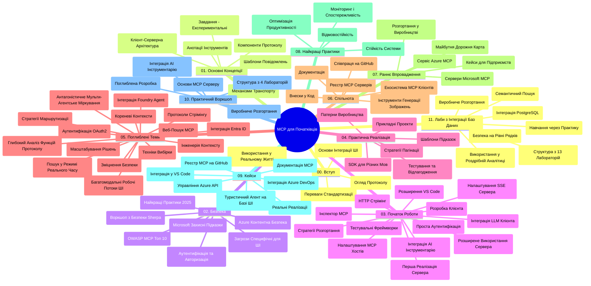

# Протокол Контексту Моделі (MCP) для Початківців - Навчальний Посібник

Цей навчальний посібник надає огляд структури репозиторію та змісту курсу "Протокол Контексту Моделі (MCP) для Початківців". Використовуйте цей посібник для ефективної навігації репозиторієм та максимального використання доступних ресурсів.

## Огляд Репозиторію

Протокол Контексту Моделі (MCP) — це стандартизований фреймворк для взаємодії між AI-моделями та клієнтськими застосунками. Спочатку створений компанією Anthropic, MCP тепер підтримується ширшою спільнотою MCP через офіційну організацію GitHub. Цей репозиторій надає комплексний навчальний курс із практичними прикладами коду на C#, Java, JavaScript, Python та TypeScript, розроблений для AI-розробників, системних архітекторів та інженерів-програмістів.

## Візуальна Карта Курсу

## Структура Репозиторію

Репозиторій організовано у одинадцять основних розділів, кожен з яких зосереджений на різних аспектах MCP:

1. **Вступ (00-Introduction/)**
   - Огляд Протоколу Контексту Моделі
   - Чому стандартизація важлива в AI-пайплайнах
   - Практичні випадки використання та переваги

2. **Основні Поняття (01-CoreConcepts/)**
   - Архітектура клієнт-сервер
   - Ключові компоненти протоколу
   - Патерни обміну повідомленнями у MCP

3. **Безпека (02-Security/)**
   - Загрози безпеці в системах на основі MCP
   - Найкращі практики для безпечної реалізації
   - Стратегії автентифікації та авторизації
   - **Комплексна документація з безпеки**:
     - Кращі практики безпеки MCP 2025
     - Посібник із впровадження Azure Content Safety
     - Контролі та методики безпеки MCP
     - Швидка довідка з кращих практик MCP
   - **Ключові теми безпеки**:
     - Атаки інжекції підказок і отруєння інструментів
     - Перехоплення сесії та проблеми «confused deputy»
     - Вразливості передачі токенів
     - Надмірні права та контроль доступу
     - Безпека ланцюга постачання AI-компонентів
     - Інтеграція Microsoft Prompt Shields

4. **Перші Кроки (03-GettingStarted/)**
   - Налаштування та конфігурація середовища
   - Створення базових MCP серверів та клієнтів
   - Інтеграція з існуючими застосунками
   - Включає розділи для:
     - Першої реалізації сервера
     - Розробки клієнта
     - Інтеграції LLM клієнта
     - Інтеграції у VS Code
     - Серверів з Server-Sent Events (SSE)
     - Просунутого використання сервера
     - HTTP стрімінгу
     - Інтеграції AI Toolkit
     - Стратегій тестування
     - Рекомендацій для розгортання

5. **Практична Реалізація (04-PracticalImplementation/)**
   - Використання SDK на різних мовах програмування
   - Налагодження, тестування і валідація
   - Створення повторно використовуваних шаблонів підказок і робочих процесів
   - Приклади проєктів з реалізаціями

6. **Поглиблені Теми (05-AdvancedTopics/)**
   - Техніки інжинірингу контексту
   - Інтеграція агента Foundry
   - Багатомодальні AI робочі процеси
   - Демонстрації автентифікації OAuth2
   - Можливості пошуку у реальному часі
   - Стрімінг у реальному часі
   - Реалізація root-контекстів
   - Стратегії маршрутизації
   - Техніки семплінгу
   - Підходи масштабування
   - Питання безпеки
   - Інтеграція безпеки Entra ID
   - Інтеграція веб-пошуку
   - Адверсарне багатое агентне обґрунтування (патерни дебатів)

7. **Спільнотні Внески (06-CommunityContributions/)**
   - Як вносити код та документацію
   - Співпраця через GitHub
   - Покращення та зворотній зв’язок від спільноти
   - Використання різних MCP клієнтів (Claude Desktop, Cline, VSCode)
   - Робота з популярними MCP серверами, включно з генерацією зображень

8. **Уроки з Раннього Впровадження (07-LessonsfromEarlyAdoption/)**
   - Реальні впровадження та історії успіху
   - Створення та розгортання рішень на основі MCP
   - Тенденції та майбутня дорожня карта
   - **Посібник по Microsoft MCP Серверах**: Комплексний посібник із 10 готових до виробництва Microsoft MCP серверів:
     - Microsoft Learn Docs MCP Server
     - Azure MCP Server (понад 15 спеціалізованих конекторів)
     - GitHub MCP Server
     - Azure DevOps MCP Server
     - MarkItDown MCP Server
     - SQL Server MCP Server
     - Playwright MCP Server
     - Dev Box MCP Server
     - Azure AI Foundry MCP Server
     - Microsoft 365 Agents Toolkit MCP Server

9. **Кращі Практики (08-BestPractices/)**
   - Оптимізація продуктивності та налаштування
   - Проєктування відмовостійких MCP систем
   - Стратегії тестування та стійкості

10. **Кейси (09-CaseStudy/)**
    - **Сім комплексних кейсів**, що демонструють універсальність MCP у різних сценаріях:
    - **Azure AI Travel Agents**: Оркестрація багатьох агентів з Azure OpenAI та AI Search
    - **Інтеграція з Azure DevOps**: Автоматизація робочих процесів оновлення даних YouTube
    - **Отримання документації в режимі реального часу**: Python консольний клієнт зі стрімінгом HTTP
    - **Інтерактивний генератор планів навчання**: Веб-додаток Chainlit з розмовним AI
    - **Документація в редакторі**: Інтеграція VS Code з робочими процесами GitHub Copilot
    - **Azure API Management**: Підприємницька інтеграція API з створенням MCP серверів
    - **GitHub MCP реєстр**: Розробка екосистеми та платформи агентної інтеграції
    - Приклади реалізацій охоплюють інтеграцію підприємств, продуктивність розробників та розвиток екосистеми

11. **Практичний Семінар (10-StreamliningAIWorkflowsBuildingAnMCPServerWithAIToolkit/)**
    - Комплексний практичний семінар з використання MCP та AI Toolkit
    - Створення інтелектуальних застосунків, що поєднують AI-моделі з реальними інструментами
    - Практичні модулі, що охоплюють основи, розробку користувацьких серверів та стратегії розгортання в продакшн
    - **Структура лабораторії**:
      - Лабораторія 1: Основи MCP серверу
      - Лабораторія 2: Просунута розробка MCP серверу
      - Лабораторія 3: Інтеграція AI Toolkit
      - Лабораторія 4: Розгортання та масштабування в продакшн
    - Навчання на основі лабораторій з покроковими інструкціями

12. **Лабораторії з Інтеграції MCP Серверу з Базою Даних (11-MCPServerHandsOnLabs/)**
    - **Комплексний шлях із 13 лабораторій** для створення MCP серверів готових до продакшн із інтеграцією PostgreSQL
    - **Реальна роздрібна аналітика** на прикладі кейсу Zava Retail
    - **Патерни корпоративного рівня**, включно з Row Level Security (RLS), семантичним пошуком і доступом до багатокористувацьких даних
    - **Повна структура лабораторії**:
      - **Лабораторії 00-03: Основи** - Вступ, Архітектура, Безпека, Налаштування середовища
      - **Лабораторії 04-06: Побудова MCP серверу** - Проєктування бази даних, Реалізація MCP серверу, Розробка інструментів
      - **Лабораторії 07-09: Просунуті функції** - Семантичний пошук, Тестування та налагодження, Інтеграція VS Code
      - **Лабораторії 10-12: Продакшн та кращі практики** - Розгортання, Моніторинг, Оптимізація
    - **Технології, що використовуються**: FastMCP framework, PostgreSQL, Azure OpenAI, Azure Container Apps, Application Insights
    - **Результати навчання**: MCP сервери готові до продакшн, патерни інтеграції бази даних, аналітика на основі AI, корпоративна безпека

## Додаткові Ресурси

Репозиторій включає допоміжні ресурси:

- **Папка з зображеннями**: Містить діаграми та ілюстрації, що використовуються в курсі
- **Переклади**: Підтримка багатомовності з автоматизованими перекладами документації
- **Офіційні ресурси MCP**:
  - [MCP Documentation](https://modelcontextprotocol.io/)
  - [MCP Specification](https://spec.modelcontextprotocol.io/)
  - [MCP GitHub Repository](https://github.com/modelcontextprotocol)

## Як Використовувати Цей Репозиторій

1. **Навчання послідовно**: Слідкуйте за главами у порядку (з 00 по 11) для структурованого вивчення.
2. **Фокус на конкретній мові**: Якщо ви зацікавлені у певній мові програмування, досліджуйте директорії зі зразками для реалізацій вашою улюбленою мовою.
3. **Практична реалізація**: Почніть із розділу "Перші кроки", щоб налаштувати середовище та створити ваш перший MCP сервер і клієнт.
4. **Поглиблене вивчення**: Коли освоїте основи, переходьте до поглиблених тем для розширення знань.
5. **Участь у спільноті**: Приєднуйтеся до спільноти MCP через обговорення на GitHub та канали Discord, щоб спілкуватися з експертами та колегами-розробниками.

## MCP Клієнти та Інструменти

Курс охоплює різні MCP клієнти та інструменти:

1. **Офіційні клієнти**:
   - Visual Studio Code
   - MCP у Visual Studio Code
   - Claude Desktop
   - Claude у VSCode
   - Claude API

2. **Спільнотні клієнти**:
   - Cline (термінальний)
   - Cursor (редактор коду)
   - ChatMCP
   - Windsurf

3. **Інструменти управління MCP**:
   - MCP CLI
   - MCP Manager
   - MCP Linker
   - MCP Router

## Популярні MCP Сервери

Репозиторій представляє різні MCP сервери, зокрема:

1. **Офіційні Microsoft MCP Сервери**:
   - Microsoft Learn Docs MCP Server
   - Azure MCP Server (понад 15 спеціалізованих конекторів)
   - GitHub MCP Server
   - Azure DevOps MCP Server
   - MarkItDown MCP Server
   - SQL Server MCP Server
   - Playwright MCP Server
   - Dev Box MCP Server
   - Azure AI Foundry MCP Server
   - Microsoft 365 Agents Toolkit MCP Server

2. **Офіційні референтні сервери**:
   - Filesystem
   - Fetch
   - Memory
   - Sequential Thinking

3. **Генерація зображень**:
   - Azure OpenAI DALL-E 3
   - Stable Diffusion WebUI
   - Replicate

4. **Інструменти розробки**:
   - Git MCP
   - Terminal Control
   - Code Assistant

5. **Спеціалізовані сервери**:
   - Salesforce
   - Microsoft Teams
   - Jira & Confluence

## Внесок у Репозиторій

Цей репозиторій вітає внески від спільноти. Дивіться розділ Спільнотні Внески для отримання рекомендацій щодо ефективного внеску у екосистему MCP.

----

*Цей навчальний посібник було оновлено востаннє 5 лютого 2026 року, відображаючи останню Специфікацію MCP 2025-11-25 і надає огляд стану репозиторію на цю дату. Зміст репозиторію може оновлюватися після цієї дати.*

---

<!-- CO-OP TRANSLATOR DISCLAIMER START -->
**Відмова від відповідальності**:  
Цей документ було перекладено за допомогою сервісу автоматичного перекладу [Co-op Translator](https://github.com/Azure/co-op-translator). Хоча ми прагнемо до точності, зверніть увагу, що автоматичні переклади можуть містити помилки або неточності. Оригінальний документ рідною мовою слід вважати авторитетним джерелом. Для критичної інформації рекомендується професійний людський переклад. Ми не несемо відповідальності за будь-які непорозуміння або неправильні тлумачення, що виникають унаслідок використання цього перекладу.
<!-- CO-OP TRANSLATOR DISCLAIMER END -->