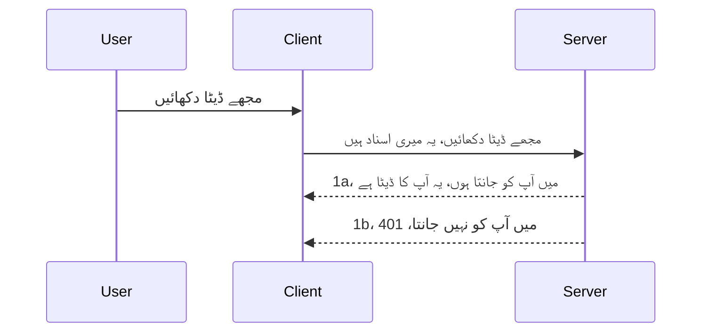

# سادہ تصدیق

MCP SDKs OAuth 2.1 کے استعمال کی حمایت کرتے ہیں جو کہ ایک کافی پیچیدہ عمل ہے جس میں تصدیقی سرور، وسائل سرور، اسناد بھیجنا، کوڈ حاصل کرنا، کوڈ کا بیئر ٹوکن میں تبادلہ شامل ہے یہاں تک کہ آپ بالآخر اپنے وسائل کے ڈیٹا تک رسائی حاصل کر سکیں۔ اگر آپ OAuth سے واقف نہیں ہیں جو کہ لاگو کرنے کے لیے زبردست چیز ہے، تو یہ ایک اچھا خیال ہے کہ آپ کسی بنیادی سطح کی تصدیق سے شروع کریں اور بہتر اور بہتر سکیورٹی کی طرف بڑھیں۔ اسی لیے یہ باب موجود ہے تاکہ آپ کو مزید پیشرفتہ تصدیق کی طرف لے جایا جا سکے۔

## تصدیق، ہم کیا مراد لیتے ہیں؟

تصدیق اصطلاح authentication اور authorization کے لیے مختصر ہے۔ خیال یہ ہے کہ ہمیں دو کام کرنے ہیں:

- **تشخیص**, یہ عمل ہے یہ معلوم کرنے کا کہ آیا ہم کسی شخص کو اپنے گھر میں داخل ہونے کی اجازت دیں، یعنی کہ آیا انہیں "یہاں" ہونے کا حق ہے یعنی ہمارے وسائل سرور کی رسائی ہے جہاں ہمارے MCP سرور کی خصوصیات ہوتی ہیں۔
- **اجازت**, یہ عمل ہے یہ معلوم کرنے کا کہ آیا صارف کو ان مخصوص وسائل تک رسائی حاصل ہونی چاہیے جن کے لیے وہ درخواست کر رہا ہے، مثلاً یہ آرڈرز یا یہ مصنوعات یا آیا وہ مواد پڑھ سکتے ہیں لیکن حذف نہیں کر سکتے جیسا کہ ایک اور مثال ہے۔

## اسناد: ہم نظام کو کیسے بتاتے ہیں کہ ہم کون ہیں

زیادہ تر ویب ڈویلپرز عام طور پر سرور کو اسناد فراہم کرنے کے بارے میں سوچنا شروع کر دیتے ہیں، عام طور پر ایک خفیہ جو بتاتی ہے کہ آیا انہیں یہاں ہونے کی اجازت ہے "تشخیص"۔ یہ اسناد عام طور پر صارف نام اور پاس ورڈ کا base64 میں انکوڈ شدہ ورژن ہوتا ہے یا ایک API کی جو مخصوص صارف کو منفرد طور پر شناخت کرتی ہے۔

اسے "Authorization" ہیڈر کے ذریعے بھیجا جاتا ہے، اس طرح:

```json
{ "Authorization": "secret123" }
```

اسے عام طور پر بنیادی تصدیق کہا جاتا ہے۔ مجموعی عمل اس طرح چلتا ہے:


اب جب کہ ہم نے سمجھ لیا کہ یہ عمل کس طرح کام کرتا ہے، اسے ہم کیسے نافذ کریں؟ زیادہ تر ویب سرورز میں middleware کا تصور ہوتا ہے، ایک کوڈ کا حصہ جو درخواست کا حصہ کے طور پر چلتا ہے جو اسناد کی تصدیق کر سکتا ہے، اور اگر اسناد درست ہوں تو درخواست کو آگے گزرنے دیتا ہے۔ اگر درخواست میں درست اسناد نہیں ہوں تو آپ کو ایک تصدیقی غلطی ملتی ہے۔ آئیے دیکھتے ہیں کہ اسے کیسے نافذ کیا جا سکتا ہے:

**Python**

```python
class AuthMiddleware(BaseHTTPMiddleware):
    async def dispatch(self, request, call_next):

        has_header = request.headers.get("Authorization")
        if not has_header:
            print("-> Missing Authorization header!")
            return Response(status_code=401, content="Unauthorized")

        if not valid_token(has_header):
            print("-> Invalid token!")
            return Response(status_code=403, content="Forbidden")

        print("Valid token, proceeding...")
       
        response = await call_next(request)
        # کسٹمر ہیڈرز میں کوئی تبدیلی کریں یا جواب میں کسی طرح سے ترمیم کریں
        return response


starlette_app.add_middleware(CustomHeaderMiddleware)
```

یہاں ہمارے پاس:

- ایک middleware `AuthMiddleware` بنایا گیا ہے جس کا `dispatch` طریقہ کار ویب سرور کی جانب سے بلایا جاتا ہے۔
- middleware کو ویب سرور میں شامل کیا گیا:

    ```python
    starlette_app.add_middleware(AuthMiddleware)
    ```

- ایک ویلیڈیشن لاجک لکھی گئی ہے جو چیک کرتی ہے کہ Authorization ہیڈر موجود ہے اور بھیجی گئی خفیہ کو درست ہے یا نہیں:

    ```python
    has_header = request.headers.get("Authorization")
    if not has_header:
        print("-> Missing Authorization header!")
        return Response(status_code=401, content="Unauthorized")

    if not valid_token(has_header):
        print("-> Invalid token!")
        return Response(status_code=403, content="Forbidden")
    ```

    اگر خفیہ موجود اور درست ہو تو ہم `call_next` کو کال کر کے درخواست کو آگے جانے دیتے ہیں اور جواب واپس کرتے ہیں۔

    ```python
    response = await call_next(request)
    # جواب میں کوئی بھی کسٹمر ہیڈرز شامل کریں یا کسی طرح تبدیلی کریں
    return response
    ```

یہ اس طرح کام کرتا ہے کہ اگر ویب درخواست سرور کی طرف کی جاتی ہے تو middleware کو بلایا جاتا ہے اور اس کی عمل آوری کے مطابق یا تو درخواست گزرنے دی جاتی ہے یا آپ کو ایک ایسی غلطی ملتی ہے جو بتاتی ہے کہ کلائنٹ کو آگے جانے کی اجازت نہیں ہے۔

**TypeScript**

یہاں ہم مشہور فریم ورک Express کے ساتھ middleware بناتے ہیں اور درخواست کو MCP سرور تک پہنچنے سے پہلے روکتے ہیں۔ اس کا کوڈ یہ ہے:

```typescript
function isValid(secret) {
    return secret === "secret123";
}

app.use((req, res, next) => {
    // 1. کیا اجازت دینے والا ہیڈر موجود ہے؟
    if(!req.headers["Authorization"]) {
        res.status(401).send('Unauthorized');
    }
    
    let token = req.headers["Authorization"];

    // 2. درستگی چیک کریں۔
    if(!isValid(token)) {
        res.status(403).send('Forbidden');
    }

   
    console.log('Middleware executed');
    // 3. درخواست کو درخواست کی لائن کے اگلے مرحلے میں بھیجیں۔
    next();
});
```

اس کوڈ میں ہم:

1. چیک کرتے ہیں کہ Authorization ہیڈر موجود ہے یا نہیں، اگر نہیں تو 401 کی غلطی بھیجتے ہیں۔
2. تصدیق کرتے ہیں کہ اسناد/ٹوکن درست ہے، اگر نہیں تو 403 کی غلطی بھیجتے ہیں۔
3. آخر میں درخواست کو درخواست کی لائن میں آگے بھیجتے ہیں اور مطلوبہ وسیلہ واپس کرتے ہیں۔

## مشق: تصدیق لاگو کریں

آئیے اپنے علم کا استعمال کریں اور اسے نافذ کرنے کی کوشش کریں۔ منصوبہ یہ ہے:

سرور

- ایک ویب سرور اور MCP انسٹینس بنائیں۔
- سرور کے لیے middleware نافذ کریں۔

کلائنٹ

- ہیڈر کے ذریعے اسناد کے ساتھ ویب درخواست بھیجیں۔

### -1- ویب سرور اور MCP انسٹینس بنائیں

ہماری پہلی قدم میں، ہمیں ویب سرور کا انسٹینس اور MCP سرور بنانا ہوگا۔

**Python**

یہاں ہم MCP سرور کا انسٹینس بناتے ہیں، starlette ویب ایپ بناتے ہیں اور اسے uvicorn کے ساتھ ہوسٹ کرتے ہیں۔

```python
# ایم سی پی سرور بنا رہے ہیں

app = FastMCP(
    name="MCP Resource Server",
    instructions="Resource Server that validates tokens via Authorization Server introspection",
    host=settings["host"],
    port=settings["port"],
    debug=True
)

# اسٹارلیٹ ویب ایپ بنا رہے ہیں
starlette_app = app.streamable_http_app()

# یوویکورن کے ذریعے ایپ سرور کر رہے ہیں
async def run(starlette_app):
    import uvicorn
    config = uvicorn.Config(
            starlette_app,
            host=app.settings.host,
            port=app.settings.port,
            log_level=app.settings.log_level.lower(),
        )
    server = uvicorn.Server(config)
    await server.serve()

run(starlette_app)
```

اس کوڈ میں ہم:

- MCP سرور بناتے ہیں۔
- MCP سرور سے starlette ویب ایپ تیار کرتے ہیں، `app.streamable_http_app()`.
- uvicorn کا استعمال کرتے ہوئے ویب ایپ ہوسٹ اور سرور کرتے ہیں `server.serve()`۔

**TypeScript**

یہاں ہم MCP سرور کا انسٹینس بناتے ہیں۔

```typescript
const server = new McpServer({
      name: "example-server",
      version: "1.0.0"
    });

    // ... سرور کے وسائل، اوزار، اور پرامپٹس ترتیب دیں ...
```

یہ MCP سرور بنانے کا عمل ہمارے POST /mcp راستہ کی تعریف میں ہونا چاہیے، تو چلیں اوپر کوڈ کو لوٹ کر یوں کرتے ہیں:

```typescript
import express from "express";
import { randomUUID } from "node:crypto";
import { McpServer } from "@modelcontextprotocol/sdk/server/mcp.js";
import { StreamableHTTPServerTransport } from "@modelcontextprotocol/sdk/server/streamableHttp.js";
import { isInitializeRequest } from "@modelcontextprotocol/sdk/types.js"

const app = express();
app.use(express.json());

// سیشن آئی ڈی کے ذریعے ٹرانسپورٹس کو محفوظ کرنے کا نقشہ
const transports: { [sessionId: string]: StreamableHTTPServerTransport } = {};

// کلائنٹ سے سرور تک مواصلات کے لئے POST درخواستیں سنبھالیں
app.post('/mcp', async (req, res) => {
  // موجودہ سیشن آئی ڈی کی جانچ کریں
  const sessionId = req.headers['mcp-session-id'] as string | undefined;
  let transport: StreamableHTTPServerTransport;

  if (sessionId && transports[sessionId]) {
    // موجودہ ٹرانسپورٹ کو دوبارہ استعمال کریں
    transport = transports[sessionId];
  } else if (!sessionId && isInitializeRequest(req.body)) {
    // نئی ابتداء کی درخواست
    transport = new StreamableHTTPServerTransport({
      sessionIdGenerator: () => randomUUID(),
      onsessioninitialized: (sessionId) => {
        // سیشن آئی ڈی کے ذریعے ٹرانسپورٹ محفوظ کریں
        transports[sessionId] = transport;
      },
      // DNS ری بائنڈنگ تحفظ پیچھے کی مطابقت کے لیے ڈیفالٹ طور پر غیر فعال ہے۔ اگر آپ یہ سرور
      // مقامی طور پر چلا رہے ہیں، تو یقینی بنائیں کہ درج ذیل کو سیٹ کریں:
      // enableDnsRebindingProtection: true,
      // allowedHosts: ['127.0.0.1'],
    });

    // بند ہونے پر ٹرانسپورٹ کو صاف کریں
    transport.onclose = () => {
      if (transport.sessionId) {
        delete transports[transport.sessionId];
      }
    };
    const server = new McpServer({
      name: "example-server",
      version: "1.0.0"
    });

    // ... سرور کے وسائل، آلات، اور پرامپٹس ترتیب دیں ...

    // MCP سرور سے رابطہ قائم کریں
    await server.connect(transport);
  } else {
    // غلط درخواست
    res.status(400).json({
      jsonrpc: '2.0',
      error: {
        code: -32000,
        message: 'Bad Request: No valid session ID provided',
      },
      id: null,
    });
    return;
  }

  // درخواست سنبھالیں
  await transport.handleRequest(req, res, req.body);
});

// GET اور DELETE درخواستوں کے لئے قابل استعمال ہینڈلر
const handleSessionRequest = async (req: express.Request, res: express.Response) => {
  const sessionId = req.headers['mcp-session-id'] as string | undefined;
  if (!sessionId || !transports[sessionId]) {
    res.status(400).send('Invalid or missing session ID');
    return;
  }
  
  const transport = transports[sessionId];
  await transport.handleRequest(req, res);
};

// SSE کے ذریعے سرور سے کلائنٹ نوٹیفیکیشن کے لئے GET درخواستوں کو سنبھالیں
app.get('/mcp', handleSessionRequest);

// سیشن ختم کرنے کے لئے DELETE درخواستیں سنبھالیں
app.delete('/mcp', handleSessionRequest);

app.listen(3000);
```

اب آپ دیکھتے ہیں کہ MCP سرور بنانے کو `app.post("/mcp")` کے اندر منتقل کیا گیا ہے۔

آئیے آگے middleware بنانے کے اگلے قدم کی طرف بڑھیں تاکہ ہم آنے والی اسناد کی تصدیق کر سکیں۔

### -2- سرور کے لیے middleware نافذ کریں

آئیے اب middleware کی طرف بڑھیں۔ یہاں ہم ایک middleware بنائیں گے جو `Authorization` ہیڈر میں اسناد کی تلاش کرے گا اور اس کی تصدیق کرے گا۔ اگر قابل قبول ہوا تو درخواست کو اس کے مطلوبہ عمل کے لیے آگے جانے دیا جائے گا (مثلاً ٹولز کی فہرست دینا، کوئی وسیلہ پڑھنا یا جو بھی MCP کی فعالیت کلائنٹ مانگ رہا ہو)۔

**Python**

middleware بنانے کے لیے، ہمیں `BaseHTTPMiddleware` سے وراثت لینے والی کلاس بنانی ہوگی۔ دو دلچسپ پہلو ہیں:

- درخواست `request`، جس میں سے ہم ہیڈر کی معلومات پڑھتے ہیں۔
- `call_next` کال بیک جو ہم کو کال کرنا ہے اگر کلائنٹ نے کوئی قابل قبول اسناد پیش کی ہیں۔

سب سے پہلے، اگر `Authorization` ہیڈر غائب ہو تو معاملہ سنبھالنا ہے:

```python
has_header = request.headers.get("Authorization")

# کوئی ہیڈر موجود نہیں، 401 کے ساتھ ناکام ہو جاؤ، ورنہ آگے بڑھو۔
if not has_header:
    print("-> Missing Authorization header!")
    return Response(status_code=401, content="Unauthorized")
```

یہاں ہم 401 غیر مجاز پیغام بھیجتے ہیں کیونکہ کلائنٹ کی تصدیق ناکام ہو گئی ہے۔

اگلا، اگر اسناد جمع کروائی گئی ہیں تو ہمیں ان کی درستگی اس طرح چیک کرنی ہے:

```python
 if not valid_token(has_header):
    print("-> Invalid token!")
    return Response(status_code=403, content="Forbidden")
```

اوپر دیکھیں ہم 403 ممنوع پیغام بھیج رہے ہیں۔ مکمل middleware جو ہم نے اوپر بیان کیا وہ کچھ یوں ہے:

```python
class AuthMiddleware(BaseHTTPMiddleware):
    async def dispatch(self, request, call_next):

        has_header = request.headers.get("Authorization")
        if not has_header:
            print("-> Missing Authorization header!")
            return Response(status_code=401, content="Unauthorized")

        if not valid_token(has_header):
            print("-> Invalid token!")
            return Response(status_code=403, content="Forbidden")

        print("Valid token, proceeding...")
        print(f"-> Received {request.method} {request.url}")
        response = await call_next(request)
        response.headers['Custom'] = 'Example'
        return response

```

زبردست، لیکن `valid_token` فنکشن کیا ہے؟ یہاں ہے:

```python
# پیداوار کے لئے استعمال نہ کریں - اسے بہتر بنائیں !!
def valid_token(token: str) -> bool:
    # "Bearer " پیشوند کو ہٹا دیں
    if token.startswith("Bearer "):
        token = token[7:]
        return token == "secret-token"
    return False
```

یہ واضح طور پر بہتر ہونا چاہیے۔

اہم: آپ کو کبھی بھی کوڈ میں اس قسم کے راز نہیں رکھنے چاہئیں۔ بہتر ہے کہ آپ موازنہ کے لیے قدر کو کسی ڈیٹا سورس یا IDP (شناختی سروس فراہم کنندہ) سے حاصل کریں یا بہتر ہے کہ IDP ہی تصدیق کرے۔

**TypeScript**

Express کے ساتھ اسے نافذ کرنے کے لیے، ہمیں `use` طریقہ کار کال کرنا ہوتا ہے جو middleware فنکشن قبول کرتا ہے۔

ہمیں یہ کرنے ہیں:

- درخواست ویری ایبل کے ساتھ تعامل کرنا کہ `Authorization` پراپرٹی میں دی گئی اسناد چیک کریں۔
- اسناد کی تصدیق کرنا، اور اگر درست ہو تو درخواست کو جاری رکھنا اور کلائنٹ کی MCP درخواست کو وہ کام کرنے دینا جو اسے کرنا چاہیے (جیسے ٹولز کی فہرست دینا، وسائل پڑھنا یا جو بھی MCP سے متعلق ہو)۔

یہاں، ہم چیک کر رہے ہیں کہ آیا `Authorization` ہیڈر موجود ہے، اور اگر نہیں تو ہم درخواست کو آگے جانے نہیں دیتے:

```typescript
if(!req.headers["authorization"]) {
    res.status(401).send('Unauthorized');
    return;
}
```

اگر ہیڈر شروع سے بھیجا ہی نہیں گیا تو آپ کو 401 ملے گا۔

اگلا، ہم چیک کرتے ہیں کہ اسناد درست ہیں یا نہیں، اگر نہیں ہیں تو ہم درخواست کو روک دیتے ہیں مگر مختلف پیغام کے ساتھ:

```typescript
if(!isValid(token)) {
    res.status(403).send('Forbidden');
    return;
} 
```

اب آپ کو 403 غلطی ملے گی۔

یہ مکمل کوڈ ہے:

```typescript
app.use((req, res, next) => {
    console.log('Request received:', req.method, req.url, req.headers);
    console.log('Headers:', req.headers["authorization"]);
    if(!req.headers["authorization"]) {
        res.status(401).send('Unauthorized');
        return;
    }
    
    let token = req.headers["authorization"];

    if(!isValid(token)) {
        res.status(403).send('Forbidden');
        return;
    }  

    console.log('Middleware executed');
    next();
});
```

ہم نے ویب سرور کو middleware قبول کرنے کے لیے ترتیب دیا ہے جو چیک کرے کہ کلائنٹ ممکنہ طور پر ہمیں جو اسناد بھیج رہا ہے وہ درست ہیں یا نہیں۔ کلائنٹ کا کیا؟

### -3- ہیڈر کے ذریعے اسناد کے ساتھ ویب درخواست بھیجیں

ہمیں یقینی بنانا ہے کہ کلائنٹ ہیڈر کے ذریعے اسناد بھیج رہا ہے۔ چونکہ ہم MCP کلائنٹ استعمال کرنے والے ہیں، ہمیں معلوم کرنا ہوگا کہ یہ کیسے کیا جاتا ہے۔

**Python**

کلائنٹ کے لیے، ہمیں اپنی اسناد کے ساتھ ایک ہیڈر بھیجنا ہوگا، اس طرح:

```python
# ویلیو کو ہارڈ کوڈ نہ کریں، کم از کم اسے ایک ماحول کے متغیر یا زیادہ محفوظ اسٹوریج میں رکھیں
token = "secret-token"

async with streamablehttp_client(
        url = f"http://localhost:{port}/mcp",
        headers = {"Authorization": f"Bearer {token}"}
    ) as (
        read_stream,
        write_stream,
        session_callback,
    ):
        async with ClientSession(
            read_stream,
            write_stream
        ) as session:
            await session.initialize()
      
            # کرنے کے لئے، آپ کلائنٹ میں کیا کرنا چاہتے ہیں، مثلاً ٹولز کی فہرست بنانا، ٹولز کال کرنا وغیرہ۔
```

دیکھیں کہ ہم `headers` پراپرٹی کو یوں بھر رہے ہیں: `headers = {"Authorization": f"Bearer {token}"}`۔

**TypeScript**

ہم اسے دو مرحلوں میں حل کر سکتے ہیں:

1. اپنی اسناد کے ساتھ ایک کنفیگریشن آبجیکٹ تیار کریں۔
2. کنفیگریشن آبجیکٹ کو ٹرانسپورٹ میں پاس کریں۔

```typescript

// یہاں دکھائی گئی طرح ویلیو کو ہارڈکوڈ نہ کریں۔ کم از کم اسے ایک env ویریبل کے طور پر رکھیں اور dev موڈ میں dotenv جیسی چیز استعمال کریں۔
let token = "secret123"

// ایک کلائنٹ ٹرانسپورٹ آپشن آبجیکٹ تعریف کریں
let options: StreamableHTTPClientTransportOptions = {
  sessionId: sessionId,
  requestInit: {
    headers: {
      "Authorization": "secret123"
    }
  }
};

// آپشنز آبجیکٹ کو ٹرانسپورٹ میں پاس کریں
async function main() {
   const transport = new StreamableHTTPClientTransport(
      new URL(serverUrl),
      options
   );
```

یہاں آپ اوپر دیکھیں کہ ہمیں `options` آبجیکٹ بنانا پڑا جس میں اپنی ہیدرز کو `requestInit` پراپرٹی میں رکھا۔

اہم: اسے یہاں سے بہتر کیسے بنایا جائے؟ موجودہ نفاذ میں کچھ مسائل ہیں۔ سب سے پہلے، اسناد اس طرح بھیجنا کافی خطرناک ہے جب تک کہ آپ کم از کم HTTPS استعمال نہ کر رہے ہوں۔ اس کے باوجود، اسناد چوری ہو سکتی ہیں اس لیے آپ کو ایک ایسا نظام چاہیے جہاں آپ آسانی سے ٹوکن کی منسوخی کر سکیں اور اضافی چیک شامل کریں جیسے کہ یہ کہاں سے آ رہا ہے، کیا درخواست بہت زیادہ ہو رہی ہے (بوٹ جیسا رویہ)، خلاصہ یہ کہ بہت سے خدشات ہیں۔

پھر بھی، بہت آسان APIs کے لیے جہاں آپ نہیں چاہتے کہ کوئی بھی آپ کی API بغیر تصدیق کے کال کرے، جو کچھ ہمارے پاس ہے وہ ایک اچھا آغاز ہے۔

اس کے ساتھ، آئیے سیکیورٹی کو تھوڑا سخت کریں اور JSON Web Token کا معیاری فارمیٹ استعمال کریں، جسے JWT یا "JOT" ٹوکن بھی کہا جاتا ہے۔

## JSON ویب ٹوکن، JWT

تو، ہم بہت سادہ اسناد بھیجنے سے بہتر کرنے کی کوشش کر رہے ہیں۔ JWT اپنانے سے کون سی فوری بہتریاں حاصل ہوتی ہیں؟

- **سیکیورٹی میں بہتری**۔ بنیادی تصدیق میں، آپ صارف نام اور پاس ورڈ کو base64 انکوڈڈ ٹوکن کے طور پر بار بار بھیجتے ہیں (یا API کی بھیجتے ہیں) جو خطرہ بڑھاتا ہے۔ JWT میں، آپ صارف نام اور پاس ورڈ بھیج کر ایک ٹوکن حاصل کرتے ہیں اور یہ وقت کی پابندی والا ہوتا ہے یعنی اس کی میعاد ختم ہو جاتی ہے۔ JWT آپ کو باریک بینی کے ساتھ رسائی کنٹرول استعمال کرنے دیتا ہے، جیسے کردار، دائرہ کار اور اجازتیں۔
- **بے ریاستی اور اسکیل ایبلٹی**۔ JWT خود کفیل ہوتے ہیں، وہ تمام صارف کی معلومات لے کر چلتے ہیں اور سرور-سائیڈ سیشن اسٹوریج کی ضرورت کو ختم کرتے ہیں۔ ٹوکن کو مقامی طور پر بھی تصدیق کیا جا سکتا ہے۔
- **بین العملیت اور اتحاد**۔ JWT اوپن آئی ڈی کنیکٹ کا مرکز ہے اور معروف شناخت فراہم کرنے والوں جیسے Entra ID، Google Identity اور Auth0 کے ساتھ استعمال ہوتا ہے۔ یہ سنگل سائن آن کو ممکن بناتے ہیں اور بہت کچھ اور جو اسے انٹرپرائز گریڈ بناتا ہے۔
- **ماڈیولیریٹی اور لچک**۔ JWT API گیٹ ویز کے ساتھ بھی استعمال ہو سکتے ہیں جیسے Azure API Management، NGINX وغیرہ۔ یہ استعمال کے تصدیقی منظرناموں اور سرور سے سرور کمیونیکیشن بشمول امپرسونیشن اور ڈیلگیشن کے منظرناموں کی حمایت بھی کرتا ہے۔
- **کارکردگی اور کیشنگ**۔ JWT کو ڈی کوڈ کرنے کے بعد کیش کیا جا سکتا ہے جو پارسنگ کی ضرورت کو کم کرتا ہے۔ یہ خاص طور پر ہائی ٹریفک ایپس میں مدد کرتا ہے کیونکہ یہ تھروپٹ کو بہتر بناتا ہے اور منتخب انفراسٹرکچر پر لوڈ کم کرتا ہے۔
- **جدید خصوصیات**۔ یہ انٹروسپیکشن (سرور پر درستگی چیک کرنا) اور منسوخی (ٹوکن کو غیر فعال کرنا) کی حمایت بھی کرتا ہے۔

ان تمام فوائد کے ساتھ، آئیے دیکھیں کہ ہم اپنی نفاذ کو اگلے درجے تک کیسے لے جا سکتے ہیں۔

## بنیادی تصدیق کو JWT میں تبدیل کرنا

تو، جو تبدیلیاں ہمیں اونچے سطح پر کرنی ہیں وہ یہ ہیں:

- **JWT ٹوکن بنانا سیکھیں** اور اسے کلائنٹ سے سرور بھیجنے کے لیے تیار کریں۔
- **JWT ٹوکن کی تصدیق کریں**، اور اگر درست ہو، تو کلائنٹ کو ہمارے وسائل تک رسائی دیں۔
- **ٹوکن اسٹوریج کو محفوظ بنائیں**۔ ہم یہ ٹوکن کیسے ذخیرہ کریں۔
- **راستوں کو محفوظ کریں**۔ ہمیں راستوں اور خاص MCP خصوصیات کو محفوظ کرنا ہو گا۔
- **ریفریش ٹوکن شامل کریں**۔ یقینی بنائیں کہ ہم کم مدت والے ٹوکن بنائیں اور طویل مدت کے ریفریش ٹوکنز جو ٹوکن کی میعاد ختم ہونے پر نئے ٹوکن حاصل کرنے کے لیے استعمال ہوں۔ اس کے علاوہ ایک ریفریش اینڈ پوائنٹ اور گردش کی حکمت عملی بھی شامل کریں۔

### -1- JWT ٹوکن بنائیں

سب سے پہلے، JWT ٹوکن کے یہ حصے ہوتے ہیں:

- **ہیڈر**، استعمال ہونے والا الگورتھم اور ٹوکن کی قسم۔
- **پے لوڈ**، دعوے، جیسے sub (صارف یا ہستی جس کی نشاندہی ٹوکن کرتا ہے۔ تصدیقی منظرنامے میں یہ عام طور پر یوزر آئی ڈی ہوتا ہے)، exp (وقت جب یہ ختم ہوتا ہے)، role (کردار)
- **دستخط**، راز یا پرائیویٹ کی کے ساتھ دستخط کیا جاتا ہے۔

اس کے لیے، ہمیں ہیڈر، پے لوڈ اور انکوڈ شدہ ٹوکن بنانے ہوں گے۔

**Python**

```python

import jwt
import jwt
from jwt.exceptions import ExpiredSignatureError, InvalidTokenError
import datetime

# JWT پر دستخط کرنے کے لیے خفیہ کلید
secret_key = 'your-secret-key'

header = {
    "alg": "HS256",
    "typ": "JWT"
}

# صارف کی معلومات اور اس کے دعوے اور معیاد کا وقت
payload = {
    "sub": "1234567890",               # موضوع (صارف کی شناخت)
    "name": "User Userson",                # حسب ضرورت دعویٰ
    "admin": True,                     # حسب ضرورت دعویٰ
    "iat": datetime.datetime.utcnow(),# جاری کردہ وقت
    "exp": datetime.datetime.utcnow() + datetime.timedelta(hours=1)  # ختم ہونے کا وقت
}

# اسے انکوڈ کریں
encoded_jwt = jwt.encode(payload, secret_key, algorithm="HS256", headers=header)
```

اوپر کوڈ میں ہم نے:

- ایک ہیڈر بنایا جس میں HS256 الگورتھم اور ٹوکن کی قسم JWT ہے۔
- ایک پے لوڈ بنایا جس میں سبجیکٹ یا یوزر آئی ڈی، یوزر نیم، کردار، جاری کرنے کا وقت اور ختم ہونے کا وقت شامل ہے، اس طرح ہم نے وقت کی پابندی کے پہلو کو نافذ کیا ہے۔

**TypeScript**

یہاں ہمیں کچھ انحصار درکار ہوں گے جو JWT ٹوکن بنانے میں مدد کریں گے۔

انحصارات

```sh

npm install jsonwebtoken
npm install --save-dev @types/jsonwebtoken
```

اب جب کہ ہمارے پاس یہ موجود ہے، آئیے ہیڈر، پے لوڈ بنائیں اور اس کے ذریعے انکوڈ شدہ ٹوکن بنائیں۔

```typescript
import jwt from 'jsonwebtoken';

const secretKey = 'your-secret-key'; // پیداوار میں ماحولیاتی متغیرات استعمال کریں

// پیلوڈ کی تعریف کریں
const payload = {
  sub: '1234567890',
  name: 'User usersson',
  admin: true,
  iat: Math.floor(Date.now() / 1000), // جاری کیا گیا وقت
  exp: Math.floor(Date.now() / 1000) + 60 * 60 // 1 گھنٹے میں ختم ہوجائے گا
};

// ہیڈر کی تعریف کریں (اختیاری، jsonwebtoken ڈیفالٹس سیٹ کرتا ہے)
const header = {
  alg: 'HS256',
  typ: 'JWT'
};

// ٹوکن بنائیں
const token = jwt.sign(payload, secretKey, {
  algorithm: 'HS256',
  header: header
});

console.log('JWT:', token);
```

یہ ٹوکن:

HS256 کے ساتھ دستخط شدہ ہے  
1 گھنٹے کے لیے درست ہے  
اس میں sub، name، admin، iat، اور exp جیسے دعوے شامل ہیں۔

### -2- ٹوکن کی تصدیق کریں

ہمیں ٹوکن کی تصدیق بھی کرنی ہو گی، یہ سرور پر کرنی چاہیے تاکہ اس بات کو یقینی بنایا جا سکے کہ کلائنٹ جو بھیج رہا ہے وہ واقعی درست ہے۔ یہاں کئی چیزیں چیک کرنی چاہئیں، ساخت کی تصدیق سے لے کر اس کی درستگی تک۔ آپ کو یہ بھی مشورہ دیا جاتا ہے کہ دوسرے چیک شامل کریں جیسے کہ صارف آپ کے نظام میں موجود ہے اور دیگر۔

ٹوکین کی تصدیق کے لیے، ہمیں اسے ڈی کوڈ کرنا ہوگا تاکہ ہم اسے پڑھ سکیں اور پھر اس کی درستگی چیک کریں:

**Python**

```python

# JWT کو ڈی کوڈ اور تصدیق کریں
try:
    decoded = jwt.decode(token, secret_key, algorithms=["HS256"])
    print("✅ Token is valid.")
    print("Decoded claims:")
    for key, value in decoded.items():
        print(f"  {key}: {value}")
except ExpiredSignatureError:
    print("❌ Token has expired.")
except InvalidTokenError as e:
    print(f"❌ Invalid token: {e}")

```

اس کوڈ میں، ہم `jwt.decode` کال کر رہے ہیں جس میں ٹوکن، خفیہ کلید اور الگورتھم ان پٹ کے طور پر ہیں۔ دھیان دیں کہ ہم try-catch کنسٹرکٹ استعمال کر رہے ہیں کیونکہ اگر تصدیق ناکام ہو جائے تو ایک ایرر پھینکا جاتا ہے۔

**TypeScript**

یہاں ہمیں `jwt.verify` کال کرنی ہوگی تاکہ ٹوکن کا ڈی کوڈ شدہ ورژن ملے جسے ہم مزید جانچ سکیں۔ اگر یہ کال ناکام ہو جاتی ہے، تو اس کا مطلب ہے کہ ٹوکن کی ساخت غلط ہے یا یہ اب درست نہیں رہا۔

```typescript

try {
  const decoded = jwt.verify(token, secretKey);
  console.log('Decoded Payload:', decoded);
} catch (err) {
  console.error('Token verification failed:', err);
}
```

نوٹ: جیسا کہ پہلے ذکر کیا گیا، آپ کو اضافی چیک کرنے چاہئیں تاکہ یہ یقینی بنایا جا سکے کہ یہ ٹوکن آپ کے نظام میں کسی صارف کی نشاندہی کرتا ہے اور وہ صارف جو حقوق ظاہر کر رہا ہے وہ اس کے پاس ہیں۔

اب، آئیے کردار کی بنیاد پر رسائی کنٹرول دیکھتے ہیں، جسے RBAC بھی کہا جاتا ہے۔
## رول پر مبنی رسائی کنٹرول کا اضافہ

خیال یہ ہے کہ ہم یہ ظاہر کرنا چاہتے ہیں کہ مختلف رولز کے مختلف اجازت نامے ہوتے ہیں۔ مثال کے طور پر، ہم فرض کرتے ہیں کہ ایک ایڈمن سب کچھ کر سکتا ہے اور ایک عام صارف صرف پڑھنے/لکھنے کا حق رکھتا ہے اور ایک مہمان صرف پڑھ سکتا ہے۔ لہذا، یہاں کچھ ممکنہ اجازت کی سطحیں ہیں:

- Admin.Write  
- User.Read  
- Guest.Read

آئیے دیکھتے ہیں کہ ہم مڈل ویئر کے ساتھ اس طرح کا کنٹرول کیسے نافذ کر سکتے ہیں۔ مڈل ویئر ہر روٹ کے لیے بھی اور تمام روٹس کے لیے بھی شامل کیا جا سکتا ہے۔

**Python**

```python
from starlette.middleware.base import BaseHTTPMiddleware
from starlette.responses import JSONResponse
import jwt

# خفیہ کوڈ میں نہ رکھیں، یہ صرف نمائش کے لیے ہے۔ اسے کسی محفوظ جگہ سے پڑھیں۔
SECRET_KEY = "your-secret-key" # اسے این ویریئبل میں ڈالیں
REQUIRED_PERMISSION = "User.Read"

class JWTPermissionMiddleware(BaseHTTPMiddleware):
    async def dispatch(self, request, call_next):
        auth_header = request.headers.get("Authorization")
        if not auth_header or not auth_header.startswith("Bearer "):
            return JSONResponse({"error": "Missing or invalid Authorization header"}, status_code=401)

        token = auth_header.split(" ")[1]
        try:
            decoded = jwt.decode(token, SECRET_KEY, algorithms=["HS256"])
        except jwt.ExpiredSignatureError:
            return JSONResponse({"error": "Token expired"}, status_code=401)
        except jwt.InvalidTokenError:
            return JSONResponse({"error": "Invalid token"}, status_code=401)

        permissions = decoded.get("permissions", [])
        if REQUIRED_PERMISSION not in permissions:
            return JSONResponse({"error": "Permission denied"}, status_code=403)

        request.state.user = decoded
        return await call_next(request)


```
  
مڈل ویئر شامل کرنے کے چند مختلف طریقے ہیں جیسا کہ نیچے:

```python

# Alt 1: اسٹارلیٹ ایپ بناتے وقت مڈل ویئر شامل کریں
middleware = [
    Middleware(JWTPermissionMiddleware)
]

app = Starlette(routes=routes, middleware=middleware)

# Alt 2: اسٹارلیٹ ایپ کے مکمل بننے کے بعد مڈل ویئر شامل کریں
starlette_app.add_middleware(JWTPermissionMiddleware)

# Alt 3: ہر روٹ کے لیے مڈل ویئر شامل کریں
routes = [
    Route(
        "/mcp",
        endpoint=..., # ہینڈلر
        middleware=[Middleware(JWTPermissionMiddleware)]
    )
]
```
  
**TypeScript**

ہم `app.use` استعمال کر سکتے ہیں اور ایک مڈل ویئر جو تمام درخواستوں کے لیے چلے گا۔

```typescript
app.use((req, res, next) => {
    console.log('Request received:', req.method, req.url, req.headers);
    console.log('Headers:', req.headers["authorization"]);

    // 1. چیک کریں کہ آیا اجازت نامہ ہیڈر بھیجا گیا ہے

    if(!req.headers["authorization"]) {
        res.status(401).send('Unauthorized');
        return;
    }
    
    let token = req.headers["authorization"];

    // 2. چیک کریں کہ ٹوکن درست ہے
    if(!isValid(token)) {
        res.status(403).send('Forbidden');
        return;
    }  

    // 3. چیک کریں کہ ٹوکن صارف ہمارے سسٹم میں موجود ہے
    if(!isExistingUser(token)) {
        res.status(403).send('Forbidden');
        console.log("User does not exist");
        return;
    }
    console.log("User exists");

    // 4. تصدیق کریں کہ ٹوکن کے پاس صحیح اجازتیں ہیں
    if(!hasScopes(token, ["User.Read"])){
        res.status(403).send('Forbidden - insufficient scopes');
    }

    console.log("User has required scopes");

    console.log('Middleware executed');
    next();
});

```
  
ہماری مڈل ویئر کو کچھ چیزیں کرنی چاہئیں اور یہ کچھ چیزیں ہونی چاہئیں، یعنی:

1. چیک کریں کہ کیا authorization ہیڈر موجود ہے  
2. چیک کریں کہ ٹوکن درست ہے یا نہیں، ہم `isValid` کو کال کرتے ہیں جو ایک طریقہ ہے جو ہم نے لکھا ہے جو JWT ٹوکن کی سالمیت اور درستگی چیک کرتا ہے۔  
3. تصدیق کریں کہ صارف ہمارے نظام میں موجود ہے، ہمیں یہ چیک کرنا چاہیے۔

   ```typescript
    // ڈیٹا بیس میں صارفین
   const users = [
     "user1",
     "User usersson",
   ]

   function isExistingUser(token) {
     let decodedToken = verifyToken(token);

     // کرنے کے لیے، چیک کریں کہ آیا صارف ڈیٹا بیس میں موجود ہے
     return users.includes(decodedToken?.name || "");
   }
   ```
  
اوپر، ہم نے ایک بہت آسان `users` کی فہرست بنائی ہے، جو بالکل ایک ڈیٹا بیس میں ہونی چاہیے۔

4. اضافی طور پر، ہمیں یہ بھی چیک کرنا چاہیے کہ ٹوکن میں مناسب اجازت نامے ہیں۔

   ```typescript
   if(!hasScopes(token, ["User.Read"])){
        res.status(403).send('Forbidden - insufficient scopes');
   }
   ```
  
اس کوڈ میں جو مڈل ویئر سے ہے، ہم چیک کرتے ہیں کہ ٹوکن میں User.Read اجازت ہے، اگر نہیں تو ہم 403 ایرر بھیجتے ہیں۔ نیچے `hasScopes` ہیلپر طریقہ ہے۔

   ```typescript
   function hasScopes(scope: string, requiredScopes: string[]) {
     let decodedToken = verifyToken(scope);
    return requiredScopes.every(scope => decodedToken?.scopes.includes(scope));
  }  
   ```

Have a think which additional checks you should be doing, but these are the absolute minimum of checks you should be doing.

Using Express as a web framework is a common choice. There are helpers library when you use JWT so you can write less code.

- `express-jwt`, helper library that provides a middleware that helps decode your token.
- `express-jwt-permissions`, this provides a middleware `guard` that helps check if a certain permission is on the token.

Here's what these libraries can look like when used:

```typescript
const express = require('express');
const jwt = require('express-jwt');
const guard = require('express-jwt-permissions')();

const app = express();
const secretKey = 'your-secret-key'; // put this in env variable

// Decode JWT and attach to req.user
app.use(jwt({ secret: secretKey, algorithms: ['HS256'] }));

// Check for User.Read permission
app.use(guard.check('User.Read'));

// multiple permissions
// app.use(guard.check(['User.Read', 'Admin.Access']));

app.get('/protected', (req, res) => {
  res.json({ message: `Welcome ${req.user.name}` });
});

// Error handler
app.use((err, req, res, next) => {
  if (err.code === 'permission_denied') {
    return res.status(403).send('Forbidden');
  }
  next(err);
});

```
  
اب آپ نے دیکھا کہ مڈل ویئر کو توثیق اور اجازت دونوں کے لیے کس طرح استعمال کیا جا سکتا ہے، مگر ایم سی پی کے بارے میں کیا، کیا یہ ہمارے authentication کے طریقہ کار کو بدلتا ہے؟ آئیں اگلے سیکشن میں معلوم کرتے ہیں۔

### -3- ایم سی پی میں رول پر مبنی رسائی کنٹرول شامل کرنا

اب تک آپ نے دیکھا کہ آپ کس طرح مڈل ویئر کے ذریعے RBAC شامل کر سکتے ہیں، تاہم، ایم سی پی کے لیے فیچر کے لحاظ سے آسان طریقہ نہیں ہے، تو ہم کیا کرتے ہیں؟ ہم بس کوڈ شامل کرتے ہیں جو اس کیس میں چیک کرتا ہے کہ کیا کلائنٹ کو کسی خاص ٹول کو کال کرنے کا حق ہے:

آپ کے پاس مختلف طریقے ہیں فیچر پر RBAC نافذ کرنے کے لیے، چند یہ ہیں:

- ہر ٹول، ریسورس، پرامپٹ کے لیے چیک شامل کریں جہاں آپ کو اجازت کی سطح چیک کرنی ہو۔

   **python**

   ```python
   @tool()
   def delete_product(id: int):
      try:
          check_permissions(role="Admin.Write", request)
      catch:
        pass # کلائنٹ کی اجازت ناکام ہوگئی، اجازت کی خرابی ظاہر کریں
   ```
  
   **typescript**

   ```typescript
   server.registerTool(
    "delete-product",
    {
      title: Delete a product",
      description: "Deletes a product",
      inputSchema: { id: z.number() }
    },
    async ({ id }) => {
      
      try {
        checkPermissions("Admin.Write", request);
        // کرنا ہے، id کو productService اور remote entry کو بھیجیں
      } catch(Exception e) {
        console.log("Authorization error, you're not allowed");  
      }

      return {
        content: [{ type: "text", text: `Deletected product with id ${id}` }]
      };
    }
   );
   ```


- ایڈوانسڈ سرور اپروچ اور ریکویسٹ ہینڈلرز استعمال کریں تاکہ آپ کو چیک کرنے کی جگہوں کی تعداد کم ہو جائے۔

   **Python**

   ```python
   
   tool_permission = {
      "create_product": ["User.Write", "Admin.Write"],
      "delete_product": ["Admin.Write"]
   }

   def has_permission(user_permissions, required_permissions) -> bool:
      # user_permissions: صارف کے پاس اجازتوں کی فہرست
      # required_permissions: ٹول کے لیے درکار اجازتوں کی فہرست
      return any(perm in user_permissions for perm in required_permissions)

   @server.call_tool()
   async def handle_call_tool(
     name: str, arguments: dict[str, str] | None
   ) -> list[types.TextContent]:
    # فرض کریں request.user.permissions صارف کی اجازتوں کی فہرست ہے
     user_permissions = request.user.permissions
     required_permissions = tool_permission.get(name, [])
     if not has_permission(user_permissions, required_permissions):
        # خرابی پیدا کریں "آپ کو ٹول {name} کال کرنے کی اجازت نہیں ہے"
        raise Exception(f"You don't have permission to call tool {name}")
     # جاری رکھیں اور ٹول کال کریں
     # ...
   ```   
   

   **TypeScript**

   ```typescript
   function hasPermission(userPermissions: string[], requiredPermissions: string[]): boolean {
       if (!Array.isArray(userPermissions) || !Array.isArray(requiredPermissions)) return false;
       // اگر صارف کو کم از کم ایک مطلوبہ اجازت ہو تو صحیح واپس کریں
       
       return requiredPermissions.some(perm => userPermissions.includes(perm));
   }
  
   server.setRequestHandler(CallToolRequestSchema, async (request) => {
      const { params: { name } } = request;
  
      let permissions = request.user.permissions;
  
      if (!hasPermission(permissions, toolPermissions[name])) {
         return new Error(`You don't have permission to call ${name}`);
      }
  
      // جاری رکھیں..
   });
   ```
  
   نوٹ کریں، آپ کو یہ یقینی بنانا ہوگا کہ آپ کے مڈل ویئر نے ریکویسٹ کی user پراپرٹی کو ڈی کوڈ شدہ ٹوکن تفویض کیا ہے تاکہ اوپر والا کوڈ آسان ہو جائے۔

### خلاصہ

اب جب کہ ہم نے عمومی طور پر اور خاص طور پر ایم سی پی کے لیے RBAC شامل کرنے کا طریقہ سیکھ لیا ہے، اب وقت ہے کہ آپ خود سیکیورٹی نافذ کرنے کی کوشش کریں تاکہ آپ ان تصورات کو سمجھ چکے ہوں جو آپ کو پیش کیے گئے ہیں۔

## ایسائنمنٹ 1: ایک م سی پی سرور اور کلائنٹ بنائیں بیسک آتھینٹیکیشن کا استعمال کرتے ہوئے

یہاں آپ نے جو سیکھا ہے، اسے ہیڈرز کے ذریعے کریڈینشلز بھیجنے کے لحاظ سے استعمال کریں گے۔

## حل 1

[حل 1](./code/basic/README.md)

## ایسائنمنٹ 2: ایسائنمنٹ 1 کے حل کو JWT استعمال کرنے کے لیے اپ گریڈ کریں

پہلا حل لیں لیکن اس بار، اسے بہتر بنائیں۔

Basic Auth کے بجائے، آئیے JWT استعمال کریں۔

## حل 2

[حل 2](./solution/jwt-solution/README.md)

## چیلنج

اس سیکشن "Add RBAC to MCP" میں بیان کیے گئے ہر ٹول کے لیے RBAC شامل کریں۔

## خلاصہ

امید ہے کہ آپ نے اس باب میں بہت کچھ سیکھا، مکمل سیکیورٹی نہ ہونے سے لے کر بنیادی سیکیورٹی، JWT اور کس طرح اسے MCP میں شامل کیا جا سکتا ہے۔

ہم نے کسٹم JWTs کے ساتھ مضبوط بنیاد رکھی ہے، لیکن جب ہم اسکیل کرتے ہیں، تو ہم معیاری شناختی ماڈل کی طرف جا رہے ہیں۔ Entra یا Keycloak جیسے IdP اپنانا ہمیں ٹوکن جاری کرنے، تصدیق کرنے اور لائف سائیکل مینجمنٹ کو ایک معتبر پلیٹ فارم کو تفویض کرنے دیتا ہے — تاکہ ہم ایپ کے لاجک اور صارف کے تجربے پر توجہ مرکوز کر سکیں۔

اس کے لیے ہمارے پاس Entra پر ایک مزید [ایڈوانسڈ باب](../../05-AdvancedTopics/mcp-security-entra/README.md) موجود ہے۔

## آگے کیا ہے

- اگلا: [MCP میزبانوں کا سیٹ اپ کرنا](../12-mcp-hosts/README.md)

---

<!-- CO-OP TRANSLATOR DISCLAIMER START -->
**ڈس کلیمر**:  
یہ دستاویز AI ترجمہ سروس [Co-op Translator](https://github.com/Azure/co-op-translator) کا استعمال کرتے ہوئے ترجمہ کی گئی ہے۔ جب کہ ہم درستگی کے لیے کوشاں ہیں، براہ کرم نوٹ کریں کہ خودکار تراجم میں غلطیاں یا ناکامیاں ہو سکتی ہیں۔ اصل دستاویز کو اس کی مادری زبان میں معتبر ذریعہ سمجھا جانا چاہیے۔ اہم معلومات کے لیے پیشہ ور انسان مترجم کی خدمات تجویز کی جاتی ہیں۔ اس ترجمے کے استعمال سے پیدا ہونے والے کسی بھی غلط فہمی یا غلط تشریح کی ہماری کوئی ذمہ داری نہیں ہے۔
<!-- CO-OP TRANSLATOR DISCLAIMER END -->