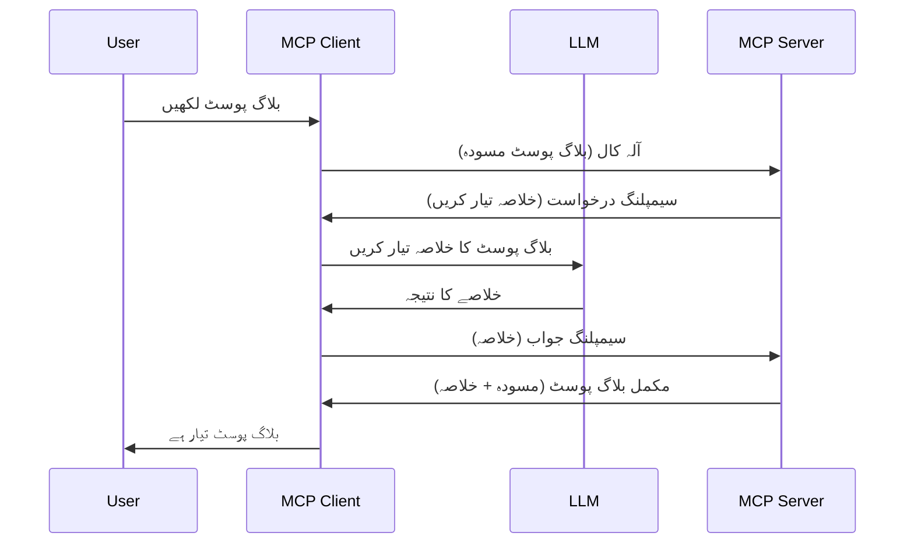

# سیمپلنگ - خصوصیات کو کلائنٹ کو تفویض کرنا

کبھی کبھار، آپ کو MCP کلائنٹ اور MCP سرور کو مشترکہ مقصد کے حصول کے لیے تعاون کرنے کی ضرورت ہوتی ہے۔ آپ کے پاس ایسا کیس ہوسکتا ہے جہاں سرور کو اس LLM کی مدد درکار ہو جو کلائنٹ پر موجود ہو۔ اس صورت حال کے لیے، سیمپلنگ استعمال کرنا چاہیے۔

آیئے کچھ استعمال کے کیسز دریافت کرتے ہیں اور سیمپلنگ پر مشتمل حل کیسے تعمیر کیا جائے۔

## جائزہ

اس سبق میں، ہم سیمپلنگ کب اور کہاں استعمال کرنی ہے اور اسے کیسے ترتیب دینا ہے اس کی وضاحت پر توجہ دیں گے۔

## سیکھنے کے مقاصد

اس باب میں، ہم:

- بتائیں گے کہ سیمپلنگ کیا ہے اور اسے کب استعمال کرنا چاہیے۔
- MCP میں سیمپلنگ کو کیسے ترتیب دیا جائے دکھائیں گے۔
- عملی طور پر سیمپلنگ کی مثالیں فراہم کریں گے۔

## سیمپلنگ کیا ہے اور اسے کیوں استعمال کریں؟

سیمپلنگ ایک جدید خصوصیت ہے جو درج ذیل طریقے سے کام کرتی ہے:


### سیمپلنگ درخواست

ٹھیک ہے، اب ہمارے پاس ایک معتبر منظرنامے کا ایک بلند نظر ہے، چلیں اس سیمپلنگ درخواست کے بارے میں بات کرتے ہیں جو سرور کلائنٹ کو واپس بھیجتا ہے۔ JSON-RPC فارمیٹ میں ایسی درخواست کچھ اس طرح دکھائی دے سکتی ہے:

```json
{
  "jsonrpc": "2.0",
  "id": 1,
  "method": "sampling/createMessage",
  "params": {
    "messages": [
      {
        "role": "user",
        "content": {
          "type": "text",
          "text": "Create a blog post summary of the following blog post: <BLOG POST>"
        }
      }
    ],
    "modelPreferences": {
      "hints": [
        {
          "name": "claude-3-sonnet"
        }
      ],
      "intelligencePriority": 0.8,
      "speedPriority": 0.5
    },
    "systemPrompt": "You are a helpful assistant.",
    "maxTokens": 100
  }
}
```

یہاں چند باتیں قابل ذکر ہیں:

- پرامپٹ، content -> text کے تحت، ہمارا پرامپٹ ہے جو LLM کو بلاگ پوسٹ کے مواد کا خلاصہ بنانے کی ہدایت ہے۔

- **modelPreferences**۔ یہ حصہ بس یہی ہے، ترجیح، ایک سفارش کہ LLM کے ساتھ کون سا کنفیگریشن استعمال کیا جائے۔ صارف انتخاب کر سکتا ہے کہ وہ ان سفارشات پر عمل کرے یا انہیں تبدیل کرے۔ اس صورت میں ماڈل کے انتخاب، رفتار اور ذہانت کی ترجیحوں پر سفارشات موجود ہیں۔
- **systemPrompt**، یہ آپ کا عام سسٹم پرامپٹ ہے جو آپ کے LLM کو شخصیت دیتا ہے اور رہنمائی کے ہدایات رکھتا ہے۔
- **maxTokens**، یہ ایک اور خاصیت ہے جو بتاتی ہے کہ اس کام کے لیے کتنے ٹوکن استعمال کرنے کی سفارش کی گئی ہے۔

### سیمپلنگ جواب

یہ جواب وہ ہے جو MCP کلائنٹ آخر کار MCP سرور کو بھیجتا ہے اور یہ کلائنٹ کے LLM کو کال کرنے، اس کے جواب کا انتظار کرنے اور پھر یہ پیغام بنانے کا نتیجہ ہوتا ہے۔ JSON-RPC میں یہ کچھ اس طرح دکھائی دیتا ہے:

```json
{
  "jsonrpc": "2.0",
  "id": 1,
  "result": {
    "role": "assistant",
    "content": {
      "type": "text",
      "text": "Here's your abstract <ABSTRACT>"
    },
    "model": "gpt-5",
    "stopReason": "endTurn"
  }
}
```

نوٹ کریں کہ جو جواب آیا ہے وہ بلاگ پوسٹ کا خلاصہ ہے جیسا کہ ہم نے درخواست کی تھی۔ اس کے علاوہ نوٹ کریں کہ استعمال شدہ `model` وہ نہیں ہے جو ہم نے مانگا تھا بلکہ "gpt-5" ہے، "claude-3-sonnet" کے بجائے۔ یہ اس بات کی وضاحت کے لیے ہے کہ صارف اپنی پسند بدل سکتا ہے اور آپ کی سیمپلنگ درخواست صرف ایک سفارش ہے۔

ٹھیک ہے، اب جب ہم مرکزی عمل کو سمجھ چکے ہیں، اور مفید کام "بلاگ پوسٹ تخلیق + خلاصہ" کے لیے اسے کیسے استعمال کریں، تو دیکھتے ہیں کہ اسے کارآمد بنانے کے لیے ہمیں کیا کرنا ہوگا۔

### پیغام کی اقسام

سیمپلنگ پیغامات صرف متن تک محدود نہیں بلکہ آپ تصاویر اور آڈیو بھی بھیج سکتے ہیں۔ JSON-RPC کیسے مختلف دکھتا ہے، یہاں ہے:

**متن**

```json
{
  "type": "text",
  "text": "The message content"
}
```

**تصویری مواد**

```json
{
  "type": "image",
  "data": "base64-encoded-image-data",
  "mimeType": "image/jpeg"
}
```

**آڈیو مواد**

```json
{
  "type": "audio",
  "data": "base64-encoded-audio-data",
  "mimeType": "audio/wav"
}
```

> نوٹ: سیمپلنگ کے بارے میں مزید تفصیلی معلومات کے لیے [سرکاری دستاویزات](https://modelcontextprotocol.io/specification/2025-06-18/client/sampling) دیکھیں۔

## کلائنٹ میں سیمپلنگ کیسے ترتیب دیں

> نوٹ: اگر آپ صرف سرور بنا رہے ہیں، تو آپ کو یہاں زیادہ کرنے کی ضرورت نہیں ہے۔

کلائنٹ میں، آپ کو درج ذیل خصوصیت اس طرح تفویض کرنی ہوگی:

```json
{
  "capabilities": {
    "sampling": {}
  }
}
```

جب آپ کا منتخب کردہ کلائنٹ سرور کے ساتھ ابتدائی ہو گا، تو یہ خصوصیت لوڈ ہو جائے گی۔

## عملی مثال - بلاگ پوسٹ بنائیں

چلیں ایک سیمپلنگ سرور کوڈ کرتے ہیں، ہمیں درج ذیل کرنا ہوگا:

1. سرور پر ایک ٹول بنائیں۔
1. مذکورہ ٹول سیمپلنگ درخواست تیار کرے۔
1. ٹول کلائنٹ کے سیمپلنگ درخواست کے جواب کا انتظار کرے۔
1. پھر ٹول نتیجہ پیدا کرے۔

چلیں کوڈ کو مرحلہ وار دیکھیں:

### -1- ٹول بنائیں

**python**

```python
@mcp.tool()
async def create_blog(title: str, content: str, ctx: Context[ServerSession, None]) -> str:
    """Create a blog post and generate a summary"""

```

### -2- سیمپلنگ درخواست تیار کریں

اپنے ٹول میں درج ذیل کوڈ شامل کریں:

**python**

```python
post = BlogPost(
        id=len(posts) + 1,
        title=title,
        content=content,
        abstract=""
    )

prompt = f"Create an abstract of the following blog post: title: {title} and draft: {content} "

result = await ctx.session.create_message(
        messages=[
            SamplingMessage(
                role="user",
                content=TextContent(type="text", text=prompt),
            )
        ],
        max_tokens=100,
)

```

### -3- جواب کے انتظار کریں اور جواب واپس کریں

**python**

```python
post.abstract = result.content.text

posts.append(post)

# مکمل مصنوع واپس کریں
return json.dumps({
    "id": post.title,
    "abstract": post.abstract
})
```

### -4- مکمل کوڈ

**python**

```python
from starlette.applications import Starlette
from starlette.routing import Mount, Host

from mcp.server.fastmcp import Context, FastMCP

from mcp.server.session import ServerSession
from mcp.types import SamplingMessage, TextContent

import json


from uuid import uuid4
from typing import List
from pydantic import BaseModel


mcp = FastMCP("Blog post generator")

# ایپ = فاسٹ اے پی آئی()

posts = []

class BlogPost(BaseModel):
    id: int
    title: str
    content: str
    abstract: str

posts: List[BlogPost] = []

@mcp.tool()
async def create_blog(title: str, content: str, ctx: Context[ServerSession, None]) -> str:
    """Create a blog post and generate a summary"""

    post = BlogPost(
        id=len(posts) + 1,
        title=title,
        content=content,
        abstract=""
    )

    prompt = f"Create an abstract of the following blog post: title: {title} and draft: {content} "

    result = await ctx.session.create_message(
        messages=[
            SamplingMessage(
                role="user",
                content=TextContent(type="text", text=prompt),
            )
        ],
        max_tokens=100,
    )

    post.abstract = result.content.text

    posts.append(post)

    # مکمل بلاگ پوسٹ واپس کریں
    return json.dumps({
        "id": post.title,
        "abstract": post.abstract
    })

if __name__ == "__main__":
    print("Starting server...")
    # ایم سی پی چلائیں()
    mcp.run(transport="streamable-http")

# ایپ چلائیں: python server.py
```

### -5- Visual Studio Code میں ٹیسٹ کرنا

Visual Studio Code میں اسے ٹیسٹ کرنے کے لیے یہ کریں:

1. ٹرمینل میں سرور شروع کریں۔
1. اسے *mcp.json* میں شامل کریں (اور یقینی بنائیں کہ سرور چل رہا ہے)، مثلاً کچھ ایسا:

   ```json
   "servers": {
      "blog-server": {
        "type": "http",
        "url": "http://localhost:8000/mcp"
      }
   }
   ```

1. ایک پرامپٹ ٹائپ کریں:

   ```text
   create a blog post named "Where Python comes from", the content is "Python is actually named after Monty Python Flying Circus"
   ```

1. سیمپلنگ کو ہوتا ہوا دیکھیں۔ پہلی بار آپ اس کی جانچ کریں گے تو آپ کو اضافی ڈائیلاگ ملے گا جسے آپ کو قبول کرنا ہوگا، پھر آپ کو ٹول چلانے کی دعوت دینے والا عام ڈائیلاگ نظر آئے گا۔

1. نتائج کا معائنہ کریں۔ آپ نتائج کو GitHub Copilot Chat میں خوش اسلوبی سے دیکھ سکیں گے اور آپ خام JSON جواب بھی معائنہ کر سکتے ہیں۔

**اضافی**: Visual Studio Code کے ٹولنگ نے سیمپلنگ کے لیے زبردست سپورٹ فراہم کی ہے۔ آپ اپنے انسٹال کردہ سرور کی Sampling رسائی کو یوں ترتیب دے سکتے ہیں:

1. ایکسٹینشن سیکشن پر جائیں۔
1. "MCP SERVERS - INSTALLED" سیکشن میں اپنے انسٹال کردہ سرور کے لیے cog آئیکن منتخب کریں۔
1. "Configure Model Access" منتخب کریں، یہاں آپ منتخب کر سکتے ہیں کہ GitHub Copilot کن ماڈلز کو سیمپلنگ کرتے وقت استعمال کرنے کی اجازت دیتا ہے۔ آپ حال ہی میں ہونے والی تمام سیمپلنگ درخواستیں بھی "Show Sampling requests" منتخب کر کے دیکھ سکتے ہیں۔

## اسائنمنٹ

اس اسائنمنٹ میں، آپ تھوڑی مختلف سیمپلنگ بنائیں گے، یعنی ایک سیمپلنگ انٹیگریشن جو پروڈکٹ کی تفصیل تیار کرنے کی حمایت کرتی ہو۔ یہ آپ کا منظرنامہ ہے:

**منظرنامہ**: ایک ای کامرس کے بیک آفس ورکر کو مدد چاہیے، کیونکہ پروڈکٹ کی تفصیلات تیار کرنے میں بہت زیادہ وقت لگتا ہے۔ لہٰذا، آپ ایسا حل بنائیں گے جہاں آپ "create_product" نامی ٹول کو "title" اور "keywords" دلائل کے ساتھ کال کریں اور یہ ایک مکمل پروڈکٹ تیار کرے، جس میں "description" فیلڈ ہو جو کلائنٹ کے LLM سے بھری جائے۔

ٹپ: جو کچھ آپ نے پہلے سیکھا ہے اسے استعمال کرتے ہوئے اس سرور اور اس کا ٹول سیمپلنگ درخواست سے تعمیر کریں۔

## حل

[حل](./solution/README.md)

## اہم نتائج

سیمپلنگ ایک طاقتور خصوصیت ہے جو سرور کو اس وقت کام تفویض کرنے دیتی ہے جب اسے LLM کی مدد کلائنٹ سے درکار ہو۔

## آگے کیا ہے

- [باب 4 - عملی نفاذ](../../04-PracticalImplementation/README.md)

---

<!-- CO-OP TRANSLATOR DISCLAIMER START -->
**دستیاب خبردار**:  
یہ دستاویز AI ترجمہ خدمات [Co-op Translator](https://github.com/Azure/co-op-translator) کے ذریعے ترجمہ کی گئی ہے۔ اگرچہ ہم درستگی کی کوشش کرتے ہیں، براہ کرم یاد رکھیں کہ خودکار ترجمے میں غلطیاں یا بے دقتیاں ہو سکتی ہیں۔ اصل دستاویز اپنی مادری زبان میں مستند ذریعہ سمجھا جانا چاہئے۔ اہم معلومات کے لیے پیشہ ور انسانی ترجمہ کی سفارش کی جاتی ہے۔ ہم اس ترجمہ کے استعمال سے ہونے والی کسی بھی غلط فہمی یا غلط تشریح کے ذمہ دار نہیں ہیں۔
<!-- CO-OP TRANSLATOR DISCLAIMER END -->