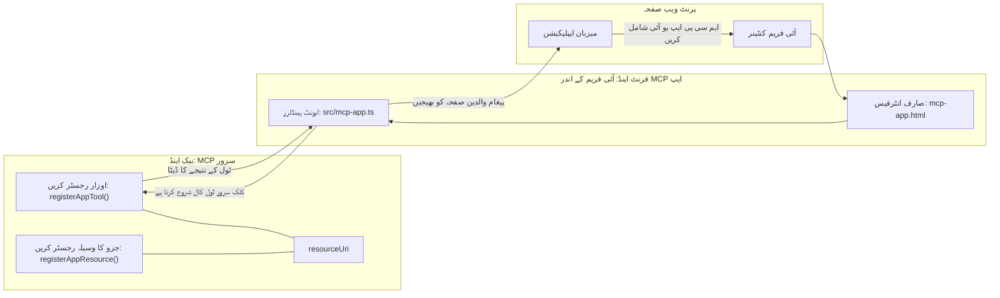

# MCP ایپس

MCP ایپس MCP میں ایک نیا تصور ہے۔ خیال یہ ہے کہ آپ صرف ٹول کال سے ڈیٹا واپس نہیں کرتے بلکہ یہ بھی فراہم کرتے ہیں کہ اس معلومات کے ساتھ کس طرح تعامل کیا جانا چاہیے۔ اس کا مطلب ہے کہ ٹول کے نتائج میں اب UI کی معلومات بھی شامل ہو سکتی ہیں۔ تاہم، ہم ایسا کیوں کرنا چاہیں گے؟ ٹھیک ہے، غور کریں کہ آپ آج کل کیسے کام کرتے ہیں۔ آپ ممکنہ طور پر MCP سرور کے نتائج کو کسی قسم کے فرنٹ اینڈ کے ذریعے استعمال کر رہے ہیں، جو وہ کوڈ ہے جسے آپ کو لکھنا اور برقرار رکھنا پڑتا ہے۔ کبھی کبھار یہ درست ہوتا ہے، لیکن کبھی کبھار یہ شاندار ہوگا کہ آپ ایسی معلومات کا چھوٹا ٹکڑا لے کر آئیں جو خود مختار ہو، جس میں ڈیٹا سے لے کر یوزر انٹرفیس تک سب کچھ موجود ہو۔

## جائزہ

یہ سبق MCP ایپس پر عملی رہنمائی فراہم کرتا ہے، اس کے ساتھ کیسے شروع کیا جائے اور اسے اپنے موجودہ ویب ایپس میں کیسے ضم کیا جائے۔ MCP ایپس MCP اسٹینڈرڈ کا ایک بالکل نیا اضافہ ہے۔

## سیکھنے کے مقاصد

اس سبق کے اختتام پر، آپ قابل ہوں گے:

- MCP ایپس کیا ہیں، سمجھائیں۔
- کب MCP ایپس استعمال کریں۔
- اپنی خود کی MCP ایپس بنائیں اور انضمام کریں۔

## MCP ایپس - یہ کیسے کام کرتی ہیں

MCP ایپس کا خیال یہ ہے کہ آپ ایک ایسا ردعمل فراہم کریں جو بنیادی طور پر ایک جزو (component) ہے جسے رینڈر کیا جا سکتا ہے۔ ایسا جزو دونوں ہی بصری اور تعاملاتی ہو سکتا ہے، مثال کے طور پر بٹن کلکس، یوزر ان پٹ اور مزید۔ آئیے سرور کی طرف اور ہمارے MCP سرور سے شروع کرتے ہیں۔ MCP ایپ جزو بنانے کے لیے آپ کو ایک ٹول بنانا ہوگا لیکن ساتھ ہی ایپلیکیشن ریسورس بھی۔ یہ دونوں حصے resourceUri کے ذریعے جڑے ہوتے ہیں۔

یہاں ایک مثال ہے۔ آئیں دیکھتے ہیں کہ اس میں کیا شامل ہے اور کون سا حصہ کیا کرتا ہے:

```text
server.ts -- responsible for registering tools and the component as a UI component
src/
  mcp-app.ts -- wiring up event handlers
mcp-app.html -- the user interface
```

یہ ویژول آرکیٹیکچر بیان کرتا ہے کہ کس طرح ایک جزو اور اس کا منطق تخلیق کیا جاتا ہے۔


آئیں اب اگلے مرحلے میں بیک اینڈ اور فرنٹ اینڈ کی ذمہ داریوں کو بیان کریں۔

### بیک اینڈ

ہمیں یہاں دو کام کرنے ہیں:

- وہ ٹولز رجسٹر کرنا جن سے ہمیں تعامل کرنا ہے۔
- جزو کی تعریف کرنا۔

**ٹول رجسٹر کرنا**

```typescript
registerAppTool(
    server,
    "get-time",
    {
      title: "Get Time",
      description: "Returns the current server time.",
      inputSchema: {},
      _meta: { ui: { resourceUri } }, // اس ٹول کو اس کے UI وسائل سے منسلک کرتا ہے
    },
    async () => {
      const time = new Date().toISOString();
      return { content: [{ type: "text", text: time }] };
    },
  );

```

مندرجہ بالا کوڈ رویہ بیان کرتا ہے، جہاں یہ `get-time` نامی ٹول کی نمائندگی کرتا ہے۔ اسے کوئی ان پٹ نہیں چاہیے لیکن یہ موجودہ وقت پیدا کرتا ہے۔ ہمارے پاس امکان ہے کہ ہم ان ٹولز کے لیے `inputSchema` بھی تعین کریں جہاں ہمیں یوزر ان پٹ کو قبول کرنا ہو۔

**جزو رجسٹر کرنا**

اسی فائل میں، ہمیں جزو کو بھی رجسٹر کرنا ہوگا:

```typescript
const resourceUri = "ui://get-time/mcp-app.html";

// وسائل کو رجسٹر کریں، جو UI کے لیے بنڈل شدہ HTML/JavaScript واپس کرتا ہے۔
registerAppResource(
  server,
  resourceUri,
  resourceUri,
  { mimeType: RESOURCE_MIME_TYPE },
  async () => {
    const html = await fs.readFile(path.join(DIST_DIR, "mcp-app.html"), "utf-8");

    return {
    contents: [
        { uri: resourceUri, mimeType: RESOURCE_MIME_TYPE, text: html },
    ],
    };
  },
);
```

نوٹ کریں کہ ہم `resourceUri` کا ذکر کرتے ہیں تاکہ جزو کو اس کے ٹولز کے ساتھ جوڑا جا سکے۔ دلچسپ بات کال بیک بھی ہے جہاں ہم UI فائل لوڈ کرتے ہیں اور جزو واپس کرتے ہیں۔

### جزو کا فرنٹ اینڈ

بیک اینڈ کی طرح، یہاں بھی دو حصے ہیں:

- صاف HTML میں لکھا ہوا فرنٹ اینڈ۔
- کوڈ جو ایونٹس کو ہینڈل کرتا ہے اور کیا کرنا ہے، مثلاً، ٹولز کو کال کرنا یا پیرنٹ ونڈو کو میسج کرنا۔

**یوزر انٹرفیس**

آئیں یوزر انٹرفیس پر نظر ڈالیں۔

```html
<!-- mcp-app.html -->
<!DOCTYPE html>
<html lang="en">
  <head>
    <meta charset="UTF-8" />
    <title>Get Time App</title>
  </head>
  <body>
    <p>
      <strong>Server Time:</strong> <code id="server-time">Loading...</code>
    </p>
    <button id="get-time-btn">Get Server Time</button>
    <script type="module" src="/src/mcp-app.ts"></script>
  </body>
</html>
```

**ایونٹ وائر اپ**

آخری حصہ ایونٹ وائر اپ ہے۔ اس کا مطلب ہے کہ ہم شناخت کرتے ہیں ہمارے UI کے کس حصے کو ایونٹ ہینڈلرز کی ضرورت ہے اور اگر ایونٹس اٹھتے ہیں تو کیا کرنا ہے:

```typescript
// mcp-app.ts

import { App } from "@modelcontextprotocol/ext-apps";

// عناصر کے حوالہ جات حاصل کریں
const serverTimeEl = document.getElementById("server-time")!;
const getTimeBtn = document.getElementById("get-time-btn")!;

// ایپ کی مثال بنائیں
const app = new App({ name: "Get Time App", version: "1.0.0" });

// سرور سے ٹول کے نتائج کو ہینڈل کریں۔ شروع میں `app.connect()` سے پہلے سیٹ کریں تاکہ
// ابتدائی ٹول کے نتیجے کو کھونے سے بچا جا سکے۔
app.ontoolresult = (result) => {
  const time = result.content?.find((c) => c.type === "text")?.text;
  serverTimeEl.textContent = time ?? "[ERROR]";
};

// بٹن کلک کو منسلک کریں
getTimeBtn.addEventListener("click", async () => {
  // `app.callServerTool()` UI کو سرور سے تازہ ڈیٹا درخواست کرنے کی اجازت دیتا ہے
  const result = await app.callServerTool({ name: "get-time", arguments: {} });
  const time = result.content?.find((c) => c.type === "text")?.text;
  serverTimeEl.textContent = time ?? "[ERROR]";
});

// ہوسٹ سے کنیکٹ کریں
app.connect();
```

جیسا کہ آپ اوپر دیکھ سکتے ہیں، یہ معمول کا کوڈ ہے جو DOM عناصر کو ایونٹس سے جوڑتا ہے۔ خاص طور پر `callServerTool` کال قابل ذکر ہے جو بیک اینڈ پر ایک ٹول کو کال کرتا ہے۔

## یوزر ان پٹ کے ساتھ نمٹنا

اب تک، ہم نے ایک ایسا جزو دیکھا ہے جس میں ایک بٹن ہے جو کلک کرنے پر ٹول کال کرتا ہے۔ آئیں دیکھتے ہیں کہ ہم مزید UI عناصر جیسے ان پٹ فیلڈ شامل کر کے ٹول کو دلائل بھی بھیج سکتے ہیں۔ ہم FAQ (اکثر پوچھے جانے والے سوالات) کی فعالیت نافذ کریں گے۔ یہ اس طرح کام کرے گا:

- ایک بٹن اور ایک ان پٹ عنصر ہونا چاہیے جہاں یوزر ایک کلیدی لفظ ٹائپ کرے، مثلاً "Shipping"۔ یہ بیک اینڈ پر ایسے ٹول کو کال کرے گا جو FAQ ڈیٹا میں تلاش کرتا ہے۔
- ایسا ٹول جو مذکورہ FAQ تلاش کی مدد کرتا ہو۔

سب سے پہلے بیک اینڈ کی ضروری سپورٹ شامل کرتے ہیں:

```typescript
const faq: { [key: string]: string } = {
    "shipping": "Our standard shipping time is 3-5 business days.",
    "return policy": "You can return any item within 30 days of purchase.",
    "warranty": "All products come with a 1-year warranty covering manufacturing defects.",
  }

registerAppTool(
    server,
    "get-faq",
    {
      title: "Search FAQ",
      description: "Searches the FAQ for relevant answers.",
      inputSchema: zod.object({
        query: zod.string().default("shipping"),
      }),
      _meta: { ui: { resourceUri: faqResourceUri } }, // اس آلے کو اس کے UI وسائل سے جوڑتا ہے
    },
    async ({ query }) => {
      const answer: string = faq[query.toLowerCase()] || "Sorry, I don't have an answer for that.";
      return { content: [{ type: "text", text: answer }] };
    },
  );
```

یہاں ہم دیکھ رہے ہیں کہ ہم `inputSchema` کو کیسے بھر رہے ہیں اور اسے `zod` اسکیمہ دے رہے ہیں:

```typescript
inputSchema: zod.object({
  query: zod.string().default("shipping"),
})
```

مذکورہ اسکیمہ میں ہم بتاتے ہیں کہ ہمارے پاس ایک ان پٹ پیرامیٹر `query` ہے اور یہ اختیاری ہے جس کی ڈیفالٹ ویلیو "shipping" ہے۔

چلیں *mcp-app.html* پر جاتے ہیں تاکہ دیکھیں ہمیں کون سا UI بنانا ہے:

```html
<div class="faq">
    <h1>FAQ response</h1>
    <p>FAQ Response: <code id="faq-response">Loading...</code></p>
    <input type="text" id="faq-query" placeholder="Enter FAQ query" />
    <button id="get-faq-btn">Get FAQ Response</button>
  </div>
```

بہت اچھا، اب ہمارے پاس ایک ان پٹ عنصر اور بٹن ہے۔ اگلا مرحلہ *mcp-app.ts* پر جانا ہے تاکہ ان ایونٹس کو وائر اپ کریں:

```typescript
const getFaqBtn = document.getElementById("get-faq-btn")!;
const faqQueryInput = document.getElementById("faq-query") as HTMLInputElement;

getFaqBtn.addEventListener("click", async () => {
  const query = faqQueryInput.value;
  const result = await app.callServerTool({ name: "get-faq", arguments: { query } });
  const faq = result.content?.find((c) => c.type === "text")?.text;
  faqResponseEl.textContent = faq ?? "[ERROR]";
});
```

اوپر کے کوڈ میں ہم نے:

- انٹرایکٹو UI عناصر کے ریفرنسز بنائے۔
- بٹن کلک ہینڈل کیا تاکہ ان پٹ ویلیو نکالی جا سکے اور `app.callServerTool()` بھی کال کی جہاں `name` اور `arguments` دیے گئے، اور `query` بطور ویلیو پاس کیا گیا۔

اصل میں جب آپ `callServerTool` کال کرتے ہیں تو یہ پیغام پیرنٹ ونڈو کو بھیجتا ہے اور وہ ونڈو MCP سرور کو کال کرتا ہے۔

### اسے آزمائیں

اس کو آزمانے سے ہمیں اب یہ نظر آنا چاہیے:


اور یہاں ہم "warranty" جیسے ان پٹ کے ساتھ آزما رہے ہیں:


اس کو چلانے کے لیے، [کوڈ سیکشن](./code/README.md) پر جائیں۔

## Visual Studio Code میں ٹیسٹنگ

Visual Studio Code MCP ایپس کی عمدہ حمایت کرتا ہے اور شاید آپ کے MCP ایپس کی ٹیسٹنگ کا سب سے آسان طریقہ ہے۔ Visual Studio Code استعمال کرنے کے لیے، *mcp.json* میں سرور انٹری شامل کریں جیسے:

```json
"my-mcp-server-7178eca7": {
    "url": "http://localhost:3001/mcp",
    "type": "http"
  }
```

پھر سرور شروع کریں، آپ اپنے MCP ایپ کے ساتھ Chat Window کے ذریعے بات چیت کر سکیں گے بشرطیکہ آپ نے GitHub Copilot انسٹال کیا ہوا ہو۔

آپ اسے پرامپٹ کے ذریعے چلا سکتے ہیں، مثلاً "#get-faq":


اور جیسے آپ نے اسے ویب براؤزر میں چلایا تھا، وہ اسی طرح رینڈر ہوتا ہے:


## اسائنمنٹ

ایک راک پیپر سیزر گیم بنائیں۔ اس میں درج ذیل شامل ہوں:

UI:

- اختیارات کے ساتھ ایک ڈراپ ڈاؤن لسٹ
- انتخاب جمع کروانے کے لیے بٹن
- ایک لیبل جو دکھائے کہ کس نے کیا منتخب کیا اور کون جیتا

سرور:

- ایک راک پیپر سیزر ٹول ہونا چاہیے جو "choice" کو ان پٹ کے طور پر لے۔ یہ کمپیوٹر کی پسند ظاہر کرے اور فاتح کا تعین کرے۔

## حل

[حل](./assignment/README.md)

## خلاصہ

ہم نے اس نئے تصور MCP ایپس کے بارے میں سیکھا۔ یہ ایک نیا تصور ہے جو MCP سرورز کو نہ صرف ڈیٹا کے بارے میں بلکہ اس بات میں بھی رائے رکھنے دیتا ہے کہ یہ ڈیٹا کیسے پیش کیا جائے۔

مزید برآں، ہم نے سیکھا کہ یہ MCP ایپس ایک IFrame میں ہوسٹ کی جاتی ہیں اور MCP سرورز سے بات چیت کے لیے انہیں پیرنٹ ویب ایپ کو پیغامات بھیجنے کی ضرورت ہوتی ہے۔ اس بات چیت کو آسان بنانے کے لیے کئی لائبریریاں موجود ہیں جو سادہ جاوا اسکرپٹ، ریئیکٹ اور دیگر کے لیے مدد فراہم کرتی ہیں۔

## اہم نکات

یہ ہیں آپ کی سیکھنے کی باتیں:

- MCP ایپس ایک نیا اسٹینڈرڈ ہے جو مفید ہوتا ہے جب آپ ڈیٹا اور UI فیچرز دونوں بھیجنا چاہتے ہیں۔
- سیکورٹی وجوہات کی بنا پر یہ ایپس IFrame میں چلتی ہیں۔

## اگلا کیا ہے

- [باب 4](../../04-PracticalImplementation/README.md)

---

<!-- CO-OP TRANSLATOR DISCLAIMER START -->
**ڈس کلیمر**:  
اس دستاویز کا ترجمہ مصنوعی ذہانت کی ترجمہ سروس [Co-op Translator](https://github.com/Azure/co-op-translator) کے ذریعے کیا گیا ہے۔ اگرچہ ہم درستگی کے لیے کوشاں ہیں، براہ کرم خیال رکھیں کہ خودکار تراجم میں غلطیاں یا عدم درستیاں ہو سکتی ہیں۔ اصل دستاویز اپنی مادری زبان میں ہی مستند ماخذ سمجھی جائے۔ اہم معلومات کے لیے پیشہ ور انسانی ترجمہ کی سفارش کی جاتی ہے۔ اس ترجمے کے استعمال سے ہونے والی کسی بھی غلط فہمی یا غلط تشریح کی ذمہ داری ہم پر نہیں ہوگی۔
<!-- CO-OP TRANSLATOR DISCLAIMER END -->