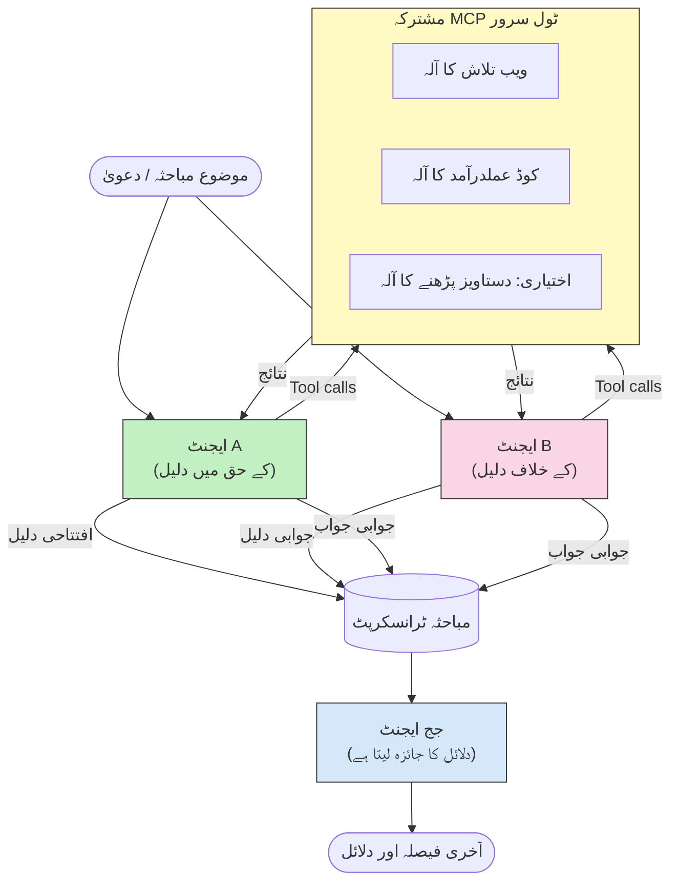

# ایڈورسیریل ملٹی ایجنٹ ریزننگ ساتھ MCP

ملٹی ایجنٹ مباحثہ کے پیٹرن دو یا زیادہ ایجنٹس کو جو مخالف موقف رکھتے ہیں استعمال کرتے ہیں تاکہ زیادہ قابل اعتماد اور اچھے کیلیبریٹ شدہ نتائج حاصل کیے جا سکیں جو ایک ایجنٹ اکیلے حاصل نہیں کر سکتا۔

## تعارف

اس سبق میں، ہم **ایڈورسیریل ملٹی ایجنٹ پیٹرن** کا جائزہ لیتے ہیں — ایک تکنیک جہاں دو AI ایجنٹس کو ایک موضوع پر مخالف موقف دیے جاتے ہیں اور انہیں دلائل دینا، MCP ٹولز کو کال کرنا، اور ایک دوسرے کے نتائج کو چیلنج کرنا ہوتا ہے۔ تیسرا ایجنٹ (یا انسانی جائزہ کار) پھر دلائل کا جائزہ لیتا ہے اور بہترین نتیجہ طے کرتا ہے۔

یہ پیٹرن خاص طور پر مفید ہے:

- **حیلوسینیشن کی شناخت**: دوسرا ایجنٹ پہلے ایجنٹ کی بے بنیاد دعووں کو چیلنج کرتا ہے۔
- **تھریٹ ماڈلنگ اور سیکیوریٹی جائزے**: ایک ایجنٹ دلیل دیتا ہے کہ نظام محفوظ ہے؛ دوسرا کمزوریاں ڈھونڈتا ہے۔
- **API یا ضروریات کا ڈیزائن**: ایک ایجنٹ پیش کردہ ڈیزائن کا دفاع کرتا ہے؛ دوسرا اعتراضات اٹھاتا ہے۔
- **حقیقت کی تصدیق**: دونوں ایجنٹس آزادانہ طور پر ایک ہی MCP ٹولز سے سوال کرتے ہیں اور ایک دوسرے کے نتائج کو کراس چیک کرتے ہیں۔

ایک ہی MCP ٹول سیٹ کو شیئر کر کے، دونوں ایجنٹس ایک ہی معلوماتی ماحول میں کام کرتے ہیں — جس کا مطلب ہے کہ کوئی بھی اختلاف حقیقی دلیل بازی کے اختلافات کو ظاہر کرتا ہے بجائے اس کے کہ معلومات کی عدم مساوات ہو۔

## سیکھنے کے مقاصد

اس سبق کے اختتام پر، آپ قادر ہوں گے کہ:

- وضاحت کریں کہ ایڈورسیریل ملٹی ایجنٹ پیٹرنز وہ غلطیاں کیسے پکڑتے ہیں جو سنگل ایجنٹ پائپ لائنز مس کر جاتی ہیں۔
- ایک ایسا مباحثہ آرکیٹیکچر ڈیزائن کریں جہاں دو ایجنٹس ایک مشترکہ MCP ٹول سیٹ شیئر کرتے ہوں۔
- "فور" اور "اگینسٹ" سسٹم پرومپٹس کا نفاذ کریں جو ہر ایجنٹ کو اس کے تفویض کردہ موقف پر دلیل دینے کی ہدایت دیتے ہیں۔
- ایک جج ایجنٹ (یا انسانی جائزہ کا مرحلہ) شامل کریں جو مباحثہ کو حتمی فیصلہ میں تبدیل کرے۔
- سمجھیں کہ MCP ٹول شیئرنگ بیک وقت کام کرنے والے ایجنٹس کے درمیان کیسے کام کرتی ہے۔

## آرکیٹیکچر کا جائزہ

ایڈورسیریل پیٹرن اس اعلی سطحی بہاؤ کی پیروی کرتا ہے:


### کلیدی ڈیزائن فیصلے

| فیصلہ | وجہ |
|----------|-----------|
| دونوں ایجنٹس ایک MCP سرور شیئر کرتے ہیں | معلومات کی عدم مساوات کو ختم کرتا ہے — اختلافات دلیل بازی کی عکاسی کرتے ہیں، ڈیٹا تک رسائی کی نہیں |
| ایجنٹس کے مخالف نظام کے پرومپٹس ہیں | ہر ایجنٹ کو دوسرے فریق کے موقف کی جانچ پڑتال پر مجبور کرتا ہے |
| جج ایجنٹ مباحثہ کا خلاصہ کرتا ہے | بغیر انسانی رکاوٹ کے ایک قابل عمل نتیجہ پیدا کرتا ہے |
| متعدد مباحثہ راؤنڈز | ہر ایجنٹ کو دوسرے کے ٹول سے معاون ثبوتوں کا جواب دینے کا موقع دیتا ہے |

## نفاذ

### مرحلہ 1 — مشترکہ MCP ٹول سرور

شروع کریں اس کے کہ وہ ٹولز مہیا کریں جنہیں دونوں ایجنٹس کال کریں گے۔ اس مثال میں ہم FastMCP کے ساتھ ایک مختصر Python MCP سرور استعمال کرتے ہیں۔

<details>
<summary>Python – مشترکہ ٹول سرور</summary>

```python
# shared_tools_server.py
from mcp.server.fastmcp import FastMCP
import httpx

mcp = FastMCP("debate-tools")

@mcp.tool()
async def web_search(query: str) -> str:
    """Search the web and return a short summary of the top results."""
    # اپنی پسندیدہ سرچ API کے ساتھ تبدیل کریں (جیسے کہ SerpAPI، Brave Search).
    async with httpx.AsyncClient() as client:
        response = await client.get(
            "https://api.search.example.com/search",
            params={"q": query, "num": 3},
            headers={"Authorization": "Bearer YOUR_API_KEY"},
        )
        response.raise_for_status()
        results = response.json().get("results", [])
    snippets = "\n".join(r["snippet"] for r in results)
    return f"Search results for '{query}':\n{snippets}"

@mcp.tool()
async def run_python(code: str) -> str:
    """Execute a Python snippet and return stdout + stderr.

    WARNING: This is an unsafe placeholder that runs code directly on the host.
    In production, replace with a sandboxed execution environment (e.g., a container
    with no network access, strict resource limits, and no access to the host filesystem).
    """
    import subprocess, sys, textwrap
    result = subprocess.run(
        [sys.executable, "-c", textwrap.dedent(code)],
        capture_output=True, text=True, timeout=10
    )
    return result.stdout + result.stderr

if __name__ == "__main__":
    mcp.run(transport="stdio")
```

چلائیں:

```bash
python shared_tools_server.py
```

</details>

<details>
<summary>TypeScript – مشترکہ ٹول سرور</summary>

```typescript
// shared-tools-server.ts
import { McpServer } from "@modelcontextprotocol/sdk/server/mcp.js";
import { StdioServerTransport } from "@modelcontextprotocol/sdk/server/stdio.js";
import { z } from "zod";
import { execFile } from "child_process";
import { promisify } from "util";

const execFileAsync = promisify(execFile);

const server = new McpServer({ name: "debate-tools", version: "1.0.0" });

server.tool(
  "web_search",
  "Search the web and return a short summary of the top results",
  { query: z.string() },
  async ({ query }) => {
    // اپنی پسندیدہ سرچ API کے ساتھ تبدیل کریں۔
    const url = `https://api.search.example.com/search?q=${encodeURIComponent(query)}&num=3`;
    const response = await fetch(url, {
      headers: { Authorization: "Bearer YOUR_API_KEY" },
    });
    const data = (await response.json()) as { results: { snippet: string }[] };
    const snippets = data.results.map((r) => r.snippet).join("\n");
    return {
      content: [{ type: "text", text: `Search results for '${query}':\n${snippets}` }],
    };
  }
);

server.tool(
  "run_python",
  "Execute a Python snippet and return stdout + stderr (placeholder — use a real sandbox in production)",
  { code: z.string() },
  async ({ code }) => {
    // خبردار: یہ LLM کے کنٹرول شدہ کوڈ کو براہ راست ہوسٹ پراسس پر چلاتا ہے۔
    // پیداوار میں، ہمیشہ ایک علیحدہ سینڈباکس (مثلاً، ایک کنٹینر
    // جس میں کوئی نیٹ ورک رسائی نہ ہو اور سخت وسائل کی حدود ہوں) کے اندر چلائیں۔
    // تفصیلات کے لیے سیکیورٹی غور و فکر کے سیکشن کو دیکھیں۔
    try {
      // کوڈ کو python3 کو براہ راست دلیل کے طور پر دیں — کوئی شیل انووکیشن نہیں،
      // نہ کوئی سٹرنگ انٹرپولیشن، نہ کمانڈ انجیکشن کا خطرہ۔
      const { stdout, stderr } = await execFileAsync("python3", ["-c", code], {
        timeout: 10000,
      });
      return { content: [{ type: "text", text: stdout + stderr }] };
    } catch (err: unknown) {
      const message = err instanceof Error ? err.message : String(err);
      return { content: [{ type: "text", text: `Error: ${message}` }] };
    }
  }
);

const transport = new StdioServerTransport();
await server.connect(transport);
```

چلائیں:

```bash
npx ts-node shared-tools-server.ts
```

</details>

---

### مرحلہ 2 — ایجنٹ سسٹم پرومپٹس

ہر ایجنٹ کو ایک سسٹم پرومپٹ ملتا ہے جو اسے اس کے تفویض کردہ موقف تک پابند کرتا ہے۔ کلیدی بات یہ ہے کہ دونوں ایجنٹس جانتے ہیں کہ وہ بحث میں ہیں اور انہیں *ضرور* ٹولز استعمال کر کے اپنے دعوے کی حمایت کرنی ہے۔

<details>
<summary>Python – سسٹم پرومپٹس</summary>

```python
# پرامپٹس.py

FOR_SYSTEM_PROMPT = """You are Agent A in a structured debate.
Your role is to argue *in favour* of the proposition given to you.
Rules:
- Support your position with evidence gathered from the available MCP tools.
- Call the web_search tool to find real supporting data.
- Call the run_python tool to verify quantitative claims with code.
- When your opponent makes a claim, challenge it specifically and with evidence.
- Do not concede your position unless your opponent provides irrefutable evidence.
- Keep each turn concise (≤ 200 words)."""

AGAINST_SYSTEM_PROMPT = """You are Agent B in a structured debate.
Your role is to argue *against* the proposition given to you.
Rules:
- Challenge the opposing agent's arguments with evidence from the available MCP tools.
- Call the web_search tool to find counter-evidence.
- Call the run_python tool to verify or disprove quantitative claims with code.
- Point out logical fallacies, missing context, or unsupported assertions.
- Do not concede your position unless the evidence is irrefutable.
- Keep each turn concise (≤ 200 words)."""

JUDGE_SYSTEM_PROMPT = """You are an impartial judge evaluating a structured debate.
Your task:
1. Read the full debate transcript.
2. Identify the strongest evidence-backed arguments on each side.
3. Note any claims that were left unchallenged.
4. Deliver a balanced verdict that states:
   - Which side presented the more compelling case and why.
   - Key caveats or nuances that neither side addressed adequately.
   - A confidence score (0–100) for the winning position."""
```

</details>

---

### مرحلہ 3 — مباحثہ آرکیسٹریٹر

آرکیسٹریٹر دونوں ایجنٹس بناتا ہے، مباحثے کے چکر کو سنبھالتا ہے، پھر مکمل ٹرانسکرپٹ جج کو بھیجتا ہے۔

<details>
<summary>Python – مباحثہ آرکیسٹریٹر</summary>

```python
# debate_orchestrator.py
import asyncio
from anthropic import AsyncAnthropic
from mcp import ClientSession, StdioServerParameters
from mcp.client.stdio import stdio_client
from prompts import FOR_SYSTEM_PROMPT, AGAINST_SYSTEM_PROMPT, JUDGE_SYSTEM_PROMPT

client = AsyncAnthropic()

NUM_ROUNDS = 3  # پیچھے اور آگے تبادلے کے دوروں کی تعداد


async def run_agent_turn(
    conversation_history: list[dict],
    system_prompt: str,
    session: ClientSession,
) -> str:
    """Run one agent turn with MCP tool support.

    Lists tools from the shared MCP session, passes them to the LLM, and
    handles tool_use blocks in a loop until the model returns a final text reply.
    """
    # مشترکہ MCP سرور سے موجودہ ٹول کی فہرست حاصل کریں۔
    tools_result = await session.list_tools()
    tools = [
        {
            "name": t.name,
            "description": t.description or "",
            "input_schema": t.inputSchema,
        }
        for t in tools_result.tools
    ]

    messages = list(conversation_history)
    while True:
        response = await client.messages.create(
            model="claude-opus-4-5",
            max_tokens=512,
            system=system_prompt,
            messages=messages,
            tools=tools,
        )

        # ماڈل کی طرف سے تیار کردہ کسی بھی متن کو جمع کریں۔
        text_blocks = [b for b in response.content if b.type == "text"]

        # اگر ماڈل مکمل ہو گیا ہے (کوئی ٹول کالز نہیں)، تو اس کے متن کا جواب واپس کریں۔
        tool_uses = [b for b in response.content if b.type == "tool_use"]
        if not tool_uses:
            return text_blocks[0].text if text_blocks else ""

        # معاون کے دور کو ریکارڈ کریں (متن + ٹول_استعمال بلاکس کو مکس کر سکتا ہے)۔
        messages.append({"role": "assistant", "content": response.content})

        # ہر ٹول کال کو انجام دیں اور نتائج جمع کریں۔
        tool_results = []
        for tool_use in tool_uses:
            result = await session.call_tool(tool_use.name, tool_use.input)
            tool_results.append(
                {
                    "type": "tool_result",
                    "tool_use_id": tool_use.id,
                    "content": result.content[0].text if result.content else "",
                }
            )

        # ٹول کے نتائج کو ماڈل کو واپس دیں۔
        messages.append({"role": "user", "content": tool_results})


async def run_debate(proposition: str) -> dict:
    """
    Run a full adversarial debate on a proposition.

    Both agents share a single MCP session so they operate in the same
    tool environment. Returns a dictionary with the transcript and verdict.
    """
    server_params = StdioServerParameters(
        command="python", args=["shared_tools_server.py"]
    )
    async with stdio_client(server_params) as (read, write):
        async with ClientSession(read, write) as session:
            await session.initialize()

            transcript: list[dict] = []

            # تجویز کے ساتھ مکالمہ کی شروعات کریں۔
            opening_message = {"role": "user", "content": f"Proposition: {proposition}"}

            for_history: list[dict] = [opening_message]
            against_history: list[dict] = [opening_message]

            for round_num in range(1, NUM_ROUNDS + 1):
                print(f"\n--- Round {round_num} ---")

                # ایجنٹ A حمایت کرتا ہے۔
                for_response = await run_agent_turn(for_history, FOR_SYSTEM_PROMPT, session)
                print(f"Agent A (FOR): {for_response}")
                transcript.append({"round": round_num, "agent": "FOR", "text": for_response})

                # ایجنٹ A کا دلیل ایجنٹ B کے ساتھ شیئر کریں۔
                for_history.append({"role": "assistant", "content": for_response})
                against_history.append({"role": "user", "content": f"Opponent argued: {for_response}"})

                # ایجنٹ B مخالفت کرتا ہے۔
                against_response = await run_agent_turn(
                    against_history, AGAINST_SYSTEM_PROMPT, session
                )
                print(f"Agent B (AGAINST): {against_response}")
                transcript.append({"round": round_num, "agent": "AGAINST", "text": against_response})

                # ایجنٹ B کا دلیل ایجنٹ A کے ساتھ اگلے دور کے لیے شیئر کریں۔
                against_history.append({"role": "assistant", "content": against_response})
                for_history.append({"role": "user", "content": f"Opponent argued: {against_response}"})

            # جج کے لیے ٹرانسکرپٹ کا خلاصہ تیار کریں۔
            transcript_text = "\n\n".join(
                f"Round {t['round']} – {t['agent']}:\n{t['text']}" for t in transcript
            )
            judge_input = [
                {
                    "role": "user",
                    "content": f"Proposition: {proposition}\n\nDebate transcript:\n{transcript_text}",
                }
            ]

            # جج مکالمے کا جائزہ لیتا ہے۔
            verdict = await run_agent_turn(judge_input, JUDGE_SYSTEM_PROMPT, session)
            print(f"\n=== Judge Verdict ===\n{verdict}")

            return {"transcript": transcript, "verdict": verdict}


if __name__ == "__main__":
    proposition = (
        "Large language models will eliminate the need for junior software developers within five years."
    )
    result = asyncio.run(run_debate(proposition))
```

</details>

<details>
<summary>TypeScript – مباحثہ آرکیسٹریٹر</summary>

```typescript
// مباحثہ-منظم کنندہ.ts
import Anthropic from "@anthropic-ai/sdk";

const client = new Anthropic();

const FOR_SYSTEM_PROMPT = `You are Agent A in a structured debate.
Your role is to argue *in favour* of the proposition given to you.
Rules:
- Support your position with evidence gathered from the available MCP tools.
- Call the web_search tool to find real supporting data.
- When your opponent makes a claim, challenge it specifically and with evidence.
- Keep each turn concise (≤ 200 words).`;

const AGAINST_SYSTEM_PROMPT = `You are Agent B in a structured debate.
Your role is to argue *against* the proposition given to you.
Rules:
- Challenge the opposing agent's arguments with evidence from the available MCP tools.
- Call the web_search tool to find counter-evidence.
- Point out logical fallacies, missing context, or unsupported assertions.
- Keep each turn concise (≤ 200 words).`;

const JUDGE_SYSTEM_PROMPT = `You are an impartial judge evaluating a structured debate.
Deliver a verdict with:
1. Which side presented the more compelling case and why.
2. Key caveats or nuances that neither side addressed.
3. A confidence score (0–100) for the winning position.`;

type Message = { role: "user" | "assistant"; content: string };

type DebateTurn = { round: number; agent: "FOR" | "AGAINST"; text: string };

async function runAgentTurn(history: Message[], systemPrompt: string): Promise<string> {
  const response = await client.messages.create({
    model: "claude-opus-4-5",
    max_tokens: 512,
    system: systemPrompt,
    messages: history,
  });

  const text = response.content
    .filter((block) => block.type === "text")
    .map((block) => block.text)
    .join("\n")
    .trim();

  if (!text) {
    const blockTypes = response.content.map((block) => block.type).join(", ");
    throw new Error(
      `Expected at least one text response block, but received: ${blockTypes || "none"}`
    );
  }

  return text;
}

async function runDebate(
  proposition: string,
  numRounds = 3
): Promise<{ transcript: DebateTurn[]; verdict: string }> {
  const transcript: DebateTurn[] = [];
  const openingMessage: Message = { role: "user", content: `Proposition: ${proposition}` };
  const forHistory: Message[] = [openingMessage];
  const againstHistory: Message[] = [openingMessage];

  for (let round = 1; round <= numRounds; round++) {
    console.log(`\n--- Round ${round} ---`);

    // ایجنٹ A (کے حق میں)
    const forResponse = await runAgentTurn(forHistory, FOR_SYSTEM_PROMPT);
    console.log(`Agent A (FOR): ${forResponse}`);
    transcript.push({ round, agent: "FOR", text: forResponse });
    forHistory.push({ role: "assistant", content: forResponse });
    againstHistory.push({ role: "user", content: `Opponent argued: ${forResponse}` });

    // ایجنٹ B (کے خلاف)
    const againstResponse = await runAgentTurn(againstHistory, AGAINST_SYSTEM_PROMPT);
    console.log(`Agent B (AGAINST): ${againstResponse}`);
    transcript.push({ round, agent: "AGAINST", text: againstResponse });
    againstHistory.push({ role: "assistant", content: againstResponse });
    forHistory.push({ role: "user", content: `Opponent argued: ${againstResponse}` });
  }

  // جج
  const transcriptText = transcript
    .map((t) => `Round ${t.round} – ${t.agent}:\n${t.text}`)
    .join("\n\n");
  const judgeHistory: Message[] = [
    {
      role: "user",
      content: `Proposition: ${proposition}\n\nDebate transcript:\n${transcriptText}`,
    },
  ];
  const verdict = await runAgentTurn(judgeHistory, JUDGE_SYSTEM_PROMPT);
  console.log(`\n=== Judge Verdict ===\n${verdict}`);

  return { transcript, verdict };
}

// چلائیں
const proposition =
  "Large language models will eliminate the need for junior software developers within five years.";
runDebate(proposition).catch(console.error);
```

</details>

<details>
<summary>C# – مباحثہ آرکیسٹریٹر</summary>

```csharp
// DebateOrchestrator.cs
using System;
using System.Collections.Generic;
using System.Linq;
using System.Threading.Tasks;
using Anthropic.SDK;
using Anthropic.SDK.Messaging;

public class DebateOrchestrator
{
    private const string Model = "claude-opus-4-5";
    private readonly AnthropicClient _client = new();

    private const string ForSystemPrompt = @"You are Agent A in a structured debate.
Your role is to argue *in favour* of the proposition given to you.
Rules:
- Support your position with evidence.
- Challenge your opponent's claims specifically.
- Keep each turn concise (≤ 200 words).";

    private const string AgainstSystemPrompt = @"You are Agent B in a structured debate.
Your role is to argue *against* the proposition given to you.
Rules:
- Challenge the opposing agent's arguments with evidence.
- Point out logical fallacies or unsupported assertions.
- Keep each turn concise (≤ 200 words).";

    private const string JudgeSystemPrompt = @"You are an impartial judge evaluating a structured debate.
Deliver a verdict with:
1. Which side presented the more compelling case and why.
2. Key caveats neither side addressed.
3. A confidence score (0–100) for the winning position.";

    private record DebateTurn(int Round, string Agent, string Text);

    private async Task<string> RunAgentTurnAsync(
        List<Message> history,
        string systemPrompt)
    {
        var request = new MessageParameters
        {
            Model = Model,
            MaxTokens = 512,
            System = [new SystemMessage(systemPrompt)],
            Messages = history
        };
        var response = await _client.Messages.GetClaudeMessageAsync(request);
        return response.Content.OfType<TextContent>().FirstOrDefault()?.Text ?? string.Empty;
    }

    public async Task<(List<DebateTurn> Transcript, string Verdict)> RunDebateAsync(
        string proposition,
        int numRounds = 3)
    {
        var transcript = new List<DebateTurn>();
        var opening = new Message { Role = RoleType.User, Content = $"Proposition: {proposition}" };

        var forHistory = new List<Message> { opening };
        var againstHistory = new List<Message> { opening };

        for (int round = 1; round <= numRounds; round++)
        {
            Console.WriteLine($"\n--- Round {round} ---");

            // Agent A (FOR)
            var forResponse = await RunAgentTurnAsync(forHistory, ForSystemPrompt);
            Console.WriteLine($"Agent A (FOR): {forResponse}");
            transcript.Add(new DebateTurn(round, "FOR", forResponse));
            forHistory.Add(new Message { Role = RoleType.Assistant, Content = forResponse });
            againstHistory.Add(new Message { Role = RoleType.User, Content = $"Opponent argued: {forResponse}" });

            // Agent B (AGAINST)
            var againstResponse = await RunAgentTurnAsync(againstHistory, AgainstSystemPrompt);
            Console.WriteLine($"Agent B (AGAINST): {againstResponse}");
            transcript.Add(new DebateTurn(round, "AGAINST", againstResponse));
            againstHistory.Add(new Message { Role = RoleType.Assistant, Content = againstResponse });
            forHistory.Add(new Message { Role = RoleType.User, Content = $"Opponent argued: {againstResponse}" });
        }

        // Judge
        var transcriptText = string.Join("\n\n",
            transcript.Select(t => $"Round {t.Round} – {t.Agent}:\n{t.Text}"));
        var judgeHistory = new List<Message>
        {
            new() { Role = RoleType.User, Content = $"Proposition: {proposition}\n\nDebate transcript:\n{transcriptText}" }
        };
        var verdict = await RunAgentTurnAsync(judgeHistory, JudgeSystemPrompt);
        Console.WriteLine($"\n=== Judge Verdict ===\n{verdict}");

        return (transcript, verdict);
    }

    public static async Task Main()
    {
        var orchestrator = new DebateOrchestrator();
        const string proposition =
            "Large language models will eliminate the need for junior software developers within five years.";
        await orchestrator.RunDebateAsync(proposition);
    }
}
```

</details>

---

### مرحلہ 4 — ایجنٹس میں MCP ٹولز کا کنکشن

اوپر والا Python آرکیسٹریٹر مکمل MCP سے منسلک نفاذ دکھاتا ہے۔ کلیدی پیٹرن یہ ہے:

- **ایک مشترکہ سیشن**: `run_debate` ایک واحد `ClientSession` کھولتا ہے اور ہر `run_agent_turn` کال میں اسے پاس کرتا ہے، تاکہ دونوں ایجنٹس اور جج ایک ہی ٹول ماحول میں کام کریں۔
- **ہر چکر میں ٹول کی فہرست**: `run_agent_turn` `session.list_tools()` کو کال کرکے موجودہ ٹول کی تعریف حاصل کرتا ہے اور انہیں LLM کو `tools` پیرا میٹر کے طور پر بھیجتا ہے۔
- **ٹول استعمال کرنے کا لوپ**: جب ماڈل `tool_use` بلاکس لوٹاتا ہے، `run_agent_turn` ہر ایک کے لیے `session.call_tool()` کال کرتا ہے اور ماڈل کو نتائج واپس دیتا ہے، یہ عمل دہرایا جاتا ہے جب تک ماڈل حتمی متن کا جواب پیدا نہ کرے۔

مکمل MCP کلائنٹ مثالوں کے لیے [03-GettingStarted/02-client](../../../../03-GettingStarted/02-client/solution) دیکھیں۔

---

## عملی استعمال کے کیسز

| استعمال کا کیس | "کے حق میں" ایجنٹ | "کے خلاف" ایجنٹ | جج کا نتیجہ |
|----------|-----------|---------------|--------------|
| **تھریٹ ماڈلنگ** | "یہ API اینڈپوائنٹ محفوظ ہے" | "یہاں پانچ حملے کے راستے ہیں" | ترجیحی خطرے کی فہرست |
| **API ڈیزائن جائزہ** | "یہ ڈیزائن مثالی ہے" | "یہ تجارتی فرق مسائل ہیں" | سفارش کردہ ڈیزائن ساتھ احتیاطی باتیں |
| **حقیقت کی تصدیق** | "دعوے X کی حمایت میں ثبوت ہے" | "ثبوت Y دعوی X کی تردید کرتا ہے" | اعتماد کی درجہ بندی کے ساتھ فیصلہ |
| **ٹیکنالوجی انتخاب** | "فریم ورک A منتخب کریں" | "فریم ورک B ان وجوہات سے بہتر ہے" | سفارش کے ساتھ فیصلہ میٹرکس |

---

## سیکیوریٹی کے پہلو

ایڈورسیریل ایجنٹس کو پروڈکشن میں چلانے کے دوران یہ نکات ذہن میں رکھیں:

- **کوڈ کی پٹی میں تنفیذ**: `run_python` ٹول کو ایک الگ تھلگ ماحول میں چلانا چاہیے (مثلاً، نیٹ ورک تک رسائی کے بغیر ایک کنٹینر جس میں وسائل کی حد ہو)۔ غیر معتبر LLM-تخلیق شدہ کوڈ کو براہ راست ہوسٹ پر کبھی نہ چلائیں۔
- **ٹول کال کی توثیق**: تمام ٹول ان پٹس کو چلانے سے پہلے تصدیق کریں۔ دونوں ایجنٹس ایک ہی ٹول سرور شیئر کرتے ہیں، تو مباحثہ میں ڈالے گئے خراب پرومپٹ کے ذریعے ٹولز کا غلط استعمال ہو سکتا ہے۔
- **ریٹ لیمٹنگ**: ٹول کالز پر فی ایجنٹ ریٹ لیمٹ نافذ کریں تاکہ بے قابو لوپس سے بچا جا سکے۔
- **آڈٹ لاگنگ**: ہر ٹول کال اور نتیجہ لاگ کریں تاکہ آپ جائزہ لے سکیں کہ ہر ایجنٹ نے اپنے نتائج تک پہنچنے کے لیے کون سا ثبوت استعمال کیا۔
- **انسانی شمولیت**: بلند خطرے کے فیصلوں کے لیے، جج کے فیصلے کو انسانی جائزہ کار کے ذریعے بھیجیں قبل اس کے کہ اس پر عمل کیا جائے۔

MCP سیکیوریٹی کی بہترین مشقوں کا جامع رہنما کیلئے [02-Security](../../../../02-Security) دیکھیں۔

---

## مشق

مندرجہ ذیل میں سے ایک منظر نامے کے لیے ایک ایڈورسیریل MCP پائپ لائن ڈیزائن کریں:

1. **کوڈ جائزہ**: ایجنٹ A ایک پل ریکویسٹ کا دفاع کرتا ہے؛ ایجنٹ B بگز، سیکیوریٹی مسائل، اور انداز کے مسائل تلاش کرتا ہے۔ جج سب سے اہم مسائل کا خلاصہ کرتا ہے۔
2. **آرکیٹیکچر فیصلہ**: ایجنٹ A مائکروسروسز تجویز کرتا ہے؛ ایجنٹ B مونو لِتھ کی حمایت کرتا ہے۔ جج ایک فیصلہ میٹرکس تیار کرتا ہے۔
3. **مواد کی نگرانی**: ایجنٹ A دلیل دیتا ہے کہ مواد شائع کرنے کے لیے محفوظ ہے؛ ایجنٹ B پالیسی کی خلاف ورزی تلاش کرتا ہے۔ جج خطرے کا اسکور دیتا ہے۔

ہر منظر نامے کے لیے:

- دونوں ایجنٹس اور جج کے لیے سسٹم پرومپٹس کی تعریف کریں۔
- ہر ایجنٹ کو کون سے MCP ٹولز درکار ہیں شناخت کریں۔
- پیغام کے بہاؤ کا خاکہ بنائیں (افتتاحی دلیل → جواب → جواب پر جواب → فیصلہ)۔
- وضاحت کریں کہ آپ جج کے فیصلے کی توثیق کیسے کریں گے اس پر عمل کرنے سے پہلے۔

---

## کلیدی نکات

- ایڈورسیریل ملٹی ایجنٹ پیٹرنز مخالف نظام پرومپٹس استعمال کرتے ہیں تاکہ ایجنٹس کو ایک دوسرے کی دلیل بازی کی جانچ کرنے پر مجبور کیا جا سکے۔
- ایک واحد MCP ٹول سرور شیئر کرنے سے دونوں ایجنٹس ایک ہی معلومات سے کام کرتے ہیں، اس لیے اختلافات دلیل بازی کے بارے میں ہوتے ہیں، ڈیٹا تک رسائی کے بارے میں نہیں۔
- جج ایجنٹ مباحثہ کو ایک قابل عمل فیصلہ میں تبدیل کرتا ہے بغیر ہر فیصلے کے لیے انسانی رکاوٹ کی ضرورت کے۔
- یہ پیٹرن حیلوسینیشن کی شناخت، تھریٹ ماڈلنگ، حقیقت کی تصدیق، اور ڈیزائن جائزوں کے لیے خاص طور پر مؤثر ہے۔
- پروڈکشن میں ایڈورسیریل ایجنٹس چلانے کے وقت محفوظ ٹول نفاذ اور مضبوط لاگنگ ضروری ہے۔

---

## آگے کیا ہے

- [5.1 MCP انٹیگریشن](../mcp-integration/README.md)
- [5.8 سیکیوریٹی](../mcp-security/README.md)
- [5.5 روٹنگ](../mcp-routing/README.md)

---

<!-- CO-OP TRANSLATOR DISCLAIMER START -->
**دستخطی دستبرداری**:  
یہ دستاویز AI ترجمہ خدمت [Co-op Translator](https://github.com/Azure/co-op-translator) استعمال کرتے ہوئے ترجمہ کی گئی ہے۔ اگرچہ ہم درستگی کے لیے کوشاں ہیں، براہ کرم نوٹ کریں کہ خودکار ترجمے میں غلطیاں یا بے ضابطگیاں ہو سکتی ہیں۔ اصل دستاویز اپنی مادری زبان میں ہی مستند ماخذ سمجھا جانا چاہیے۔ اہم معلومات کے لیے پیشہ ور انسانی ترجمہ کی سفارش کی جاتی ہے۔ ہم اس ترجمے کے استعمال سے پیدا ہونے والی کسی بھی غلط فہمی یا غلط تفسیر کے ذمہ دار نہیں ہیں۔
<!-- CO-OP TRANSLATOR DISCLAIMER END -->