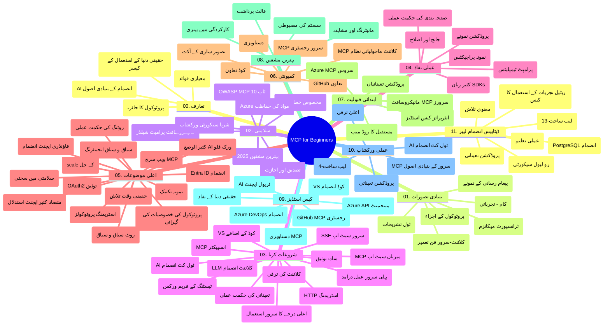

# ماڈل کانٹیکسٹ پروٹوکول (MCP) برائے ابتدائی افراد - مطالعہ گائیڈ

یہ مطالعہ گائیڈ "ماڈل کانٹیکسٹ پروٹوکول (MCP) برائے ابتدائی افراد" نصاب کے لیے ریپوزیٹری کے ڈھانچے اور مواد کا جائزہ فراہم کرتی ہے۔ اس گائیڈ کا استعمال کرتے ہوئے ریپوزیٹری میں مؤثر طریقے سے نیویگیٹ کریں اور دستیاب وسائل سے زیادہ سے زیادہ فائدہ اٹھائیں۔

## ریپوزیٹری کا جائزہ

ماڈل کانٹیکسٹ پروٹوکول (MCP) AI ماڈلز اور کلائنٹ ایپلیکیشنز کے درمیان تعاملات کے لیے ایک معیار بند فریم ورک ہے۔ ابتدا میں Anthropic نے تیار کیا تھا، MCP اب آفیشل GitHub آرگنائزیشن کے ذریعے وسیع MCP کمیونٹی کی طرف سے برقرار رکھا جاتا ہے۔ یہ ریپوزیٹری AI ڈویلپرز، سسٹم آرکیٹیکٹس، اور سافٹ ویئر انجینئرز کے لیے C#، Java، JavaScript، Python، اور TypeScript میں عملی کوڈ مثالوں کے ساتھ ایک جامع نصاب فراہم کرتی ہے۔

## بصری نصاب نقشہ

## ریپوزیٹری کا ڈھانچہ

ریپوزیٹری گیارہ اہم حصوں میں منظم ہے، جو MCP کے مختلف پہلوؤں پر مرکوز ہیں:

1. **تعارف (00-Introduction/)**
   - ماڈل کانٹیکسٹ پروٹوکول کا جائزہ
   - AI پائپ لائنز میں معیاری بنانے کی اہمیت
   - عملی استعمال کے کیسز اور فوائد

2. **بنیادی تصورات (01-CoreConcepts/)**
   - کلائنٹ-سرور آرکیٹیکچر
   - پروٹوکول کے کلیدی اجزاء
   - MCP میں پیغام رسانی کے انداز

3. **سیکیورٹی (02-Security/)**
   - MCP پر مبنی نظام میں سیکیورٹی خطرات
   - نفاذ کو محفوظ بنانے کے بہترین طریقے
   - توثیق اور اجازت کے اسٹریٹجیز
   - **جامع سیکیورٹی دستاویزات**:
     - MCP سیکیورٹی بہترین طریقے 2025
     - Azure مواد کی حفاظت کا رہنما
     - MCP سیکیورٹی کنٹرولز اور تکنیک
     - MCP بہترین طریقے فوری حوالہ
   - **اہم سیکیورٹی موضوعات**:
     - پرامپٹ انجیکشن اور ٹول زہریلا حملے
     - سیشن ہائی جیکنگ اور الجھے ہوئے نائب مسائل
     - ٹوکن پاس تھرو کمزوریاں
     - ضرورت سے زیادہ اجازتیں اور رسائی کنٹرول
     - AI اجزاء کے لیے سپلائی چین سیکیورٹی
     - Microsoft پرامپٹ شیلڈز انضمام

4. **شروع کرنا (03-GettingStarted/)**
   - ماحول کی ترتیب اور کنفیگریشن
   - بنیادی MCP سرور اور کلائنٹس بنانا
   - موجودہ ایپلیکیشنز سے انضمام
   - شامل سیکشنز:
     - پہلا سرور نفاذ
     - کلائنٹ ڈویلپمنٹ
     - LLM کلائنٹ انضمام
     - VS Code انضمام
     - سرور-سینٹ ایونٹس (SSE) سرور
     - ایڈوانسڈ سرور استعمال
     - HTTP اسٹریمنگ
     - AI ٹول کٹ انضمام
     - ٹیسٹنگ حکمت عملیاں
     - تعیناتی رہنما خطوط

5. **عملی نفاذ (04-PracticalImplementation/)**
   - مختلف پروگرامنگ زبانوں میں SDKs کا استعمال
   - ڈی بگنگ، ٹیسٹنگ، اور توثیق کے طریقے
   - قابل استعمال پرامپٹ ٹیمپلیٹس اور ورک فلو تیار کرنا
   - نفاذ کی مثالوں والے نمونہ پروجیکٹس

6. **ایڈوانسڈ موضوعات (05-AdvancedTopics/)**
   - کانٹیکسٹ انجینیئرنگ تکنیکیں
   - Foundry ایجنٹ انضمام
   - ملٹی موڈل AI ورک فلو
   - OAuth2 توثیق ڈیموز
   - ریئل ٹائم سرچ خصوصیات
   - ریئل ٹائم اسٹریمنگ
   - روٹ کانٹیکسٹس نفاذ
   - روٹنگ حکمت عملیاں
   - سیمپلنگ تکنیکیں
   - اسکیلنگ طریقے
   - سیکیورٹی تجاویز
   - Entra ID سیکیورٹی انضمام
   - ویب سرچ انضمام
   - مخاصمتی کثیر ایجنٹ استدلال (بحث کے انداز)

7. **کمیونٹی تعاون (06-CommunityContributions/)**
   - کوڈ اور دستاویزات میں تعاون کیسے کریں
   - GitHub کے ذریعے تعاون
   - کمیونٹی سے چلنے والی بہتریاں اور فیڈبیک
   - مختلف MCP کلائنٹس کا استعمال (Claude Desktop، Cline، VSCode)
   - مقبول MCP سرورز کے ساتھ کام کرنا بشمول امیج جنریشن

8. **ابتدائی اپنانے سے سبق (07-LessonsfromEarlyAdoption/)**
   - عملی نفاذ اور کامیابی کی کہانیاں
   - MCP پر مبنی حل کی تعمیر اور تعیناتی
   - رجحانات اور مستقبل کا روڈمیپ
   - **Microsoft MCP سرورز گائیڈ**: 10 پروڈکشن ریڈی Microsoft MCP سرورز کا جامع رہنما بشمول:
     - Microsoft Learn Docs MCP Server
     - Azure MCP Server (15 سے زائد خصوصی کنیکٹرز)
     - GitHub MCP Server
     - Azure DevOps MCP Server
     - MarkItDown MCP Server
     - SQL Server MCP Server
     - Playwright MCP Server
     - Dev Box MCP Server
     - Azure AI Foundry MCP Server
     - Microsoft 365 Agents Toolkit MCP Server

9. **بہترین طریقے (08-BestPractices/)**
   - کارکردگی کو بہتر بنانا اور اصلاح کرنا
   - نقص برداشت کرنے والے MCP نظام کی ڈیزائننگ
   - ٹیسٹنگ اور لچک کی حکمت عملیاں

10. **کیس اسٹڈیز (09-CaseStudy/)**
    - **سات جامع کیس اسٹڈیز** جو MCP کی مختلف حالات میں استعمال کو ظاہر کرتی ہیں:
    - **Azure AI ٹریول ایجنٹس**: Azure OpenAI اور AI سرچ کے ساتھ کثیر ایجنٹ آرکیسٹریشن
    - **Azure DevOps انضمام**: یوٹیوب ڈیٹا اپڈیٹس کے ساتھ ورک فلو عملوں کی خود کاری
    - **ریئل ٹائم دستاویزات بازیافت**: Python کنسول کلائنٹ کے ساتھ HTTP اسٹریمنگ
    - **انٹرایکٹو مطالعہ منصوبہ جنریٹر**: Chainlit ویب ایپ گفتگو AI کے ساتھ
    - **ایڈیٹر میں دستاویزات**: VS Code اور GitHub Copilot ورک فلو انضمام
    - **Azure API مینجمنٹ**: MCP سرور تخلیق کے ساتھ انٹرپرائز API انضمام
    - **GitHub MCP رجسٹری**: ایکوسسٹم ڈیولپمنٹ اور ایجنٹیک انضمام پلیٹ فارم
    - انٹرپرائز انضمام، ڈویلپر پروڈکٹیویٹی، اور ایکوسسٹم ڈیولپمنٹ کی مثالیں

11. **عملی ورکشاپ (10-StreamliningAIWorkflowsBuildingAnMCPServerWithAIToolkit/)**
    - MCP اور AI Toolkit کے ساتھ جامع عملی ورکشاپ
    - حقیقی دنیا کے ٹولز کے ساتھ AI ماڈلز کو جوڑنے والی ذہین ایپلیکیشنز کی تعمیر
    - بنیادیات، کسٹم سرور ڈویلپمنٹ، اور پیداوار میں تعیناتی حکمت عملیاں
    - **لیب ڈھانچہ**:
      - لیب 1: MCP سرور بنیادیات
      - لیب 2: ایڈوانس MCP سرور ترقی
      - لیب 3: AI Toolkit انضمام
      - لیب 4: پیداوار کی تعیناتی اور اسکیلنگ
    - مرحلہ وار ہدایات کے ساتھ لیب پر مبنی سیکھنے کا طریقہ

12. **MCP سرور ڈیٹا بیس انضمام لیبز (11-MCPServerHandsOnLabs/)**
    - **13 مکمل لیب کا تعلیمی راستہ** پروڈکشن ریڈی MCP سرورز بنانے کے لیے PostgreSQL انضمام کے ساتھ
    - **حقیقی دنیا کی ریٹیل اینالٹکس نفاذ** Zava Retail استعمال کے کیس کے ساتھ
    - **انٹرپرائز گریڈ پیٹرنز** بشمول رو لیول سیکیورٹی (RLS)، سیمنٹک سرچ، اور کثیر کرایہ دار ڈیٹا رسائی
    - **مکمل لیب ساخت**:
      - **لیب 00-03: بنیادیں** - تعارف، آرکیٹیکچر، سیکیورٹی، ماحول کی ترتیب
      - **لیب 04-06: MCP سرور کی تعمیر** - ڈیٹا بیس ڈیزائن، MCP سرور نفاذ، ٹول ترقی
      - **لیب 07-09: جدید خصوصیات** - سیمنٹک سرچ، ٹیسٹنگ اور ڈی بگنگ، VS Code انضمام
      - **لیب 10-12: پیداوار اور بہترین طریقے** - تعیناتی، نگرانی، اصلاح
    - **شامل ٹیکنالوجیز**: FastMCP فریم ورک، PostgreSQL، Azure OpenAI، Azure Container Apps، Application Insights
    - **سیکھنے کے نتائج**: پروڈکشن ریڈی MCP سرورز، ڈیٹا بیس انضمام پیٹرنز، AI سے چلنے والی اینالٹکس، انٹرپرائز سیکیورٹی

## اضافی وسائل

ریپوزیٹری اضافی وسائل شامل کرتی ہے:

- **تصاویر فولڈر**: نصاب میں استعمال ہونے والے خاکے اور تصاویر
- **ترجمے**: دستاویزات کے خودکار ترجمے کے ساتھ کثیراللسانی حمایت
- **سرکاری MCP وسائل**:
  - [MCP دستاویزات](https://modelcontextprotocol.io/)
  - [MCP وضاحت](https://spec.modelcontextprotocol.io/)
  - [MCP GitHub ریپوزیٹری](https://github.com/modelcontextprotocol)

## اس ریپوزیٹری کا استعمال کیسے کریں

1. **تسلسلی سیکھنا**: ترتیب وار ابواب (00 سے 11) کا مطالعہ کریں تاکہ منظم تعلیمی تجربہ حاصل ہو۔
2. **زبان کی مخصوص توجہ**: اگر آپ کسی خاص پروگرامنگ زبان میں دلچسپی رکھتے ہیں، تو اپنی پسندیدہ زبان کے نفاذ کے لیے سیمپلز ڈائریکٹریز کو دریافت کریں۔
3. **عملی نفاذ**: "شروع کرنا" والے سیکشن سے آغاز کریں تاکہ اپنا ماحول ترتیب دیں اور پہلا MCP سرور اور کلائنٹ بنائیں۔
4. **ایڈوانسڈ دریافت**: بنیادی معلومات کے ساتھ آرام دہ ہونے کے بعد ایڈوانسڈ موضوعات میں غوطہ لگائیں تاکہ اپنے علم میں اضافہ کریں۔
5. **کمیونٹی میں شمولیت**: MCP کمیونٹی میں شامل ہوں GitHub مباحثوں اور Discord چینلز کے ذریعے ماہرین اور دیگر ڈویلپرز سے جڑیں۔

## MCP کلائنٹس اور ٹولز

نصاب مختلف MCP کلائنٹس اور ٹولز کا احاطہ کرتا ہے:

1. **سرکاری کلائنٹس**:
   - Visual Studio Code
   - MCP in Visual Studio Code
   - Claude Desktop
   - Claude in VSCode
   - Claude API

2. **کمیونٹی کلائنٹس**:
   - Cline (ٹرمینل-بنیاد)
   - Cursor (کوڈ ایڈیٹر)
   - ChatMCP
   - Windsurf

3. **MCP مینجمنٹ ٹولز**:
   - MCP CLI
   - MCP Manager
   - MCP Linker
   - MCP Router

## مقبول MCP سرورز

ریپوزیٹری مختلف MCP سرورز متعارف کراتی ہے، جن میں شامل ہیں:

1. **سرکاری Microsoft MCP سرورز**:
   - Microsoft Learn Docs MCP Server
   - Azure MCP Server (15+ خصوصی کنیکٹرز)
   - GitHub MCP Server
   - Azure DevOps MCP Server
   - MarkItDown MCP Server
   - SQL Server MCP Server
   - Playwright MCP Server
   - Dev Box MCP Server
   - Azure AI Foundry MCP Server
   - Microsoft 365 Agents Toolkit MCP Server

2. **سرکاری ریفرنس سرورز**:
   - فائل سسٹم
   - Fetch
   - میموری
   - سیکوئنشیل تھنکنگ

3. **امیج جنریشن**:
   - Azure OpenAI DALL-E 3
   - Stable Diffusion WebUI
   - Replicate

4. **ترقیاتی ٹولز**:
   - Git MCP
   - ٹرمینل کنٹرول
   - کوڈ اسسٹنٹ

5. **ماہرانہ سرورز**:
   - Salesforce
   - Microsoft Teams
   - Jira & Confluence

## تعاون

یہ ریپوزیٹری کمیونٹی سے تعاون کا خیرمقدم کرتی ہے۔ MCP ایکوسسٹم میں مؤثر تعاون کے لیے کمیونٹی تعاون والے سیکشن کو دیکھیں۔

----

*یہ مطالعہ گائیڈ آخری بار 5 فروری 2026 کو اپ ڈیٹ کیا گیا تھا، جو تازہ ترین MCP وضاحت 2025-11-25 کی عکاسی کرتا ہے اور اس تاریخ تک ریپوزیٹری کا جائزہ فراہم کرتا ہے۔ اس تاریخ کے بعد ریپوزیٹری کا مواد اپ ڈیٹ ہو سکتا ہے۔*

---

<!-- CO-OP TRANSLATOR DISCLAIMER START -->
**دفع الاعلان**:  
اس دستاویز کا ترجمہ AI ترجمہ سروس [Co-op Translator](https://github.com/Azure/co-op-translator) کا استعمال کرتے ہوئے کیا گیا ہے۔ اگرچہ ہم درستگی کے لیے کوشش کرتے ہیں، براہ کرم آگاہ رہیں کہ خودکار تراجم میں غلطیاں یا نقائص ہو سکتے ہیں۔ اصل دستاویز اپنی مادری زبان میں ہی مجاز ذریعہ سمجھی جائے۔ اہم معلومات کے لیے پیشہ ور انسانی ترجمہ کی سفارش کی جاتی ہے۔ اس ترجمہ کے استعمال سے پیدا ہونے والی کسی بھی غلط فہمی یا تشریح کی ذمہ داری ہم پر عائد نہیں ہوتی۔
<!-- CO-OP TRANSLATOR DISCLAIMER END -->