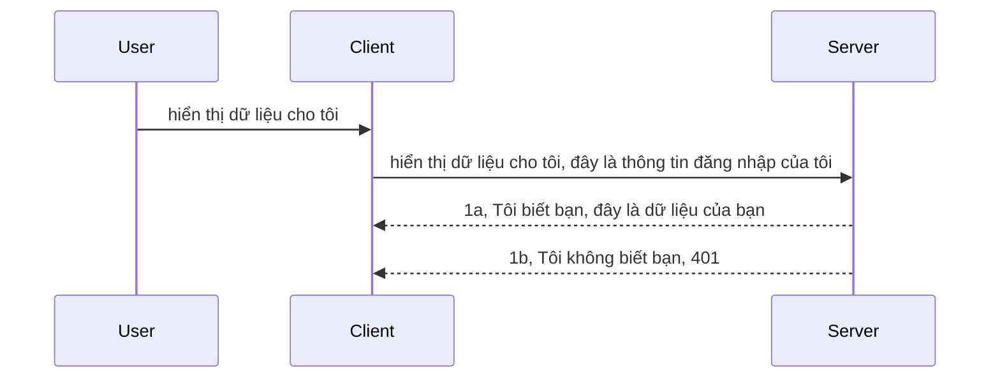

# Xác thực đơn giản

SDK MCP hỗ trợ sử dụng OAuth 2.1, mà để nói thật là một quá trình khá phức tạp liên quan đến các khái niệm như máy chủ xác thực, máy chủ tài nguyên, gửi chứng thực, lấy mã, trao đổi mã lấy token bearer cho đến khi bạn cuối cùng có thể lấy dữ liệu tài nguyên. Nếu bạn chưa quen với OAuth, một thứ rất hay để triển khai, thì tốt nhất nên bắt đầu với một mức xác thực cơ bản và xây dựng lên bảo mật ngày càng tốt hơn. Đó là lý do chương này tồn tại, để giúp bạn xây dựng đến xác thực nâng cao hơn.

## Xác thực là gì?

Xác thực là viết tắt của authentication và authorization. Ý tưởng là chúng ta cần làm hai việc:

- **Authentication**, là quá trình xác định xem liệu chúng ta có cho một người vào nhà không, liệu họ có quyền ở "đây" tức có quyền truy cập vào máy chủ tài nguyên nơi các tính năng MCP Server của chúng ta nằm.
- **Authorization**, là quá trình kiểm tra xem một người dùng có nên truy cập những tài nguyên cụ thể mà họ hỏi, ví dụ những đơn hàng này hay những sản phẩm này, hoặc liệu họ chỉ được đọc nội dung nhưng không được xoá chẳng hạn.

## Credentials: cách chúng ta nói với hệ thống mình là ai

Chà, đa số các nhà phát triển web thường nghĩ đến việc cung cấp một credential cho server, thường là một bí mật nói rằng liệu họ được phép ở đây "Authentication". Credential này thường là một chuỗi base64 được mã hoá của tên người dùng và mật khẩu hoặc một API key nhận dạng duy nhất cho một người dùng cụ thể.

Điều này liên quan đến việc gửi nó qua header gọi là "Authorization" như sau:

```json
{ "Authorization": "secret123" }
```

Điều này thường được gọi là xác thực cơ bản (basic authentication). Cách hoạt động tổng thể diễn ra như sau:


Giờ chúng ta đã hiểu cách hoạt động ở mức luồng, làm thế nào để triển khai nó? Đa số các web server có một khái niệm gọi là middleware, một đoạn mã chạy trong quy trình xử lý yêu cầu có thể xác minh credential, và nếu credential hợp lệ thì cho phép yêu cầu đi qua. Nếu yêu cầu không có credential hợp lệ thì sẽ trả lỗi xác thực. Hãy xem cách triển khai như sau:

**Python**

```python
class AuthMiddleware(BaseHTTPMiddleware):
    async def dispatch(self, request, call_next):

        has_header = request.headers.get("Authorization")
        if not has_header:
            print("-> Missing Authorization header!")
            return Response(status_code=401, content="Unauthorized")

        if not valid_token(has_header):
            print("-> Invalid token!")
            return Response(status_code=403, content="Forbidden")

        print("Valid token, proceeding...")
       
        response = await call_next(request)
        # thêm bất kỳ tiêu đề khách hàng nào hoặc thay đổi phản hồi theo một cách nào đó
        return response


starlette_app.add_middleware(CustomHeaderMiddleware)
```

Ở đây chúng ta có:

- Tạo middleware tên `AuthMiddleware` với phương thức `dispatch` được gọi bởi web server.
- Thêm middleware vào web server:

    ```python
    starlette_app.add_middleware(AuthMiddleware)
    ```

- Viết logic kiểm tra xem Header Authorization có tồn tại và bí mật được gửi có hợp lệ không:

    ```python
    has_header = request.headers.get("Authorization")
    if not has_header:
        print("-> Missing Authorization header!")
        return Response(status_code=401, content="Unauthorized")

    if not valid_token(has_header):
        print("-> Invalid token!")
        return Response(status_code=403, content="Forbidden")
    ```

    nếu bí mật có tồn tại và hợp lệ thì cho phép yêu cầu đi qua bằng cách gọi `call_next` và trả về phản hồi.

    ```python
    response = await call_next(request)
    # thêm bất kỳ tiêu đề khách hàng nào hoặc thay đổi phản hồi theo một cách nào đó
    return response
    ```

Cách hoạt động là nếu một yêu cầu web được gửi đến server, middleware sẽ được gọi và với triển khai này nó sẽ hoặc cho phép yêu cầu đi qua hoặc trả về lỗi báo rằng client không được phép tiếp tục.

**TypeScript**

Ở đây chúng ta tạo middleware với framework phổ biến Express và chặn yêu cầu trước khi nó đến MCP Server. Đây là mã cho việc đó:

```typescript
function isValid(secret) {
    return secret === "secret123";
}

app.use((req, res, next) => {
    // 1. Header ủy quyền có tồn tại không?
    if(!req.headers["Authorization"]) {
        res.status(401).send('Unauthorized');
    }
    
    let token = req.headers["Authorization"];

    // 2. Kiểm tra tính hợp lệ.
    if(!isValid(token)) {
        res.status(403).send('Forbidden');
    }

   
    console.log('Middleware executed');
    // 3. Chuyển yêu cầu tới bước tiếp theo trong quy trình xử lý yêu cầu.
    next();
});
```

Trong đoạn mã này chúng ta:

1. Kiểm tra xem Header Authorization có tồn tại hay không, nếu không thì trả lỗi 401.
2. Đảm bảo credential/token hợp lệ, nếu không thì trả lỗi 403.
3. Cuối cùng chuyển yêu cầu đi tiếp trong pipeline và trả lại tài nguyên được yêu cầu.

## Bài tập: Triển khai xác thực

Hãy lấy kiến thức của chúng ta và thử triển khai. Kế hoạch như sau:

Server

- Tạo web server và instance MCP.
- Triển khai middleware cho server.

Client

- Gửi yêu cầu web kèm credential qua header.

### -1- Tạo web server và instance MCP

Bước đầu tiên, chúng ta cần tạo instance web server và MCP Server.

**Python**

Ở đây chúng ta tạo một instance MCP server, tạo một ứng dụng web starlette và host nó bằng uvicorn.

```python
# tạo máy chủ MCP

app = FastMCP(
    name="MCP Resource Server",
    instructions="Resource Server that validates tokens via Authorization Server introspection",
    host=settings["host"],
    port=settings["port"],
    debug=True
)

# tạo ứng dụng web starlette
starlette_app = app.streamable_http_app()

# phục vụ ứng dụng qua uvicorn
async def run(starlette_app):
    import uvicorn
    config = uvicorn.Config(
            starlette_app,
            host=app.settings.host,
            port=app.settings.port,
            log_level=app.settings.log_level.lower(),
        )
    server = uvicorn.Server(config)
    await server.serve()

run(starlette_app)
```

Trong đoạn này chúng ta:

- Tạo MCP Server.
- Xây dựng ứng dụng web starlette từ MCP Server, `app.streamable_http_app()`.
- Host và phục vụ ứng dụng web dùng uvicorn `server.serve()`.

**TypeScript**

Ở đây chúng ta tạo một MCP Server instance.

```typescript
const server = new McpServer({
      name: "example-server",
      version: "1.0.0"
    });

    // ... thiết lập tài nguyên máy chủ, công cụ và lời nhắc ...
```

Việc tạo MCP Server này cần xảy ra trong phần định nghĩa route POST /mcp, vậy nên chuyển đoạn mã trên như sau:

```typescript
import express from "express";
import { randomUUID } from "node:crypto";
import { McpServer } from "@modelcontextprotocol/sdk/server/mcp.js";
import { StreamableHTTPServerTransport } from "@modelcontextprotocol/sdk/server/streamableHttp.js";
import { isInitializeRequest } from "@modelcontextprotocol/sdk/types.js"

const app = express();
app.use(express.json());

// Bản đồ để lưu các phương tiện theo ID phiên
const transports: { [sessionId: string]: StreamableHTTPServerTransport } = {};

// Xử lý các yêu cầu POST cho giao tiếp từ khách hàng đến máy chủ
app.post('/mcp', async (req, res) => {
  // Kiểm tra ID phiên hiện có
  const sessionId = req.headers['mcp-session-id'] as string | undefined;
  let transport: StreamableHTTPServerTransport;

  if (sessionId && transports[sessionId]) {
    // Tái sử dụng phương tiện hiện có
    transport = transports[sessionId];
  } else if (!sessionId && isInitializeRequest(req.body)) {
    // Yêu cầu khởi tạo mới
    transport = new StreamableHTTPServerTransport({
      sessionIdGenerator: () => randomUUID(),
      onsessioninitialized: (sessionId) => {
        // Lưu phương tiện theo ID phiên
        transports[sessionId] = transport;
      },
      // Bảo vệ DNS rebinding mặc định bị tắt để tương thích ngược. Nếu bạn chạy máy chủ này
      // cục bộ, hãy chắc chắn thiết lập:
      // enableDnsRebindingProtection: true,
      // allowedHosts: ['127.0.0.1'],
    });

    // Dọn dẹp phương tiện khi đóng
    transport.onclose = () => {
      if (transport.sessionId) {
        delete transports[transport.sessionId];
      }
    };
    const server = new McpServer({
      name: "example-server",
      version: "1.0.0"
    });

    // ... thiết lập tài nguyên, công cụ và lời nhắc của máy chủ ...

    // Kết nối đến máy chủ MCP
    await server.connect(transport);
  } else {
    // Yêu cầu không hợp lệ
    res.status(400).json({
      jsonrpc: '2.0',
      error: {
        code: -32000,
        message: 'Bad Request: No valid session ID provided',
      },
      id: null,
    });
    return;
  }

  // Xử lý yêu cầu
  await transport.handleRequest(req, res, req.body);
});

// Bộ xử lý có thể tái sử dụng cho các yêu cầu GET và DELETE
const handleSessionRequest = async (req: express.Request, res: express.Response) => {
  const sessionId = req.headers['mcp-session-id'] as string | undefined;
  if (!sessionId || !transports[sessionId]) {
    res.status(400).send('Invalid or missing session ID');
    return;
  }
  
  const transport = transports[sessionId];
  await transport.handleRequest(req, res);
};

// Xử lý yêu cầu GET cho thông báo từ máy chủ đến khách hàng qua SSE
app.get('/mcp', handleSessionRequest);

// Xử lý yêu cầu DELETE để kết thúc phiên
app.delete('/mcp', handleSessionRequest);

app.listen(3000);
```

Giờ bạn thấy cách tạo MCP Server được đặt trong `app.post("/mcp")`.

Hãy tiếp tục bước tiếp theo để tạo middleware giúp kiểm tra credential đến.

### -2- Triển khai middleware cho server

Tiếp theo là phần middleware. Ở đây chúng ta sẽ tạo middleware tìm kiếm credential trong header `Authorization` và kiểm tra tính hợp lệ. Nếu được chấp nhận thì yêu cầu sẽ được tiếp tục thực hiện tác vụ cần thiết (ví dụ liệt kê công cụ, đọc tài nguyên hoặc bất kỳ chức năng MCP nào client hỏi).

**Python**

Để tạo middleware, ta tạo một lớp kế thừa từ `BaseHTTPMiddleware`. Có hai phần quan trọng:

- Yêu cầu `request`, từ đó đọc thông tin header.
- `call_next` callback cần gọi nếu client mang credential mà ta chấp nhận.

Trước tiên, ta xử lý trường hợp header `Authorization` không tồn tại:

```python
has_header = request.headers.get("Authorization")

# không có tiêu đề, trả về lỗi 401, nếu không thì tiếp tục.
if not has_header:
    print("-> Missing Authorization header!")
    return Response(status_code=401, content="Unauthorized")
```

Ở đây ta gửi thông báo 401 unauthorized vì client không xác thực được.

Tiếp theo, nếu có credential gửi đến, ta kiểm tra tính hợp lệ như sau:

```python
 if not valid_token(has_header):
    print("-> Invalid token!")
    return Response(status_code=403, content="Forbidden")
```

Bạn thấy cách gửi thông báo 403 forbidden ở trên. Dưới đây là toàn bộ middleware triển khai đầy đủ các phần trên:

```python
class AuthMiddleware(BaseHTTPMiddleware):
    async def dispatch(self, request, call_next):

        has_header = request.headers.get("Authorization")
        if not has_header:
            print("-> Missing Authorization header!")
            return Response(status_code=401, content="Unauthorized")

        if not valid_token(has_header):
            print("-> Invalid token!")
            return Response(status_code=403, content="Forbidden")

        print("Valid token, proceeding...")
        print(f"-> Received {request.method} {request.url}")
        response = await call_next(request)
        response.headers['Custom'] = 'Example'
        return response

```

Tuyệt, nhưng `valid_token` là gì? Đây:

```python
# KHÔNG sử dụng cho sản xuất - cải thiện nó !!
def valid_token(token: str) -> bool:
    # bỏ tiền tố "Bearer "
    if token.startswith("Bearer "):
        token = token[7:]
        return token == "secret-token"
    return False
```

Điều này tất nhiên nên cải tiến hơn.

QUAN TRỌNG: Bạn KHÔNG BAO GIỜ nên để secrets như thế này trong code. Tốt nhất nên lấy giá trị này từ nguồn dữ liệu hoặc nhà cung cấp dịch vụ IDP (Identity Provider) hoặc tốt hơn để IDP lo phần xác thực.

**TypeScript**

Để triển khai với Express, chúng ta dùng phương thức `use` nhận middleware functions.

Ta cần:

- Tương tác với biến request để kiểm tra credential trong thuộc tính `Authorization`.
- Xác thực credential, nếu hợp lệ thì cho phép yêu cầu tiếp tục và thực hiện chức năng MCP client yêu cầu (ví dụ liệt kê công cụ, đọc tài nguyên hay những gì liên quan MCP).

Ở đây ta kiểm tra nếu header `Authorization` không tồn tại thì chặn yêu cầu:

```typescript
if(!req.headers["authorization"]) {
    res.status(401).send('Unauthorized');
    return;
}
```

Nếu không gửi header thì nhận lỗi 401.

Sau đó kiểm tra credential có hợp lệ không, nếu không hợp lệ ta cũng chặn yêu cầu nhưng gửi thông báo khác:

```typescript
if(!isValid(token)) {
    res.status(403).send('Forbidden');
    return;
} 
```

Bạn nhận lỗi 403 ở đây.

Đây là toàn bộ mã:

```typescript
app.use((req, res, next) => {
    console.log('Request received:', req.method, req.url, req.headers);
    console.log('Headers:', req.headers["authorization"]);
    if(!req.headers["authorization"]) {
        res.status(401).send('Unauthorized');
        return;
    }
    
    let token = req.headers["authorization"];

    if(!isValid(token)) {
        res.status(403).send('Forbidden');
        return;
    }  

    console.log('Middleware executed');
    next();
});
```

Ta đã thiết lập web server nhận một middleware để kiểm tra credential mà client hy vọng gửi cho ta. Vậy client thì sao?

### -3- Gửi yêu cầu web với credential qua header

Cần đảm bảo client gửi credential qua header. Vì ta dùng MCP client nên tìm cách thực hiện việc đó.

**Python**

Với client, ta cần truyền header kèm credential như sau:

```python
# ĐỪNG mã hóa cứng giá trị, ít nhất hãy đặt nó trong biến môi trường hoặc một nơi lưu trữ an toàn hơn
token = "secret-token"

async with streamablehttp_client(
        url = f"http://localhost:{port}/mcp",
        headers = {"Authorization": f"Bearer {token}"}
    ) as (
        read_stream,
        write_stream,
        session_callback,
    ):
        async with ClientSession(
            read_stream,
            write_stream
        ) as session:
            await session.initialize()
      
            # TODO, những gì bạn muốn thực hiện ở phía client, ví dụ liệt kê công cụ, gọi công cụ v.v.
```

Bạn thấy ta thiết lập thuộc tính `headers` như ` headers = {"Authorization": f"Bearer {token}"}`.

**TypeScript**

Có thể giải quyết trong hai bước:

1. Điền config object với credential.
2. Truyền config vào transport.

```typescript

// ĐỪNG mã hóa cứng giá trị như được hiển thị ở đây. Ít nhất hãy để nó như một biến môi trường và sử dụng thứ gì đó như dotenv (trong chế độ phát triển).
let token = "secret123"

// định nghĩa một đối tượng tùy chọn giao vận khách hàng
let options: StreamableHTTPClientTransportOptions = {
  sessionId: sessionId,
  requestInit: {
    headers: {
      "Authorization": "secret123"
    }
  }
};

// truyền đối tượng tùy chọn vào giao vận
async function main() {
   const transport = new StreamableHTTPClientTransport(
      new URL(serverUrl),
      options
   );
```

Ở đây bạn thấy cách tạo `options` object và đặt header trong thuộc tính `requestInit`.

QUAN TRỌNG: Cách cải tiến từ đây thế nào? Thực tế hiện tại có vài vấn đề. Đầu tiên, gửi credential kiểu này khá rủi ro trừ khi bạn ít nhất có HTTPS. Dù có HTTPS, credential vẫn có thể bị đánh cắp nên bạn cần hệ thống dễ dàng thu hồi token và thêm kiểm tra như token xuất từ đâu, yêu cầu có xảy ra quá nhiều (hành vi bot), nói chung có rất nhiều quan ngại.

Tuy vậy, với API đơn giản mà bạn không muốn ai đó gọi API mà không xác thực, mô hình hiện tại là một khởi đầu tốt.

Tuy nhiên, hãy thử tăng cường bảo mật một chút bằng cách dùng định dạng chuẩn như JSON Web Token, hay còn gọi là JWT hoặc token "JOT".

## JSON Web Tokens, JWT

Vậy, ta đang cố nâng cấp từ gửi credential đơn giản. Những cải tiến ngay lập tức khi áp dụng JWT là gì?

- **Cải tiến bảo mật**. Cơ bản trong basic auth, bạn gửi username và password dưới dạng token mã base64 (hoặc gửi API key) đi đi lại lại làm tăng rủi ro. Với JWT, bạn gửi username và password lấy token trả về và token này có thời hạn hết hạn. JWT cho phép sử dụng kiểm soát truy cập chi tiết qua vai trò, phạm vi và quyền.
- **Không trạng thái và khả năng mở rộng**. JWT tự chứa (self-contained), mang tất cả thông tin người dùng và loại bỏ nhu cầu lưu phiên phía server. Token cũng có thể được xác thực cục bộ.
- **Tương tác và liên kết**. JWT là trung tâm của Open ID Connect và dùng với các nhà cung cấp định danh như Entra ID, Google Identity, Auth0. Chúng cũng cho phép đăng nhập một lần (SSO) và nhiều khả năng doanh nghiệp khác.
- **Tính mô đun và linh hoạt**. JWT cũng dùng được với API Gateway như Azure API Management, NGINX và hơn thế nữa. Hỗ trợ các tình huống xác thực người dùng và giao tiếp dịch vụ-đến-dịch vụ bao gồm giả mạo và ủy quyền.
- **Hiệu năng và cache**. JWT có thể cache sau khi giải mã giúp giảm nhu cầu phân tích lại. Điều này rất tốt với ứng dụng có lưu lượng cao vì tăng thông lượng và giảm tải hạ tầng.
- **Tính năng nâng cao**. JWT hỗ trợ introspection (kiểm tra tính hợp lệ trên server) và revocation (làm token không còn hợp lệ).

Với những lợi ích đó, hãy xem cách đưa triển khai hiện tại lên tầm cao mới.

## Biến basic auth thành JWT

Những thay đổi ở mức tổng quan cần làm là:

- **Học cách tạo token JWT** và chuẩn bị gửi client tới server.
- **Xác thực token JWT**, và nếu hợp lệ thì cho client truy cập tài nguyên.
- **Lưu trữ token an toàn**. Cách lưu token này.
- **Bảo vệ các route**. Ta cần bảo vệ route, cụ thể là các route và tính năng MCP.
- **Thêm refresh token**. Tao token có thời hạn ngắn và refresh token dài hạn dùng để lấy token mới khi hết hạn. Cũng cần endpoint refresh và chiến lược luân chuyển (rotation).

### -1- Tạo token JWT

Trước tiên, token JWT có các phần chính:

- **header**, thuật toán dùng và loại token.
- **payload**, các claim như sub (người dùng hoặc thực thể token đại diện, thường là userid), exp (hết hạn), role (vai trò)
- **signature**, ký bằng secret hoặc khóa riêng.

Chúng ta sẽ tạo header, payload và token đã mã hoá.

**Python**

```python

import jwt
import jwt
from jwt.exceptions import ExpiredSignatureError, InvalidTokenError
import datetime

# Khóa bí mật dùng để ký JWT
secret_key = 'your-secret-key'

header = {
    "alg": "HS256",
    "typ": "JWT"
}

# thông tin người dùng và các quyền của họ cùng thời gian hết hạn
payload = {
    "sub": "1234567890",               # Chủ đề (ID người dùng)
    "name": "User Userson",                # Quyền tùy chỉnh
    "admin": True,                     # Quyền tùy chỉnh
    "iat": datetime.datetime.utcnow(),# Thời gian phát hành
    "exp": datetime.datetime.utcnow() + datetime.timedelta(hours=1)  # Thời gian hết hạn
}

# mã hóa nó
encoded_jwt = jwt.encode(payload, secret_key, algorithm="HS256", headers=header)
```

Trong đoạn này ta:

- Định nghĩa header với thuật toán HS256 và loại JWT.
- Tạo payload chứa chủ thể hay user id, tên người dùng, vai trò, ngày phát hành và ngày hết hạn, thể hiện yếu tố giới hạn thời gian mà ta đề cập.

**TypeScript**

Cần vài dependencies giúp tạo token JWT.

Dependencies

```sh

npm install jsonwebtoken
npm install --save-dev @types/jsonwebtoken
```

Giờ có sẵn thư viện, ta tạo header, payload và mã hoá token.

```typescript
import jwt from 'jsonwebtoken';

const secretKey = 'your-secret-key'; // Sử dụng biến môi trường trong môi trường sản xuất

// Định nghĩa phần tải
const payload = {
  sub: '1234567890',
  name: 'User usersson',
  admin: true,
  iat: Math.floor(Date.now() / 1000), // Được phát hành tại
  exp: Math.floor(Date.now() / 1000) + 60 * 60 // Hết hạn trong 1 giờ
};

// Định nghĩa phần tiêu đề (tùy chọn, jsonwebtoken đặt mặc định)
const header = {
  alg: 'HS256',
  typ: 'JWT'
};

// Tạo token
const token = jwt.sign(payload, secretKey, {
  algorithm: 'HS256',
  header: header
});

console.log('JWT:', token);
```

Token này:

Ký bằng HS256
Có hiệu lực 1 giờ
Bao gồm các claims sub, name, admin, iat và exp.

### -2- Xác thực token

Ta cũng cần xác thực token, việc này nên làm phía server để đảm bảo token client gửi là hợp lệ. Có nhiều kiểm tra cần làm từ cấu trúc đến tính hợp lệ. Bạn cũng nên thêm kiểm tra xem người dùng có trong hệ thống không và các yếu tố khác.

Để xác thực token, ta giải mã nó để đọc rồi bắt đầu kiểm tra.

**Python**

```python

# Giải mã và xác minh JWT
try:
    decoded = jwt.decode(token, secret_key, algorithms=["HS256"])
    print("✅ Token is valid.")
    print("Decoded claims:")
    for key, value in decoded.items():
        print(f"  {key}: {value}")
except ExpiredSignatureError:
    print("❌ Token has expired.")
except InvalidTokenError as e:
    print(f"❌ Invalid token: {e}")

```

Trong mã này, ta gọi `jwt.decode` với token, secret key và thuật toán đã chọn. Bạn thấy ta dùng cấu trúc try-catch vì xác thực lỗi sẽ gây ra exception.

**TypeScript**

Ở đây ta gọi `jwt.verify` để lấy token đã giải mã, có thể phân tích sâu hơn. Nếu gọi lỗi, có nghĩa token sai cấu trúc hoặc không còn hợp lệ.

```typescript

try {
  const decoded = jwt.verify(token, secretKey);
  console.log('Decoded Payload:', decoded);
} catch (err) {
  console.error('Token verification failed:', err);
}
```

LƯU Ý: như đã nói, bạn nên thực hiện thêm các kiểm tra để chắc token này đại diện người dùng trong hệ thống và người dùng đó có quyền như tuyên bố.

Tiếp theo, hãy xem kiểm soát truy cập dựa trên vai trò (RBAC).
## Thêm kiểm soát truy cập dựa trên vai trò

Ý tưởng là chúng ta muốn biểu đạt rằng các vai trò khác nhau có các quyền khác nhau. Ví dụ, chúng ta giả định một quản trị viên có thể làm mọi thứ, người dùng bình thường có thể đọc/ghi và khách chỉ có thể đọc. Do đó, đây là một số cấp độ quyền có thể:

- Admin.Write  
- User.Read  
- Guest.Read  

Hãy xem cách chúng ta có thể triển khai kiểm soát như vậy với middleware. Middleware có thể được thêm vào từng route cũng như cho tất cả các route.

**Python**

```python
from starlette.middleware.base import BaseHTTPMiddleware
from starlette.responses import JSONResponse
import jwt

# KHÔNG nên để bí mật trong mã như thế này, đây chỉ là để minh họa. Hãy đọc nó từ nơi an toàn.
SECRET_KEY = "your-secret-key" # đặt cái này trong biến môi trường
REQUIRED_PERMISSION = "User.Read"

class JWTPermissionMiddleware(BaseHTTPMiddleware):
    async def dispatch(self, request, call_next):
        auth_header = request.headers.get("Authorization")
        if not auth_header or not auth_header.startswith("Bearer "):
            return JSONResponse({"error": "Missing or invalid Authorization header"}, status_code=401)

        token = auth_header.split(" ")[1]
        try:
            decoded = jwt.decode(token, SECRET_KEY, algorithms=["HS256"])
        except jwt.ExpiredSignatureError:
            return JSONResponse({"error": "Token expired"}, status_code=401)
        except jwt.InvalidTokenError:
            return JSONResponse({"error": "Invalid token"}, status_code=401)

        permissions = decoded.get("permissions", [])
        if REQUIRED_PERMISSION not in permissions:
            return JSONResponse({"error": "Permission denied"}, status_code=403)

        request.state.user = decoded
        return await call_next(request)


```
  
Có một vài cách khác nhau để thêm middleware như dưới đây:

```python

# Lựa chọn 1: thêm middleware trong khi xây dựng ứng dụng starlette
middleware = [
    Middleware(JWTPermissionMiddleware)
]

app = Starlette(routes=routes, middleware=middleware)

# Lựa chọn 2: thêm middleware sau khi ứng dụng starlette đã được xây dựng
starlette_app.add_middleware(JWTPermissionMiddleware)

# Lựa chọn 3: thêm middleware cho từng route
routes = [
    Route(
        "/mcp",
        endpoint=..., # trình xử lý
        middleware=[Middleware(JWTPermissionMiddleware)]
    )
]
```
  
**TypeScript**

Chúng ta có thể sử dụng `app.use` và một middleware sẽ chạy cho tất cả các yêu cầu.

```typescript
app.use((req, res, next) => {
    console.log('Request received:', req.method, req.url, req.headers);
    console.log('Headers:', req.headers["authorization"]);

    // 1. Kiểm tra xem tiêu đề ủy quyền đã được gửi chưa

    if(!req.headers["authorization"]) {
        res.status(401).send('Unauthorized');
        return;
    }
    
    let token = req.headers["authorization"];

    // 2. Kiểm tra xem token có hợp lệ không
    if(!isValid(token)) {
        res.status(403).send('Forbidden');
        return;
    }  

    // 3. Kiểm tra xem người dùng của token có tồn tại trong hệ thống của chúng tôi không
    if(!isExistingUser(token)) {
        res.status(403).send('Forbidden');
        console.log("User does not exist");
        return;
    }
    console.log("User exists");

    // 4. Xác minh token có quyền thích hợp không
    if(!hasScopes(token, ["User.Read"])){
        res.status(403).send('Forbidden - insufficient scopes');
    }

    console.log("User has required scopes");

    console.log('Middleware executed');
    next();
});

```
  
Có khá nhiều việc chúng ta có thể và middleware của chúng ta NÊN làm, cụ thể là:

1. Kiểm tra xem header authorization có tồn tại không  
2. Kiểm tra xem token có hợp lệ không, chúng ta gọi `isValid` là một phương thức do chúng ta viết để kiểm tra tính toàn vẹn và hợp lệ của token JWT.  
3. Xác minh người dùng có tồn tại trong hệ thống của chúng ta không, chúng ta nên kiểm tra điều này.

   ```typescript
    // người dùng trong cơ sở dữ liệu
   const users = [
     "user1",
     "User usersson",
   ]

   function isExistingUser(token) {
     let decodedToken = verifyToken(token);

     // TODO, kiểm tra xem người dùng có tồn tại trong cơ sở dữ liệu không
     return users.includes(decodedToken?.name || "");
   }
   ```
  
Ở trên, chúng ta đã tạo một danh sách `users` rất đơn giản, tất nhiên nó nên được lưu trong cơ sở dữ liệu.

4. Ngoài ra, chúng ta cũng nên kiểm tra token có quyền thích hợp.

   ```typescript
   if(!hasScopes(token, ["User.Read"])){
        res.status(403).send('Forbidden - insufficient scopes');
   }
   ```
  
Trong đoạn mã trên từ middleware, chúng ta kiểm tra rằng token có chứa quyền User.Read, nếu không chúng ta gửi lỗi 403. Dưới đây là phương thức trợ giúp `hasScopes`.

   ```typescript
   function hasScopes(scope: string, requiredScopes: string[]) {
     let decodedToken = verifyToken(scope);
    return requiredScopes.every(scope => decodedToken?.scopes.includes(scope));
  }  
   ```

Have a think which additional checks you should be doing, but these are the absolute minimum of checks you should be doing.

Using Express as a web framework is a common choice. There are helpers library when you use JWT so you can write less code.

- `express-jwt`, helper library that provides a middleware that helps decode your token.
- `express-jwt-permissions`, this provides a middleware `guard` that helps check if a certain permission is on the token.

Here's what these libraries can look like when used:

```typescript
const express = require('express');
const jwt = require('express-jwt');
const guard = require('express-jwt-permissions')();

const app = express();
const secretKey = 'your-secret-key'; // put this in env variable

// Decode JWT and attach to req.user
app.use(jwt({ secret: secretKey, algorithms: ['HS256'] }));

// Check for User.Read permission
app.use(guard.check('User.Read'));

// multiple permissions
// app.use(guard.check(['User.Read', 'Admin.Access']));

app.get('/protected', (req, res) => {
  res.json({ message: `Welcome ${req.user.name}` });
});

// Error handler
app.use((err, req, res, next) => {
  if (err.code === 'permission_denied') {
    return res.status(403).send('Forbidden');
  }
  next(err);
});

```
  
Bây giờ bạn đã thấy middleware có thể được sử dụng cho cả xác thực và phân quyền, còn MCP thì sao, nó có thay đổi cách chúng ta thực hiện auth không? Hãy cùng tìm hiểu trong phần tiếp theo.

### -3- Thêm RBAC vào MCP

Cho đến nay bạn đã thấy cách bạn có thể thêm RBAC qua middleware, tuy nhiên đối với MCP thì không có cách đơn giản để thêm RBAC theo từng tính năng MCP, vậy chúng ta làm gì? Chúng ta chỉ cần thêm mã như thế này để kiểm tra trong trường hợp này liệu client có quyền gọi một công cụ cụ thể hay không:

Bạn có một vài lựa chọn khác nhau để thực hiện RBAC theo từng tính năng, dưới đây là một số cách:

- Thêm một kiểm tra cho mỗi công cụ, tài nguyên, prompt nơi bạn cần kiểm tra cấp độ quyền.

   **python**

   ```python
   @tool()
   def delete_product(id: int):
      try:
          check_permissions(role="Admin.Write", request)
      catch:
        pass # khách hàng xác thực không thành công, phát sinh lỗi xác thực
   ```
  
   **typescript**

   ```typescript
   server.registerTool(
    "delete-product",
    {
      title: Delete a product",
      description: "Deletes a product",
      inputSchema: { id: z.number() }
    },
    async ({ id }) => {
      
      try {
        checkPermissions("Admin.Write", request);
        // việc cần làm, gửi id đến productService và entry từ xa
      } catch(Exception e) {
        console.log("Authorization error, you're not allowed");  
      }

      return {
        content: [{ type: "text", text: `Deletected product with id ${id}` }]
      };
    }
   );
   ```
  

- Sử dụng phương pháp máy chủ nâng cao và các trình xử lý yêu cầu để giảm thiểu số nơi bạn cần thực hiện kiểm tra.

   **Python**

   ```python
   
   tool_permission = {
      "create_product": ["User.Write", "Admin.Write"],
      "delete_product": ["Admin.Write"]
   }

   def has_permission(user_permissions, required_permissions) -> bool:
      # user_permissions: danh sách các quyền mà người dùng có
      # required_permissions: danh sách các quyền cần thiết cho công cụ
      return any(perm in user_permissions for perm in required_permissions)

   @server.call_tool()
   async def handle_call_tool(
     name: str, arguments: dict[str, str] | None
   ) -> list[types.TextContent]:
    # Giả sử request.user.permissions là danh sách các quyền của người dùng
     user_permissions = request.user.permissions
     required_permissions = tool_permission.get(name, [])
     if not has_permission(user_permissions, required_permissions):
        # Ném lỗi "Bạn không có quyền gọi công cụ {name}"
        raise Exception(f"You don't have permission to call tool {name}")
     # Tiếp tục và gọi công cụ
     # ...
   ```   
     

   **TypeScript**

   ```typescript
   function hasPermission(userPermissions: string[], requiredPermissions: string[]): boolean {
       if (!Array.isArray(userPermissions) || !Array.isArray(requiredPermissions)) return false;
       // Trả về đúng nếu người dùng có ít nhất một quyền cần thiết
       
       return requiredPermissions.some(perm => userPermissions.includes(perm));
   }
  
   server.setRequestHandler(CallToolRequestSchema, async (request) => {
      const { params: { name } } = request;
  
      let permissions = request.user.permissions;
  
      if (!hasPermission(permissions, toolPermissions[name])) {
         return new Error(`You don't have permission to call ${name}`);
      }
  
      // tiếp tục..
   });
   ```
  
   Lưu ý, bạn sẽ cần đảm bảo middleware của bạn gán một token đã giải mã vào thuộc tính user của request để đoạn mã trên trở nên đơn giản.

### Tóm tắt

Bây giờ chúng ta đã thảo luận về cách thêm hỗ trợ RBAC nói chung và cho MCP nói riêng, đã đến lúc thử tự mình triển khai bảo mật để đảm bảo bạn đã hiểu các khái niệm được trình bày.

## Bài tập 1: Xây dựng máy chủ mcp và client mcp sử dụng xác thực cơ bản

Ở đây bạn sẽ áp dụng những gì đã học về gửi thông tin đăng nhập qua các header.

## Giải pháp 1

[Giải pháp 1](./code/basic/README.md)

## Bài tập 2: Nâng cấp giải pháp từ Bài tập 1 để sử dụng JWT

Lấy giải pháp đầu tiên nhưng lần này, chúng ta sẽ cải tiến hơn.

Thay vì sử dụng Basic Auth, chúng ta sẽ dùng JWT.

## Giải pháp 2

[Giải pháp 2](./solution/jwt-solution/README.md)

## Thách thức

Thêm RBAC theo từng công cụ như được mô tả trong phần "Thêm RBAC vào MCP".

## Tóm tắt

Hy vọng bạn đã học được rất nhiều trong chương này, từ không có bảo mật, đến bảo mật cơ bản, đến JWT và cách nó có thể được thêm vào MCP.

Chúng ta đã xây dựng một nền tảng vững chắc với các JWT tùy chỉnh, nhưng khi mở rộng, chúng ta đang tiến tới một mô hình danh tính dựa trên tiêu chuẩn. Việc áp dụng một IdP như Entra hoặc Keycloak cho phép chúng ta chuyển giao việc phát hành, xác thực token và quản lý vòng đời cho một nền tảng tin cậy — giúp chúng ta tập trung vào logic ứng dụng và trải nghiệm người dùng.

Về điều này, chúng ta có một [chương nâng cao về Entra](../../05-AdvancedTopics/mcp-security-entra/README.md)

## Tiếp theo

- Tiếp theo: [Cài đặt các máy chủ MCP](../12-mcp-hosts/README.md)

---

<!-- CO-OP TRANSLATOR DISCLAIMER START -->
**Tuyên bố từ chối trách nhiệm**:  
Tài liệu này đã được dịch bằng dịch vụ dịch thuật AI [Co-op Translator](https://github.com/Azure/co-op-translator). Mặc dù chúng tôi cố gắng đảm bảo độ chính xác, xin lưu ý rằng bản dịch tự động có thể chứa lỗi hoặc sự không chính xác. Tài liệu gốc bằng ngôn ngữ bản địa nên được coi là nguồn chính xác và đáng tin cậy. Đối với thông tin quan trọng, khuyến nghị sử dụng dịch vụ dịch thuật chuyên nghiệp do con người thực hiện. Chúng tôi không chịu trách nhiệm về bất kỳ sự hiểu nhầm hoặc sai lệch nào phát sinh từ việc sử dụng bản dịch này.
<!-- CO-OP TRANSLATOR DISCLAIMER END -->