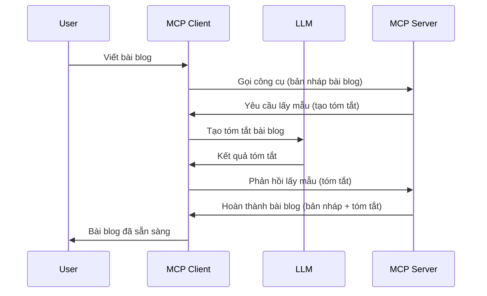

# Lấy mẫu - ủy quyền tính năng cho Client

Đôi khi, bạn cần MCP Client và MCP Server cùng phối hợp để đạt được mục tiêu chung. Có thể bạn gặp trường hợp Server cần sự trợ giúp của một LLM nằm trên client. Trong tình huống này, lấy mẫu là cái bạn nên sử dụng.

Hãy cùng khám phá một số trường hợp sử dụng và cách xây dựng giải pháp liên quan đến lấy mẫu.

## Tổng quan

Trong bài học này, chúng ta tập trung vào việc giải thích khi nào và ở đâu nên sử dụng Lấy mẫu và cách cấu hình nó.

## Mục tiêu học tập

Trong chương này, chúng ta sẽ:

- Giải thích Lấy mẫu là gì và khi nào sử dụng.
- Trình bày cách cấu hình Lấy mẫu trong MCP.
- Cung cấp các ví dụ về Lấy mẫu trong thực tế.

## Lấy mẫu là gì và tại sao sử dụng nó?

Lấy mẫu là một tính năng nâng cao hoạt động theo cách sau:


### Yêu cầu lấy mẫu

Ok, bây giờ chúng ta đã có cái nhìn tổng quan về một kịch bản khả tín, hãy nói về yêu cầu lấy mẫu mà server gửi về client. Đây là cách một yêu cầu như vậy có thể trông trong định dạng JSON-RPC:

```json
{
  "jsonrpc": "2.0",
  "id": 1,
  "method": "sampling/createMessage",
  "params": {
    "messages": [
      {
        "role": "user",
        "content": {
          "type": "text",
          "text": "Create a blog post summary of the following blog post: <BLOG POST>"
        }
      }
    ],
    "modelPreferences": {
      "hints": [
        {
          "name": "claude-3-sonnet"
        }
      ],
      "intelligencePriority": 0.8,
      "speedPriority": 0.5
    },
    "systemPrompt": "You are a helpful assistant.",
    "maxTokens": 100
  }
}
```

Có một vài điểm đáng chú ý ở đây:

- Prompt, dưới content -> text, là lời nhắc của chúng ta, đó là hướng dẫn để LLM tóm tắt nội dung bài viết blog.

- **modelPreferences**. Phần này chính là ưu tiên, đề xuất cấu hình nên dùng với LLM. Người dùng có thể chọn theo những đề xuất này hoặc thay đổi chúng. Trong trường hợp này có các đề xuất về mô hình sử dụng, độ ưu tiên tốc độ và trí tuệ.
- **systemPrompt**, đây là prompt hệ thống bình thường của bạn, cung cấp tính cách cho LLM và chứa các hướng dẫn.
- **maxTokens**, thuộc tính khác dùng để chỉ ra số lượng token được đề xuất sử dụng cho nhiệm vụ này.

### Phản hồi lấy mẫu

Phản hồi này là thứ MCP Client gửi trả lại cho MCP Server, là kết quả của việc client gọi LLM, chờ câu trả lời rồi xây dựng thông điệp này. Đây là mẫu trong định dạng JSON-RPC:

```json
{
  "jsonrpc": "2.0",
  "id": 1,
  "result": {
    "role": "assistant",
    "content": {
      "type": "text",
      "text": "Here's your abstract <ABSTRACT>"
    },
    "model": "gpt-5",
    "stopReason": "endTurn"
  }
}
```

Lưu ý phản hồi là bản tóm tắt bài viết blog đúng như ta yêu cầu. Cũng lưu ý mô hình dùng `model` không phải là mô hình ta yêu cầu mà là "gpt-5" thay vì "claude-3-sonnet". Điều này minh họa người dùng có thể thay đổi ý định về mô hình sử dụng và yêu cầu lấy mẫu của bạn chỉ là đề xuất.

Ok, giờ đã hiểu luồng chính và nhiệm vụ hữu ích để áp dụng nó "tạo bài viết blog + tóm tắt", hãy xem chúng ta cần làm gì để nó hoạt động.

### Các loại thông điệp

Thông điệp lấy mẫu không chỉ giới hạn ở văn bản mà bạn có thể gửi cả hình ảnh và âm thanh. Đây là cách JSON-RPC khác biệt cho từng loại:

**Văn bản**

```json
{
  "type": "text",
  "text": "The message content"
}
```

**Nội dung hình ảnh**

```json
{
  "type": "image",
  "data": "base64-encoded-image-data",
  "mimeType": "image/jpeg"
}
```

**Nội dung âm thanh**

```json
{
  "type": "audio",
  "data": "base64-encoded-audio-data",
  "mimeType": "audio/wav"
}
```

> NOTE: để biết thêm thông tin chi tiết về Lấy mẫu, xem tài liệu [chính thức](https://modelcontextprotocol.io/specification/2025-06-18/client/sampling)

## Cách cấu hình Lấy mẫu trong Client

> Lưu ý: nếu bạn chỉ xây dựng server, bạn không cần làm nhiều ở đây.

Trong client, bạn cần chỉ định tính năng sau như thế này:

```json
{
  "capabilities": {
    "sampling": {}
  }
}
```

Điều này sẽ được nhận khi client bạn chọn khởi tạo với server.

## Ví dụ Lấy mẫu trong thực tế - Tạo bài viết blog

Hãy cùng lập trình một server lấy mẫu, ta cần làm các bước sau:

1. Tạo một công cụ trên Server.
1. Công cụ đó tạo yêu cầu lấy mẫu
1. Công cụ chờ yêu cầu lấy mẫu từ client được trả lời.
1. Sau đó, công cụ trả về kết quả.

Hãy xem mã từng bước:

### -1- Tạo công cụ

**python**

```python
@mcp.tool()
async def create_blog(title: str, content: str, ctx: Context[ServerSession, None]) -> str:
    """Create a blog post and generate a summary"""

```

### -2- Tạo yêu cầu lấy mẫu

Mở rộng công cụ của bạn với mã sau:

**python**

```python
post = BlogPost(
        id=len(posts) + 1,
        title=title,
        content=content,
        abstract=""
    )

prompt = f"Create an abstract of the following blog post: title: {title} and draft: {content} "

result = await ctx.session.create_message(
        messages=[
            SamplingMessage(
                role="user",
                content=TextContent(type="text", text=prompt),
            )
        ],
        max_tokens=100,
)

```

### -3- Chờ phản hồi và trả về phản hồi

**python**

```python
post.abstract = result.content.text

posts.append(post)

# trả về sản phẩm hoàn chỉnh
return json.dumps({
    "id": post.title,
    "abstract": post.abstract
})
```

### -4- Mã đầy đủ

**python**

```python
from starlette.applications import Starlette
from starlette.routing import Mount, Host

from mcp.server.fastmcp import Context, FastMCP

from mcp.server.session import ServerSession
from mcp.types import SamplingMessage, TextContent

import json


from uuid import uuid4
from typing import List
from pydantic import BaseModel


mcp = FastMCP("Blog post generator")

# app = FastAPI()

posts = []

class BlogPost(BaseModel):
    id: int
    title: str
    content: str
    abstract: str

posts: List[BlogPost] = []

@mcp.tool()
async def create_blog(title: str, content: str, ctx: Context[ServerSession, None]) -> str:
    """Create a blog post and generate a summary"""

    post = BlogPost(
        id=len(posts) + 1,
        title=title,
        content=content,
        abstract=""
    )

    prompt = f"Create an abstract of the following blog post: title: {title} and draft: {content} "

    result = await ctx.session.create_message(
        messages=[
            SamplingMessage(
                role="user",
                content=TextContent(type="text", text=prompt),
            )
        ],
        max_tokens=100,
    )

    post.abstract = result.content.text

    posts.append(post)

    # trả về bài viết blog đầy đủ
    return json.dumps({
        "id": post.title,
        "abstract": post.abstract
    })

if __name__ == "__main__":
    print("Starting server...")
    # mcp.run()
    mcp.run(transport="streamable-http")

# chạy ứng dụng với: python server.py
```

### -5- Thử nghiệm trong Visual Studio Code

Để thử nghiệm trong Visual Studio Code, làm theo các bước sau:

1. Khởi động server trong terminal
1. Thêm nó vào *mcp.json* (và chắc chắn server đã được chạy) ví dụ như sau:

   ```json
   "servers": {
      "blog-server": {
        "type": "http",
        "url": "http://localhost:8000/mcp"
      }
   }
   ```

1. Gõ một lời nhắc:

   ```text
   create a blog post named "Where Python comes from", the content is "Python is actually named after Monty Python Flying Circus"
   ```

1. Cho phép lấy mẫu diễn ra. Lần đầu bạn thử, sẽ có một hộp thoại bổ sung yêu cầu bạn đồng ý, sau đó bạn sẽ thấy hộp thoại bình thường hỏi bạn chạy công cụ

1. Kiểm tra kết quả. Bạn sẽ thấy kết quả được hiển thị đẹp trong GitHub Copilot Chat đồng thời cũng có thể xem phản hồi JSON thô.

**Bonus**. Công cụ Visual Studio Code hỗ trợ lấy mẫu rất tốt. Bạn có thể cấu hình quyền truy cập Lấy mẫu trên server đã cài bằng cách:

1. Vào phần extension.
1. Chọn biểu tượng bánh răng cho server bạn đã cài đặt trong mục "MCP SERVERS - INSTALLED".
1 Chọn "Configure Model Access", ở đây bạn chọn được mô hình GitHub Copilot được phép sử dụng khi lấy mẫu. Bạn cũng có thể xem tất cả yêu cầu lấy mẫu gần đây bằng cách chọn "Show Sampling requests".

## Bài tập

Trong bài tập này, bạn sẽ xây dựng một Lấy mẫu hơi khác, đó là tích hợp lấy mẫu hỗ trợ tạo mô tả sản phẩm. Đây là kịch bản của bạn:

**Kịch bản**: Nhân viên văn phòng tại một cửa hàng thương mại điện tử cần trợ giúp, tốn quá nhiều thời gian để tạo mô tả sản phẩm. Vì vậy, bạn phải xây dựng giải pháp có thể gọi công cụ "create_product" với các đối số "title" và "keywords" và nó sẽ tạo một sản phẩm hoàn chỉnh bao gồm trường "description" được điền bởi LLM của client.

TIP: sử dụng những gì bạn đã học trước đó để xây dựng server và công cụ này sử dụng yêu cầu lấy mẫu.

## Giải pháp

[Giải pháp](./solution/README.md)

## Những điểm chính cần nhớ

Lấy mẫu là một tính năng mạnh mẽ cho phép server ủy quyền nhiệm vụ cho client khi cần sự trợ giúp của LLM.

## Tiếp theo là gì

- [Chương 4 - Triển khai thực tế](../../04-PracticalImplementation/README.md)

---

<!-- CO-OP TRANSLATOR DISCLAIMER START -->
**Tuyên bố miễn trừ trách nhiệm**:  
Tài liệu này đã được dịch bằng dịch vụ dịch thuật AI [Co-op Translator](https://github.com/Azure/co-op-translator). Mặc dù chúng tôi nỗ lực đảm bảo độ chính xác, xin lưu ý rằng các bản dịch tự động có thể chứa lỗi hoặc không chính xác. Tài liệu gốc bằng ngôn ngữ gốc của nó nên được coi là nguồn chính xác và đáng tin cậy. Đối với các thông tin quan trọng, việc dịch thuật chuyên nghiệp do con người thực hiện được khuyến nghị. Chúng tôi không chịu trách nhiệm về bất kỳ sự hiểu lầm hoặc giải thích sai nào phát sinh từ việc sử dụng bản dịch này.
<!-- CO-OP TRANSLATOR DISCLAIMER END -->