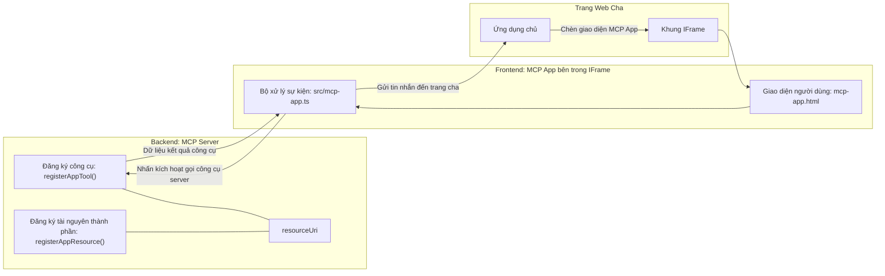

# MCP Apps

MCP Apps là một mô hình mới trong MCP. Ý tưởng là không chỉ phản hồi dữ liệu từ việc gọi công cụ, bạn còn cung cấp thông tin về cách mà dữ liệu này nên được tương tác. Điều đó có nghĩa là kết quả của công cụ giờ có thể chứa thông tin về giao diện người dùng. Tại sao chúng ta lại muốn điều đó? Hãy xem cách bạn làm việc ngày nay. Bạn có thể đang lấy kết quả của MCP Server bằng cách đặt một loại frontend nào đó ở phía trước nó, đó là mã bạn cần viết và duy trì. Đôi khi đó là điều bạn muốn, nhưng đôi khi sẽ thật tuyệt nếu bạn chỉ cần đưa vào một đoạn thông tin tự chứa, có đầy đủ từ dữ liệu đến giao diện người dùng.

## Tổng quan

Bài học này cung cấp hướng dẫn thực tế về MCP Apps, cách bắt đầu với nó và cách tích hợp vào các Web Apps hiện có của bạn. MCP Apps là một phần bổ sung rất mới cho Tiêu chuẩn MCP.

## Mục tiêu học tập

Kết thúc bài học này, bạn sẽ có thể:

- Giải thích MCP Apps là gì.
- Khi nào nên sử dụng MCP Apps.
- Xây dựng và tích hợp MCP Apps của riêng bạn.

## MCP Apps - nó hoạt động như thế nào

Ý tưởng với MCP Apps là cung cấp một phản hồi thực chất là một thành phần để được hiển thị. Thành phần như vậy có thể có cả hình ảnh và tính tương tác, ví dụ, nhấn nút, nhập liệu của người dùng và nhiều hơn nữa. Hãy bắt đầu với phía máy chủ và MCP Server của chúng ta. Để tạo một thành phần MCP App, bạn cần tạo một công cụ và cũng tạo tài nguyên ứng dụng. Hai phần này được kết nối bằng resourceUri.

Đây là một ví dụ. Hãy cùng hình dung có gì liên quan và phần nào làm gì:

```text
server.ts -- responsible for registering tools and the component as a UI component
src/
  mcp-app.ts -- wiring up event handlers
mcp-app.html -- the user interface
```
  
Hình ảnh này mô tả kiến trúc để tạo một thành phần và logic của nó.


Tiếp theo, hãy thử mô tả trách nhiệm cho backend và frontend tương ứng.

### Phía backend

Có hai việc chúng ta cần hoàn thành ở đây:

- Đăng ký các công cụ mà chúng ta muốn tương tác.
- Định nghĩa thành phần.

**Đăng ký công cụ**

```typescript
registerAppTool(
    server,
    "get-time",
    {
      title: "Get Time",
      description: "Returns the current server time.",
      inputSchema: {},
      _meta: { ui: { resourceUri } }, // Liên kết công cụ này với tài nguyên giao diện người dùng của nó
    },
    async () => {
      const time = new Date().toISOString();
      return { content: [{ type: "text", text: time }] };
    },
  );

```
  
Đoạn mã trên mô tả hành vi, trong đó nó cung cấp một công cụ được gọi là `get-time`. Công cụ này không nhận đầu vào nhưng sẽ tạo ra thời gian hiện tại. Chúng ta có khả năng định nghĩa `inputSchema` cho các công cụ mà cần tiếp nhận dữ liệu nhập của người dùng.

**Đăng ký thành phần**

Trong cùng một tập tin, chúng ta cũng cần đăng ký thành phần:

```typescript
const resourceUri = "ui://get-time/mcp-app.html";

// Đăng ký tài nguyên, trả về HTML/JavaScript đã đóng gói cho giao diện người dùng.
registerAppResource(
  server,
  resourceUri,
  resourceUri,
  { mimeType: RESOURCE_MIME_TYPE },
  async () => {
    const html = await fs.readFile(path.join(DIST_DIR, "mcp-app.html"), "utf-8");

    return {
    contents: [
        { uri: resourceUri, mimeType: RESOURCE_MIME_TYPE, text: html },
    ],
    };
  },
);
```
  
Lưu ý cách chúng ta đề cập đến `resourceUri` để kết nối thành phần với các công cụ của nó. Điều thú vị là callback nơi chúng ta tải file UI và trả về thành phần.

### Frontend thành phần

Giống như backend, có hai phần ở đây:

- Frontend viết bằng HTML thuần.
- Mã xử lý các sự kiện và hành động, ví dụ gọi công cụ hoặc gửi tin nhắn đến cửa sổ cha.

**Giao diện người dùng**

Hãy xem giao diện người dùng.

```html
<!-- mcp-app.html -->
<!DOCTYPE html>
<html lang="en">
  <head>
    <meta charset="UTF-8" />
    <title>Get Time App</title>
  </head>
  <body>
    <p>
      <strong>Server Time:</strong> <code id="server-time">Loading...</code>
    </p>
    <button id="get-time-btn">Get Server Time</button>
    <script type="module" src="/src/mcp-app.ts"></script>
  </body>
</html>
```
  
**Kết nối sự kiện**

Phần cuối cùng là kết nối sự kiện. Điều này có nghĩa là chúng ta xác định phần nào trong UI cần có trình xử lý sự kiện và làm gì khi sự kiện được kích hoạt:

```typescript
// mcp-app.ts

import { App } from "@modelcontextprotocol/ext-apps";

// Lấy tham chiếu phần tử
const serverTimeEl = document.getElementById("server-time")!;
const getTimeBtn = document.getElementById("get-time-btn")!;

// Tạo phiên bản ứng dụng
const app = new App({ name: "Get Time App", version: "1.0.0" });

// Xử lý kết quả công cụ từ máy chủ. Đặt trước `app.connect()` để tránh
// bỏ lỡ kết quả công cụ ban đầu.
app.ontoolresult = (result) => {
  const time = result.content?.find((c) => c.type === "text")?.text;
  serverTimeEl.textContent = time ?? "[ERROR]";
};

// Kết nối sự kiện nhấn nút
getTimeBtn.addEventListener("click", async () => {
  // `app.callServerTool()` cho phép giao diện người dùng yêu cầu dữ liệu mới từ máy chủ
  const result = await app.callServerTool({ name: "get-time", arguments: {} });
  const time = result.content?.find((c) => c.type === "text")?.text;
  serverTimeEl.textContent = time ?? "[ERROR]";
});

// Kết nối đến máy chủ
app.connect();
```
  
Như bạn thấy ở trên, đây là mã thông thường để gắn các phần tử DOM với sự kiện. Cần nhấn mạnh là gọi hàm `callServerTool` sẽ gọi công cụ ở phía backend.

## Xử lý nhập liệu người dùng

Cho đến nay, chúng ta đã thấy một thành phần có một nút khi nhấn sẽ gọi một công cụ. Hãy thử thêm các phần tử UI như trường nhập liệu và xem có thể truyền tham số đến công cụ không. Hãy triển khai chức năng FAQ. Nó hoạt động như sau:

- Có một nút và một phần tử nhập liệu để người dùng gõ từ khóa tìm kiếm ví dụ "Shipping". Điều này sẽ gọi một công cụ phía backend làm chức năng tìm kiếm trong dữ liệu FAQ.
- Một công cụ hỗ trợ tìm kiếm FAQ như đã nói.

Trước hết hãy thêm hỗ trợ cần thiết cho phía backend:

```typescript
const faq: { [key: string]: string } = {
    "shipping": "Our standard shipping time is 3-5 business days.",
    "return policy": "You can return any item within 30 days of purchase.",
    "warranty": "All products come with a 1-year warranty covering manufacturing defects.",
  }

registerAppTool(
    server,
    "get-faq",
    {
      title: "Search FAQ",
      description: "Searches the FAQ for relevant answers.",
      inputSchema: zod.object({
        query: zod.string().default("shipping"),
      }),
      _meta: { ui: { resourceUri: faqResourceUri } }, // Liên kết công cụ này với tài nguyên giao diện người dùng của nó
    },
    async ({ query }) => {
      const answer: string = faq[query.toLowerCase()] || "Sorry, I don't have an answer for that.";
      return { content: [{ type: "text", text: answer }] };
    },
  );
```
  
Chúng ta thấy cách ta điền vào `inputSchema` và cung cấp cho nó một schema `zod` như sau:

```typescript
inputSchema: zod.object({
  query: zod.string().default("shipping"),
})
```
  
Trong schema trên, chúng ta khai báo có tham số đầu vào là `query` và nó là tùy chọn với giá trị mặc định là "shipping".

Ok, tiếp theo sang *mcp-app.html* để xem giao diện người dùng cần tạo ra như thế nào:

```html
<div class="faq">
    <h1>FAQ response</h1>
    <p>FAQ Response: <code id="faq-response">Loading...</code></p>
    <input type="text" id="faq-query" placeholder="Enter FAQ query" />
    <button id="get-faq-btn">Get FAQ Response</button>
  </div>
```
  
Tuyệt, giờ chúng ta có một phần tử nhập liệu và một nút bấm. Tiếp theo sang *mcp-app.ts* để kết nối các sự kiện này:

```typescript
const getFaqBtn = document.getElementById("get-faq-btn")!;
const faqQueryInput = document.getElementById("faq-query") as HTMLInputElement;

getFaqBtn.addEventListener("click", async () => {
  const query = faqQueryInput.value;
  const result = await app.callServerTool({ name: "get-faq", arguments: { query } });
  const faq = result.content?.find((c) => c.type === "text")?.text;
  faqResponseEl.textContent = faq ?? "[ERROR]";
});
```
  
Trong đoạn mã trên chúng ta:

- Tạo các tham chiếu đến các phần tử UI có tính tương tác.
- Xử lý sự kiện nút bấm để lấy giá trị của phần tử nhập liệu và gọi `app.callServerTool()` với `name` và `arguments` trong đó đối số truyền `query` làm giá trị.

Thực tế khi gọi `callServerTool`, nó gửi một tin nhắn đến cửa sổ cha và cửa sổ đó gọi MCP Server.

### Thử nghiệm

Thử nghiệm, chúng ta nên thấy như sau:


và đây là khi thử với dữ liệu nhập như "warranty"


Để chạy đoạn mã này, hãy vào phần [Code section](./code/README.md)

## Kiểm thử trong Visual Studio Code

Visual Studio Code hỗ trợ rất tốt cho MCP Apps và có thể là một trong những cách dễ nhất để thử MCP Apps của bạn. Để sử dụng Visual Studio Code, thêm một mục server vào *mcp.json* như sau:

```json
"my-mcp-server-7178eca7": {
    "url": "http://localhost:3001/mcp",
    "type": "http"
  }
```
  
Sau đó khởi động server, bạn có thể giao tiếp với MCP App qua cửa sổ Chat nếu đã cài GitHub Copilot.

Bạn có thể kích hoạt nó qua câu lệnh ví dụ "#get-faq":


Và cũng giống như chạy trong trình duyệt web, nó hiển thị như sau:


## Bài tập

Tạo một trò chơi oẳn tù tì. Nó cần gồm các phần sau:

Giao diện người dùng:

- một danh sách thả xuống với các tùy chọn
- một nút để gửi lựa chọn
- một nhãn hiển thị ai chọn gì và ai thắng

Máy chủ:

- cần có công cụ oẳn tù tì nhận "choice" làm đầu vào. Nó cũng hiển thị lựa chọn máy tính và xác định người chiến thắng

## Giải pháp

[Giải pháp](./assignment/README.md)

## Tóm tắt

Chúng ta đã học về mô hình mới MCP Apps. Đây là một mô hình mới cho phép MCP Servers không chỉ định hướng dữ liệu mà còn cách trình bày dữ liệu đó.

Ngoài ra, chúng ta biết MCP Apps được chạy trong một IFrame và để giao tiếp với MCP Servers, chúng cần gửi tin nhắn đến ứng dụng web cha. Có nhiều thư viện cho JavaScript thuần, React và hơn thế nữa giúp việc giao tiếp này dễ dàng hơn.

## Những điểm chính

Đây là những gì bạn đã học được:

- MCP Apps là tiêu chuẩn mới có ích khi bạn muốn cung cấp đồng thời dữ liệu và tính năng giao diện người dùng.
- Các ứng dụng này chạy trong IFrame vì lý do bảo mật.

## Tiếp theo

- [Chương 4](../../04-PracticalImplementation/README.md)

---

<!-- CO-OP TRANSLATOR DISCLAIMER START -->
**Tuyên bố miễn trừ trách nhiệm**:  
Tài liệu này đã được dịch bằng dịch vụ dịch thuật AI [Co-op Translator](https://github.com/Azure/co-op-translator). Mặc dù chúng tôi cố gắng đảm bảo độ chính xác, xin lưu ý rằng dịch tự động có thể chứa lỗi hoặc sai sót. Tài liệu gốc bằng ngôn ngữ bản địa của nó nên được coi là nguồn chính xác và đáng tin cậy. Đối với thông tin quan trọng, nên sử dụng dịch thuật chuyên nghiệp bởi con người. Chúng tôi không chịu trách nhiệm về bất kỳ hiểu lầm hoặc sai lệch nào phát sinh từ việc sử dụng bản dịch này.
<!-- CO-OP TRANSLATOR DISCLAIMER END -->