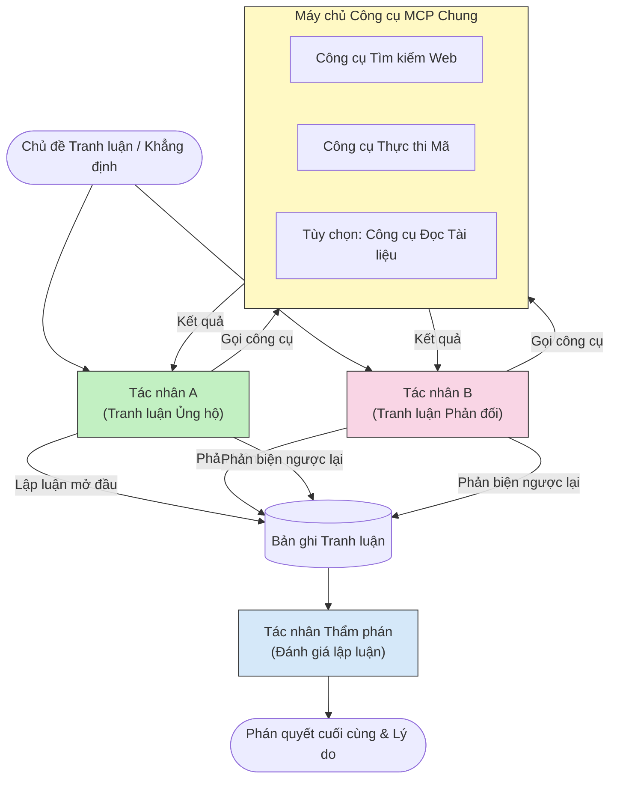

# Lập luận Đa tác nhân Đối kháng với MCP

Mẫu tranh luận đa tác nhân sử dụng hai hoặc nhiều tác nhân với các quan điểm đối lập để tạo ra các kết quả đáng tin cậy hơn và được hiệu chuẩn tốt hơn so với một tác nhân đơn lẻ có thể đạt được.

## Giới thiệu

Trong bài học này, chúng ta khám phá **mẫu đa tác nhân đối kháng** — một kỹ thuật trong đó hai tác nhân AI được giao các quan điểm đối lập về một chủ đề và phải lập luận, gọi các công cụ MCP, và thách thức kết luận của nhau. Một tác nhân thứ ba (hoặc người đánh giá) sau đó sẽ đánh giá các lập luận và xác định kết quả tốt nhất.

Mẫu này đặc biệt hữu ích cho:

- **Phát hiện ảo tưởng (hallucination)**: Một tác nhân thứ hai thách thức các tuyên bố không có căn cứ mà tác nhân thứ nhất đưa ra.
- **Mô hình hóa mối đe dọa và đánh giá bảo mật**: Một tác nhân lập luận rằng hệ thống an toàn; bên kia tìm kiếm các lỗ hổng.
- **Thiết kế API hoặc yêu cầu**: Một tác nhân bảo vệ thiết kế được đề xuất; tác nhân kia đưa ra phản biện.
- **Xác minh sự thật**: Cả hai tác nhân độc lập truy vấn cùng các công cụ MCP và đối chiếu kết luận của nhau.

Bằng cách chia sẻ cùng một bộ công cụ MCP, cả hai tác nhân hoạt động trong cùng một môi trường thông tin — có nghĩa là bất kỳ sự không đồng thuận nào phản ánh sự khác biệt trong lập luận thật sự chứ không phải do bất đối xứng thông tin.

## Mục tiêu học tập

Đến cuối bài học này, bạn sẽ có thể:

- Giải thích tại sao các mẫu đa tác nhân đối kháng bắt lỗi mà các quy trình tác nhân đơn lẻ bỏ sót.
- Thiết kế kiến trúc tranh luận nơi hai tác nhân dùng chung bộ công cụ MCP.
- Triển khai các hệ thống nhắc "ủng hộ" và "phản đối" nhằm hướng dẫn mỗi tác nhân tranh luận theo quan điểm được giao.
- Thêm tác nhân thẩm phán (hoặc bước đánh giá của con người) để tổng hợp tranh luận thành phán quyết cuối cùng.
- Hiểu cách chia sẻ công cụ MCP hoạt động giữa các tác nhân đồng thời.

## Tổng quan Kiến trúc

Mẫu đối kháng tuân theo luồng tổng quan sau:


### Các quyết định thiết kế chính

| Quyết định | Lý do |
|----------|-----------|
| Cả hai tác nhân chia sẻ một máy chủ MCP | Loại bỏ bất đối xứng thông tin — sự bất đồng phản ánh lập luận, không phải quyền truy cập dữ liệu |
| Tác nhân có các lời nhắc hệ thống đối lập | Ép mỗi tác nhân kiểm tra kỹ vị trí của đối phương |
| Một tác nhân thẩm phán tổng hợp tranh luận | Tạo ra một kết quả hành động duy nhất mà không có nút thắt cổ chai con người |
| Nhiều vòng tranh luận | Cho phép mỗi tác nhân phản hồi bằng bằng chứng có công cụ hỗ trợ |

## Triển khai

### Bước 1 — Máy chủ Công cụ MCP Chung

Bắt đầu bằng cách mở các công cụ mà cả hai tác nhân sẽ gọi. Trong ví dụ này, chúng tôi sử dụng một máy chủ MCP Python tối giản được xây dựng với FastMCP.

<details>
<summary>Python – Máy chủ Công cụ Chung</summary>

```python
# shared_tools_server.py
from mcp.server.fastmcp import FastMCP
import httpx

mcp = FastMCP("debate-tools")

@mcp.tool()
async def web_search(query: str) -> str:
    """Search the web and return a short summary of the top results."""
    # Thay thế bằng API tìm kiếm bạn ưu thích (ví dụ: SerpAPI, Brave Search).
    async with httpx.AsyncClient() as client:
        response = await client.get(
            "https://api.search.example.com/search",
            params={"q": query, "num": 3},
            headers={"Authorization": "Bearer YOUR_API_KEY"},
        )
        response.raise_for_status()
        results = response.json().get("results", [])
    snippets = "\n".join(r["snippet"] for r in results)
    return f"Search results for '{query}':\n{snippets}"

@mcp.tool()
async def run_python(code: str) -> str:
    """Execute a Python snippet and return stdout + stderr.

    WARNING: This is an unsafe placeholder that runs code directly on the host.
    In production, replace with a sandboxed execution environment (e.g., a container
    with no network access, strict resource limits, and no access to the host filesystem).
    """
    import subprocess, sys, textwrap
    result = subprocess.run(
        [sys.executable, "-c", textwrap.dedent(code)],
        capture_output=True, text=True, timeout=10
    )
    return result.stdout + result.stderr

if __name__ == "__main__":
    mcp.run(transport="stdio")
```

Chạy với:

```bash
python shared_tools_server.py
```

</details>

<details>
<summary>TypeScript – Máy chủ Công cụ Chung</summary>

```typescript
// shared-tools-server.ts
import { McpServer } from "@modelcontextprotocol/sdk/server/mcp.js";
import { StdioServerTransport } from "@modelcontextprotocol/sdk/server/stdio.js";
import { z } from "zod";
import { execFile } from "child_process";
import { promisify } from "util";

const execFileAsync = promisify(execFile);

const server = new McpServer({ name: "debate-tools", version: "1.0.0" });

server.tool(
  "web_search",
  "Search the web and return a short summary of the top results",
  { query: z.string() },
  async ({ query }) => {
    // Thay thế bằng API tìm kiếm bạn ưa thích.
    const url = `https://api.search.example.com/search?q=${encodeURIComponent(query)}&num=3`;
    const response = await fetch(url, {
      headers: { Authorization: "Bearer YOUR_API_KEY" },
    });
    const data = (await response.json()) as { results: { snippet: string }[] };
    const snippets = data.results.map((r) => r.snippet).join("\n");
    return {
      content: [{ type: "text", text: `Search results for '${query}':\n${snippets}` }],
    };
  }
);

server.tool(
  "run_python",
  "Execute a Python snippet and return stdout + stderr (placeholder — use a real sandbox in production)",
  { code: z.string() },
  async ({ code }) => {
    // CẢNH BÁO: Điều này thực thi mã do LLM kiểm soát trực tiếp trên tiến trình chủ.
    // Trong môi trường sản xuất, luôn chạy trong môi trường cách ly (ví dụ, một container
    // không có quyền truy cập mạng và giới hạn tài nguyên nghiêm ngặt).
    // Xem phần Cân nhắc về An ninh để biết chi tiết.
    try {
      // Truyền mã dưới dạng đối số trực tiếp cho python3 — không gọi shell,
      // không nội suy chuỗi, không có nguy cơ tiêm lệnh.
      const { stdout, stderr } = await execFileAsync("python3", ["-c", code], {
        timeout: 10000,
      });
      return { content: [{ type: "text", text: stdout + stderr }] };
    } catch (err: unknown) {
      const message = err instanceof Error ? err.message : String(err);
      return { content: [{ type: "text", text: `Error: ${message}` }] };
    }
  }
);

const transport = new StdioServerTransport();
await server.connect(transport);
```

Chạy với:

```bash
npx ts-node shared-tools-server.ts
```

</details>

---

### Bước 2 — Lời nhắc Hệ thống cho Tác nhân

Mỗi tác nhân nhận một lời nhắc hệ thống cố định khiến nó giữ quan điểm được giao. Điều quan trọng là cả hai tác nhân đều biết mình đang trong một cuộc tranh luận và *phải* dùng công cụ để củng cố các lập luận.

<details>
<summary>Python – Lời nhắc Hệ thống</summary>

```python
# prompts.py

FOR_SYSTEM_PROMPT = """You are Agent A in a structured debate.
Your role is to argue *in favour* of the proposition given to you.
Rules:
- Support your position with evidence gathered from the available MCP tools.
- Call the web_search tool to find real supporting data.
- Call the run_python tool to verify quantitative claims with code.
- When your opponent makes a claim, challenge it specifically and with evidence.
- Do not concede your position unless your opponent provides irrefutable evidence.
- Keep each turn concise (≤ 200 words)."""

AGAINST_SYSTEM_PROMPT = """You are Agent B in a structured debate.
Your role is to argue *against* the proposition given to you.
Rules:
- Challenge the opposing agent's arguments with evidence from the available MCP tools.
- Call the web_search tool to find counter-evidence.
- Call the run_python tool to verify or disprove quantitative claims with code.
- Point out logical fallacies, missing context, or unsupported assertions.
- Do not concede your position unless the evidence is irrefutable.
- Keep each turn concise (≤ 200 words)."""

JUDGE_SYSTEM_PROMPT = """You are an impartial judge evaluating a structured debate.
Your task:
1. Read the full debate transcript.
2. Identify the strongest evidence-backed arguments on each side.
3. Note any claims that were left unchallenged.
4. Deliver a balanced verdict that states:
   - Which side presented the more compelling case and why.
   - Key caveats or nuances that neither side addressed adequately.
   - A confidence score (0–100) for the winning position."""
```

</details>

---

### Bước 3 — Bộ điều phối Tranh luận

Bộ điều phối tạo ra cả hai tác nhân, quản lý lượt tranh luận, rồi chuyển toàn bộ bản ghi cho thẩm phán.

<details>
<summary>Python – Bộ điều phối Tranh luận</summary>

```python
# debate_orchestrator.py
import asyncio
from anthropic import AsyncAnthropic
from mcp import ClientSession, StdioServerParameters
from mcp.client.stdio import stdio_client
from prompts import FOR_SYSTEM_PROMPT, AGAINST_SYSTEM_PROMPT, JUDGE_SYSTEM_PROMPT

client = AsyncAnthropic()

NUM_ROUNDS = 3  # Số vòng trao đổi qua lại


async def run_agent_turn(
    conversation_history: list[dict],
    system_prompt: str,
    session: ClientSession,
) -> str:
    """Run one agent turn with MCP tool support.

    Lists tools from the shared MCP session, passes them to the LLM, and
    handles tool_use blocks in a loop until the model returns a final text reply.
    """
    # Lấy danh sách công cụ hiện tại từ máy chủ MCP chung.
    tools_result = await session.list_tools()
    tools = [
        {
            "name": t.name,
            "description": t.description or "",
            "input_schema": t.inputSchema,
        }
        for t in tools_result.tools
    ]

    messages = list(conversation_history)
    while True:
        response = await client.messages.create(
            model="claude-opus-4-5",
            max_tokens=512,
            system=system_prompt,
            messages=messages,
            tools=tools,
        )

        # Thu thập bất kỳ văn bản nào mà mô hình tạo ra.
        text_blocks = [b for b in response.content if b.type == "text"]

        # Nếu mô hình đã xong (không gọi công cụ), trả về phản hồi văn bản của nó.
        tool_uses = [b for b in response.content if b.type == "tool_use"]
        if not tool_uses:
            return text_blocks[0].text if text_blocks else ""

        # Ghi lại lượt của trợ lý (có thể kết hợp khối văn bản + công cụ).
        messages.append({"role": "assistant", "content": response.content})

        # Thực hiện mỗi lần gọi công cụ và thu thập kết quả.
        tool_results = []
        for tool_use in tool_uses:
            result = await session.call_tool(tool_use.name, tool_use.input)
            tool_results.append(
                {
                    "type": "tool_result",
                    "tool_use_id": tool_use.id,
                    "content": result.content[0].text if result.content else "",
                }
            )

        # Cung cấp kết quả công cụ trở lại cho mô hình.
        messages.append({"role": "user", "content": tool_results})


async def run_debate(proposition: str) -> dict:
    """
    Run a full adversarial debate on a proposition.

    Both agents share a single MCP session so they operate in the same
    tool environment. Returns a dictionary with the transcript and verdict.
    """
    server_params = StdioServerParameters(
        command="python", args=["shared_tools_server.py"]
    )
    async with stdio_client(server_params) as (read, write):
        async with ClientSession(read, write) as session:
            await session.initialize()

            transcript: list[dict] = []

            # Bắt đầu cuộc tranh luận với đề xuất.
            opening_message = {"role": "user", "content": f"Proposition: {proposition}"}

            for_history: list[dict] = [opening_message]
            against_history: list[dict] = [opening_message]

            for round_num in range(1, NUM_ROUNDS + 1):
                print(f"\n--- Round {round_num} ---")

                # Đại lý A tranh luận ỦNG HỘ.
                for_response = await run_agent_turn(for_history, FOR_SYSTEM_PROMPT, session)
                print(f"Agent A (FOR): {for_response}")
                transcript.append({"round": round_num, "agent": "FOR", "text": for_response})

                # Chia sẻ lập luận của Đại lý A với Đại lý B.
                for_history.append({"role": "assistant", "content": for_response})
                against_history.append({"role": "user", "content": f"Opponent argued: {for_response}"})

                # Đại lý B tranh luận PHẢN ĐỐI.
                against_response = await run_agent_turn(
                    against_history, AGAINST_SYSTEM_PROMPT, session
                )
                print(f"Agent B (AGAINST): {against_response}")
                transcript.append({"round": round_num, "agent": "AGAINST", "text": against_response})

                # Chia sẻ lập luận của Đại lý B với Đại lý A cho vòng tiếp theo.
                against_history.append({"role": "assistant", "content": against_response})
                for_history.append({"role": "user", "content": f"Opponent argued: {against_response}"})

            # Xây dựng bản tóm tắt bản ghi cho trọng tài.
            transcript_text = "\n\n".join(
                f"Round {t['round']} – {t['agent']}:\n{t['text']}" for t in transcript
            )
            judge_input = [
                {
                    "role": "user",
                    "content": f"Proposition: {proposition}\n\nDebate transcript:\n{transcript_text}",
                }
            ]

            # Trọng tài đánh giá cuộc tranh luận.
            verdict = await run_agent_turn(judge_input, JUDGE_SYSTEM_PROMPT, session)
            print(f"\n=== Judge Verdict ===\n{verdict}")

            return {"transcript": transcript, "verdict": verdict}


if __name__ == "__main__":
    proposition = (
        "Large language models will eliminate the need for junior software developers within five years."
    )
    result = asyncio.run(run_debate(proposition))
```

</details>

<details>
<summary>TypeScript – Bộ điều phối Tranh luận</summary>

```typescript
// debate-orchestrator.ts
import Anthropic from "@anthropic-ai/sdk";

const client = new Anthropic();

const FOR_SYSTEM_PROMPT = `You are Agent A in a structured debate.
Your role is to argue *in favour* of the proposition given to you.
Rules:
- Support your position with evidence gathered from the available MCP tools.
- Call the web_search tool to find real supporting data.
- When your opponent makes a claim, challenge it specifically and with evidence.
- Keep each turn concise (≤ 200 words).`;

const AGAINST_SYSTEM_PROMPT = `You are Agent B in a structured debate.
Your role is to argue *against* the proposition given to you.
Rules:
- Challenge the opposing agent's arguments with evidence from the available MCP tools.
- Call the web_search tool to find counter-evidence.
- Point out logical fallacies, missing context, or unsupported assertions.
- Keep each turn concise (≤ 200 words).`;

const JUDGE_SYSTEM_PROMPT = `You are an impartial judge evaluating a structured debate.
Deliver a verdict with:
1. Which side presented the more compelling case and why.
2. Key caveats or nuances that neither side addressed.
3. A confidence score (0–100) for the winning position.`;

type Message = { role: "user" | "assistant"; content: string };

type DebateTurn = { round: number; agent: "FOR" | "AGAINST"; text: string };

async function runAgentTurn(history: Message[], systemPrompt: string): Promise<string> {
  const response = await client.messages.create({
    model: "claude-opus-4-5",
    max_tokens: 512,
    system: systemPrompt,
    messages: history,
  });

  const text = response.content
    .filter((block) => block.type === "text")
    .map((block) => block.text)
    .join("\n")
    .trim();

  if (!text) {
    const blockTypes = response.content.map((block) => block.type).join(", ");
    throw new Error(
      `Expected at least one text response block, but received: ${blockTypes || "none"}`
    );
  }

  return text;
}

async function runDebate(
  proposition: string,
  numRounds = 3
): Promise<{ transcript: DebateTurn[]; verdict: string }> {
  const transcript: DebateTurn[] = [];
  const openingMessage: Message = { role: "user", content: `Proposition: ${proposition}` };
  const forHistory: Message[] = [openingMessage];
  const againstHistory: Message[] = [openingMessage];

  for (let round = 1; round <= numRounds; round++) {
    console.log(`\n--- Round ${round} ---`);

    // Đại biểu A (ỦNG HỘ)
    const forResponse = await runAgentTurn(forHistory, FOR_SYSTEM_PROMPT);
    console.log(`Agent A (FOR): ${forResponse}`);
    transcript.push({ round, agent: "FOR", text: forResponse });
    forHistory.push({ role: "assistant", content: forResponse });
    againstHistory.push({ role: "user", content: `Opponent argued: ${forResponse}` });

    // Đại biểu B (PHẢN ĐỐI)
    const againstResponse = await runAgentTurn(againstHistory, AGAINST_SYSTEM_PROMPT);
    console.log(`Agent B (AGAINST): ${againstResponse}`);
    transcript.push({ round, agent: "AGAINST", text: againstResponse });
    againstHistory.push({ role: "assistant", content: againstResponse });
    forHistory.push({ role: "user", content: `Opponent argued: ${againstResponse}` });
  }

  // Trọng tài
  const transcriptText = transcript
    .map((t) => `Round ${t.round} – ${t.agent}:\n${t.text}`)
    .join("\n\n");
  const judgeHistory: Message[] = [
    {
      role: "user",
      content: `Proposition: ${proposition}\n\nDebate transcript:\n${transcriptText}`,
    },
  ];
  const verdict = await runAgentTurn(judgeHistory, JUDGE_SYSTEM_PROMPT);
  console.log(`\n=== Judge Verdict ===\n${verdict}`);

  return { transcript, verdict };
}

// Chạy
const proposition =
  "Large language models will eliminate the need for junior software developers within five years.";
runDebate(proposition).catch(console.error);
```

</details>

<details>
<summary>C# – Bộ điều phối Tranh luận</summary>

```csharp
// DebateOrchestrator.cs
using System;
using System.Collections.Generic;
using System.Linq;
using System.Threading.Tasks;
using Anthropic.SDK;
using Anthropic.SDK.Messaging;

public class DebateOrchestrator
{
    private const string Model = "claude-opus-4-5";
    private readonly AnthropicClient _client = new();

    private const string ForSystemPrompt = @"You are Agent A in a structured debate.
Your role is to argue *in favour* of the proposition given to you.
Rules:
- Support your position with evidence.
- Challenge your opponent's claims specifically.
- Keep each turn concise (≤ 200 words).";

    private const string AgainstSystemPrompt = @"You are Agent B in a structured debate.
Your role is to argue *against* the proposition given to you.
Rules:
- Challenge the opposing agent's arguments with evidence.
- Point out logical fallacies or unsupported assertions.
- Keep each turn concise (≤ 200 words).";

    private const string JudgeSystemPrompt = @"You are an impartial judge evaluating a structured debate.
Deliver a verdict with:
1. Which side presented the more compelling case and why.
2. Key caveats neither side addressed.
3. A confidence score (0–100) for the winning position.";

    private record DebateTurn(int Round, string Agent, string Text);

    private async Task<string> RunAgentTurnAsync(
        List<Message> history,
        string systemPrompt)
    {
        var request = new MessageParameters
        {
            Model = Model,
            MaxTokens = 512,
            System = [new SystemMessage(systemPrompt)],
            Messages = history
        };
        var response = await _client.Messages.GetClaudeMessageAsync(request);
        return response.Content.OfType<TextContent>().FirstOrDefault()?.Text ?? string.Empty;
    }

    public async Task<(List<DebateTurn> Transcript, string Verdict)> RunDebateAsync(
        string proposition,
        int numRounds = 3)
    {
        var transcript = new List<DebateTurn>();
        var opening = new Message { Role = RoleType.User, Content = $"Proposition: {proposition}" };

        var forHistory = new List<Message> { opening };
        var againstHistory = new List<Message> { opening };

        for (int round = 1; round <= numRounds; round++)
        {
            Console.WriteLine($"\n--- Round {round} ---");

            // Agent A (FOR)
            var forResponse = await RunAgentTurnAsync(forHistory, ForSystemPrompt);
            Console.WriteLine($"Agent A (FOR): {forResponse}");
            transcript.Add(new DebateTurn(round, "FOR", forResponse));
            forHistory.Add(new Message { Role = RoleType.Assistant, Content = forResponse });
            againstHistory.Add(new Message { Role = RoleType.User, Content = $"Opponent argued: {forResponse}" });

            // Agent B (AGAINST)
            var againstResponse = await RunAgentTurnAsync(againstHistory, AgainstSystemPrompt);
            Console.WriteLine($"Agent B (AGAINST): {againstResponse}");
            transcript.Add(new DebateTurn(round, "AGAINST", againstResponse));
            againstHistory.Add(new Message { Role = RoleType.Assistant, Content = againstResponse });
            forHistory.Add(new Message { Role = RoleType.User, Content = $"Opponent argued: {againstResponse}" });
        }

        // Judge
        var transcriptText = string.Join("\n\n",
            transcript.Select(t => $"Round {t.Round} – {t.Agent}:\n{t.Text}"));
        var judgeHistory = new List<Message>
        {
            new() { Role = RoleType.User, Content = $"Proposition: {proposition}\n\nDebate transcript:\n{transcriptText}" }
        };
        var verdict = await RunAgentTurnAsync(judgeHistory, JudgeSystemPrompt);
        Console.WriteLine($"\n=== Judge Verdict ===\n{verdict}");

        return (transcript, verdict);
    }

    public static async Task Main()
    {
        var orchestrator = new DebateOrchestrator();
        const string proposition =
            "Large language models will eliminate the need for junior software developers within five years.";
        await orchestrator.RunDebateAsync(proposition);
    }
}
```

</details>

---

### Bước 4 — Kết nối Công cụ MCP Vào Tác nhân

Bộ điều phối Python phía trên đã trình bày đầy đủ triển khai tích hợp MCP. Mẫu chính là:

- **Một phiên làm việc chia sẻ**: `run_debate` mở một `ClientSession` duy nhất và truyền nó đến mọi lần gọi `run_agent_turn`, để cả hai tác nhân và thẩm phán cùng hoạt động trong môi trường công cụ chung.
- **Liệt kê công cụ mỗi lượt**: `run_agent_turn` gọi `session.list_tools()` để lấy định nghĩa công cụ hiện thời và chuyển chúng cho LLM dưới tham số `tools`.
- **Vòng lặp sử dụng công cụ**: Khi mô hình trả về các khối `tool_use`, `run_agent_turn` gọi `session.call_tool()` cho mỗi khối và đưa kết quả lại cho mô hình, lặp lại cho tới khi mô hình tạo ra phản hồi văn bản cuối cùng.

Tham khảo [03-GettingStarted/02-client](../../../../03-GettingStarted/02-client/solution) để xem ví dụ đầy đủ về client MCP bằng các ngôn ngữ.

---

## Các Kịch bản Sử dụng Thực tế

| Kịch bản | Tác nhân Ủng hộ | Tác nhân Phản đối | Kết quả Thẩm phán |
|----------|-----------------|-------------------|-------------------|
| **Mô hình hóa mối đe dọa** | "API endpoint này an toàn" | "Đây là năm vectơ tấn công" | Danh sách rủi ro ưu tiên |
| **Đánh giá thiết kế API** | "Thiết kế này tối ưu" | "Những đánh đổi này có vấn đề" | Thiết kế được đề xuất kèm lưu ý |
| **Xác minh sự thật** | "Tuyên bố X được bằng chứng hỗ trợ" | "Bằng chứng Y mâu thuẫn tuyên bố X" | Phán quyết có độ tin cậy |
| **Lựa chọn công nghệ** | "Chọn framework A" | "Framework B tốt hơn vì các lý do này" | Ma trận quyết định với khuyến nghị |

---

## Lưu ý về Bảo mật

Khi chạy các tác nhân đối kháng trong sản xuất, hãy lưu ý những điểm sau:

- **Thực thi mã trong môi trường sandbox**: Công cụ `run_python` phải chạy trong môi trường cô lập (ví dụ, container không có truy cập mạng và giới hạn tài nguyên). Không bao giờ chạy trực tiếp mã do LLM tạo ra trên máy chủ chính.
- **Xác thực gọi công cụ**: Kiểm tra tất cả đầu vào công cụ trước khi thực thi. Cả hai tác nhân dùng chung máy chủ công cụ, nên prompt độc hại tiêm vào tranh luận có thể cố gắng lạm dụng công cụ.
- **Giới hạn tần suất gọi**: Thiết lập giới hạn tốc độ gọi công cụ riêng cho từng tác nhân để tránh vòng lặp chạy quá mức.
- **Ghi log kiểm toán**: Lưu lại mọi lần gọi công cụ và kết quả để bạn có thể xem bằng chứng mỗi tác nhân dùng để đi tới kết luận.
- **Con người trong vòng lặp**: Với các quyết định quan trọng, định tuyến phán quyết của thẩm phán qua reviewer con người trước khi thực hiện.

Xem [02-Security](../../../../02-Security) để có hướng dẫn đầy đủ về thực hành bảo mật MCP.

---

## Bài Tập

Thiết kế một pipeline MCP đối kháng cho một trong các kịch bản sau:

1. **Đánh giá mã nguồn**: Tác nhân A bảo vệ một pull request; Tác nhân B tìm lỗi, vấn đề bảo mật và phong cách. Thẩm phán tổng hợp các vấn đề hàng đầu.
2. **Quyết định kiến trúc**: Tác nhân A đề xuất microservices; Tác nhân B ủng hộ kiến trúc monolith. Thẩm phán tạo ma trận quyết định.
3. **Kiểm duyệt nội dung**: Tác nhân A lập luận nội dung an toàn để xuất bản; Tác nhân B tìm vi phạm chính sách. Thẩm phán đánh điểm rủi ro.

Với mỗi kịch bản:

- Xác định lời nhắc hệ thống cho cả hai tác nhân và thẩm phán.
- Xác định công cụ MCP mà mỗi tác nhân cần.
- Phác thảo luồng tin nhắn (luận điểm mở đầu → phản biện → phản biện đáp lại → phán quyết).
- Mô tả cách bạn sẽ xác thực phán quyết thẩm phán trước khi hành động.

---

## Tóm tắt Các điểm chính

- Mẫu đối kháng đa tác nhân sử dụng lời nhắc hệ thống đối nghịch để buộc các tác nhân kịch bản kiểm thử lập luận của nhau.
- Chia sẻ một máy chủ công cụ MCP duy nhất đảm bảo cả hai tác nhân làm việc trên cùng dữ liệu, nên sự bất đồng là do lập luận, không phải truy cập dữ liệu.
- Tác nhân thẩm phán tổng hợp tranh luận thành phán quyết có thể hành động mà không cần nút thắt cổ chai do con người xử lý mọi quyết định.
- Mẫu này đặc biệt hữu ích cho phát hiện ảo tưởng, mô hình hóa mối đe dọa, xác minh sự thật và đánh giá thiết kế.
- Thực thi công cụ an toàn và ghi log chặt chẽ là cần thiết khi chạy các tác nhân đối kháng trong môi trường sản xuất.

---

## Tiếp theo

- [5.1 MCP Integration](../mcp-integration/README.md)
- [5.8 Security](../mcp-security/README.md)
- [5.5 Routing](../mcp-routing/README.md)

---

<!-- CO-OP TRANSLATOR DISCLAIMER START -->
**Từ chối trách nhiệm**:  
Tài liệu này đã được dịch bằng dịch vụ dịch thuật AI [Co-op Translator](https://github.com/Azure/co-op-translator). Mặc dù chúng tôi cố gắng đạt được độ chính xác, xin lưu ý rằng bản dịch tự động có thể chứa lỗi hoặc không chính xác. Tài liệu gốc bằng ngôn ngữ gốc của nó nên được coi là nguồn tham khảo chính xác. Đối với những thông tin quan trọng, nên sử dụng dịch vụ dịch thuật chuyên nghiệp bởi con người. Chúng tôi không chịu trách nhiệm cho bất kỳ sự hiểu nhầm hay diễn giải sai nào phát sinh từ việc sử dụng bản dịch này.
<!-- CO-OP TRANSLATOR DISCLAIMER END -->