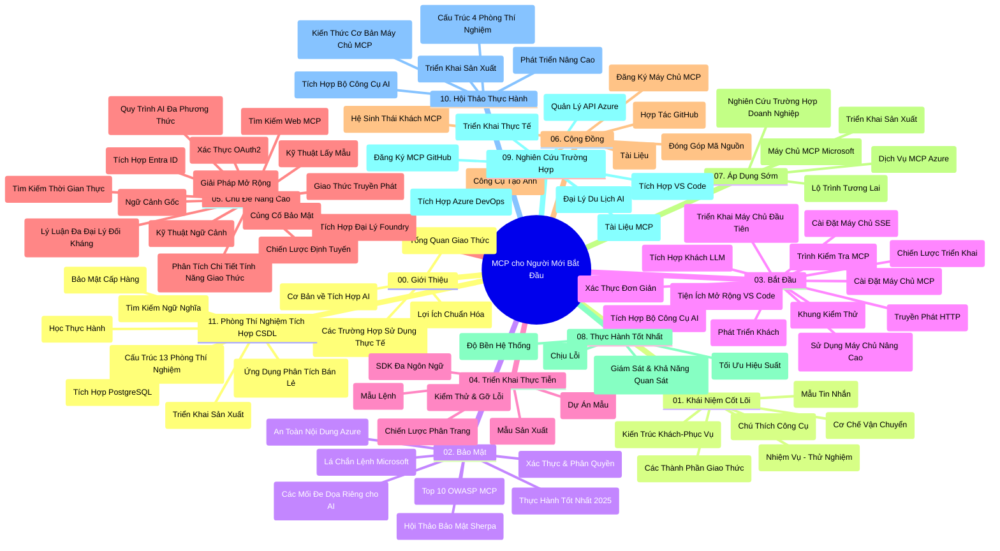

# Model Context Protocol (MCP) cho Người mới bắt đầu - Hướng dẫn học tập

Hướng dẫn học tập này cung cấp tổng quan về cấu trúc và nội dung của kho lưu trữ cho chương trình "Model Context Protocol (MCP) cho Người mới bắt đầu". Sử dụng hướng dẫn này để điều hướng kho lưu trữ một cách hiệu quả và tận dụng tối đa các tài nguyên có sẵn.

## Tổng quan kho lưu trữ

Model Context Protocol (MCP) là một khuôn khổ chuẩn hóa cho các tương tác giữa các mô hình AI và ứng dụng khách. Ban đầu được tạo bởi Anthropic, MCP hiện được duy trì bởi cộng đồng MCP rộng lớn hơn thông qua tổ chức chính thức trên GitHub. Kho lưu trữ này cung cấp một chương trình học toàn diện với các ví dụ mã thực hành bằng C#, Java, JavaScript, Python và TypeScript, dành cho các nhà phát triển AI, kiến trúc sư hệ thống và kỹ sư phần mềm.

## Bản đồ chương trình học trực quan

## Cấu trúc kho lưu trữ

Kho lưu trữ được tổ chức thành mười một phần chính, mỗi phần tập trung vào các khía cạnh khác nhau của MCP:

1. **Giới thiệu (00-Introduction/)**
   - Tổng quan về Model Context Protocol
   - Tại sao tiêu chuẩn hóa quan trọng trong các quy trình AI
   - Các trường hợp sử dụng thực tế và lợi ích

2. **Khái niệm cốt lõi (01-CoreConcepts/)**
   - Kiến trúc client-server
   - Các thành phần chính của giao thức
   - Các mẫu tin nhắn trong MCP

3. **Bảo mật (02-Security/)**
   - Các mối đe dọa bảo mật trong hệ thống dựa trên MCP
   - Thực hành tốt nhất để bảo mật các triển khai
   - Chiến lược xác thực và phân quyền
   - **Tài liệu bảo mật toàn diện**:
     - Thực hành bảo mật MCP tốt nhất 2025
     - Hướng dẫn triển khai Azure Content Safety
     - Kiểm soát và kỹ thuật bảo mật MCP
     - Tài liệu tham khảo nhanh về thực hành tốt MCP
   - **Các chủ đề bảo mật quan trọng**:
     - Tấn công tiêm nhiễm prompt và đầu độc công cụ
     - Chiếm quyền phiên và vấn đề confused deputy
     - Lỗ hổng token passthrough
     - Quyền truy cập vượt mức và kiểm soát truy cập
     - Bảo mật chuỗi cung ứng cho các thành phần AI
     - Tích hợp Microsoft Prompt Shields

4. **Bắt đầu (03-GettingStarted/)**
   - Thiết lập môi trường và cấu hình
   - Tạo các server và client MCP cơ bản
   - Tích hợp với các ứng dụng hiện có
   - Bao gồm các phần:
     - Triển khai server đầu tiên
     - Phát triển client
     - Tích hợp client LLM
     - Tích hợp VS Code
     - Server sự kiện gửi (SSE)
     - Sử dụng server nâng cao
     - Streaming HTTP
     - Tích hợp AI Toolkit
     - Chiến lược kiểm thử
     - Hướng dẫn triển khai

5. **Triển khai thực tế (04-PracticalImplementation/)**
   - Sử dụng SDK trong các ngôn ngữ lập trình khác nhau
   - Kỹ thuật gỡ lỗi, kiểm thử và xác thực
   - Tạo mẫu prompt và quy trình làm việc có thể tái sử dụng
   - Dự án mẫu với ví dụ triển khai

6. **Các chủ đề nâng cao (05-AdvancedTopics/)**
   - Kỹ thuật kỹ sư ngữ cảnh
   - Tích hợp đại lý Foundry
   - Quy trình đa mô-đun AI
   - Demo xác thực OAuth2
   - Khả năng tìm kiếm thời gian thực
   - Streaming thời gian thực
   - Triển khai ngữ cảnh gốc
   - Chiến lược định tuyến
   - Kỹ thuật lấy mẫu
   - Phương pháp mở rộng
   - Cân nhắc bảo mật
   - Tích hợp bảo mật Entra ID
   - Tích hợp tìm kiếm web
   - Lý luận đa tác nhân đối kháng (mô hình tranh luận)

7. **Đóng góp cộng đồng (06-CommunityContributions/)**
   - Cách đóng góp mã nguồn và tài liệu
   - Hợp tác qua GitHub
   - Nâng cao và phản hồi do cộng đồng điều khiển
   - Sử dụng các client MCP khác nhau (Claude Desktop, Cline, VSCode)
   - Làm việc với các server MCP phổ biến bao gồm sinh ảnh

8. **Bài học từ việc áp dụng sớm (07-LessonsfromEarlyAdoption/)**
   - Triển khai thực tiễn và câu chuyện thành công
   - Xây dựng và triển khai các giải pháp dựa trên MCP
   - Xu hướng và lộ trình tương lai
   - **Hướng dẫn các server MCP Microsoft**: Hướng dẫn toàn diện cho 10 server MCP Microsoft sẵn sàng sản xuất bao gồm:
     - Microsoft Learn Docs MCP Server
     - Azure MCP Server (hơn 15 trình kết nối chuyên biệt)
     - GitHub MCP Server
     - Azure DevOps MCP Server
     - MarkItDown MCP Server
     - SQL Server MCP Server
     - Playwright MCP Server
     - Dev Box MCP Server
     - Azure AI Foundry MCP Server
     - Microsoft 365 Agents Toolkit MCP Server

9. **Thực hành tốt nhất (08-BestPractices/)**
   - Điều chỉnh và tối ưu hiệu suất
   - Thiết kế hệ thống MCP chịu lỗi
   - Chiến lược kiểm thử và tính chịu lỗi

10. **Nghiên cứu trường hợp (09-CaseStudy/)**
    - **Bảy nghiên cứu trường hợp toàn diện** minh họa sự đa dạng của MCP trong các tình huống khác nhau:
    - **Azure AI Travel Agents**: Đa tác nhân phối hợp với Azure OpenAI và AI Search
    - **Tích hợp Azure DevOps**: Tự động hóa quy trình làm việc với cập nhật dữ liệu YouTube
    - **Truy xuất tài liệu thời gian thực**: Client console Python với streaming HTTP
    - **Trình tạo kế hoạch học tương tác**: Ứng dụng web Chainlit với AI hội thoại
    - **Tài liệu trong trình soạn thảo**: Tích hợp VS Code với quy trình làm việc GitHub Copilot
    - **Quản lý API Azure**: Tích hợp API doanh nghiệp và tạo server MCP
    - **Đăng ký MCP GitHub**: Phát triển hệ sinh thái và nền tảng tích hợp đại lý
    - Ví dụ triển khai trải dài từ tích hợp doanh nghiệp, năng suất nhà phát triển đến phát triển hệ sinh thái

11. **Hội thảo thực hành (10-StreamliningAIWorkflowsBuildingAnMCPServerWithAIToolkit/)**
    - Hội thảo thực hành toàn diện kết hợp MCP với AI Toolkit
    - Xây dựng ứng dụng thông minh kết nối mô hình AI với công cụ thực tế
    - Các mô-đun thực tế bao gồm kiến thức cơ bản, phát triển server tùy chỉnh và chiến lược triển khai sản xuất
    - **Cấu trúc phòng thí nghiệm**:
      - Phòng thí nghiệm 1: Kiến thức cơ bản về server MCP
      - Phòng thí nghiệm 2: Phát triển server MCP nâng cao
      - Phòng thí nghiệm 3: Tích hợp AI Toolkit
      - Phòng thí nghiệm 4: Triển khai sản xuất và mở rộng
    - Phương pháp học dựa trên phòng thí nghiệm với hướng dẫn từng bước

12. **Phòng thí nghiệm tích hợp cơ sở dữ liệu MCP Server (11-MCPServerHandsOnLabs/)**
    - **Lộ trình học 13 phòng thí nghiệm toàn diện** xây dựng server MCP sẵn sàng sản xuất với tích hợp PostgreSQL
    - **Triển khai phân tích bán lẻ thực tiễn** sử dụng trường hợp sử dụng Zava Retail
    - **Mẫu doanh nghiệp** bao gồm Bảo mật cấp dòng (RLS), tìm kiếm ngữ nghĩa và truy cập dữ liệu đa người thuê
    - **Cấu trúc phòng thí nghiệm hoàn chỉnh**:
      - **Phòng thí nghiệm 00-03: Nền tảng** - Giới thiệu, Kiến trúc, Bảo mật, Thiết lập môi trường
      - **Phòng thí nghiệm 04-06: Xây dựng MCP Server** - Thiết kế cơ sở dữ liệu, Triển khai server MCP, Phát triển công cụ
      - **Phòng thí nghiệm 07-09: Tính năng nâng cao** - Tìm kiếm ngữ nghĩa, Kiểm thử & Gỡ lỗi, Tích hợp VS Code
      - **Phòng thí nghiệm 10-12: Sản xuất & Thực hành tốt nhất** - Triển khai, Giám sát, Tối ưu
    - **Công nghệ bao phủ**: framework FastMCP, PostgreSQL, Azure OpenAI, Azure Container Apps, Application Insights
    - **Kết quả học tập**: Server MCP sẵn sàng sản xuất, mẫu tích hợp cơ sở dữ liệu, phân tích AI, bảo mật doanh nghiệp

## Tài nguyên bổ sung

Kho lưu trữ bao gồm các tài nguyên hỗ trợ:

- **Thư mục hình ảnh**: Chứa sơ đồ và minh họa được sử dụng trong chương trình học
- **Bản dịch**: Hỗ trợ đa ngôn ngữ với bản dịch tài liệu tự động
- **Tài nguyên MCP chính thức**:
  - [Tài liệu MCP](https://modelcontextprotocol.io/)
  - [Đặc tả MCP](https://spec.modelcontextprotocol.io/)
  - [Kho lưu trữ MCP GitHub](https://github.com/modelcontextprotocol)

## Cách sử dụng kho lưu trữ này

1. **Học tuần tự**: Theo dõi các chương theo thứ tự (00 đến 11) để có trải nghiệm học có cấu trúc.
2. **Tập trung theo ngôn ngữ**: Nếu bạn quan tâm đến ngôn ngữ lập trình cụ thể, khám phá thư mục mẫu cho triển khai bằng ngôn ngữ bạn chọn.
3. **Triển khai thực tế**: Bắt đầu với phần "Bắt đầu" để thiết lập môi trường và tạo server và client MCP đầu tiên.
4. **Khám phá nâng cao**: Khi đã quen với cơ bản, hãy đi sâu vào các chủ đề nâng cao để mở rộng kiến thức.
5. **Tham gia cộng đồng**: Tham gia cộng đồng MCP qua các cuộc thảo luận GitHub và kênh Discord để kết nối với chuyên gia và các nhà phát triển khác.

## Các client và công cụ MCP

Chương trình học bao gồm nhiều client và công cụ MCP:

1. **Client chính thức**:
   - Visual Studio Code
   - MCP trong Visual Studio Code
   - Claude Desktop
   - Claude trong VSCode
   - Claude API

2. **Client cộng đồng**:
   - Cline (dựa trên terminal)
   - Cursor (trình soạn thảo mã)
   - ChatMCP
   - Windsurf

3. **Công cụ quản lý MCP**:
   - MCP CLI
   - MCP Manager
   - MCP Linker
   - MCP Router

## Các server MCP phổ biến

Kho lưu trữ giới thiệu nhiều server MCP khác nhau, bao gồm:

1. **Server MCP chính thức của Microsoft**:
   - Microsoft Learn Docs MCP Server
   - Azure MCP Server (hơn 15 trình kết nối chuyên biệt)
   - GitHub MCP Server
   - Azure DevOps MCP Server
   - MarkItDown MCP Server
   - SQL Server MCP Server
   - Playwright MCP Server
   - Dev Box MCP Server
   - Azure AI Foundry MCP Server
   - Microsoft 365 Agents Toolkit MCP Server

2. **Server tham khảo chính thức**:
   - Filesystem
   - Fetch
   - Memory
   - Sequential Thinking

3. **Sinh ảnh**:
   - Azure OpenAI DALL-E 3
   - Stable Diffusion WebUI
   - Replicate

4. **Công cụ phát triển**:
   - Git MCP
   - Terminal Control
   - Code Assistant

5. **Server chuyên biệt**:
   - Salesforce
   - Microsoft Teams
   - Jira & Confluence

## Đóng góp

Kho lưu trữ này hoan nghênh các đóng góp từ cộng đồng. Xem phần Đóng góp cộng đồng để biết hướng dẫn cách đóng góp hiệu quả cho hệ sinh thái MCP.

----

*Hướng dẫn học tập này được cập nhật lần cuối vào ngày 5 tháng 2 năm 2026, phản ánh đặc tả MCP mới nhất 2025-11-25 và cung cấp tổng quan về kho lưu trữ tính đến ngày đó. Nội dung kho lưu trữ có thể được cập nhật sau ngày này.*

---

<!-- CO-OP TRANSLATOR DISCLAIMER START -->
**Tuyên bố miễn trừ trách nhiệm**:  
Tài liệu này đã được dịch bằng dịch vụ dịch thuật AI [Co-op Translator](https://github.com/Azure/co-op-translator). Mặc dù chúng tôi cố gắng đảm bảo độ chính xác, xin lưu ý rằng các bản dịch tự động có thể chứa lỗi hoặc không chính xác. Tài liệu gốc bằng ngôn ngữ nguyên bản nên được coi là nguồn chính xác nhất. Đối với thông tin quan trọng, khuyến nghị sử dụng dịch thuật chuyên nghiệp do con người thực hiện. Chúng tôi không chịu trách nhiệm về bất kỳ sự hiểu lầm hoặc giải thích sai nào phát sinh từ việc sử dụng bản dịch này.
<!-- CO-OP TRANSLATOR DISCLAIMER END -->