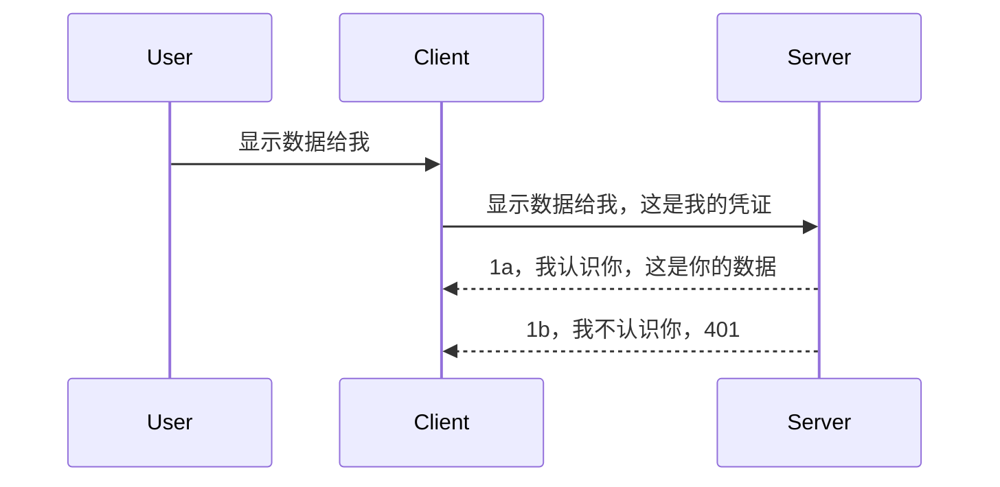

# 简单认证

MCP SDK 支持使用 OAuth 2.1，老实说这是一个相当复杂的过程，涉及认证服务器、资源服务器、提交凭证、获取代码、用代码换取 Bearer 令牌，直到最终获取资源数据。如果你不熟悉 OAuth，它确实是一个很好的实现方案，那么从基础级别的认证开始，逐步构建更高级别的安全措施是个不错的主意。这就是本章存在的原因，为你打好基础，逐步迈向更高级的认证。

## 认证，我们指的是什么？

认证是 authentication 和 authorization 的简称。意思是我们需要做两件事：

- **身份验证（Authentication）**，即确定是否允许某人进入我们的“家”，也就是说确认他们有权“在这里”，即访问我们的资源服务器，这里运行着 MCP 服务器的功能。
- **授权（Authorization）**，即判断用户是否应该访问他们请求的特定资源，例如这些订单或这些产品，或者他们是否只被允许读取内容，但不能删除，作为另一种示例。

## 凭证：我们如何告诉系统我们是谁

大部分网页开发者通常会想到向服务器提供凭证，通常是一个秘密，用来表示他们是否被允许这里“通过身份验证”。这种凭证通常是用户名和密码的 base64 编码版本，或者是唯一标识某个用户的 API 密钥。

这通常通过一个名为 "Authorization" 的请求头发送，如下：

```json
{ "Authorization": "secret123" }
```

这通常被称为基础认证。整体流程如下：


现在我们理解了流程，如何实现呢？大多数 Web 服务器都有一个叫做中间件（middleware）的概念，它是在请求过程中运行的一段代码，能验证凭证，如果凭证有效，就允许请求通过。如果请求没有有效凭证，则返回认证错误。来看如何实现：

**Python**

```python
class AuthMiddleware(BaseHTTPMiddleware):
    async def dispatch(self, request, call_next):

        has_header = request.headers.get("Authorization")
        if not has_header:
            print("-> Missing Authorization header!")
            return Response(status_code=401, content="Unauthorized")

        if not valid_token(has_header):
            print("-> Invalid token!")
            return Response(status_code=403, content="Forbidden")

        print("Valid token, proceeding...")
       
        response = await call_next(request)
        # 添加任何客户头或以某种方式更改响应
        return response


starlette_app.add_middleware(CustomHeaderMiddleware)
```

这里我们：

- 创建了一个叫 `AuthMiddleware` 的中间件，它的 `dispatch` 方法由 Web 服务器调用。
- 把该中间件添加到了 Web 服务器：

    ```python
    starlette_app.add_middleware(AuthMiddleware)
    ```

- 编写了验证逻辑，检查 `Authorization` 请求头是否存在以及发送的秘密是否有效：

    ```python
    has_header = request.headers.get("Authorization")
    if not has_header:
        print("-> Missing Authorization header!")
        return Response(status_code=401, content="Unauthorized")

    if not valid_token(has_header):
        print("-> Invalid token!")
        return Response(status_code=403, content="Forbidden")
    ```

    如果秘密存在且有效，我们通过调用 `call_next` 让请求通过，并返回响应。

    ```python
    response = await call_next(request)
    # 添加任何客户头或以某种方式更改响应
    return response
    ```

工作原理是，如果有 Web 请求向服务器发起，中间件就会被调用，根据它的实现，要么允许请求通过，要么返回提示客户端没有权限继续的错误。

**TypeScript**

这里使用流行的框架 Express 创建一个中间件，在请求到达 MCP 服务器之前拦截它。代码如下：

```typescript
function isValid(secret) {
    return secret === "secret123";
}

app.use((req, res, next) => {
    // 1. 是否存在授权头？
    if(!req.headers["Authorization"]) {
        res.status(401).send('Unauthorized');
    }
    
    let token = req.headers["Authorization"];

    // 2. 检查有效性。
    if(!isValid(token)) {
        res.status(403).send('Forbidden');
    }

   
    console.log('Middleware executed');
    // 3. 将请求传递到请求流程的下一步。
    next();
});
```

在这段代码中我们：

1. 首先检查是否存在 `Authorization` 请求头，如无，发送 401 错误。
2. 验证凭证/令牌是否有效，如无，发送 403 错误。
3. 最后将请求传递到处理管道中，返回请求的资源。

## 练习：实现认证

让我们利用所学来尝试实现认证。计划如下：

服务器

- 创建一个 Web 服务器和 MCP 实例。
- 为服务器实现一个中间件。

客户端

- 通过请求头发送带凭证的 Web 请求。

### -1- 创建 Web 服务器和 MCP 实例

第一步，我们需要创建 Web 服务器实例和 MCP 服务器。

**Python**

这里我们创建一个 MCP 服务器实例，创建一个 starlette Web 应用，用 uvicorn 托管它。

```python
# 创建 MCP 服务器

app = FastMCP(
    name="MCP Resource Server",
    instructions="Resource Server that validates tokens via Authorization Server introspection",
    host=settings["host"],
    port=settings["port"],
    debug=True
)

# 创建 starlette 网络应用
starlette_app = app.streamable_http_app()

# 通过 uvicorn 提供应用服务
async def run(starlette_app):
    import uvicorn
    config = uvicorn.Config(
            starlette_app,
            host=app.settings.host,
            port=app.settings.port,
            log_level=app.settings.log_level.lower(),
        )
    server = uvicorn.Server(config)
    await server.serve()

run(starlette_app)
```

代码中我们：

- 创建了 MCP 服务器。
- 通过 MCP 服务器调用 `app.streamable_http_app()` 构造了 starlette Web 应用。
- 使用 uvicorn `server.serve()` 托管并服务该 Web 应用。

**TypeScript**

这里我们创建一个 MCP 服务器实例。

```typescript
const server = new McpServer({
      name: "example-server",
      version: "1.0.0"
    });

    // ... 设置服务器资源、工具和提示 ...
```

该 MCP 服务器创建代码需要写在 POST /mcp 路由定义中，所以我们把上面代码移至：

```typescript
import express from "express";
import { randomUUID } from "node:crypto";
import { McpServer } from "@modelcontextprotocol/sdk/server/mcp.js";
import { StreamableHTTPServerTransport } from "@modelcontextprotocol/sdk/server/streamableHttp.js";
import { isInitializeRequest } from "@modelcontextprotocol/sdk/types.js"

const app = express();
app.use(express.json());

// 用于按会话ID存储传输的映射
const transports: { [sessionId: string]: StreamableHTTPServerTransport } = {};

// 处理客户端到服务器的POST请求
app.post('/mcp', async (req, res) => {
  // 检查是否存在会话ID
  const sessionId = req.headers['mcp-session-id'] as string | undefined;
  let transport: StreamableHTTPServerTransport;

  if (sessionId && transports[sessionId]) {
    // 重用已存在的传输
    transport = transports[sessionId];
  } else if (!sessionId && isInitializeRequest(req.body)) {
    // 新的初始化请求
    transport = new StreamableHTTPServerTransport({
      sessionIdGenerator: () => randomUUID(),
      onsessioninitialized: (sessionId) => {
        // 按会话ID存储传输
        transports[sessionId] = transport;
      },
      // 默认情况下禁用DNS绑定重绑定保护以保持向后兼容。如果你在本地运行此服务器
      // 请确保设置：
      // enableDnsRebindingProtection: true,
      // allowedHosts: ['127.0.0.1'],
    });

    // 关闭时清理传输
    transport.onclose = () => {
      if (transport.sessionId) {
        delete transports[transport.sessionId];
      }
    };
    const server = new McpServer({
      name: "example-server",
      version: "1.0.0"
    });

    // ... 设置服务器资源、工具和提示 ...

    // 连接到MCP服务器
    await server.connect(transport);
  } else {
    // 无效的请求
    res.status(400).json({
      jsonrpc: '2.0',
      error: {
        code: -32000,
        message: 'Bad Request: No valid session ID provided',
      },
      id: null,
    });
    return;
  }

  // 处理请求
  await transport.handleRequest(req, res, req.body);
});

// GET和DELETE请求的可复用处理器
const handleSessionRequest = async (req: express.Request, res: express.Response) => {
  const sessionId = req.headers['mcp-session-id'] as string | undefined;
  if (!sessionId || !transports[sessionId]) {
    res.status(400).send('Invalid or missing session ID');
    return;
  }
  
  const transport = transports[sessionId];
  await transport.handleRequest(req, res);
};

// 处理通过SSE进行服务器到客户端通知的GET请求
app.get('/mcp', handleSessionRequest);

// 处理用于终止会话的DELETE请求
app.delete('/mcp', handleSessionRequest);

app.listen(3000);
```

你可以看到 MCP 服务器的创建被移到了 `app.post("/mcp")` 内部。

接下来实现中间件用于验证传入凭证。

### -2- 为服务器实现中间件

接下来进入中间件部分。这里我们创建一个中间件，检查请求头 `Authorization` 中的凭证并进行验证。如果有效，请求继续进行（例如列出工具、读取资源或其他 MCP 功能）。

**Python**

创建中间件需要创建一个继承自 `BaseHTTPMiddleware` 的类。关键点有两个：

- 请求对象 `request`，用来读取请求头信息。
- `call_next` 回调，若客户端携带我们接受的凭证，需要调用它。

首先处理缺少 `Authorization` 请求头的情况：

```python
has_header = request.headers.get("Authorization")

# 如果没有头部，返回401失败，否则继续。
if not has_header:
    print("-> Missing Authorization header!")
    return Response(status_code=401, content="Unauthorized")
```

这里返回 401 未授权错误，因为客户端认证失败。

接着，如果提交了凭证，需要验证其有效性：

```python
 if not valid_token(has_header):
    print("-> Invalid token!")
    return Response(status_code=403, content="Forbidden")
```

上面返回了 403 禁止访问错误。下面是完整的中间件代码，包含了上述所有逻辑：

```python
class AuthMiddleware(BaseHTTPMiddleware):
    async def dispatch(self, request, call_next):

        has_header = request.headers.get("Authorization")
        if not has_header:
            print("-> Missing Authorization header!")
            return Response(status_code=401, content="Unauthorized")

        if not valid_token(has_header):
            print("-> Invalid token!")
            return Response(status_code=403, content="Forbidden")

        print("Valid token, proceeding...")
        print(f"-> Received {request.method} {request.url}")
        response = await call_next(request)
        response.headers['Custom'] = 'Example'
        return response

```

那么 `valid_token` 函数怎么办？如下：

```python
# 不要用于生产环境 - 改善它！！
def valid_token(token: str) -> bool:
    # 删除 "Bearer " 前缀
    if token.startswith("Bearer "):
        token = token[7:]
        return token == "secret-token"
    return False
```

显然这里可以进一步完善。

重要提示：你绝不应该把秘密直接写在代码中。理想情况下，你应该从数据源或 IDP（身份服务提供商）获取比较值，或者更好的是让 IDP 进行验证。

**TypeScript**

在 Express 中实现此功能，需要调用 `use` 方法并传入中间件函数。

我们需要：

- 访问请求对象，检查 `Authorization` 属性中的凭证。
- 验证凭证是否有效，有效则允许请求继续执行客户端 MCP 请求（例如列出工具、读取资源等）。

这里检查了 `Authorization` 请求头是否存在，如不存在就阻止请求通过：

```typescript
if(!req.headers["authorization"]) {
    res.status(401).send('Unauthorized');
    return;
}
```

如果一开始没有发送该请求头，会收到 401 错误。

接下来检查凭证有效性，无效则阻止请求，并返回不同的消息：

```typescript
if(!isValid(token)) {
    res.status(403).send('Forbidden');
    return;
} 
```

这是 403 错误。

完整代码如下：

```typescript
app.use((req, res, next) => {
    console.log('Request received:', req.method, req.url, req.headers);
    console.log('Headers:', req.headers["authorization"]);
    if(!req.headers["authorization"]) {
        res.status(401).send('Unauthorized');
        return;
    }
    
    let token = req.headers["authorization"];

    if(!isValid(token)) {
        res.status(403).send('Forbidden');
        return;
    }  

    console.log('Middleware executed');
    next();
});
```

我们已设置 Web 服务器使用中间件检查客户端发送的凭证。那么客户端端是怎么做的呢？

### -3- 通过请求头发送带凭证的 Web 请求

需要确保客户端通过请求头传递凭证。由于我们使用 MCP 客户端，得了解如何实现。

**Python**

客户端需要传递带有凭证的请求头，如下：

```python
# 不要硬编码值，至少要放在环境变量或更安全的存储中
token = "secret-token"

async with streamablehttp_client(
        url = f"http://localhost:{port}/mcp",
        headers = {"Authorization": f"Bearer {token}"}
    ) as (
        read_stream,
        write_stream,
        session_callback,
    ):
        async with ClientSession(
            read_stream,
            write_stream
        ) as session:
            await session.initialize()
      
            # 待办事项，您希望在客户端完成的操作，例如列出工具、调用工具等。
```

可以看到我们这么设置 `headers` 属性：` headers = {"Authorization": f"Bearer {token}"}` 。

**TypeScript**

实现步骤有两步：

1. 创建一个包含凭证的配置对象。
2. 将配置对象传给传输层。

```typescript

// 不要像这里显示的那样硬编码值。至少应将其作为环境变量，并在开发模式下使用类似 dotenv 的工具。
let token = "secret123"

// 定义一个客户端传输选项对象
let options: StreamableHTTPClientTransportOptions = {
  sessionId: sessionId,
  requestInit: {
    headers: {
      "Authorization": "secret123"
    }
  }
};

// 将选项对象传递给传输层
async function main() {
   const transport = new StreamableHTTPClientTransport(
      new URL(serverUrl),
      options
   );
```

如上所示，我们创建了 `options` 对象，并且将请求头放在 `requestInit` 属性里。

重要提示：那该如何改进呢？目前的实现有一定隐患。首先，除非至少启用了 HTTPS，否则以这种方式传递凭证风险较高。即便 HTTPS，凭证仍有被窃取风险，因此需要有一套机制方便撤销令牌，并额外检查请求来源地、请求频率是否异常（类似机器人行为）等，涉及非常多安全细节。

不过，对于非常简单的 API，如果你只是不想让未认证用户调用，这种实现是一个不错的起点。

说了这么多，让我们通过使用标准化格式如 JSON Web Token（JWT，简称“JOT”令牌）来稍微强化安全性。

## JSON Web 令牌，JWT

那么我们试图改进，不再使用很简单的凭证。采用 JWT 有哪些立即见效的提升？

- <strong>安全性提升</strong>。基础认证中，你重复发送用户名和密码的 base64 编码（或 API 密钥），风险较高。使用 JWT 时，你发送用户名和密码换取一个令牌，该令牌有时间限制，过期即失效。JWT 容易实现基于角色、权限范围和授予的细粒度访问控制。
- <strong>无状态和可扩展性</strong>。JWT 是自包含的，携带了所有用户信息，免去了服务器端会话存储需求。令牌也可以本地验证。
- <strong>互通性和联合身份</strong>。JWT 是 Open ID Connect 的核心，常与已知身份提供商如 Entra ID、Google Identity 和 Auth0 配合使用。它也支持单点登录等企业级功能。
- <strong>模块化和灵活性</strong>。JWT 可配合 Azure API 管理、NGINX 等 API 网关使用，也支持用户认证场景、服务器间通信，包括模拟和委托场景。
- <strong>性能和缓存</strong>。JWT 解码后可缓存，减少重复解析开销，这对于高流量应用有助于提升吞吐量和减轻基础架构负载。
- <strong>高级特性</strong>。支持 introspection（服务器端令牌有效性检查）和注销（令牌失效）。

综合这些好处，让我们看看如何将实现提升到下一个层级。

## 将基础认证转成 JWT

概览我们需要做的改动：

- **学会构造 JWT 令牌**，使其可用于客户端到服务器的传输。
- **验证 JWT 令牌**，验过就允许客户端访问资源。
- <strong>安全存储令牌</strong>。令牌应如何存储。
- <strong>保护路由</strong>。需要保护路由和特定 MCP 功能。
- <strong>添加刷新令牌</strong>。确保令牌有效期短，刷新令牌有效期长，便于续期，且要实现刷新接口和轮换策略。

### -1- 构造 JWT 令牌

JWT 令牌由以下几部分组成：

- **头部（header）**，算法和令牌类型。
- **负载（payload）**，声明（claims），如 sub（令牌代表的用户或实体，通常是用户ID），exp（过期时间），角色等。
- **签名（signature）**，使用密钥或私钥签名。

我们需要构造头部、负载并生成编码令牌。

**Python**

```python

import jwt
import jwt
from jwt.exceptions import ExpiredSignatureError, InvalidTokenError
import datetime

# 用于签署 JWT 的密钥
secret_key = 'your-secret-key'

header = {
    "alg": "HS256",
    "typ": "JWT"
}

# 用户信息及其声明和过期时间
payload = {
    "sub": "1234567890",               # 主题（用户 ID）
    "name": "User Userson",                # 自定义声明
    "admin": True,                     # 自定义声明
    "iat": datetime.datetime.utcnow(),# 签发时间
    "exp": datetime.datetime.utcnow() + datetime.timedelta(hours=1)  # 过期时间
}

# 编码它
encoded_jwt = jwt.encode(payload, secret_key, algorithm="HS256", headers=header)
```

上面代码：

- 定义了头部，使用 HS256 算法，类型为 JWT。
- 构造了负载，包含主题（用户 ID）、用户名、角色、签发时间和过期时间，实现了时间限定功能。

**TypeScript**

这里我们需要一些依赖包来辅助构造 JWT 令牌。

依赖项

```sh

npm install jsonwebtoken
npm install --save-dev @types/jsonwebtoken
```

依赖就绪后，创建头部和负载，并生成编码令牌。

```typescript
import jwt from 'jsonwebtoken';

const secretKey = 'your-secret-key'; // 在生产环境中使用环境变量

// 定义载荷
const payload = {
  sub: '1234567890',
  name: 'User usersson',
  admin: true,
  iat: Math.floor(Date.now() / 1000), // 签发时间
  exp: Math.floor(Date.now() / 1000) + 60 * 60 // 1 小时后过期
};

// 定义头部（可选，jsonwebtoken 设置默认值）
const header = {
  alg: 'HS256',
  typ: 'JWT'
};

// 创建令牌
const token = jwt.sign(payload, secretKey, {
  algorithm: 'HS256',
  header: header
});

console.log('JWT:', token);
```

该令牌：

使用 HS256 签名  
有效期 1 小时  
包含 sub、name、admin、iat 和 exp 等声明。

### -2- 验证令牌

服务器端需要验证令牌，确保客户端传来的令牌确实有效。验证内容包括结构及有效性。建议增添额外检查，比如确认用户存在且权限正确。

验证令牌需先解码以读取内容，再检查有效性：

**Python**

```python

# 解码并验证 JWT
try:
    decoded = jwt.decode(token, secret_key, algorithms=["HS256"])
    print("✅ Token is valid.")
    print("Decoded claims:")
    for key, value in decoded.items():
        print(f"  {key}: {value}")
except ExpiredSignatureError:
    print("❌ Token has expired.")
except InvalidTokenError as e:
    print(f"❌ Invalid token: {e}")

```

此处调用 `jwt.decode`，传入令牌、密钥和算法。用 try-catch 捕获异常，验证失败会触发异常。

**TypeScript**

这里调用 `jwt.verify`，获取解码后的令牌信息并进一步分析。调用失败意味着令牌结构错误或已失效。

```typescript

try {
  const decoded = jwt.verify(token, secretKey);
  console.log('Decoded Payload:', decoded);
} catch (err) {
  console.error('Token verification failed:', err);
}
```

注意：如前所述，应做更多检查，保证令牌指向系统中的用户，且用户拥有所声明的权限。

接下来，我们看看基于角色的访问控制（RBAC）。
## 添加基于角色的访问控制

我们的想法是表达不同角色有不同的权限。例如，我们假设管理员可以做所有事情，普通用户可以读写，访客只能读取。因此，这里有一些可能的权限级别：

- Admin.Write 
- User.Read
- Guest.Read

让我们来看一下如何用中间件实现这样的控制。中间件可以针对每个路由添加，也可以为所有路由添加。

**Python**

```python
from starlette.middleware.base import BaseHTTPMiddleware
from starlette.responses import JSONResponse
import jwt

# 不要在代码中包含秘密信息，这只是为了演示目的。请从安全的地方读取。
SECRET_KEY = "your-secret-key" # 将此放入环境变量中
REQUIRED_PERMISSION = "User.Read"

class JWTPermissionMiddleware(BaseHTTPMiddleware):
    async def dispatch(self, request, call_next):
        auth_header = request.headers.get("Authorization")
        if not auth_header or not auth_header.startswith("Bearer "):
            return JSONResponse({"error": "Missing or invalid Authorization header"}, status_code=401)

        token = auth_header.split(" ")[1]
        try:
            decoded = jwt.decode(token, SECRET_KEY, algorithms=["HS256"])
        except jwt.ExpiredSignatureError:
            return JSONResponse({"error": "Token expired"}, status_code=401)
        except jwt.InvalidTokenError:
            return JSONResponse({"error": "Invalid token"}, status_code=401)

        permissions = decoded.get("permissions", [])
        if REQUIRED_PERMISSION not in permissions:
            return JSONResponse({"error": "Permission denied"}, status_code=403)

        request.state.user = decoded
        return await call_next(request)


```

有几种不同的方法像下面这样添加中间件：

```python

# 方案1：在构建starlette应用时添加中间件
middleware = [
    Middleware(JWTPermissionMiddleware)
]

app = Starlette(routes=routes, middleware=middleware)

# 方案2：在starlette应用已构建后添加中间件
starlette_app.add_middleware(JWTPermissionMiddleware)

# 方案3：针对每个路由添加中间件
routes = [
    Route(
        "/mcp",
        endpoint=..., # 处理程序
        middleware=[Middleware(JWTPermissionMiddleware)]
    )
]
```

**TypeScript**

我们可以使用 `app.use` 和一个会对所有请求运行的中间件。

```typescript
app.use((req, res, next) => {
    console.log('Request received:', req.method, req.url, req.headers);
    console.log('Headers:', req.headers["authorization"]);

    // 1. 检查授权头是否已发送

    if(!req.headers["authorization"]) {
        res.status(401).send('Unauthorized');
        return;
    }
    
    let token = req.headers["authorization"];

    // 2. 检查令牌是否有效
    if(!isValid(token)) {
        res.status(403).send('Forbidden');
        return;
    }  

    // 3. 检查令牌用户是否存在于我们的系统中
    if(!isExistingUser(token)) {
        res.status(403).send('Forbidden');
        console.log("User does not exist");
        return;
    }
    console.log("User exists");

    // 4. 验证令牌是否具有正确的权限
    if(!hasScopes(token, ["User.Read"])){
        res.status(403).send('Forbidden - insufficient scopes');
    }

    console.log("User has required scopes");

    console.log('Middleware executed');
    next();
});

```

我们的中间件可以做且应该做的事情有不少，主要包括：

1. 检查是否存在授权头
2. 检查令牌是否有效，我们调用了 `isValid`，这是我们编写的方法，用于检查 JWT 令牌的完整性和有效性。
3. 验证用户在我们的系统中是否存在，我们应该检查这一点。

   ```typescript
    // 数据库中的用户
   const users = [
     "user1",
     "User usersson",
   ]

   function isExistingUser(token) {
     let decodedToken = verifyToken(token);

     // 待办，检查用户是否存在于数据库中
     return users.includes(decodedToken?.name || "");
   }
   ```

   上面，我们创建了一个非常简单的 `users` 列表，当然它应该在数据库中。

4. 另外，我们还应该检查令牌是否具有正确的权限。

   ```typescript
   if(!hasScopes(token, ["User.Read"])){
        res.status(403).send('Forbidden - insufficient scopes');
   }
   ```

   在上面中间件的代码中，我们检查令牌是否包含 User.Read 权限，如果没有，则发送 403 错误。下面是 `hasScopes` 辅助方法。

   ```typescript
   function hasScopes(scope: string, requiredScopes: string[]) {
     let decodedToken = verifyToken(scope);
    return requiredScopes.every(scope => decodedToken?.scopes.includes(scope));
  }
   ```

Have a think which additional checks you should be doing, but these are the absolute minimum of checks you should be doing.

Using Express as a web framework is a common choice. There are helpers library when you use JWT so you can write less code.

- `express-jwt`, helper library that provides a middleware that helps decode your token.
- `express-jwt-permissions`, this provides a middleware `guard` that helps check if a certain permission is on the token.

Here's what these libraries can look like when used:

```typescript
const express = require('express');
const jwt = require('express-jwt');
const guard = require('express-jwt-permissions')();

const app = express();
const secretKey = 'your-secret-key'; // put this in env variable

// Decode JWT and attach to req.user
app.use(jwt({ secret: secretKey, algorithms: ['HS256'] }));

// Check for User.Read permission
app.use(guard.check('User.Read'));

// multiple permissions
// app.use(guard.check(['User.Read', 'Admin.Access']));

app.get('/protected', (req, res) => {
  res.json({ message: `Welcome ${req.user.name}` });
});

// Error handler
app.use((err, req, res, next) => {
  if (err.code === 'permission_denied') {
    return res.status(403).send('Forbidden');
  }
  next(err);
});

```

现在你已经看到中间件如何用于身份验证和授权，那么 MCP 呢？它会改变我们做身份验证的方式吗？让我们在下一节中了解。

### -3- 给 MCP 添加 RBAC

到目前为止你已经看到如何通过中间件添加 RBAC，然而对于 MCP，没有简单的方法添加针对每个 MCP 功能的 RBAC，那我们怎么办？其实很简单，我们只需添加类似以下代码，检查客户端是否有调用特定工具的权限：

你有几种实现每个功能 RBAC 的不同选择，以下是一些：

- 针对你需要检查权限等级的每个工具、资源、提示添加检查。

   **python**

   ```python
   @tool()
   def delete_product(id: int):
      try:
          check_permissions(role="Admin.Write", request)
      catch:
        pass # 客户端授权失败，引发授权错误
   ```

   **typescript**

   ```typescript
   server.registerTool(
    "delete-product",
    {
      title: Delete a product",
      description: "Deletes a product",
      inputSchema: { id: z.number() }
    },
    async ({ id }) => {
      
      try {
        checkPermissions("Admin.Write", request);
        // 待办，发送ID到productService和远程入口
      } catch(Exception e) {
        console.log("Authorization error, you're not allowed");  
      }

      return {
        content: [{ type: "text", text: `Deletected product with id ${id}` }]
      };
    }
   );
   ```


- 使用高级服务器方法和请求处理程序，这样你就能最小化需要做权限检查的位置数量。

   **Python**

   ```python
   
   tool_permission = {
      "create_product": ["User.Write", "Admin.Write"],
      "delete_product": ["Admin.Write"]
   }

   def has_permission(user_permissions, required_permissions) -> bool:
      # user_permissions: 用户拥有的权限列表
      # required_permissions: 工具所需的权限列表
      return any(perm in user_permissions for perm in required_permissions)

   @server.call_tool()
   async def handle_call_tool(
     name: str, arguments: dict[str, str] | None
   ) -> list[types.TextContent]:
    # 假设 request.user.permissions 是用户的权限列表
     user_permissions = request.user.permissions
     required_permissions = tool_permission.get(name, [])
     if not has_permission(user_permissions, required_permissions):
        # 抛出错误 "您没有调用工具 {name} 的权限"
        raise Exception(f"You don't have permission to call tool {name}")
     # 继续并调用工具
     # ...
   ```   
   

   **TypeScript**

   ```typescript
   function hasPermission(userPermissions: string[], requiredPermissions: string[]): boolean {
       if (!Array.isArray(userPermissions) || !Array.isArray(requiredPermissions)) return false;
       // 如果用户至少拥有一个所需的权限，则返回true
       
       return requiredPermissions.some(perm => userPermissions.includes(perm));
   }
  
   server.setRequestHandler(CallToolRequestSchema, async (request) => {
      const { params: { name } } = request;
  
      let permissions = request.user.permissions;
  
      if (!hasPermission(permissions, toolPermissions[name])) {
         return new Error(`You don't have permission to call ${name}`);
      }
  
      // 继续..
   });
   ```

   注意，你需要确保你的中间件将解码后的令牌赋值给请求的 user 属性，这样上面的代码才会很简单。

### 总结

现在我们讨论了如何一般性地支持 RBAC，以及如何为 MCP 实际添加 RBAC，是时候尝试自己实现安全功能以确保掌握了介绍的概念。

## 练习 1：使用基本身份验证构建 mcp 服务器和 mcp 客户端

这里你将运用你所学的通过请求头发送凭证的知识。

## 方案 1

[方案 1](./code/basic/README.md)

## 练习 2：将练习 1 的方案升级为使用 JWT

基于第一个方案，但这次让我们改进它。

不使用基本身份验证，改用 JWT。

## 方案 2

[方案 2](./solution/jwt-solution/README.md)

## 挑战

为我们在“给 MCP 添加 RBAC”章节中描述的每个工具添加 RBAC。

## 总结

希望你在本章学到了很多内容，从没有安全，到基础安全，再到 JWT 及其如何集成到 MCP 中。

我们已经建立了用自定义 JWT 的坚实基础，但随着规模扩大，我们正在向基于标准的身份模型迈进。采用像 Entra 或 Keycloak 这样的身份提供商(IdP)，让我们能将令牌的颁发、验证和生命周期管理托管给可信平台——这样我们就可以专注于应用逻辑和用户体验。

为此，我们有一章更[高级的关于 Entra 的内容](../../05-AdvancedTopics/mcp-security-entra/README.md)

## 接下来

- 下一篇：[设置 MCP 主机](../12-mcp-hosts/README.md)

---

<!-- CO-OP TRANSLATOR DISCLAIMER START -->
**免责声明**：  
本文件已通过 AI 翻译服务 [Co-op Translator](https://github.com/Azure/co-op-translator) 翻译完成。虽然我们力求准确，但请注意自动翻译可能存在错误或不准确之处。原始语言版本的文件应被视为权威来源。对于关键信息，建议使用专业人工翻译。我们不对因使用本翻译而产生的任何误解或误释承担责任。
<!-- CO-OP TRANSLATOR DISCLAIMER END -->