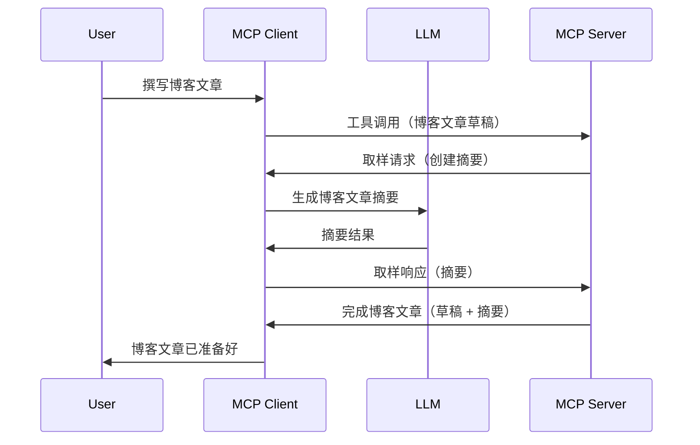

# 采样 - 将功能委托给客户端

有时，您需要 MCP 客户端和 MCP 服务器协作以实现共同的目标。您可能遇到服务器需要客户端上运行的 LLM 帮助的情况。对于这种情况，应该使用采样。

让我们探索一些用例以及如何构建涉及采样的解决方案。

## 概述

本课将重点解释何时何地使用采样以及如何配置它。

## 学习目标

在本章中，我们将：

- 解释什么是采样及其使用时机。
- 展示如何在 MCP 中配置采样。
- 提供采样实际应用的示例。

## 什么是采样及其使用原因？

采样是一项高级功能，其工作原理如下：


### 采样请求

好的，现在我们对一个可信场景有了宏观描述，让我们谈谈服务器发送回客户端的采样请求。以下是该请求采用 JSON-RPC 格式的示例：

```json
{
  "jsonrpc": "2.0",
  "id": 1,
  "method": "sampling/createMessage",
  "params": {
    "messages": [
      {
        "role": "user",
        "content": {
          "type": "text",
          "text": "Create a blog post summary of the following blog post: <BLOG POST>"
        }
      }
    ],
    "modelPreferences": {
      "hints": [
        {
          "name": "claude-3-sonnet"
        }
      ],
      "intelligencePriority": 0.8,
      "speedPriority": 0.5
    },
    "systemPrompt": "You are a helpful assistant.",
    "maxTokens": 100
  }
}
```

这里有几点值得注意：

- Prompt，在 content -> text 下，是我们的提示，指示 LLM 对博客文章内容进行摘要。

- **modelPreferences**。这一部分就是偏好，建议使用的 LLM 配置。用户可以选择是否采用这些建议或更改它们。本例中对使用的模型、速度和智能优先级提供了建议。
- **systemPrompt**，这是您通常的系统提示，赋予 LLM 个性并包含指导指令。
- **maxTokens**，这是另一个属性，用来说明建议为该任务使用的最大令牌数。

### 采样响应

该响应是 MCP 客户端最终发送回 MCP 服务器的内容，它是客户端调用 LLM、等待响应后构建的消息。这里是它的 JSON-RPC 格式示例：

```json
{
  "jsonrpc": "2.0",
  "id": 1,
  "result": {
    "role": "assistant",
    "content": {
      "type": "text",
      "text": "Here's your abstract <ABSTRACT>"
    },
    "model": "gpt-5",
    "stopReason": "endTurn"
  }
}
```

注意响应是博客文章的摘要，正如我们所要求的。同时注意，使用的 `model` 并不是请求中指定的，而是“gpt-5”而非“claude-3-sonnet”。这表明用户可以改变他们想使用的模型，而您的采样请求仅是建议。

好了，既然我们理解了主要流程以及适合应用于“博客文章创建 + 摘要”的任务，接下来看看如何实现它。

### 消息类型

采样消息不仅限于文本，还可以发送图像和音频。以下是 JSON-RPC 格式的不同表现：

<strong>文本</strong>

```json
{
  "type": "text",
  "text": "The message content"
}
```

<strong>图像内容</strong>

```json
{
  "type": "image",
  "data": "base64-encoded-image-data",
  "mimeType": "image/jpeg"
}
```

<strong>音频内容</strong>

```json
{
  "type": "audio",
  "data": "base64-encoded-audio-data",
  "mimeType": "audio/wav"
}
```

> NOTE: 有关采样的详细信息，请查看[官方文档](https://modelcontextprotocol.io/specification/2025-06-18/client/sampling)

## 如何在客户端配置采样

> 注意：如果您只构建服务器端，则不需要做太多配置。

在客户端，您需要像下面这样指定相应功能：

```json
{
  "capabilities": {
    "sampling": {}
  }
}
```

当您选择的客户端与服务器初始化时，将会加载此配置。

## 采样实战示例 - 创建博客文章

让我们一起编写一个采样服务器代码，我们需要完成以下步骤：

1. 在服务器上创建一个工具。
2. 该工具应创建一个采样请求
3. 工具应等待客户端对采样请求的回应。
4. 然后生成工具结果。

让我们逐步查看代码：

### -1- 创建工具

**python**

```python
@mcp.tool()
async def create_blog(title: str, content: str, ctx: Context[ServerSession, None]) -> str:
    """Create a blog post and generate a summary"""

```

### -2- 创建采样请求

扩展您的工具，添加以下代码：

**python**

```python
post = BlogPost(
        id=len(posts) + 1,
        title=title,
        content=content,
        abstract=""
    )

prompt = f"Create an abstract of the following blog post: title: {title} and draft: {content} "

result = await ctx.session.create_message(
        messages=[
            SamplingMessage(
                role="user",
                content=TextContent(type="text", text=prompt),
            )
        ],
        max_tokens=100,
)

```

### -3- 等待响应并返回结果

**python**

```python
post.abstract = result.content.text

posts.append(post)

# 返回完整的产品
return json.dumps({
    "id": post.title,
    "abstract": post.abstract
})
```

### -4- 完整代码

**python**

```python
from starlette.applications import Starlette
from starlette.routing import Mount, Host

from mcp.server.fastmcp import Context, FastMCP

from mcp.server.session import ServerSession
from mcp.types import SamplingMessage, TextContent

import json


from uuid import uuid4
from typing import List
from pydantic import BaseModel


mcp = FastMCP("Blog post generator")

# app = FastAPI()

posts = []

class BlogPost(BaseModel):
    id: int
    title: str
    content: str
    abstract: str

posts: List[BlogPost] = []

@mcp.tool()
async def create_blog(title: str, content: str, ctx: Context[ServerSession, None]) -> str:
    """Create a blog post and generate a summary"""

    post = BlogPost(
        id=len(posts) + 1,
        title=title,
        content=content,
        abstract=""
    )

    prompt = f"Create an abstract of the following blog post: title: {title} and draft: {content} "

    result = await ctx.session.create_message(
        messages=[
            SamplingMessage(
                role="user",
                content=TextContent(type="text", text=prompt),
            )
        ],
        max_tokens=100,
    )

    post.abstract = result.content.text

    posts.append(post)

    # 返回完整的博客文章
    return json.dumps({
        "id": post.title,
        "abstract": post.abstract
    })

if __name__ == "__main__":
    print("Starting server...")
    # mcp.run()
    mcp.run(transport="streamable-http")

# 使用以下命令运行应用程序：python server.py
```

### -5- 在 Visual Studio Code 中测试

要在 Visual Studio Code 中测试，请执行以下操作：

1. 在终端启动服务器
2. 添加到 *mcp.json*（确保服务器已启动），例如：

   ```json
   "servers": {
      "blog-server": {
        "type": "http",
        "url": "http://localhost:8000/mcp"
      }
   }
   ```

3. 输入提示：

   ```text
   create a blog post named "Where Python comes from", the content is "Python is actually named after Monty Python Flying Circus"
   ```

4. 允许采样进行。首次测试时，您将看到额外的对话框，需要您接受，然后会显示正常的对话框，询问是否运行工具。

5. 检查结果。您会看到结果在 GitHub Copilot Chat 中漂亮地呈现，同时也可以查看原始 JSON 响应。

<strong>额外提示</strong>。Visual Studio Code 工具对采样有很好的支持。您可以通过以下方式配置您的已安装服务器的采样访问：

1. 进入扩展部分。
2. 在“MCP SERVERS - INSTALLED”部分为已安装的服务器点击齿轮图标。
3. 选择“配置模型访问”，在这里您可以选择 GitHub Copilot 允许在执行采样时使用哪些模型。您还可以通过选择“显示采样请求”查看最近所有的采样请求。

## 练习作业

在本作业中，您将构建一个稍有不同的采样集成，即支持生成产品描述的采样。场景如下：

<strong>场景</strong>：电子商务的后勤人员需要帮助，生成产品描述花费太多时间。因此，您需要构建一个解决方案，能够调用一个名为 "create_product" 的工具，使用 "title" 和 "keywords" 作为参数，生成包含由客户端 LLM 填充的 "description" 字段的完整产品信息。

TIP：利用之前学到的内容，使用采样请求构建此服务器及其工具。

## 解决方案

[解决方案](./solution/README.md)

## 关键要点

采样是一项强大功能，当服务器需要 LLM 帮助时，允许将任务委托给客户端。

## 接下来

- [第4章 - 实践实现](../../04-PracticalImplementation/README.md)

---

<!-- CO-OP TRANSLATOR DISCLAIMER START -->
**免责声明**：  
本文件是使用AI翻译服务[Co-op Translator](https://github.com/Azure/co-op-translator)翻译的。虽然我们力求准确，但请注意自动翻译可能包含错误或不准确之处。原始语言的文档应被视为权威来源。对于重要信息，建议使用专业人工翻译。我们不对因使用此翻译而产生的任何误解或误释负责。
<!-- CO-OP TRANSLATOR DISCLAIMER END -->