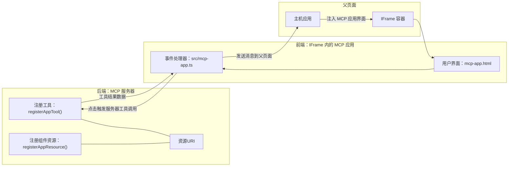

# MCP 应用

MCP 应用是 MCP 中的一种新范式。其理念不仅是在工具调用中返回数据，还提供关于如何与这些信息交互的信息。这意味着工具结果现在可以包含 UI 信息。那为什么我们需要这样做呢？试想你现在的操作方式。你很可能是通过在 MCP 服务器前放置某种前端来消费结果，这需要你编写和维护代码。有时这正是你所需要的，但有时如果你能直接引入一个包含数据到用户界面一应俱全的自包含信息片段，那会非常好。

## 概览

本课程提供关于 MCP 应用的实用指导，教你如何入门并将其整合到现有的 Web 应用中。MCP 应用是 MCP 标准中的一个非常新的补充。

## 学习目标

在本课程结束时，你将能够：

- 解释什么是 MCP 应用。
- 了解何时使用 MCP 应用。
- 创建并集成你自己的 MCP 应用。

## MCP 应用 —— 它是如何工作的

MCP 应用的核心思想是提供一个本质上是可渲染的组件作为响应。该组件可以具有视觉元素和交互性，例如按钮点击、用户输入等。让我们从服务器端和 MCP 服务器开始。创建一个 MCP 应用组件，你需要创建一个工具和应用资源。这两个部分通过 resourceUri 连接。

下面是一个示例。让我们尝试可视化所涉及的内容以及各部分的职责：

```text
server.ts -- responsible for registering tools and the component as a UI component
src/
  mcp-app.ts -- wiring up event handlers
mcp-app.html -- the user interface
```

这个视图描述了创建组件及其逻辑的架构。


接下来让我们分别描述后台和前端的责任。

### 后台

这里我们需要完成两件事：

- 注册我们想要交互的工具。
- 定义组件。

<strong>注册工具</strong>

```typescript
registerAppTool(
    server,
    "get-time",
    {
      title: "Get Time",
      description: "Returns the current server time.",
      inputSchema: {},
      _meta: { ui: { resourceUri } }, // 将此工具链接到其用户界面资源
    },
    async () => {
      const time = new Date().toISOString();
      return { content: [{ type: "text", text: time }] };
    },
  );

```

上面的代码描述了行为，暴露了一个名为 `get-time` 的工具。它不接受输入，但会生成当前时间。我们确实有能力为需要接收用户输入的工具定义 `inputSchema`。

<strong>注册组件</strong>

在同一文件中，我们还需要注册组件：

```typescript
const resourceUri = "ui://get-time/mcp-app.html";

// 注册资源，返回用于用户界面的打包HTML/JavaScript。
registerAppResource(
  server,
  resourceUri,
  resourceUri,
  { mimeType: RESOURCE_MIME_TYPE },
  async () => {
    const html = await fs.readFile(path.join(DIST_DIR, "mcp-app.html"), "utf-8");

    return {
    contents: [
        { uri: resourceUri, mimeType: RESOURCE_MIME_TYPE, text: html },
    ],
    };
  },
);
```

注意我们提到了 `resourceUri` 用于连接组件与其工具。还有一点值得关注的是回调函数，我们在其中加载 UI 文件并返回组件。

### 组件前端

与后台相似，这里也有两部分：

- 一个用纯 HTML 编写的前端。
- 处理事件和操作的代码，例如调用工具或向父窗口发送消息。

<strong>用户界面</strong>

让我们看看用户界面。

```html
<!-- mcp-app.html -->
<!DOCTYPE html>
<html lang="en">
  <head>
    <meta charset="UTF-8" />
    <title>Get Time App</title>
  </head>
  <body>
    <p>
      <strong>Server Time:</strong> <code id="server-time">Loading...</code>
    </p>
    <button id="get-time-btn">Get Server Time</button>
    <script type="module" src="/src/mcp-app.ts"></script>
  </body>
</html>
```

<strong>事件绑定</strong>

最后一部分是事件绑定。这意味着我们确定 UI 中哪部分需要事件处理程序，以及事件触发时该做什么：

```typescript
// mcp-app.ts

import { App } from "@modelcontextprotocol/ext-apps";

// 获取元素引用
const serverTimeEl = document.getElementById("server-time")!;
const getTimeBtn = document.getElementById("get-time-btn")!;

// 创建应用实例
const app = new App({ name: "Get Time App", version: "1.0.0" });

// 处理来自服务器的工具结果。在 `app.connect()` 之前设置，以避免
// 缺少初始工具结果。
app.ontoolresult = (result) => {
  const time = result.content?.find((c) => c.type === "text")?.text;
  serverTimeEl.textContent = time ?? "[ERROR]";
};

// 连接按钮点击事件
getTimeBtn.addEventListener("click", async () => {
  // `app.callServerTool()` 让 UI 请求服务器的新数据
  const result = await app.callServerTool({ name: "get-time", arguments: {} });
  const time = result.content?.find((c) => c.type === "text")?.text;
  serverTimeEl.textContent = time ?? "[ERROR]";
});

// 连接到主机
app.connect();
```

从上述代码可以看到，这就是将 DOM 元素钩挂到事件上的正常代码。值得一提的是对 `callServerTool` 的调用，该调用最终会触发后台的工具。

## 处理用户输入

到目前为止，我们看到的组件只有一个按钮，点击后调用一个工具。让我们看看是否可以添加更多 UI 元素，比如输入字段，并将参数发送给工具。我们来实现一个 FAQ 功能。其工作流程如下：

- 应该有一个按钮和输入元素，用户可以输入关键词，例如“Shipping”，这将调用后台的一个工具在 FAQ 数据中进行搜索。
- 一个支持上述 FAQ 搜索的工具。

先为后台添加所需支持：

```typescript
const faq: { [key: string]: string } = {
    "shipping": "Our standard shipping time is 3-5 business days.",
    "return policy": "You can return any item within 30 days of purchase.",
    "warranty": "All products come with a 1-year warranty covering manufacturing defects.",
  }

registerAppTool(
    server,
    "get-faq",
    {
      title: "Search FAQ",
      description: "Searches the FAQ for relevant answers.",
      inputSchema: zod.object({
        query: zod.string().default("shipping"),
      }),
      _meta: { ui: { resourceUri: faqResourceUri } }, // 将此工具链接到其UI资源
    },
    async ({ query }) => {
      const answer: string = faq[query.toLowerCase()] || "Sorry, I don't have an answer for that.";
      return { content: [{ type: "text", text: answer }] };
    },
  );
```

这里展示了如何填充 `inputSchema` 并为其赋予 `zod` 模式，像这样：

```typescript
inputSchema: zod.object({
  query: zod.string().default("shipping"),
})
```

在上面的模式中，我们声明有一个输入参数 `query`，它是可选的，默认值为 "shipping"。

好，接下来打开 *mcp-app.html* 看看需要创建什么 UI：

```html
<div class="faq">
    <h1>FAQ response</h1>
    <p>FAQ Response: <code id="faq-response">Loading...</code></p>
    <input type="text" id="faq-query" placeholder="Enter FAQ query" />
    <button id="get-faq-btn">Get FAQ Response</button>
  </div>
```

很好，现在我们有了输入元素和按钮。接下来查看 *mcp-app.ts*，绑定这些事件：

```typescript
const getFaqBtn = document.getElementById("get-faq-btn")!;
const faqQueryInput = document.getElementById("faq-query") as HTMLInputElement;

getFaqBtn.addEventListener("click", async () => {
  const query = faqQueryInput.value;
  const result = await app.callServerTool({ name: "get-faq", arguments: { query } });
  const faq = result.content?.find((c) => c.type === "text")?.text;
  faqResponseEl.textContent = faq ?? "[ERROR]";
});
```

在上面代码中我们：

- 创建对交互式 UI 元素的引用。
- 处理按钮点击事件，解析输入元素的值，同时调用 `app.callServerTool()`，传递 `name` 和 `arguments`，后者将 `query` 作为参数值。

调用 `callServerTool` 实际上是向父窗口发送消息，父窗口最终调用 MCP 服务器。

### 试用

试用该功能，界面应如下所示：


以下是输入“warranty”时的界面：


运行此代码，请前往[代码部分](./code/README.md)

## 在 Visual Studio Code 中测试

Visual Studio Code 对 MCP 应用提供了很好的支持，可能是测试 MCP 应用最简单方式之一。使用 Visual Studio Code，请在 *mcp.json* 中添加一个服务器条目，如下：

```json
"my-mcp-server-7178eca7": {
    "url": "http://localhost:3001/mcp",
    "type": "http"
  }
```

然后启动服务器，只要安装了 GitHub Copilot，就可以通过聊天窗口与 MCP 应用通信。

你可以通过提示触发，比如 "#get-faq"：


运行后，界面与网页端运行时相同，效果如下：


## 练习

创建一个石头剪刀布游戏。它应包括：

界面：

- 一个带选项的下拉列表
- 一个提交选择的按钮
- 一个显示谁选了什么以及谁赢了的标签

服务器端：

- 应该有一个石头剪刀布工具，接受 "choice" 作为输入，同时生成电脑的选择并判断赢家

## 解决方案

[解决方案](./assignment/README.md)

## 总结

我们了解了 MCP 应用这一新范式。这是一种允许 MCP 服务器不仅定义数据，还能定义数据呈现方式的新方法。

此外，我们了解到 MCP 应用托管于 IFrame 中，且需要通过向父网页应用发送消息来与 MCP 服务器通信。市面上有多个适用于纯 JavaScript 和 React 的库，使此类通信更简单。

## 关键要点

你学到了：

- MCP 应用是一种新标准，当你想同时发布数据和 UI 功能时非常有用。
- 出于安全考虑，这类应用运行在 IFrame 中。

## 接下来

- [第 4 章](../../04-PracticalImplementation/README.md)

---

<!-- CO-OP TRANSLATOR DISCLAIMER START -->
**免责声明**：  
本文件采用 AI 翻译服务 [Co-op Translator](https://github.com/Azure/co-op-translator) 进行翻译。虽然我们力求准确，但请注意自动翻译可能包含错误或不准确之处。原始语言版本的文件应被视为权威来源。对于重要信息，建议使用专业人工翻译。对于因使用本翻译而产生的任何误解或误读，我们不承担任何责任。
<!-- CO-OP TRANSLATOR DISCLAIMER END -->