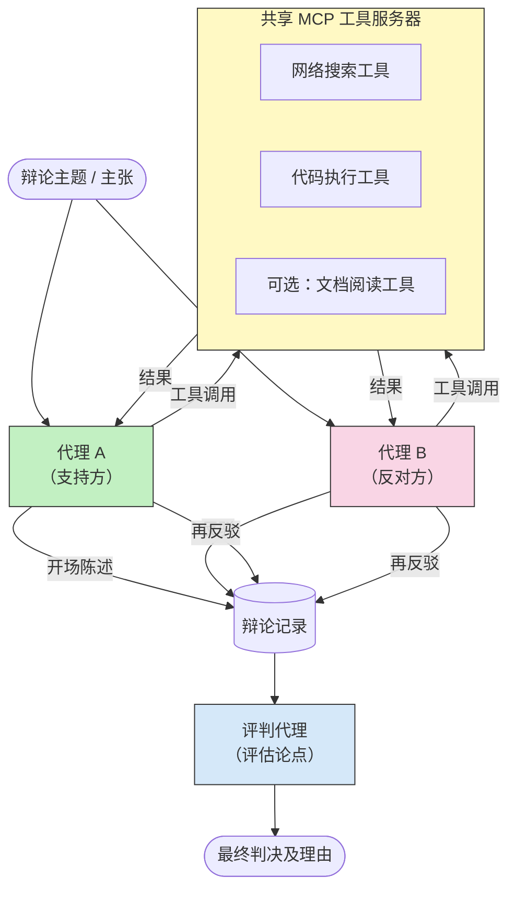

# 对抗性多智能体推理与 MCP

多智能体辩论模式使用两个或多个持相反立场的智能体，产生比单一智能体更可靠且更准确的输出。

## 介绍

在本课中，我们将探讨<strong>对抗性多智能体模式</strong>——一种技术，其中两个 AI 智能体被分配在某个话题上的相反立场，必须推理、调用 MCP 工具，并挑战彼此的结论。第三个智能体（或人类审查者）随后评估论点并确定最佳结果。

该模式特别适用于：

- <strong>幻觉检测</strong>：第二个智能体挑战第一个智能体提出的无根据的断言。
- <strong>威胁建模和安全审查</strong>：一个智能体论证系统安全；另一个寻找漏洞。
- **API 或需求设计**：一个智能体辩护拟议设计；另一个提出异议。
- <strong>事实验证</strong>：两个智能体独立查询相同的 MCP 工具，交叉核对彼此的结论。

通过共享相同的 MCP 工具集，两个智能体在相同的信息环境中工作——这意味着任何分歧都反映真实的推理差异，而非信息不对称。

## 学习目标

本课结束后，您将能够：

- 解释为何对抗性多智能体模式能捕捉单智能体流水线遗漏的错误。
- 设计一个两个智能体共享公共 MCP 工具集的辩论架构。
- 实现“支持”和“反对”系统提示，引导每个智能体论证其被分配的立场。
- 添加一个评审智能体（或人类审核步骤），将辩论综合为最终裁决。
- 理解 MCP 工具共享如何在并发智能体之间工作。

## 架构概述

对抗模式遵循如下高层流程：


### 关键设计决策

| 决策 | 理由 |
|----------|-----------|
| 两个智能体共享一个 MCP 服务器 | 消除信息不对称——分歧反映推理差异而非数据访问差异 |
| 智能体拥有相反的系统提示 | 迫使每个智能体对另一方立场进行压力测试 |
| 一个评审智能体综合辩论 | 产生单一可执行的输出，避免人为瓶颈 |
| 多轮辩论 | 允许每个智能体对另一方基于工具的证据进行回应 |

## 实现

### 第 1 步 — 共享 MCP 工具服务器

首先开放两个智能体都会调用的工具。在本例中，我们使用基于 FastMCP 构建的最小 Python MCP 服务器。

<details>
<summary>Python – 共享工具服务器</summary>

```python
# shared_tools_server.py
from mcp.server.fastmcp import FastMCP
import httpx

mcp = FastMCP("debate-tools")

@mcp.tool()
async def web_search(query: str) -> str:
    """Search the web and return a short summary of the top results."""
    # 替换为您首选的搜索API（例如，SerpAPI，Brave Search）。
    async with httpx.AsyncClient() as client:
        response = await client.get(
            "https://api.search.example.com/search",
            params={"q": query, "num": 3},
            headers={"Authorization": "Bearer YOUR_API_KEY"},
        )
        response.raise_for_status()
        results = response.json().get("results", [])
    snippets = "\n".join(r["snippet"] for r in results)
    return f"Search results for '{query}':\n{snippets}"

@mcp.tool()
async def run_python(code: str) -> str:
    """Execute a Python snippet and return stdout + stderr.

    WARNING: This is an unsafe placeholder that runs code directly on the host.
    In production, replace with a sandboxed execution environment (e.g., a container
    with no network access, strict resource limits, and no access to the host filesystem).
    """
    import subprocess, sys, textwrap
    result = subprocess.run(
        [sys.executable, "-c", textwrap.dedent(code)],
        capture_output=True, text=True, timeout=10
    )
    return result.stdout + result.stderr

if __name__ == "__main__":
    mcp.run(transport="stdio")
```

运行命令：

```bash
python shared_tools_server.py
```

</details>

<details>
<summary>TypeScript – 共享工具服务器</summary>

```typescript
// shared-tools-server.ts
import { McpServer } from "@modelcontextprotocol/sdk/server/mcp.js";
import { StdioServerTransport } from "@modelcontextprotocol/sdk/server/stdio.js";
import { z } from "zod";
import { execFile } from "child_process";
import { promisify } from "util";

const execFileAsync = promisify(execFile);

const server = new McpServer({ name: "debate-tools", version: "1.0.0" });

server.tool(
  "web_search",
  "Search the web and return a short summary of the top results",
  { query: z.string() },
  async ({ query }) => {
    // 替换为您首选的搜索 API。
    const url = `https://api.search.example.com/search?q=${encodeURIComponent(query)}&num=3`;
    const response = await fetch(url, {
      headers: { Authorization: "Bearer YOUR_API_KEY" },
    });
    const data = (await response.json()) as { results: { snippet: string }[] };
    const snippets = data.results.map((r) => r.snippet).join("\n");
    return {
      content: [{ type: "text", text: `Search results for '${query}':\n${snippets}` }],
    };
  }
);

server.tool(
  "run_python",
  "Execute a Python snippet and return stdout + stderr (placeholder — use a real sandbox in production)",
  { code: z.string() },
  async ({ code }) => {
    // 警告：这会直接在主机进程上执行由 LLM 控制的代码。
    // 在生产环境中，始终在隔离的沙箱内运行（例如，容器
    // 无网络访问且有严格的资源限制）。
    // 有关详细信息，请参阅安全注意事项部分。
    try {
      // 将代码作为直接参数传递给 python3 — 无需调用 shell，
      // 无字符串插值，无命令注入风险。
      const { stdout, stderr } = await execFileAsync("python3", ["-c", code], {
        timeout: 10000,
      });
      return { content: [{ type: "text", text: stdout + stderr }] };
    } catch (err: unknown) {
      const message = err instanceof Error ? err.message : String(err);
      return { content: [{ type: "text", text: `Error: ${message}` }] };
    }
  }
);

const transport = new StdioServerTransport();
await server.connect(transport);
```

运行命令：

```bash
npx ts-node shared-tools-server.ts
```

</details>

---

### 第 2 步 — 智能体系统提示

每个智能体收到一个系统提示，固定其在辩论中的所分配立场。关键在于两个智能体都知道他们处于辩论中，并且<em>必须</em>使用工具来支持其声明。

<details>
<summary>Python – 系统提示</summary>

```python
# prompts.py

FOR_SYSTEM_PROMPT = """You are Agent A in a structured debate.
Your role is to argue *in favour* of the proposition given to you.
Rules:
- Support your position with evidence gathered from the available MCP tools.
- Call the web_search tool to find real supporting data.
- Call the run_python tool to verify quantitative claims with code.
- When your opponent makes a claim, challenge it specifically and with evidence.
- Do not concede your position unless your opponent provides irrefutable evidence.
- Keep each turn concise (≤ 200 words)."""

AGAINST_SYSTEM_PROMPT = """You are Agent B in a structured debate.
Your role is to argue *against* the proposition given to you.
Rules:
- Challenge the opposing agent's arguments with evidence from the available MCP tools.
- Call the web_search tool to find counter-evidence.
- Call the run_python tool to verify or disprove quantitative claims with code.
- Point out logical fallacies, missing context, or unsupported assertions.
- Do not concede your position unless the evidence is irrefutable.
- Keep each turn concise (≤ 200 words)."""

JUDGE_SYSTEM_PROMPT = """You are an impartial judge evaluating a structured debate.
Your task:
1. Read the full debate transcript.
2. Identify the strongest evidence-backed arguments on each side.
3. Note any claims that were left unchallenged.
4. Deliver a balanced verdict that states:
   - Which side presented the more compelling case and why.
   - Key caveats or nuances that neither side addressed adequately.
   - A confidence score (0–100) for the winning position."""
```

</details>

---

### 第 3 步 — 辩论协调器

协调器创建两个智能体，管理辩论轮次，然后将完整对话记录传递给评审。

<details>
<summary>Python – 辩论协调器</summary>

```python
# debate_orchestrator.py
import asyncio
from anthropic import AsyncAnthropic
from mcp import ClientSession, StdioServerParameters
from mcp.client.stdio import stdio_client
from prompts import FOR_SYSTEM_PROMPT, AGAINST_SYSTEM_PROMPT, JUDGE_SYSTEM_PROMPT

client = AsyncAnthropic()

NUM_ROUNDS = 3  # 来回交换回合次数


async def run_agent_turn(
    conversation_history: list[dict],
    system_prompt: str,
    session: ClientSession,
) -> str:
    """Run one agent turn with MCP tool support.

    Lists tools from the shared MCP session, passes them to the LLM, and
    handles tool_use blocks in a loop until the model returns a final text reply.
    """
    # 从共享的MCP服务器获取当前工具列表。
    tools_result = await session.list_tools()
    tools = [
        {
            "name": t.name,
            "description": t.description or "",
            "input_schema": t.inputSchema,
        }
        for t in tools_result.tools
    ]

    messages = list(conversation_history)
    while True:
        response = await client.messages.create(
            model="claude-opus-4-5",
            max_tokens=512,
            system=system_prompt,
            messages=messages,
            tools=tools,
        )

        # 收集模型产生的任何文本。
        text_blocks = [b for b in response.content if b.type == "text"]

        # 如果模型完成（无工具调用），返回其文本回复。
        tool_uses = [b for b in response.content if b.type == "tool_use"]
        if not tool_uses:
            return text_blocks[0].text if text_blocks else ""

        # 记录助手回合（可能混合文本 + 工具使用块）。
        messages.append({"role": "assistant", "content": response.content})

        # 执行每个工具调用并收集结果。
        tool_results = []
        for tool_use in tool_uses:
            result = await session.call_tool(tool_use.name, tool_use.input)
            tool_results.append(
                {
                    "type": "tool_result",
                    "tool_use_id": tool_use.id,
                    "content": result.content[0].text if result.content else "",
                }
            )

        # 将工具结果反馈给模型。
        messages.append({"role": "user", "content": tool_results})


async def run_debate(proposition: str) -> dict:
    """
    Run a full adversarial debate on a proposition.

    Both agents share a single MCP session so they operate in the same
    tool environment. Returns a dictionary with the transcript and verdict.
    """
    server_params = StdioServerParameters(
        command="python", args=["shared_tools_server.py"]
    )
    async with stdio_client(server_params) as (read, write):
        async with ClientSession(read, write) as session:
            await session.initialize()

            transcript: list[dict] = []

            # 用命题启动辩论。
            opening_message = {"role": "user", "content": f"Proposition: {proposition}"}

            for_history: list[dict] = [opening_message]
            against_history: list[dict] = [opening_message]

            for round_num in range(1, NUM_ROUNDS + 1):
                print(f"\n--- Round {round_num} ---")

                # 代理A支持论点。
                for_response = await run_agent_turn(for_history, FOR_SYSTEM_PROMPT, session)
                print(f"Agent A (FOR): {for_response}")
                transcript.append({"round": round_num, "agent": "FOR", "text": for_response})

                # 将代理A的论点分享给代理B。
                for_history.append({"role": "assistant", "content": for_response})
                against_history.append({"role": "user", "content": f"Opponent argued: {for_response}"})

                # 代理B反对论点。
                against_response = await run_agent_turn(
                    against_history, AGAINST_SYSTEM_PROMPT, session
                )
                print(f"Agent B (AGAINST): {against_response}")
                transcript.append({"round": round_num, "agent": "AGAINST", "text": against_response})

                # 将代理B的论点分享给代理A作为下一轮。
                against_history.append({"role": "assistant", "content": against_response})
                for_history.append({"role": "user", "content": f"Opponent argued: {against_response}"})

            # 为裁判构建对话摘要。
            transcript_text = "\n\n".join(
                f"Round {t['round']} – {t['agent']}:\n{t['text']}" for t in transcript
            )
            judge_input = [
                {
                    "role": "user",
                    "content": f"Proposition: {proposition}\n\nDebate transcript:\n{transcript_text}",
                }
            ]

            # 裁判评估辩论。
            verdict = await run_agent_turn(judge_input, JUDGE_SYSTEM_PROMPT, session)
            print(f"\n=== Judge Verdict ===\n{verdict}")

            return {"transcript": transcript, "verdict": verdict}


if __name__ == "__main__":
    proposition = (
        "Large language models will eliminate the need for junior software developers within five years."
    )
    result = asyncio.run(run_debate(proposition))
```

</details>

<details>
<summary>TypeScript – 辩论协调器</summary>

```typescript
// 争论协调器.ts
import Anthropic from "@anthropic-ai/sdk";

const client = new Anthropic();

const FOR_SYSTEM_PROMPT = `You are Agent A in a structured debate.
Your role is to argue *in favour* of the proposition given to you.
Rules:
- Support your position with evidence gathered from the available MCP tools.
- Call the web_search tool to find real supporting data.
- When your opponent makes a claim, challenge it specifically and with evidence.
- Keep each turn concise (≤ 200 words).`;

const AGAINST_SYSTEM_PROMPT = `You are Agent B in a structured debate.
Your role is to argue *against* the proposition given to you.
Rules:
- Challenge the opposing agent's arguments with evidence from the available MCP tools.
- Call the web_search tool to find counter-evidence.
- Point out logical fallacies, missing context, or unsupported assertions.
- Keep each turn concise (≤ 200 words).`;

const JUDGE_SYSTEM_PROMPT = `You are an impartial judge evaluating a structured debate.
Deliver a verdict with:
1. Which side presented the more compelling case and why.
2. Key caveats or nuances that neither side addressed.
3. A confidence score (0–100) for the winning position.`;

type Message = { role: "user" | "assistant"; content: string };

type DebateTurn = { round: number; agent: "FOR" | "AGAINST"; text: string };

async function runAgentTurn(history: Message[], systemPrompt: string): Promise<string> {
  const response = await client.messages.create({
    model: "claude-opus-4-5",
    max_tokens: 512,
    system: systemPrompt,
    messages: history,
  });

  const text = response.content
    .filter((block) => block.type === "text")
    .map((block) => block.text)
    .join("\n")
    .trim();

  if (!text) {
    const blockTypes = response.content.map((block) => block.type).join(", ");
    throw new Error(
      `Expected at least one text response block, but received: ${blockTypes || "none"}`
    );
  }

  return text;
}

async function runDebate(
  proposition: string,
  numRounds = 3
): Promise<{ transcript: DebateTurn[]; verdict: string }> {
  const transcript: DebateTurn[] = [];
  const openingMessage: Message = { role: "user", content: `Proposition: ${proposition}` };
  const forHistory: Message[] = [openingMessage];
  const againstHistory: Message[] = [openingMessage];

  for (let round = 1; round <= numRounds; round++) {
    console.log(`\n--- Round ${round} ---`);

    // 代理 A（支持）
    const forResponse = await runAgentTurn(forHistory, FOR_SYSTEM_PROMPT);
    console.log(`Agent A (FOR): ${forResponse}`);
    transcript.push({ round, agent: "FOR", text: forResponse });
    forHistory.push({ role: "assistant", content: forResponse });
    againstHistory.push({ role: "user", content: `Opponent argued: ${forResponse}` });

    // 代理 B（反对）
    const againstResponse = await runAgentTurn(againstHistory, AGAINST_SYSTEM_PROMPT);
    console.log(`Agent B (AGAINST): ${againstResponse}`);
    transcript.push({ round, agent: "AGAINST", text: againstResponse });
    againstHistory.push({ role: "assistant", content: againstResponse });
    forHistory.push({ role: "user", content: `Opponent argued: ${againstResponse}` });
  }

  // 法官
  const transcriptText = transcript
    .map((t) => `Round ${t.round} – ${t.agent}:\n${t.text}`)
    .join("\n\n");
  const judgeHistory: Message[] = [
    {
      role: "user",
      content: `Proposition: ${proposition}\n\nDebate transcript:\n${transcriptText}`,
    },
  ];
  const verdict = await runAgentTurn(judgeHistory, JUDGE_SYSTEM_PROMPT);
  console.log(`\n=== Judge Verdict ===\n${verdict}`);

  return { transcript, verdict };
}

// 运行
const proposition =
  "Large language models will eliminate the need for junior software developers within five years.";
runDebate(proposition).catch(console.error);
```

</details>

<details>
<summary>C# – 辩论协调器</summary>

```csharp
// DebateOrchestrator.cs
using System;
using System.Collections.Generic;
using System.Linq;
using System.Threading.Tasks;
using Anthropic.SDK;
using Anthropic.SDK.Messaging;

public class DebateOrchestrator
{
    private const string Model = "claude-opus-4-5";
    private readonly AnthropicClient _client = new();

    private const string ForSystemPrompt = @"You are Agent A in a structured debate.
Your role is to argue *in favour* of the proposition given to you.
Rules:
- Support your position with evidence.
- Challenge your opponent's claims specifically.
- Keep each turn concise (≤ 200 words).";

    private const string AgainstSystemPrompt = @"You are Agent B in a structured debate.
Your role is to argue *against* the proposition given to you.
Rules:
- Challenge the opposing agent's arguments with evidence.
- Point out logical fallacies or unsupported assertions.
- Keep each turn concise (≤ 200 words).";

    private const string JudgeSystemPrompt = @"You are an impartial judge evaluating a structured debate.
Deliver a verdict with:
1. Which side presented the more compelling case and why.
2. Key caveats neither side addressed.
3. A confidence score (0–100) for the winning position.";

    private record DebateTurn(int Round, string Agent, string Text);

    private async Task<string> RunAgentTurnAsync(
        List<Message> history,
        string systemPrompt)
    {
        var request = new MessageParameters
        {
            Model = Model,
            MaxTokens = 512,
            System = [new SystemMessage(systemPrompt)],
            Messages = history
        };
        var response = await _client.Messages.GetClaudeMessageAsync(request);
        return response.Content.OfType<TextContent>().FirstOrDefault()?.Text ?? string.Empty;
    }

    public async Task<(List<DebateTurn> Transcript, string Verdict)> RunDebateAsync(
        string proposition,
        int numRounds = 3)
    {
        var transcript = new List<DebateTurn>();
        var opening = new Message { Role = RoleType.User, Content = $"Proposition: {proposition}" };

        var forHistory = new List<Message> { opening };
        var againstHistory = new List<Message> { opening };

        for (int round = 1; round <= numRounds; round++)
        {
            Console.WriteLine($"\n--- Round {round} ---");

            // Agent A (FOR)
            var forResponse = await RunAgentTurnAsync(forHistory, ForSystemPrompt);
            Console.WriteLine($"Agent A (FOR): {forResponse}");
            transcript.Add(new DebateTurn(round, "FOR", forResponse));
            forHistory.Add(new Message { Role = RoleType.Assistant, Content = forResponse });
            againstHistory.Add(new Message { Role = RoleType.User, Content = $"Opponent argued: {forResponse}" });

            // Agent B (AGAINST)
            var againstResponse = await RunAgentTurnAsync(againstHistory, AgainstSystemPrompt);
            Console.WriteLine($"Agent B (AGAINST): {againstResponse}");
            transcript.Add(new DebateTurn(round, "AGAINST", againstResponse));
            againstHistory.Add(new Message { Role = RoleType.Assistant, Content = againstResponse });
            forHistory.Add(new Message { Role = RoleType.User, Content = $"Opponent argued: {againstResponse}" });
        }

        // Judge
        var transcriptText = string.Join("\n\n",
            transcript.Select(t => $"Round {t.Round} – {t.Agent}:\n{t.Text}"));
        var judgeHistory = new List<Message>
        {
            new() { Role = RoleType.User, Content = $"Proposition: {proposition}\n\nDebate transcript:\n{transcriptText}" }
        };
        var verdict = await RunAgentTurnAsync(judgeHistory, JudgeSystemPrompt);
        Console.WriteLine($"\n=== Judge Verdict ===\n{verdict}");

        return (transcript, verdict);
    }

    public static async Task Main()
    {
        var orchestrator = new DebateOrchestrator();
        const string proposition =
            "Large language models will eliminate the need for junior software developers within five years.";
        await orchestrator.RunDebateAsync(proposition);
    }
}
```

</details>

---

### 第 4 步 — 将 MCP 工具接入智能体

上述 Python 协调器示例已经展示了完整的 MCP 绑定实现。关键模式为：

- <strong>单个共享会话</strong>：`run_debate` 打开一个 `ClientSession` 并传递给每个 `run_agent_turn` 调用，使两个智能体和评审处于相同工具环境。
- <strong>每轮列出工具</strong>：`run_agent_turn` 调用 `session.list_tools()` 获取当前工具定义，并作为 `tools` 参数转发给模型。
- <strong>工具使用循环</strong>：当模型返回 `tool_use` 块时，`run_agent_turn` 调用 `session.call_tool()` 执行工具，并将结果反馈给模型，循环直至模型输出最终文本响应。

请参阅 [03-GettingStarted/02-client](../../../../03-GettingStarted/02-client/solution) 了解各语言的完整 MCP 客户端示例。

---

## 实际用例

| 用例 | 支持智能体 | 反对智能体 | 评审输出 |
|----------|-----------|---------------|--------------|
| <strong>威胁建模</strong> | “该 API 终端节点安全” | “这里有五种攻击向量” | 优先风险列表 |
| **API 设计审查** | “此设计是最优的” | “这些权衡存在问题” | 推荐设计及注意事项 |
| <strong>事实验证</strong> | “声明 X 有证据支持” | “证据 Y 驳斥声明 X” | 带置信度的裁决 |
| <strong>技术选型</strong> | “选择框架 A” | “基于这些理由框架 B 更佳” | 带推荐的决策矩阵 |

---

## 安全注意事项

在生产环境运行对抗性智能体时，请牢记：

- <strong>沙箱代码执行</strong>：`run_python` 工具必须在隔离环境中执行（例如无网络访问和资源限制的容器）。切勿在主机上直接运行不可信的 LLM 生成代码。
- <strong>工具调用验证</strong>：在执行前验证所有工具输入。两个智能体共享工具服务器，辩论中注入恶意提示可能滥用工具。
- <strong>速率限制</strong>：对智能体的工具调用实行速率限制，避免无限循环。
- <strong>审计日志</strong>：记录每次工具调用及结果，便于审查智能体用以得出结论的证据。
- <strong>人机协作</strong>：针对高风险决策，在采纳评审裁决前通过人工审核。

详见 [02-Security](../../../../02-Security) 获取 MCP 安全最佳实践完整指南。

---

## 练习

设计一个对抗性 MCP 流水线，应用于以下场景之一：

1. <strong>代码审查</strong>：智能体 A 辩护一个拉取请求；智能体 B 寻找漏洞、安全问题和风格问题。评审总结主要问题。
2. <strong>架构决策</strong>：智能体 A 提议微服务架构；智能体 B 支持单体架构。评审输出决策矩阵。
3. <strong>内容审核</strong>：智能体 A 论证一条内容安全可发布；智能体 B 查找政策违规。评审给出风险评分。

对于每个场景：

- 定义两个智能体和评审的系统提示。
- 确定每个智能体所需的 MCP 工具。
- 草拟消息流（开场陈述 → 反驳 → 反反驳 → 裁决）。
- 描述如何在执行前验证评审裁决。

---

## 关键要点

- 对抗性多智能体模式使用相反的系统提示，迫使智能体对彼此的推理进行压力测试。
- 共享一个 MCP 工具服务器确保两个智能体基于同一信息，因此分歧源于推理差异而非数据访问。
- 一个评审智能体将辩论综合为可操作的裁决，无需每次决策都需人工干预。
- 该模式对幻觉检测、威胁建模、事实核查和设计审查尤其有效。
- 在生产中运行对抗智能体时，确保安全的工具执行与完善的日志记录至关重要。

---

## 下一步

- [5.1 MCP 集成](../mcp-integration/README.md)
- [5.8 安全](../mcp-security/README.md)
- [5.5 路由](../mcp-routing/README.md)

---

<!-- CO-OP TRANSLATOR DISCLAIMER START -->
**免责声明**：
本文档使用AI翻译服务[Co-op Translator](https://github.com/Azure/co-op-translator)进行翻译。尽管我们力求准确，但请注意自动翻译可能包含错误或不准确之处。原始文档的本国语言版本应被视为权威来源。对于关键信息，建议采用专业人工翻译。因使用本翻译而产生的任何误解或错误理解，我们不承担任何责任。
<!-- CO-OP TRANSLATOR DISCLAIMER END -->