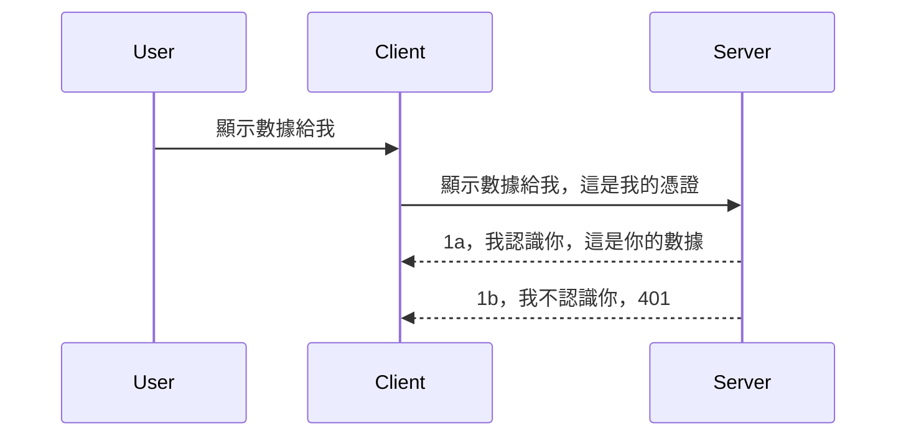

# 簡單認證

MCP SDK 支援使用 OAuth 2.1，說實話這是個相當複雜的過程，涉及像是認證伺服器、資源伺服器、傳送憑證、取得代碼、交換代碼取得存取權杖，直到最終取得資源資料。如果你不熟悉 OAuth，而它是個很棒的實作機制，那麼建議先從簡單的認證開始，逐步建立更好的安全性。這也是本章節存在的原因，帶你從基礎認證晉升到更進階的認證。

## 認證，我們指什麼？

認證是 authentication 和 authorization 的縮寫。重點是我們需要完成兩件事：

- **認證（Authentication）**，指的是判斷我們是否允許某人進入我們的系統，確認他們有權限「在這裡」，也就是有權限存取承載 MCP Server 功能的資源伺服器。
- **授權（Authorization）**，是判斷使用者是否有權限存取他們請求的特定資源，例如這些訂單或這些產品，或者是否允許讀取內容但不能刪除，這是另一個範例。

## 憑證：我們如何告訴系統我們是誰

大部分的網頁開發者一開始會想到向伺服器提供一組憑證，通常是一個秘密，用以證明是否被允許進入「認證」。這個憑證通常是使用 base64 編碼的使用者名稱與密碼，或者是一個唯一標識某使用者的 API 金鑰。

這過程會通過一個名為 "Authorization" 的標頭來進行傳遞，如下：

```json
{ "Authorization": "secret123" }
```

這通常稱為基本認證。整個流程則是如下運作：


了解整體流程後，我們要怎麼實作？大部分網頁伺服器都具備中介軟體（middleware）的概念，這是一段在請求時被執行的程式碼，可以用來驗證憑證，如果憑證有效，允許請求繼續通過。若請求憑證無效，則會返回認證錯誤。我們來看看怎麼實作：

**Python**

```python
class AuthMiddleware(BaseHTTPMiddleware):
    async def dispatch(self, request, call_next):

        has_header = request.headers.get("Authorization")
        if not has_header:
            print("-> Missing Authorization header!")
            return Response(status_code=401, content="Unauthorized")

        if not valid_token(has_header):
            print("-> Invalid token!")
            return Response(status_code=403, content="Forbidden")

        print("Valid token, proceeding...")
       
        response = await call_next(request)
        # 加入任何用戶自訂標頭或以某種方式更改回應
        return response


starlette_app.add_middleware(CustomHeaderMiddleware)
```

這裡我們：

- 建立了一個名為 `AuthMiddleware` 的中介軟體類別，其 `dispatch` 方法會被網頁伺服器調用。
- 把中介軟體加到網頁伺服器中：

    ```python
    starlette_app.add_middleware(AuthMiddleware)
    ```

- 撰寫了驗證邏輯來檢查是否有 Authorization 標頭，且送過來的密鑰是否合法：

    ```python
    has_header = request.headers.get("Authorization")
    if not has_header:
        print("-> Missing Authorization header!")
        return Response(status_code=401, content="Unauthorized")

    if not valid_token(has_header):
        print("-> Invalid token!")
        return Response(status_code=403, content="Forbidden")
    ```

    若密鑰存在且有效，我們會呼叫 `call_next` 讓請求通過，並回傳回應。

    ```python
    response = await call_next(request)
    # 添加任何客戶端標頭或以某種方式更改回應
    return response
    ```

其運作方式是：當有網路請求發往伺服器時，中介軟體會被調用，根據實作，會讓請求通過或回傳一個錯誤，表示客戶端無權繼續。

**TypeScript**

這裡我們使用流行的框架 Express 建立中介軟體，在請求達到 MCP Server 前截取請求。程式碼如下：

```typescript
function isValid(secret) {
    return secret === "secret123";
}

app.use((req, res, next) => {
    // 1. 有冇授權標頭？
    if(!req.headers["Authorization"]) {
        res.status(401).send('Unauthorized');
    }
    
    let token = req.headers["Authorization"];

    // 2. 檢查有效性。
    if(!isValid(token)) {
        res.status(403).send('Forbidden');
    }

   
    console.log('Middleware executed');
    // 3. 將請求傳遞到請求流程嘅下一步。
    next();
});
```

這段程式碼中我們：

1. 檢查 Authorization 標頭是否存在，若無則回傳 401 錯誤。
2. 確認憑證/令牌是否有效，若無效則回傳 403 錯誤。
3. 最後讓請求繼續在請求流程中，並回傳所需資源。

## 練習：實作認證

讓我們把所學應用實作，計畫如下：

伺服器端

- 建立一個網頁伺服器與 MCP 實例。
- 實作一個中介軟體給伺服器。

客戶端

- 透過標頭送出帶憑證的網路請求。

### -1- 建立網頁伺服器與 MCP 實例

第一步，我們要先建立網頁伺服器實例與 MCP Server。

**Python**

這裡建立 MCP 伺服器實例，建立 starlette 網頁應用並用 uvicorn 主持。

```python
# 建立 MCP 伺服器

app = FastMCP(
    name="MCP Resource Server",
    instructions="Resource Server that validates tokens via Authorization Server introspection",
    host=settings["host"],
    port=settings["port"],
    debug=True
)

# 建立 starlette 網頁應用程式
starlette_app = app.streamable_http_app()

# 透過 uvicorn 提供應用程式服務
async def run(starlette_app):
    import uvicorn
    config = uvicorn.Config(
            starlette_app,
            host=app.settings.host,
            port=app.settings.port,
            log_level=app.settings.log_level.lower(),
        )
    server = uvicorn.Server(config)
    await server.serve()

run(starlette_app)
```

程式碼中我們：

- 建立 MCP Server。
- 從 MCP Server 建立 starlette 網頁應用 `app.streamable_http_app()`。
- 使用 uvicorn 主持並提供網頁應用 `server.serve()`。

**TypeScript**

這裡我們建立 MCP Server 實例。

```typescript
const server = new McpServer({
      name: "example-server",
      version: "1.0.0"
    });

    // ... 設置伺服器資源、工具和提示 ...
```

要在 POST /mcp 路由定義中建立 MCP Server，所以將上述程式碼移動如下：

```typescript
import express from "express";
import { randomUUID } from "node:crypto";
import { McpServer } from "@modelcontextprotocol/sdk/server/mcp.js";
import { StreamableHTTPServerTransport } from "@modelcontextprotocol/sdk/server/streamableHttp.js";
import { isInitializeRequest } from "@modelcontextprotocol/sdk/types.js"

const app = express();
app.use(express.json());

// 用於根據會話 ID 存儲傳輸的映射
const transports: { [sessionId: string]: StreamableHTTPServerTransport } = {};

// 處理客戶端到服務器的 POST 請求
app.post('/mcp', async (req, res) => {
  // 檢查是否存在會話 ID
  const sessionId = req.headers['mcp-session-id'] as string | undefined;
  let transport: StreamableHTTPServerTransport;

  if (sessionId && transports[sessionId]) {
    // 重用現有的傳輸
    transport = transports[sessionId];
  } else if (!sessionId && isInitializeRequest(req.body)) {
    // 新的初始化請求
    transport = new StreamableHTTPServerTransport({
      sessionIdGenerator: () => randomUUID(),
      onsessioninitialized: (sessionId) => {
        // 按會話 ID 存儲傳輸
        transports[sessionId] = transport;
      },
      // DNS 重新綁定保護預設為關閉以保持向後兼容。如果您在本機運行此服務器
      // 請確保設置：
      // enableDnsRebindingProtection: true,
      // allowedHosts: ['127.0.0.1'],
    });

    // 傳輸關閉時進行清理
    transport.onclose = () => {
      if (transport.sessionId) {
        delete transports[transport.sessionId];
      }
    };
    const server = new McpServer({
      name: "example-server",
      version: "1.0.0"
    });

    // ... 設置服務器資源、工具和提示 ...

    // 連接到 MCP 服務器
    await server.connect(transport);
  } else {
    // 無效的請求
    res.status(400).json({
      jsonrpc: '2.0',
      error: {
        code: -32000,
        message: 'Bad Request: No valid session ID provided',
      },
      id: null,
    });
    return;
  }

  // 處理請求
  await transport.handleRequest(req, res, req.body);
});

// 用於 GET 和 DELETE 請求的可重用處理程序
const handleSessionRequest = async (req: express.Request, res: express.Response) => {
  const sessionId = req.headers['mcp-session-id'] as string | undefined;
  if (!sessionId || !transports[sessionId]) {
    res.status(400).send('Invalid or missing session ID');
    return;
  }
  
  const transport = transports[sessionId];
  await transport.handleRequest(req, res);
};

// 處理用於通過 SSE 向客戶端發送服務器通知的 GET 請求
app.get('/mcp', handleSessionRequest);

// 處理用於終止會話的 DELETE 請求
app.delete('/mcp', handleSessionRequest);

app.listen(3000);
```

你會看到 MCP Server 實例建立已移入到 `app.post("/mcp")` 內。

接下來進入下一步，建立中介軟體來驗證進來的憑證。

### -2- 為伺服器實作中介軟體

接著我們實作中介軟體，找出 `Authorization` 標頭中的憑證並驗證之。若接受，請求將繼續執行（例如列出工具、讀取某資源或客戶端請求的 MCP 功能）。

**Python**

建立中介軟體需創建一個繼承自 `BaseHTTPMiddleware` 的類別。主要有兩個重要元素：

- 請求物件 `request`，從中讀取標頭資訊。
- 回呼函式 `call_next`，當客戶端送來接受的憑證時需呼叫它。

先處理當缺少 `Authorization` 標頭的情況：

```python
has_header = request.headers.get("Authorization")

# 無標頭，返回 401 失敗，否則繼續。
if not has_header:
    print("-> Missing Authorization header!")
    return Response(status_code=401, content="Unauthorized")
```

此時回傳 401 未授權訊息，客戶端認證失敗。

接著當憑證存在時，檢查合法性如下：

```python
 if not valid_token(has_header):
    print("-> Invalid token!")
    return Response(status_code=403, content="Forbidden")
```

注意上面是回傳 403 禁止存取。以下是完整中介軟體實作，涵蓋以上邏輯：

```python
class AuthMiddleware(BaseHTTPMiddleware):
    async def dispatch(self, request, call_next):

        has_header = request.headers.get("Authorization")
        if not has_header:
            print("-> Missing Authorization header!")
            return Response(status_code=401, content="Unauthorized")

        if not valid_token(has_header):
            print("-> Invalid token!")
            return Response(status_code=403, content="Forbidden")

        print("Valid token, proceeding...")
        print(f"-> Received {request.method} {request.url}")
        response = await call_next(request)
        response.headers['Custom'] = 'Example'
        return response

```

很好，那 `valid_token` 函式呢？如下：

```python
# 唔好用喺生產環境 - 改善佢 !!
def valid_token(token: str) -> bool:
    # 移除 "Bearer " 字串前綴
    if token.startswith("Bearer "):
        token = token[7:]
        return token == "secret-token"
    return False
```

這部分當然應該改進。

重要提醒：絕不應該把密鑰寫死在程式碼裡。理想是從資料來源或身份提供者（IDP）抓取要比對的值，最好由 IDP 負責認證。

**TypeScript**

用 Express 實作需要呼叫 `use` 方法註冊中介軟體。

我們需要：

- 使用請求物件檢查 `Authorization` 標頭憑證。
- 驗證憑證是否有效，若有效就讓請求繼續執行，完成 MCP 功能（列工具、讀資源等）。

先檢查是否有 `Authorization` 標頭，若沒有就終止請求：

```typescript
if(!req.headers["authorization"]) {
    res.status(401).send('Unauthorized');
    return;
}
```

未送標頭時會收到 401。

接著驗證憑證合法性，若不合法則以不同訊息終止請求：

```typescript
if(!isValid(token)) {
    res.status(403).send('Forbidden');
    return;
} 
```

此時會收到 403。

完整程式碼如下：

```typescript
app.use((req, res, next) => {
    console.log('Request received:', req.method, req.url, req.headers);
    console.log('Headers:', req.headers["authorization"]);
    if(!req.headers["authorization"]) {
        res.status(401).send('Unauthorized');
        return;
    }
    
    let token = req.headers["authorization"];

    if(!isValid(token)) {
        res.status(403).send('Forbidden');
        return;
    }  

    console.log('Middleware executed');
    next();
});
```

我們設置伺服器接受中介軟體檢查客戶端送來的憑證。那客戶端怎麼辦？

### -3- 透過標頭送出帶憑證的網路請求

確保客戶端透過標頭送出憑證。使用 MCP 客戶端時我們要搞懂如何設定。

**Python**

客戶端需要帶著憑證標頭如下：

```python
# 唔好硬編碼個值，最少要放喺環境變數或者更安全嘅存儲入面
token = "secret-token"

async with streamablehttp_client(
        url = f"http://localhost:{port}/mcp",
        headers = {"Authorization": f"Bearer {token}"}
    ) as (
        read_stream,
        write_stream,
        session_callback,
    ):
        async with ClientSession(
            read_stream,
            write_stream
        ) as session:
            await session.initialize()
      
            # 待辦事項，你想客戶端做啲乜，例如列出工具、調用工具等等
```

注意如何設定 `headers` 欄位，如 `headers = {"Authorization": f"Bearer {token}"}`。

**TypeScript**

可分兩步解決：

1. 憑證放入設定物件。
2. 設定物件傳給 transport。

```typescript

// 唔好似呢度咁將值硬編碼。最少都應該設為環境變量，並喺開發模式用類似 dotenv 嘅工具。
let token = "secret123"

// 定義一個客戶端傳輸選項對象
let options: StreamableHTTPClientTransportOptions = {
  sessionId: sessionId,
  requestInit: {
    headers: {
      "Authorization": "secret123"
    }
  }
};

// 將選項對象傳入傳輸層
async function main() {
   const transport = new StreamableHTTPClientTransport(
      new URL(serverUrl),
      options
   );
```

可見我們建立 `options` 物件，憑證放在 `requestInit` 內的 `headers`。

重要提醒：怎麼改進呢？現有實作有問題。首先明文帶憑證風險很高，除非至少使用 HTTPS。儘管如此，憑證仍會被竊取，因此需有一套機制可隨時吊銷令牌並加強檢查，比如從哪來、請求頻率（防止機器人）等等，整套考量不少。

不過對於非常簡單的 API，且你希望未經認證者不能呼叫 API，這已是個不錯的起點。

接著我們想用標準化格式如 JSON Web Token（JWT，也叫 JOT 令牌）來加強安全性。

## JSON Web Tokens，JWT

想從簡單憑證提升，採用 JWT 有什麼立刻好處？

- <strong>安全性提升</strong>。基本認證會一直 base64 傳送使用者名稱密碼或 API key，增加風險。JWT 則是先送一次使用者名稱密碼換取令牌，且有時間限制會過期。JWT 支援細緻的存取控管，如角色、範圍和權限。
- <strong>無狀態與可擴展性</strong>。JWT 是自含把使用者資訊封裝在令牌中，不需伺服器端字串化快取。也能本地驗證令牌。
- <strong>互通性和聯合身份</strong>。JWT 是 Open ID Connect 的核心，支援像 Entra ID、Google Identity 以及 Auth0 等已知身份供應者，便利實作單一登入等企業級功能。
- <strong>模組化與彈性</strong>。JWT 可與 API Gateway（Azure API Management、NGINX等）搭配使用，支援用戶認證、伺服器對服務溝通，包括冒用與委派情境。
- <strong>效能與快取</strong>。JWT 解碼後可快取，減少反覆解析，需要時提高吞吐量，降低基礎設施負擔，尤其適合高流量應用。
- <strong>進階功能</strong>。支援內省（確認令牌有效性）與撤銷（將令牌作廢）。

有了這些好處，我們來看看如何把實作提升到下一層級。

## 把基本認證改成 JWT

高層次來看，我們要做的變更是：

- **學會產生 JWT 令牌**，並從客戶端傳送到伺服器。
- **驗證 JWT 令牌**，若有效就允許客戶端存取資源。
- <strong>安全存放令牌</strong>。我們要怎麼保存這個令牌。
- <strong>保護路由</strong>。需要保護路由，在我們案例裡是保護 MCP 路由與功能。
- <strong>加入刷新令牌</strong>。設計短期存活的訪問令牌與長期存活的刷新令牌，且能用刷新令牌取得新訪問令牌。也要有刷新終點與令牌輪替策略。

### -1- 產生 JWT 令牌

JWT 令牌由以下部分組成：

- **header**：演算法與令牌型態。
- **payload**：聲明，例如 sub（這個令牌代表的使用者或實體，在認證中通常是使用者 ID）、exp（過期時間）、role（角色）。
- **signature**：用秘密或私鑰簽名。

我們要分別產生 header、payload 及編碼的令牌。

**Python**

```python

import jwt
import jwt
from jwt.exceptions import ExpiredSignatureError, InvalidTokenError
import datetime

# 用作簽署 JWT 的秘密密鑰
secret_key = 'your-secret-key'

header = {
    "alg": "HS256",
    "typ": "JWT"
}

# 使用者資訊及其權利和過期時間
payload = {
    "sub": "1234567890",               # 主題（使用者 ID）
    "name": "User Userson",                # 自訂權利
    "admin": True,                     # 自訂權利
    "iat": datetime.datetime.utcnow(),# 發行時間
    "exp": datetime.datetime.utcnow() + datetime.timedelta(hours=1)  # 過期時間
}

# 編碼它
encoded_jwt = jwt.encode(payload, secret_key, algorithm="HS256", headers=header)
```

上述程式碼中：

- 定義 header 使用 HS256 演算法，型態為 JWT。
- 建構 payload 包含主體（使用者 ID）、使用者名稱、角色、發行時間和過期時間，實現時間綁定特性。

**TypeScript**

這邊我們需要一些工具函式建構 JWT。

依賴安裝

```sh

npm install jsonwebtoken
npm install --save-dev @types/jsonwebtoken
```

有了依賴後，我們來產生 header、payload，並產生已編碼令牌。

```typescript
import jwt from 'jsonwebtoken';

const secretKey = 'your-secret-key'; // 在生產環境使用環境變數

// 定義負載
const payload = {
  sub: '1234567890',
  name: 'User usersson',
  admin: true,
  iat: Math.floor(Date.now() / 1000), // 簽發於
  exp: Math.floor(Date.now() / 1000) + 60 * 60 // 一小時後過期
};

// 定義標頭（可選，jsonwebtoken 設置了默認值）
const header = {
  alg: 'HS256',
  typ: 'JWT'
};

// 創建令牌
const token = jwt.sign(payload, secretKey, {
  algorithm: 'HS256',
  header: header
});

console.log('JWT:', token);
```

令牌特點：

用 HS256 簽名
有效期 1 小時
包含 `sub`、`name`、`admin`、`iat`、`exp` 聲明。

### -2- 驗證令牌

伺服器要驗證令牌，確保客戶端送來的令牌為有效。我們會做很多檢查，包含結構與有效期，也建議加入額外檢查，確認使用者存在於系統且擁有相應權限。

驗證步驟先將令牌解碼，以便讀取及進行檢查：

**Python**

```python

# 解碼及驗證 JWT
try:
    decoded = jwt.decode(token, secret_key, algorithms=["HS256"])
    print("✅ Token is valid.")
    print("Decoded claims:")
    for key, value in decoded.items():
        print(f"  {key}: {value}")
except ExpiredSignatureError:
    print("❌ Token has expired.")
except InvalidTokenError as e:
    print(f"❌ Invalid token: {e}")

```

這段程式碼呼叫 `jwt.decode`，帶入令牌、秘密金鑰及演算法。用 try-catch 捕捉錯誤以便處理驗證失敗。

**TypeScript**

這裡呼叫 `jwt.verify` 以解碼令牌進一步分析。若呼叫失敗，表示令牌結構錯誤或失效。

```typescript

try {
  const decoded = jwt.verify(token, secretKey);
  console.log('Decoded Payload:', decoded);
} catch (err) {
  console.error('Token verification failed:', err);
}
```

提醒：正如前述，還應檢查令牌指向的使用者是否存在於系統，以及該使用者擁有的權限。

接著我們探討基於角色的存取控制，亦稱 RBAC。
## 加入角色基礎存取控制

其想法是我們要表達不同角色擁有不同的權限。例如，我們假設管理員可以做所有事情，普通用戶可以讀寫，而訪客只能閱讀。因此，這裡有一些可能的權限級別：

- Admin.Write 
- User.Read
- Guest.Read

讓我們來看看如何用中介軟體實現這種控制。中介軟體可以針對每條路徑添加，也可以針對所有路徑添加。

**Python**

```python
from starlette.middleware.base import BaseHTTPMiddleware
from starlette.responses import JSONResponse
import jwt

# 唔好將秘密寫喺代碼入面，呢個淨係用作示範。請從安全嘅地方讀取。
SECRET_KEY = "your-secret-key" # 將呢個放喺環境變數入面
REQUIRED_PERMISSION = "User.Read"

class JWTPermissionMiddleware(BaseHTTPMiddleware):
    async def dispatch(self, request, call_next):
        auth_header = request.headers.get("Authorization")
        if not auth_header or not auth_header.startswith("Bearer "):
            return JSONResponse({"error": "Missing or invalid Authorization header"}, status_code=401)

        token = auth_header.split(" ")[1]
        try:
            decoded = jwt.decode(token, SECRET_KEY, algorithms=["HS256"])
        except jwt.ExpiredSignatureError:
            return JSONResponse({"error": "Token expired"}, status_code=401)
        except jwt.InvalidTokenError:
            return JSONResponse({"error": "Invalid token"}, status_code=401)

        permissions = decoded.get("permissions", [])
        if REQUIRED_PERMISSION not in permissions:
            return JSONResponse({"error": "Permission denied"}, status_code=403)

        request.state.user = decoded
        return await call_next(request)


```

有幾種不同的方法來添加以下的中介軟體：

```python

# 選項 1：在建構 starlette 應用程式時加入中介軟體
middleware = [
    Middleware(JWTPermissionMiddleware)
]

app = Starlette(routes=routes, middleware=middleware)

# 選項 2：在 starlette 應用程式已建構完成後加入中介軟體
starlette_app.add_middleware(JWTPermissionMiddleware)

# 選項 3：為每個路由加入中介軟體
routes = [
    Route(
        "/mcp",
        endpoint=..., # 處理程序
        middleware=[Middleware(JWTPermissionMiddleware)]
    )
]
```

**TypeScript**

我們可以使用 `app.use` 和會為所有請求執行的中介軟體。

```typescript
app.use((req, res, next) => {
    console.log('Request received:', req.method, req.url, req.headers);
    console.log('Headers:', req.headers["authorization"]);

    // 1. 檢查是否已發送授權標頭

    if(!req.headers["authorization"]) {
        res.status(401).send('Unauthorized');
        return;
    }
    
    let token = req.headers["authorization"];

    // 2. 檢查令牌是否有效
    if(!isValid(token)) {
        res.status(403).send('Forbidden');
        return;
    }  

    // 3. 檢查令牌用戶是否存在於我們的系統中
    if(!isExistingUser(token)) {
        res.status(403).send('Forbidden');
        console.log("User does not exist");
        return;
    }
    console.log("User exists");

    // 4. 驗證令牌是否具有正確的權限
    if(!hasScopes(token, ["User.Read"])){
        res.status(403).send('Forbidden - insufficient scopes');
    }

    console.log("User has required scopes");

    console.log('Middleware executed');
    next();
});

```

我們可以讓中介軟體做的事情有很多，而且中介軟體應該要做的事情包括：

1. 檢查是否存在授權標頭
2. 檢查令牌是否有效，我們呼叫 `isValid`，這是我們寫的方法，用來檢查 JWT 令牌的完整性和有效性。
3. 驗證使用者是否存在於系統中，這點我們應該檢查。

   ```typescript
    // 數據庫中的用戶
   const users = [
     "user1",
     "User usersson",
   ]

   function isExistingUser(token) {
     let decodedToken = verifyToken(token);

     // 待辦，檢查用戶是否存在於數據庫中
     return users.includes(decodedToken?.name || "");
   }
   ```

   上面，我們建立了一個非常簡單的 `users` 列表，當然它應該存在資料庫中。

4. 此外，我們還應檢查令牌是否具有正確的權限。

   ```typescript
   if(!hasScopes(token, ["User.Read"])){
        res.status(403).send('Forbidden - insufficient scopes');
   }
   ```

   在上述中介軟體代碼中，我們檢查令牌是否包含 User.Read 權限，如果沒有，我們會回傳 403 錯誤。下面是 `hasScopes` 幫助方法。

   ```typescript
   function hasScopes(scope: string, requiredScopes: string[]) {
     let decodedToken = verifyToken(scope);
    return requiredScopes.every(scope => decodedToken?.scopes.includes(scope));
  }
   ```

Have a think which additional checks you should be doing, but these are the absolute minimum of checks you should be doing.

Using Express as a web framework is a common choice. There are helpers library when you use JWT so you can write less code.

- `express-jwt`, helper library that provides a middleware that helps decode your token.
- `express-jwt-permissions`, this provides a middleware `guard` that helps check if a certain permission is on the token.

Here's what these libraries can look like when used:

```typescript
const express = require('express');
const jwt = require('express-jwt');
const guard = require('express-jwt-permissions')();

const app = express();
const secretKey = 'your-secret-key'; // put this in env variable

// Decode JWT and attach to req.user
app.use(jwt({ secret: secretKey, algorithms: ['HS256'] }));

// Check for User.Read permission
app.use(guard.check('User.Read'));

// multiple permissions
// app.use(guard.check(['User.Read', 'Admin.Access']));

app.get('/protected', (req, res) => {
  res.json({ message: `Welcome ${req.user.name}` });
});

// Error handler
app.use((err, req, res, next) => {
  if (err.code === 'permission_denied') {
    return res.status(403).send('Forbidden');
  }
  next(err);
});

```

現在你已經看到中介軟體如何用於身份驗證和授權，那麼 MCP 呢？它是否改變了我們做授權的方式？讓我們在下一節中了解。

### -3- 對 MCP 加入 RBAC

到目前為止你已經看過如何透過中介軟體添加 RBAC，不過對於 MCP，沒有簡單的方法可以按 MCP 功能添加 RBAC，那我們該怎麼辦？我們只好新增這樣的代碼來檢查客戶端是否有權限呼叫特定工具：

你有幾種不同選擇以實現每個功能的 RBAC，以下是一些做法：

- 對每個工具、資源、提示添加檢查，以判斷是否有權限。

   **python**

   ```python
   @tool()
   def delete_product(id: int):
      try:
          check_permissions(role="Admin.Write", request)
      catch:
        pass # 客戶端授權失敗，拋出授權錯誤
   ```

   **typescript**

   ```typescript
   server.registerTool(
    "delete-product",
    {
      title: Delete a product",
      description: "Deletes a product",
      inputSchema: { id: z.number() }
    },
    async ({ id }) => {
      
      try {
        checkPermissions("Admin.Write", request);
        // 待辦，將 id 發送到 productService 和遠程入口
      } catch(Exception e) {
        console.log("Authorization error, you're not allowed");  
      }

      return {
        content: [{ type: "text", text: `Deletected product with id ${id}` }]
      };
    }
   );
   ```


- 使用進階的伺服器方法與請求處理器，這樣可以減少需要執行檢查的地方數量。

   **Python**

   ```python
   
   tool_permission = {
      "create_product": ["User.Write", "Admin.Write"],
      "delete_product": ["Admin.Write"]
   }

   def has_permission(user_permissions, required_permissions) -> bool:
      # user_permissions: 使用者擁有的權限清單
      # required_permissions: 工具所需的權限清單
      return any(perm in user_permissions for perm in required_permissions)

   @server.call_tool()
   async def handle_call_tool(
     name: str, arguments: dict[str, str] | None
   ) -> list[types.TextContent]:
    # 假設 request.user.permissions 是使用者的權限清單
     user_permissions = request.user.permissions
     required_permissions = tool_permission.get(name, [])
     if not has_permission(user_permissions, required_permissions):
        # 引發錯誤「你沒有權限呼叫工具 {name}」
        raise Exception(f"You don't have permission to call tool {name}")
     # 繼續並呼叫工具
     # ...
   ```   
   

   **TypeScript**

   ```typescript
   function hasPermission(userPermissions: string[], requiredPermissions: string[]): boolean {
       if (!Array.isArray(userPermissions) || !Array.isArray(requiredPermissions)) return false;
       // 如果用戶擁有至少一個必需的權限則返回真
       
       return requiredPermissions.some(perm => userPermissions.includes(perm));
   }
  
   server.setRequestHandler(CallToolRequestSchema, async (request) => {
      const { params: { name } } = request;
  
      let permissions = request.user.permissions;
  
      if (!hasPermission(permissions, toolPermissions[name])) {
         return new Error(`You don't have permission to call ${name}`);
      }
  
      // 繼續..
   });
   ```

   注意，你需要確保你的中介軟體將解碼後的令牌附加到請求的 user 屬性上，以便簡化上述代碼。

### 總結

現在我們已經討論了如何在一般情況及 MCP 中添加 RBAC 支援，是時候嘗試自己實作安全機制，確保你理解了所介紹的概念。

## 作業 1：使用基本身份驗證建立 MCP 伺服器與 MCP 用戶端

這裡你將應用學到的透過標頭傳送憑證的知識。

## 解答 1

[解答 1](./code/basic/README.md)

## 作業 2：將作業 1 的解決方案升級為使用 JWT

使用第一個解法，但這次改進它。

不使用基本認證，而改為使用 JWT。

## 解答 2

[解答 2](./solution/jwt-solution/README.md)

## 挑戰

為每個工具如章節「對 MCP 加入 RBAC」所述，添加 RBAC。

## 小結

你應該在本章學到了許多，從完全沒有安全機制，基本安全，到 JWT 以及如何將它加入 MCP。

我們建構了一個以自訂 JWT 為基礎的穩固基礎，但隨著規模擴大，我們正轉向基於標準的身份模型。採用像 Entra 或 Keycloak 這類身份提供者（IdP）讓我們能將令牌的發行、驗證和生命周期管理委託給受信任的平台，這樣我們就能集中精力在應用邏輯和使用者體驗上。

為此，我們有更 [進階的 Entra 章節](../../05-AdvancedTopics/mcp-security-entra/README.md)

## 下一步

- 下一章： [設定 MCP 主機](../12-mcp-hosts/README.md)

---

<!-- CO-OP TRANSLATOR DISCLAIMER START -->
**免責聲明**：  
本文件係使用 AI 翻譯服務 [Co-op Translator](https://github.com/Azure/co-op-translator) 翻譯而成。雖然我們致力於準確性，但請注意自動翻譯可能包含錯誤或不準確之處。原始文件的母語版本應被視為權威來源。對於重要資訊，建議使用專業人工翻譯。因使用本翻譯而引起的任何誤解或誤釋，我們概不負責。
<!-- CO-OP TRANSLATOR DISCLAIMER END -->