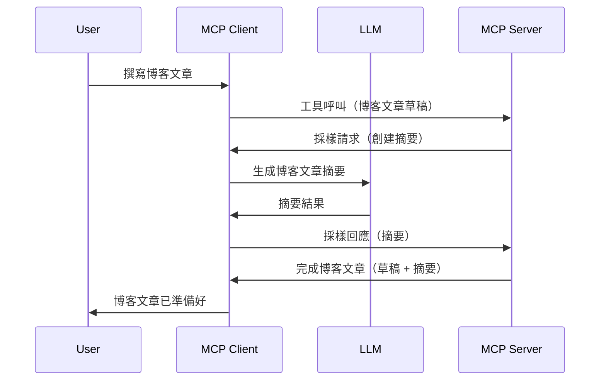

# 採樣 - 將功能委派給客戶端

有時候，你需要 MCP 客戶端和 MCP 伺服器協同合作以達成共同目標。你可能會遇到伺服器需要使用位於客戶端的 LLM 來協助的情況。針對這種情況，應該使用採樣。

讓我們探討一些使用案例以及如何建立包含採樣的解決方案。

## 概述

本課程將著重解釋何時及在哪裡使用採樣，以及如何配置它。

## 學習目標

在本章中，我們將：

- 解釋什麼是採樣以及何時使用。
- 展示如何在 MCP 中配置採樣。
- 提供採樣實際操作的範例。

## 什麼是採樣及為何使用它？

採樣是一項高階功能，運作方式如下：


### 採樣請求

好的，現在我們對一個可信場景有了高度概述，讓我們來討論伺服器回傳給客戶端的採樣請求。這樣的請求在 JSON-RPC 格式中可以是這樣：

```json
{
  "jsonrpc": "2.0",
  "id": 1,
  "method": "sampling/createMessage",
  "params": {
    "messages": [
      {
        "role": "user",
        "content": {
          "type": "text",
          "text": "Create a blog post summary of the following blog post: <BLOG POST>"
        }
      }
    ],
    "modelPreferences": {
      "hints": [
        {
          "name": "claude-3-sonnet"
        }
      ],
      "intelligencePriority": 0.8,
      "speedPriority": 0.5
    },
    "systemPrompt": "You are a helpful assistant.",
    "maxTokens": 100
  }
}
```

這裡有幾個值得注意的點：

- 提示（prompt）位於 content -> text 下，是我們指示 LLM 摘要部落格文章內容的提示。

- **modelPreferences**。這部分就是偏好設定，建議使用什麼配置於 LLM。使用者可以選擇是否接受這些建議或自行修改。在本例中建議了要使用的模型以及速度和智慧優先級。
- **systemPrompt**，這是你的標準系統提示，給予你的 LLM 一個人格，並包含指導指令。
- **maxTokens**，這是另一個屬性，用來表示推薦此任務應使用多少 token。

### 採樣回應

此回應是 MCP 客戶端最終回傳給 MCP 伺服器的結果，是客戶端呼叫 LLM、等待回應後構造的訊息。它在 JSON-RPC 中的樣子如下：

```json
{
  "jsonrpc": "2.0",
  "id": 1,
  "result": {
    "role": "assistant",
    "content": {
      "type": "text",
      "text": "Here's your abstract <ABSTRACT>"
    },
    "model": "gpt-5",
    "stopReason": "endTurn"
  }
}
```

注意回應是部落格文章的摘要，就像我們所要求的。同時注意使用的 `model` 不是我們請求的，而是「gpt-5」取代「claude-3-sonnet」。這是為了說明使用者可以改變想法選用的模型，而你的採樣請求只是建議。

好了，現在我們理解了主要流程，以及適合使用的任務「部落格文章創建 + 摘要」，接下來看看需要做什麼才能讓它工作。

### 訊息類型

採樣訊息不只限於文字，你還可以傳送圖片和音訊。JSON-RPC 格式會有所不同，示例如下：

<strong>文字</strong>

```json
{
  "type": "text",
  "text": "The message content"
}
```

<strong>圖片內容</strong>

```json
{
  "type": "image",
  "data": "base64-encoded-image-data",
  "mimeType": "image/jpeg"
}
```

<strong>音訊內容</strong>

```json
{
  "type": "audio",
  "data": "base64-encoded-audio-data",
  "mimeType": "audio/wav"
}
```

> NOTE: 如需更詳細的採樣資訊，請參考[官方文件](https://modelcontextprotocol.io/specification/2025-06-18/client/sampling)

## 如何在客戶端配置採樣

> 注意：如果你只是在建立伺服器端，這裡不需做太多。

在客戶端，你需要指定以下功能，如下所示：

```json
{
  "capabilities": {
    "sampling": {}
  }
}
```

當你選定的客戶端與伺服器初始化時，它就會被讀取。

## 實際採樣範例 - 建立一篇部落格文章

讓我們一起編寫一個採樣伺服器，我們需要做以下幾件事：

1. 在伺服器上建立一個工具。
1. 該工具應建立一個採樣請求。
1. 工具應等待客戶端的採樣回覆。
1. 然後產生工具結果。

讓我們逐步看程式碼：

### -1- 建立工具

**python**

```python
@mcp.tool()
async def create_blog(title: str, content: str, ctx: Context[ServerSession, None]) -> str:
    """Create a blog post and generate a summary"""

```

### -2- 建立採樣請求

使用以下程式碼擴充你的工具：

**python**

```python
post = BlogPost(
        id=len(posts) + 1,
        title=title,
        content=content,
        abstract=""
    )

prompt = f"Create an abstract of the following blog post: title: {title} and draft: {content} "

result = await ctx.session.create_message(
        messages=[
            SamplingMessage(
                role="user",
                content=TextContent(type="text", text=prompt),
            )
        ],
        max_tokens=100,
)

```

### -3- 等待回應並回傳結果

**python**

```python
post.abstract = result.content.text

posts.append(post)

# 返回完整產品
return json.dumps({
    "id": post.title,
    "abstract": post.abstract
})
```

### -4- 完整程式碼

**python**

```python
from starlette.applications import Starlette
from starlette.routing import Mount, Host

from mcp.server.fastmcp import Context, FastMCP

from mcp.server.session import ServerSession
from mcp.types import SamplingMessage, TextContent

import json


from uuid import uuid4
from typing import List
from pydantic import BaseModel


mcp = FastMCP("Blog post generator")

# app = FastAPI()

posts = []

class BlogPost(BaseModel):
    id: int
    title: str
    content: str
    abstract: str

posts: List[BlogPost] = []

@mcp.tool()
async def create_blog(title: str, content: str, ctx: Context[ServerSession, None]) -> str:
    """Create a blog post and generate a summary"""

    post = BlogPost(
        id=len(posts) + 1,
        title=title,
        content=content,
        abstract=""
    )

    prompt = f"Create an abstract of the following blog post: title: {title} and draft: {content} "

    result = await ctx.session.create_message(
        messages=[
            SamplingMessage(
                role="user",
                content=TextContent(type="text", text=prompt),
            )
        ],
        max_tokens=100,
    )

    post.abstract = result.content.text

    posts.append(post)

    # 返回完整的博客文章
    return json.dumps({
        "id": post.title,
        "abstract": post.abstract
    })

if __name__ == "__main__":
    print("Starting server...")
    # mcp.run()
    mcp.run(transport="streamable-http")

# 使用以下命令運行應用程式：python server.py
```

### -5- 在 Visual Studio Code 中測試

在 Visual Studio Code 測試請執行以下步驟：

1. 在終端機啟動伺服器
1. 將其加入到 *mcp.json*（並確保啟動中），範例如下：

   ```json
   "servers": {
      "blog-server": {
        "type": "http",
        "url": "http://localhost:8000/mcp"
      }
   }
   ```

1. 輸入提示：

   ```text
   create a blog post named "Where Python comes from", the content is "Python is actually named after Monty Python Flying Circus"
   ```

1. 允許採樣進行。首次測試時會出現額外的對話框必須接受，之後會看到正常的對話框，請你執行工具。

1. 檢視結果。你會看到結果在 GitHub Copilot Chat 中美觀呈現，也可以查看原始 JSON 回應。

<strong>額外提示</strong>。Visual Studio Code 工具對採樣支援良好。你可以在已安裝伺服器上設定採樣權限，方法如下：

1. 前往擴充功能區。
1. 在「MCP SERVERS - INSTALLED」區段選擇你的已安裝伺服器旁的齒輪圖示。
1. 選擇「Configure Model Access」，在這裡可以選擇 GitHub Copilot 執行採樣時允許使用的模型。也可以選擇「Show Sampling requests」查看近期所有採樣請求。

## 作業

在此作業中，你將建立稍微不同的採樣整合，具體來說是支援產生產品描述。這是你的場景：

<strong>場景</strong>：電商後台工作人員需要協助，產生產品描述耗費太多時間。因此，你要建立一個解決方案，可以呼叫名為「create_product」的工具，帶入「title」和「keywords」作為引數，工具應產出一個包含「description」欄位的完整產品描述，該欄位由客戶端的 LLM 補充。

提示：利用你先前所學，使用採樣請求來構建這個伺服器及工具。

## 解答

[解答](./solution/README.md)

## 主要重點

採樣是一項強大功能，允許伺服器在需要 LLM 協助時，將任務委派給客戶端。

## 下一步

- [第四章 - 實務實作](../../04-PracticalImplementation/README.md)

---

<!-- CO-OP TRANSLATOR DISCLAIMER START -->
**免責聲明**：  
本文件是使用 AI 翻譯服務 [Co-op Translator](https://github.com/Azure/co-op-translator) 進行翻譯。雖然我們力求準確，但請注意，自動翻譯可能包含錯誤或不準確之處。原始語言版本的文件應視為權威來源。對於重要資訊，建議尋求專業人工翻譯。我們不對因使用本翻譯而產生的任何誤解或誤譯負責。
<!-- CO-OP TRANSLATOR DISCLAIMER END -->