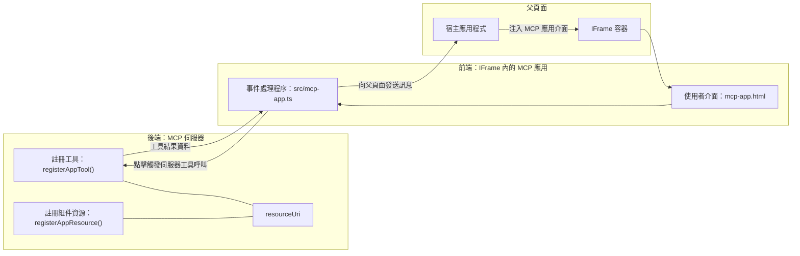

# MCP Apps

MCP Apps 是 MCP 的一種新範式。這理念不僅僅是你從工具呼叫得到資料的回應，還提供關於如何與這些資訊互動的資訊。這表示工具結果現在可以包含 UI 資訊。那為什麼我們要這麼做呢？想想你今天是怎麼做的。你很可能是透過放一個前端在 MCP Server 前面來消費結果，這是你需要撰寫與維護的程式碼。有時這是你想要的，但有時如果你可以帶入一個自包含的片段，包含從資料到使用介面的一切，那會很棒。

## 概覽

本課程提供 MCP Apps 的實務指引，說明如何開始使用以及如何整合至你現有的 Web 應用。MCP Apps 是 MCP 標準中非常新的附加項目。

## 學習目標

完成本課程後，你將能夠：

- 解釋 MCP Apps 是什麼。
- 了解何時使用 MCP Apps。
- 建立並整合你自己的 MCP Apps。

## MCP Apps - 它如何運作

MCP Apps 的理念是回應實質上是一個待渲染的元件。這種元件可以有視覺效果和互動性，例如按鈕點擊、使用者輸入等。先從伺服器端與我們的 MCP Server 開始。要建立 MCP App 元件，你需要建立工具與應用資源。這兩部分透過 resourceUri 連結。

以下是一個範例。讓我們嘗試視覺化了解涉及的部分及各自分工：

```text
server.ts -- responsible for registering tools and the component as a UI component
src/
  mcp-app.ts -- wiring up event handlers
mcp-app.html -- the user interface
```

此視覺描述了建立元件及其邏輯的架構。


接著讓我們嘗試描述後端與前端的職責。

### 後端

這裡有兩件事情要完成：

- 註冊我們想要互動的工具。
- 定義元件。

<strong>註冊工具</strong>

```typescript
registerAppTool(
    server,
    "get-time",
    {
      title: "Get Time",
      description: "Returns the current server time.",
      inputSchema: {},
      _meta: { ui: { resourceUri } }, // 將此工具連結至其使用者界面資源
    },
    async () => {
      const time = new Date().toISOString();
      return { content: [{ type: "text", text: time }] };
    },
  );

```

前述程式碼描述行為，暴露了一個名為 `get-time` 的工具。它不接受輸入，卻會回傳當前時間。我們可以為需要接收使用者輸入的工具定義 `inputSchema`。

<strong>註冊元件</strong>

在同一檔案，我們也需要註冊元件：

```typescript
const resourceUri = "ui://get-time/mcp-app.html";

// 註冊資源，返回用於用戶界面的打包 HTML/JavaScript。
registerAppResource(
  server,
  resourceUri,
  resourceUri,
  { mimeType: RESOURCE_MIME_TYPE },
  async () => {
    const html = await fs.readFile(path.join(DIST_DIR, "mcp-app.html"), "utf-8");

    return {
    contents: [
        { uri: resourceUri, mimeType: RESOURCE_MIME_TYPE, text: html },
    ],
    };
  },
);
```

注意我們如何用 `resourceUri` 連結元件與其工具。另一個值得關注的是回呼函式，載入 UI 檔案並回傳元件。

### 元件前端

和後端一樣，這裡有兩部分：

- 純 HTML 撰寫的前端。
- 處理事件及回應的程式碼，例如呼叫工具或向父視窗傳訊息。

<strong>使用者介面</strong>

來看看使用者介面。

```html
<!-- mcp-app.html -->
<!DOCTYPE html>
<html lang="en">
  <head>
    <meta charset="UTF-8" />
    <title>Get Time App</title>
  </head>
  <body>
    <p>
      <strong>Server Time:</strong> <code id="server-time">Loading...</code>
    </p>
    <button id="get-time-btn">Get Server Time</button>
    <script type="module" src="/src/mcp-app.ts"></script>
  </body>
</html>
```

<strong>綁定事件</strong>

最後一部分是事件綁定。也就是我們辨識 UI 中哪些部分需要事件處理器以及事件發生時該怎麼做：

```typescript
// mcp-app.ts

import { App } from "@modelcontextprotocol/ext-apps";

// 獲取元素引用
const serverTimeEl = document.getElementById("server-time")!;
const getTimeBtn = document.getElementById("get-time-btn")!;

// 建立應用程式實例
const app = new App({ name: "Get Time App", version: "1.0.0" });

// 處理來自伺服器的工具結果。在 `app.connect()` 之前設定以避免
// 遺漏初始工具結果。
app.ontoolresult = (result) => {
  const time = result.content?.find((c) => c.type === "text")?.text;
  serverTimeEl.textContent = time ?? "[ERROR]";
};

// 連結按鈕點擊事件
getTimeBtn.addEventListener("click", async () => {
  // `app.callServerTool()` 讓用戶界面向伺服器請求更新數據
  const result = await app.callServerTool({ name: "get-time", arguments: {} });
  const time = result.content?.find((c) => c.type === "text")?.text;
  serverTimeEl.textContent = time ?? "[ERROR]";
});

// 連接到主機
app.connect();
```

正如上面所示，這是綁定 DOM 元素與事件的常規程式碼。值得一提的是 `callServerTool` 的呼叫，該呼叫會在後端呼叫工具。

## 處理使用者輸入

到目前為止，我們看到一個元件包含一個按鈕，點擊時會呼叫工具。讓我們看看能否加入更多 UI 元素如輸入欄位，並嘗試將參數傳給工具。我們來實作一個 FAQ 功能。它應該這樣運作：

- 有一個按鈕和一個輸入欄位，使用者可以輸入關鍵字搜尋，例如「Shipping」。這會呼叫後端的工具，在 FAQ 資料中做搜尋。
- 一個支援上述 FAQ 搜尋的工具。

先在後端加入必要支援：

```typescript
const faq: { [key: string]: string } = {
    "shipping": "Our standard shipping time is 3-5 business days.",
    "return policy": "You can return any item within 30 days of purchase.",
    "warranty": "All products come with a 1-year warranty covering manufacturing defects.",
  }

registerAppTool(
    server,
    "get-faq",
    {
      title: "Search FAQ",
      description: "Searches the FAQ for relevant answers.",
      inputSchema: zod.object({
        query: zod.string().default("shipping"),
      }),
      _meta: { ui: { resourceUri: faqResourceUri } }, // 將此工具連結到其用戶界面資源
    },
    async ({ query }) => {
      const answer: string = faq[query.toLowerCase()] || "Sorry, I don't have an answer for that.";
      return { content: [{ type: "text", text: answer }] };
    },
  );
```

這裡展示我們如何填寫 `inputSchema`，並給予一個 `zod` 綱要如下：

```typescript
inputSchema: zod.object({
  query: zod.string().default("shipping"),
})
```

在上述綱要中，我們宣告有一個輸入參數叫 `query`，它是可選的，且預設值為 "shipping"。

好，接下來看 *mcp-app.html* 需建立什麼 UI：

```html
<div class="faq">
    <h1>FAQ response</h1>
    <p>FAQ Response: <code id="faq-response">Loading...</code></p>
    <input type="text" id="faq-query" placeholder="Enter FAQ query" />
    <button id="get-faq-btn">Get FAQ Response</button>
  </div>
```

很好，現在有了輸入元素與按鈕。接著到 *mcp-app.ts* 綁定事件：

```typescript
const getFaqBtn = document.getElementById("get-faq-btn")!;
const faqQueryInput = document.getElementById("faq-query") as HTMLInputElement;

getFaqBtn.addEventListener("click", async () => {
  const query = faqQueryInput.value;
  const result = await app.callServerTool({ name: "get-faq", arguments: { query } });
  const faq = result.content?.find((c) => c.type === "text")?.text;
  faqResponseEl.textContent = faq ?? "[ERROR]";
});
```

上面的程式中我們：

- 建立對互動 UI 元件的引用。
- 處理按鈕點擊事件以解析輸入框的值，並呼叫 `app.callServerTool()`，帶入 `name` 與 `arguments`，其中 `arguments` 傳送 `query` 作為值。

實際呼叫 `callServerTool` 會傳訊息到父視窗，該視窗再呼叫 MCP Server。

### 嘗試看看

試用後應看到：


這是輸入「warranty」的結果：


要執行此程式碼，請前往 [程式碼區](./code/README.md)

## 在 Visual Studio Code 中測試

Visual Studio Code 對 MCP Apps 有很好的支援，是測試 MCP Apps 最簡單的方式之一。使用 Visual Studio Code 時，在 *mcp.json* 加上伺服器設定如下：

```json
"my-mcp-server-7178eca7": {
    "url": "http://localhost:3001/mcp",
    "type": "http"
  }
```

啟動伺服器後，只要裝有 GitHub Copilot，應能透過聊天視窗與你的 MCP App 溝通。

你可以透過提示字觸發，例如 "#get-faq"：


像透過瀏覽器執行一樣，界面會呈現相同效果：


## 作業

建立一個剪刀石頭布遊戲。應包含以下：

UI：

- 一個下拉選單選項
- 一個送出選擇的按鈕
- 一個標籤顯示誰選了什麼與勝利者是誰

伺服器端：

- 應有一個剪刀石頭布工具，接受「choice」為輸入。也應渲染電腦選擇並判定勝負。

## 解答

[解答](./assignment/README.md)

## 總結

我們學到了 MCP Apps 這個新範式。這是個讓 MCP Server 不僅能控制資料，也能決定如何呈現資料的嶄新模式。

此外，我們知道 MCP Apps 是被嵌入在 IFrame 中，與 MCP Server 溝通時需向父網頁傳送訊息。有多個現成函式庫支援純 JavaScript、React 等，讓溝通變得簡單。

## 主要重點

你學到了：

- MCP Apps 是新標準，適合需要同時輸出資料與 UI 功能的情境。
- 此類應用為安全考量，在 IFrame 內運行。

## 接下來

- [第 4 章](../../04-PracticalImplementation/README.md)

---

<!-- CO-OP TRANSLATOR DISCLAIMER START -->
**免責聲明**：  
本文件是使用 AI 翻譯服務 [Co-op Translator](https://github.com/Azure/co-op-translator) 進行翻譯的。雖然我們致力於提供準確的翻譯，但請注意，自動翻譯可能包含錯誤或不準確之處。原始文件的母語版本應視為權威來源。對於重要資訊，建議採用專業人工翻譯。我們對因使用此翻譯而引起的任何誤解或誤譯不承擔任何責任。
<!-- CO-OP TRANSLATOR DISCLAIMER END -->