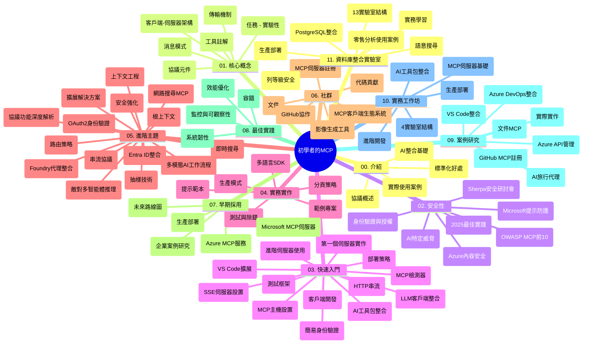

# Model Context Protocol (MCP) 初學者指南 - 學習手冊

本學習手冊概述「Model Context Protocol (MCP) 初學者」課程的倉庫結構及內容。使用此手冊可有效導航倉庫並充分利用可用資源。

## 倉庫概覽

Model Context Protocol (MCP) 是 AI 模型與客戶端應用程式間互動的標準化框架。最初由 Anthropic 創建，現由官方 GitHub 組織中的廣大 MCP 社群共同維護。該倉庫提供全面課程，包含 C#、Java、JavaScript、Python 與 TypeScript 的實作範例，面向 AI 開發者、系統架構師及軟體工程師。

## 視覺課程地圖

## 倉庫結構

此倉庫分為十一個主要部分，分別聚焦 MCP 的不同面向：

1. **介紹 (00-Introduction/)**
   - Model Context Protocol 概述
   - AI 流程中標準化的重要性
   - 實際應用案例與效益

2. **核心概念 (01-CoreConcepts/)**
   - 客戶端－伺服器架構
   - 主要協議組件
   - MCP 訊息模式

3. **安全性 (02-Security/)**
   - MCP 系統中的安全威脅
   - 安全實踐最佳方法
   - 身份驗證與授權策略
   - <strong>全面安全文件</strong>：
     - MCP 安全最佳實踐 2025
     - Azure 內容安全實作指南
     - MCP 安全控管與技術
     - MCP 最佳實踐速查
   - <strong>關鍵安全主題</strong>：
     - 提示注入與工具中毒攻擊
     - 會話劫持與代理混淆問題
     - 令牌直通漏洞
     - 過度權限與存取控制
     - AI 組件供應鏈安全
     - Microsoft 提示盾牌整合

4. **入門 (03-GettingStarted/)**
   - 環境設定與配置
   - 建立基本 MCP 伺服器與客戶端
   - 與現有應用程式整合
   - 包含章節：
     - 首個伺服器實作
     - 客戶端開發
     - LLM 客戶端整合
     - VS Code 整合
     - 伺服器發送事件 (SSE) 伺服器
     - 進階伺服器使用
     - HTTP 串流
     - AI 工具包整合
     - 測試策略
     - 部署指南

5. **實務操作 (04-PracticalImplementation/)**
   - 跨程式語言使用 SDK
   - 除錯、測試與驗證技巧
   - 製作可重複使用的提示模板與工作流程
   - 範例專案與實作範例

6. **進階主題 (05-AdvancedTopics/)**
   - 上下文工程技巧
   - Foundry 代理整合
   - 多模態 AI 工作流程
   - OAuth2 驗證示範
   - 即時搜尋功能
   - 即時串流
   - Root Contexts 實作
   - 路由策略
   - 採樣技巧
   - 擴充方案
   - 安全考量
   - Entra ID 安全整合
   - 網頁搜索整合
   - 對抗型多代理推理（辯論模式）

7. **社群貢獻 (06-CommunityContributions/)**
   - 如何貢獻程式碼與文件
   - 透過 GitHub 協作
   - 社群驅動的增強與反饋
   - 使用多款 MCP 客戶端（Claude Desktop、Cline、VSCode）
   - 搭配熱門 MCP 伺服器包括影像生成

8. **早期採用心得 (07-LessonsfromEarlyAdoption/)**
   - 真實案例及成功故事
   - MCP 解決方案建置與部署
   - 趨勢與未來路線圖
   - **Microsoft MCP 伺服器指南**：涵蓋 10 個生產就緒的 Microsoft MCP 伺服器，包括：
     - Microsoft Learn 文件 MCP 伺服器
     - Azure MCP 伺服器（15+ 專業連接器）
     - GitHub MCP 伺服器
     - Azure DevOps MCP 伺服器
     - MarkItDown MCP 伺服器
     - SQL Server MCP 伺服器
     - Playwright MCP 伺服器
     - Dev Box MCP 伺服器
     - Azure AI Foundry MCP 伺服器
     - Microsoft 365 Agents Toolkit MCP 伺服器

9. **最佳實踐 (08-BestPractices/)**
   - 效能調校與優化
   - MCP 系統容錯設計
   - 測試與韌性策略

10. **案例研究 (09-CaseStudy/)**
    - <strong>七個全面案例研究</strong> 展示 MCP 在多場景的靈活性：
    - **Azure AI 旅遊代理**：Azure OpenAI 與 AI 搜索的多代理協調
    - **Azure DevOps 整合**：自動化工作流與 YouTube 資料更新
    - <strong>即時文檔檢索</strong>：Python 主控台客戶端搭配串流 HTTP
    - <strong>互動學習計劃產生器</strong>：Chainlit 網頁應用整合對話式 AI
    - <strong>編輯器內文檔</strong>：VS Code 與 GitHub Copilot 工作流程
    - **Azure API 管理**：企業 API 整合與 MCP 伺服器構建
    - **GitHub MCP Registry**：生態系開發與代理整合平台
    - 涵蓋企業整合、開發者生產力及生態系擴展實作範例

11. **實作工作坊 (10-StreamliningAIWorkflowsBuildingAnMCPServerWithAIToolkit/)**
    - 結合 MCP 與 AI 工具包的全面實作工作坊
    - 建置智能應用，橋接 AI 模型與實際工具
    - 實務模組涵蓋基礎知識、自訂伺服器開發與生產部署策略
    - <strong>實驗室結構</strong>：
      - 實驗室 1：MCP 伺服器基礎
      - 實驗室 2：進階 MCP 伺服器開發
      - 實驗室 3：AI 工具包整合
      - 實驗室 4：生產部署與擴充
    - 以實驗室方式，逐步引導學習

12. **MCP 伺服器資料庫整合實驗室 (11-MCPServerHandsOnLabs/)**
    - **完整 13 個實驗室學習路徑**，建置具生產就緒的 PostgreSQL 整合 MCP 伺服器
    - <strong>真實零售分析實作</strong>，以 Zava Retail 使用案例展示
    - <strong>企業級範式</strong> 包含列級安全（RLS）、語意搜尋、多租戶資料存取
    - <strong>完整實驗室結構</strong>：
      - **實驗室 00-03：基礎** - 介紹、架構、安全性、環境設定
      - **實驗室 04-06：構建 MCP 伺服器** - 資料庫設計、伺服器實作、工具開發
      - **實驗室 07-09：進階功能** - 語意搜尋、測試與除錯、VS Code 整合
      - **實驗室 10-12：生產與最佳實踐** - 部署、監控、優化
    - <strong>涵蓋技術</strong>：FastMCP 框架、PostgreSQL、Azure OpenAI、Azure 容器應用、應用洞察
    - <strong>學習成果</strong>：生產就緒 MCP 伺服器、資料庫整合範式、AI 驅動分析、企業安全

## 附加資源

倉庫還包含支援性資源：

- **Images 資料夾**：包含課程中使用的圖解與插圖
- <strong>多語言翻譯</strong>：文件自動翻譯支援多語言
- **官方 MCP 資源**：
  - [MCP 文件](https://modelcontextprotocol.io/)
  - [MCP 規範](https://spec.modelcontextprotocol.io/)
  - [MCP GitHub 倉庫](https://github.com/modelcontextprotocol)

## 如何使用此倉庫

1. <strong>依序學習</strong>：按章節順序（00 至 11）循序漸進學習。
2. <strong>語言專注</strong>：有特定程式語言偏好，請探索 samples 目錄中相關範例。
3. <strong>實務入門</strong>：從「入門」章節開始設定環境並建立首個 MCP 伺服器與客戶端。
4. <strong>進階探究</strong>：熟悉基礎後，深入進階主題擴展知識。
5. <strong>社群互動</strong>：透過 GitHub 論壇及 Discord 頻道加入 MCP 社群，交流專家及開發者。

## MCP 客戶端與工具

課程涵蓋多款 MCP 客戶端與工具：

1. <strong>官方客戶端</strong>：
   - Visual Studio Code
   - MCP for Visual Studio Code
   - Claude Desktop
   - VSCode 中的 Claude
   - Claude API

2. <strong>社群客戶端</strong>：
   - Cline（終端機介面）
   - Cursor（程式碼編輯器）
   - ChatMCP
   - Windsurf

3. **MCP 管理工具**：
   - MCP CLI
   - MCP Manager
   - MCP Linker
   - MCP Router

## 熱門 MCP 伺服器

倉庫介紹多款 MCP 伺服器，包括：

1. **官方 Microsoft MCP 伺服器**：
   - Microsoft Learn 文件 MCP 伺服器
   - Azure MCP 伺服器（15+ 專業連接器）
   - GitHub MCP 伺服器
   - Azure DevOps MCP 伺服器
   - MarkItDown MCP 伺服器
   - SQL Server MCP 伺服器
   - Playwright MCP 伺服器
   - Dev Box MCP 伺服器
   - Azure AI Foundry MCP 伺服器
   - Microsoft 365 Agents Toolkit MCP 伺服器

2. <strong>官方參考伺服器</strong>：
   - 檔案系統
   - Fetch
   - 記憶體
   - Sequential Thinking

3. <strong>影像生成</strong>：
   - Azure OpenAI DALL-E 3
   - Stable Diffusion WebUI
   - Replicate

4. <strong>開發工具</strong>：
   - Git MCP
   - 終端控管
   - 程式碼助理

5. <strong>專業伺服器</strong>：
   - Salesforce
   - Microsoft Teams
   - Jira 與 Confluence

## 貢獻指南

本倉庫歡迎社群貢獻。詳見「社群貢獻」章節以了解如何有效參與 MCP 生態系統的協作。

----

*本學習手冊最後更新於 2026 年 2 月 5 日，反映最新的 MCP 規範 2025-11-25，並提供當日倉庫概覽。倉庫內容在此日期後可能有所更新。*

---

<!-- CO-OP TRANSLATOR DISCLAIMER START -->
**免責聲明**：  
本文件使用 AI 翻譯服務 [Co-op Translator](https://github.com/Azure/co-op-translator) 進行翻譯。雖然我們致力於翻譯準確性，但請注意自動翻譯可能包含錯誤或不準確之處。原始語言文件應被視為權威來源。對於重要資訊，建議採用專業人工翻譯。我們不對因使用本翻譯而引起的任何誤解或誤譯承擔責任。
<!-- CO-OP TRANSLATOR DISCLAIMER END -->