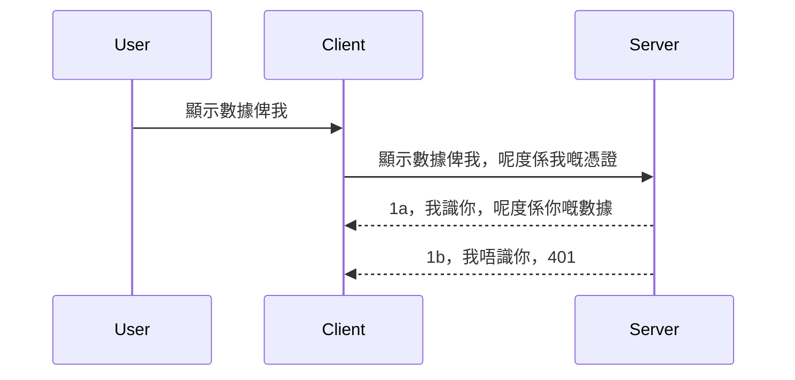

# 簡易認證

MCP SDK 支援使用 OAuth 2.1，說實話這是一個相當繁複的流程，包含驗證伺服器、資源伺服器、提交憑證、取得代碼、交換代碼取得承載權杖，直到你最終取得資源資料。如果你不熟悉 OAuth，這是一個很棒的實作方式，一開始最好先從一些基本級別的認證開始，然後漸進提升到更強的安全性。這也是本章存在的原因，讓你逐步建立起更進階的認證。

## 認證，我們指的是什麼？

認證是 authentication（身份驗證）和 authorization（授權）的合稱。概念是我們需要做兩件事：

- <strong>身份驗證</strong>，這是判斷是否允許一個人進入我們的房子，他是否有權限「在這裡」，也就是是否有權訪問我們的資源伺服器，MCP 伺服器功能所在的位置。
- <strong>授權</strong>，是判斷使用者是否應該存取他們請求的特定資源，例如這些訂單或這些產品，或者他們是否只允許讀取內容但不能刪除，以此類推。

## 憑證：我們如何告訴系統我們是誰

大多數網頁開發者一開始的思維都是提供憑證給伺服器，通常是一個秘密，用於說明他們是否被允許停留此地「身份驗證」。這個憑證通常是用 base64 編碼的使用者名稱和密碼，或者是一個獨特識別特定使用者的 API 金鑰。

這通常是藉由名為 "Authorization" 的標頭傳送，如下所示：

```json
{ "Authorization": "secret123" }
```

這通常被稱為基本認證（basic authentication）。整體流程如下：


現在我們從流程的角度理解了它怎麼運作，如何實作呢？大多數網頁伺服器都有一個中介軟體（middleware）的概念，一段作為請求一部分運行的程式碼，可以驗證憑證，如果憑證有效就讓請求通過。如果請求沒有有效憑證，則會出現認證錯誤。讓我們看看如何實作：

**Python**

```python
class AuthMiddleware(BaseHTTPMiddleware):
    async def dispatch(self, request, call_next):

        has_header = request.headers.get("Authorization")
        if not has_header:
            print("-> Missing Authorization header!")
            return Response(status_code=401, content="Unauthorized")

        if not valid_token(has_header):
            print("-> Invalid token!")
            return Response(status_code=403, content="Forbidden")

        print("Valid token, proceeding...")
       
        response = await call_next(request)
        # 在回應中加入任何客戶端標頭或以某種方式進行更改
        return response


starlette_app.add_middleware(CustomHeaderMiddleware)
```

這裡我們：

- 建立一個名為 `AuthMiddleware` 的中介軟體，其中的 `dispatch` 方法由網頁伺服器呼叫。
- 將中介軟體新增到網頁伺服器：

    ```python
    starlette_app.add_middleware(AuthMiddleware)
    ```

- 編寫驗證邏輯，檢查是否存在 Authorization 標頭以及傳送的秘密是否有效：

    ```python
    has_header = request.headers.get("Authorization")
    if not has_header:
        print("-> Missing Authorization header!")
        return Response(status_code=401, content="Unauthorized")

    if not valid_token(has_header):
        print("-> Invalid token!")
        return Response(status_code=403, content="Forbidden")
    ```

如果秘密存在且有效，則呼叫 `call_next` 讓請求通過並回傳回應。

    ```python
    response = await call_next(request)
    # 添加任何自訂標頭或以某種方式更改回應
    return response
    ```

它的運作方式是：當有網頁請求到伺服器時，中介軟體會被呼叫，根據其實作，它要麼讓請求通過，要麼返回一個表示客戶端不被允許繼續的錯誤。

**TypeScript**

這裡我們用流行的框架 Express 建立一個中介軟體，在請求到達 MCP 伺服器之前攔截該請求。程式碼如下：

```typescript
function isValid(secret) {
    return secret === "secret123";
}

app.use((req, res, next) => {
    // 1. 授權標頭存在嗎？
    if(!req.headers["Authorization"]) {
        res.status(401).send('Unauthorized');
    }
    
    let token = req.headers["Authorization"];

    // 2. 檢查有效性。
    if(!isValid(token)) {
        res.status(403).send('Forbidden');
    }

   
    console.log('Middleware executed');
    // 3. 將請求傳遞到請求流程的下一步。
    next();
});
```

此段程式碼中，我們：

1. 先檢查 Authorization 標頭是否存在，若沒有，回傳 401 錯誤。
2. 確認憑證／權杖是否有效，若無效則回傳 403 錯誤。
3. 最後將請求傳遞到請求管線的下一階段並回傳所請求的資源。

## 練習：實作認證

讓我們應用所學開始實作。計畫如下：

伺服器

- 建立網頁伺服器和 MCP 實例。
- 為伺服器實作中介軟體。

客戶端

- 透過標頭發送帶憑證的網頁請求。

### -1- 建立網頁伺服器和 MCP 實例

第一步，我們需要建立網頁伺服器實例和 MCP 伺服器。

**Python**

我們這裡建立 MCP 伺服器實例，創建 starlette 網頁應用並用 uvicorn 進行托管。

```python
# 建立 MCP 伺服器

app = FastMCP(
    name="MCP Resource Server",
    instructions="Resource Server that validates tokens via Authorization Server introspection",
    host=settings["host"],
    port=settings["port"],
    debug=True
)

# 建立 starlette 網頁應用程式
starlette_app = app.streamable_http_app()

# 透過 uvicorn 提供應用程式服務
async def run(starlette_app):
    import uvicorn
    config = uvicorn.Config(
            starlette_app,
            host=app.settings.host,
            port=app.settings.port,
            log_level=app.settings.log_level.lower(),
        )
    server = uvicorn.Server(config)
    await server.serve()

run(starlette_app)
```

程式碼中：

- 建立 MCP 伺服器。
- 從 MCP 伺服器建立 starlette 網頁應用 `app.streamable_http_app()`。
- 使用 uvicorn `server.serve()` 來托管並服務該網頁應用。

**TypeScript**

這裡我們建立 MCP 伺服器實例。

```typescript
const server = new McpServer({
      name: "example-server",
      version: "1.0.0"
    });

    // ... 設置伺服器資源、工具及提示 ...
```

這個 MCP 伺服器的建立需要發生在 POST /mcp 路由定義內，因此我們把上述程式碼移動如下：

```typescript
import express from "express";
import { randomUUID } from "node:crypto";
import { McpServer } from "@modelcontextprotocol/sdk/server/mcp.js";
import { StreamableHTTPServerTransport } from "@modelcontextprotocol/sdk/server/streamableHttp.js";
import { isInitializeRequest } from "@modelcontextprotocol/sdk/types.js"

const app = express();
app.use(express.json());

// 用於存儲按會話 ID 分組的傳輸映射
const transports: { [sessionId: string]: StreamableHTTPServerTransport } = {};

// 處理客戶端至服務器通信的 POST 請求
app.post('/mcp', async (req, res) => {
  // 檢查現有的會話 ID
  const sessionId = req.headers['mcp-session-id'] as string | undefined;
  let transport: StreamableHTTPServerTransport;

  if (sessionId && transports[sessionId]) {
    // 重用現有的傳輸
    transport = transports[sessionId];
  } else if (!sessionId && isInitializeRequest(req.body)) {
    // 新的初始化請求
    transport = new StreamableHTTPServerTransport({
      sessionIdGenerator: () => randomUUID(),
      onsessioninitialized: (sessionId) => {
        // 按會話 ID 存儲傳輸
        transports[sessionId] = transport;
      },
      // DNS 重綁定保護默認關閉，以保持向後兼容性。如果您在本地運行此服務器
      // 請確保設定：
      // enableDnsRebindingProtection: true,
      // allowedHosts: ['127.0.0.1'],
    });

    // 傳輸關閉時清理
    transport.onclose = () => {
      if (transport.sessionId) {
        delete transports[transport.sessionId];
      }
    };
    const server = new McpServer({
      name: "example-server",
      version: "1.0.0"
    });

    // … 設置服務器資源、工具和提示 …

    // 連接到 MCP 服務器
    await server.connect(transport);
  } else {
    // 無效請求
    res.status(400).json({
      jsonrpc: '2.0',
      error: {
        code: -32000,
        message: 'Bad Request: No valid session ID provided',
      },
      id: null,
    });
    return;
  }

  // 處理請求
  await transport.handleRequest(req, res, req.body);
});

// 用於 GET 及 DELETE 請求的可重用處理程序
const handleSessionRequest = async (req: express.Request, res: express.Response) => {
  const sessionId = req.headers['mcp-session-id'] as string | undefined;
  if (!sessionId || !transports[sessionId]) {
    res.status(400).send('Invalid or missing session ID');
    return;
  }
  
  const transport = transports[sessionId];
  await transport.handleRequest(req, res);
};

// 處理通過 SSE 的服務器至客戶端通知的 GET 請求
app.get('/mcp', handleSessionRequest);

// 處理會話終止的 DELETE 請求
app.delete('/mcp', handleSessionRequest);

app.listen(3000);
```

現在你看到 MCP 伺服器建立的程式碼被放入了 `app.post("/mcp")` 之內。

接下來我們移至建立中介軟體階段，好讓我們能驗證進來的憑證。

### -2- 為伺服器實作中介軟體

接著來到中介軟體部分，我們要建立一個中介軟體，檢查 `Authorization` 標頭的憑證並驗證它。如果可接受，請求將繼續進行它的工作（例如列出工具、讀取資源或任何 MCP 功能）。

**Python**

建立中介軟體需建立繼承自 `BaseHTTPMiddleware` 的類別，有兩個重要部分：

- 請求 `request`，我們從中讀取標頭資訊。
- `call_next`，如果客戶端提交的憑證被接受，我們需呼叫此回調。

首先，我們處理缺少 `Authorization` 標頭的狀況：

```python
has_header = request.headers.get("Authorization")

# 沒有標頭，回傳401錯誤，否則繼續。
if not has_header:
    print("-> Missing Authorization header!")
    return Response(status_code=401, content="Unauthorized")
```

此處我們回應 401 Unauthorized 訊息，因為客戶端無法通過身份驗證。

接著，若提交了憑證，我們檢查其有效性如下：

```python
 if not valid_token(has_header):
    print("-> Invalid token!")
    return Response(status_code=403, content="Forbidden")
```

你會注意到我們回傳了 403 Forbidden。以下呈現完整中介軟體範例，實作了上述所有內容：

```python
class AuthMiddleware(BaseHTTPMiddleware):
    async def dispatch(self, request, call_next):

        has_header = request.headers.get("Authorization")
        if not has_header:
            print("-> Missing Authorization header!")
            return Response(status_code=401, content="Unauthorized")

        if not valid_token(has_header):
            print("-> Invalid token!")
            return Response(status_code=403, content="Forbidden")

        print("Valid token, proceeding...")
        print(f"-> Received {request.method} {request.url}")
        response = await call_next(request)
        response.headers['Custom'] = 'Example'
        return response

```

很好，那 `valid_token` 函數呢？如下：

```python
# 不要用於生產環境 - 改進它！！
def valid_token(token: str) -> bool:
    # 移除「Bearer 」前綴
    if token.startswith("Bearer "):
        token = token[7:]
        return token == "secret-token"
    return False
```

這顯然還能改進。

重要提醒：你不應該在程式碼中直接寫這類秘密。理想狀況下，應該從資料來源或身份服務提供者（IDP）取出比對值，或者更好的是讓 IDP 來執行驗證。

**TypeScript**

使用 Express 實作時，我們需要呼叫 `use` 方法，傳入中介軟體函數。

我們需要：

- 從請求變數檢查傳入的 `Authorization` 屬性裡的憑證。
- 驗證憑證，有效則讓請求繼續，MCP 客戶端請求如預期執行（例如列出工具、讀取資源等）。

這裡我們檢查是否存在 `Authorization` 標頭，若無，停止請求：

```typescript
if(!req.headers["authorization"]) {
    res.status(401).send('Unauthorized');
    return;
}
```

若根本沒帶標頭，會得到 401。

接著檢查憑證是否有效，不行的話也停止並回傳不同訊息：

```typescript
if(!isValid(token)) {
    res.status(403).send('Forbidden');
    return;
} 
```

你會看到取得了一個 403 錯誤。

完整程式碼如下：

```typescript
app.use((req, res, next) => {
    console.log('Request received:', req.method, req.url, req.headers);
    console.log('Headers:', req.headers["authorization"]);
    if(!req.headers["authorization"]) {
        res.status(401).send('Unauthorized');
        return;
    }
    
    let token = req.headers["authorization"];

    if(!isValid(token)) {
        res.status(403).send('Forbidden');
        return;
    }  

    console.log('Middleware executed');
    next();
});
```

我們設定好網頁伺服器接受中介軟體來檢查客戶端希望帶來的憑證。那客戶端本身呢？

### -3- 透過標頭帶憑證發送網頁請求

我們需確保客戶端透過標頭帶入憑證。由於此處會使用 MCP 客戶端，我們得了解怎麼做。

**Python**

針對客戶端，需加入帶憑證的標頭，如下：

```python
# 唔好硬編碼嗰個值，起碼擺喺環境變量或者更安全嘅儲存位置
token = "secret-token"

async with streamablehttp_client(
        url = f"http://localhost:{port}/mcp",
        headers = {"Authorization": f"Bearer {token}"}
    ) as (
        read_stream,
        write_stream,
        session_callback,
    ):
        async with ClientSession(
            read_stream,
            write_stream
        ) as session:
            await session.initialize()
      
            # 待辦事項，喺客戶端想做啲乜，例如列出工具、調用工具等等
```

注意我們如何這樣設定 `headers = {"Authorization": f"Bearer {token}"}`。

**TypeScript**

這可以分兩步完成：

1. 把憑證放入設定物件。
2. 將設定物件傳給 transport。

```typescript

// 不要像這裡所示般硬編碼值。最少應該將其作為環境變量，並在開發模式下使用類似 dotenv 的工具。
let token = "secret123"

// 定義一個客戶端傳輸選項對象
let options: StreamableHTTPClientTransportOptions = {
  sessionId: sessionId,
  requestInit: {
    headers: {
      "Authorization": "secret123"
    }
  }
};

// 將選項對象傳遞給傳輸層
async function main() {
   const transport = new StreamableHTTPClientTransport(
      new URL(serverUrl),
      options
   );
```

你可看到上面程式碼建立了一個名為 `options` 的物件，並將標頭放到 `requestInit` 屬性。

重要提醒：但要如何改進呢？目前做法有幾個問題，首先除非至少有 HTTPS，否則用這種方式傳憑證風險很大。即便 HTTPS，憑證仍可能遭竊取，所以你需要一套能輕鬆撤銷權杖且添加額外檢查（例如：地理位置、請求頻率是否過高（類機器人行為）等）的系統，總之有一系列安全考量。

不過，對於不希望沒身份驗證就隨意呼叫你 API 的非常簡單 API 來說，我們現有的方式是一個不錯的開始。

話說回來，接下來我們嘗試用一種標準格式來加強安全性：JSON Web Token，簡稱 JWT 或稱「JOT」權杖。

## JSON Web Tokens，JWT

我們想改進簡單憑證傳送方式。採用 JWT 後，可立即獲得哪些改良？

- <strong>安全性提升</strong>。在基本認證中，你要不斷以 base64 編碼令牌傳送用戶名和密碼（或 API 金鑰），風險增加。使用 JWT，你先送帳密換取一個時間有限的權杖。JWT 支援基於角色、作用域和權限的細粒度存取控制。
- <strong>無狀態與擴展性</strong>。JWT 是自含代幣，搭載用戶資訊，無需伺服器端 session 存儲。權杖也能本地驗證。
- <strong>可互操作與聯合身份</strong>。JWT 是 Open ID Connect 的核心，且廣泛用於 Entra ID、Google Identity 與 Auth0 等知名身分提供者。它們也讓單點登入和更多功能成為可能，達到企業級標準。
- <strong>模組化與彈性</strong>。JWT 可搭配 Azure API Management、NGINX 等 API Gateway 使用。也支援身份驗證場景與伺服器間通訊，包括代理與委派場景。
- <strong>效能與快取</strong>。JWT 解碼後可快取，降低解析需求。這對高流量應用尤為重要，可提升吞吐量與減輕基礎設施負擔。
- <strong>進階功能</strong>。也支援檢視（introspection，伺服器檢查有效性）與撤銷（revocation，讓權杖無效）。

有了這些好處，我們看看如何將實作提升到下一個層次。

## 將基本認證轉為 JWT

我們高層的變更有以下幾點：

- **學習構造 JWT 權杖**，準備從客戶端發送到伺服器。
- **驗證 JWT 權杖**，有效後讓客戶端取得資源。
- <strong>安全儲存權杖</strong>，討論怎麼存放此權杖。
- <strong>保護路由</strong>，保護路由和特定 MCP 功能。
- <strong>新增刷新權杖</strong>。確保建立存活時間短的權杖，與長期存在的刷新權杖，用來延長權杖生命週期。也建立刷新端點與旋轉策略。

### -1- 建立 JWT 權杖

首先，JWT 權杖有以下部分：

- **header**，使用的演算法和令牌類型。
- **payload**，聲明（claims），如 sub（代表使用者或實體，認證場景一般是 userid）、exp（過期時間）、role（角色）。
- **signature**，以秘密或私鑰簽署。

我們需要構造標頭、有效載荷並產生編碼權杖。

**Python**

```python

import jwt
import jwt
from jwt.exceptions import ExpiredSignatureError, InvalidTokenError
import datetime

# 用於簽署 JWT 的秘密金鑰
secret_key = 'your-secret-key'

header = {
    "alg": "HS256",
    "typ": "JWT"
}

# 用戶信息及其聲明和有效期限
payload = {
    "sub": "1234567890",               # 主體（用戶 ID）
    "name": "User Userson",                # 自訂聲明
    "admin": True,                     # 自訂聲明
    "iat": datetime.datetime.utcnow(),# 發行時間
    "exp": datetime.datetime.utcnow() + datetime.timedelta(hours=1)  # 到期時間
}

# 編碼它
encoded_jwt = jwt.encode(payload, secret_key, algorithm="HS256", headers=header)
```

程式碼中我們：

- 定義標頭，演算法使用 HS256，型別設為 JWT。
- 構造有效載荷，含有主體（子）或使用者 ID、使用者名稱、角色、發行時間以及過期時間，實作之前提到的時限設定。

**TypeScript**

這裡需要一些依賴來協助建立 JWT 權杖。

依賴

```sh

npm install jsonwebtoken
npm install --save-dev @types/jsonwebtoken
```

安裝完後，我們來建立標頭、有效載荷，並生成編碼權杖。

```typescript
import jwt from 'jsonwebtoken';

const secretKey = 'your-secret-key'; // 在生產環境中使用環境變數

// 定義有效載荷
const payload = {
  sub: '1234567890',
  name: 'User usersson',
  admin: true,
  iat: Math.floor(Date.now() / 1000), // 發行時間
  exp: Math.floor(Date.now() / 1000) + 60 * 60 // 一小時後過期
};

// 定義標頭（可選，jsonwebtoken 會設置預設值）
const header = {
  alg: 'HS256',
  typ: 'JWT'
};

// 創建令牌
const token = jwt.sign(payload, secretKey, {
  algorithm: 'HS256',
  header: header
});

console.log('JWT:', token);
```

此權杖：

使用 HS256 簽署
有效時間 1 小時
包含聲明如 sub、name、admin、iat 與 exp。

### -2- 驗證權杖

我們還需驗證權杖，這件事應該在伺服器上執行，確認客戶端送來的內容有效。檢查相當多，從結構驗證到有效性，不少項目都要確認。你也應該加入其他檢查，看使用者是否在系統中，並確認擁有正確權限。

要驗證權杖，需先解碼，好讀取內容後開始驗證：

**Python**

```python

# 解碼及驗證 JWT
try:
    decoded = jwt.decode(token, secret_key, algorithms=["HS256"])
    print("✅ Token is valid.")
    print("Decoded claims:")
    for key, value in decoded.items():
        print(f"  {key}: {value}")
except ExpiredSignatureError:
    print("❌ Token has expired.")
except InvalidTokenError as e:
    print(f"❌ Invalid token: {e}")

```

此程式碼中，我們呼叫 `jwt.decode`，傳入權杖、秘密密鑰以及演算法。注意我們使用 try-catch 結構來捕獲錯誤，非常驗證失敗會引發例外。

**TypeScript**

這裡我們呼叫 `jwt.verify`，取得解碼版本權杖，以便進一步分析。呼叫失敗表示權杖結構錯誤或已失效。

```typescript

try {
  const decoded = jwt.verify(token, secretKey);
  console.log('Decoded Payload:', decoded);
} catch (err) {
  console.error('Token verification failed:', err);
}
```

注意：如先前所述，我們還應執行其他檢查，確保此權杖所指的使用者存在系統，並確認用戶擁有所聲稱的權限。

接下來，我們來看看基於角色的存取控制，亦稱 RBAC。
## 添加基於角色的存取控制

我們的想法是要表示不同角色擁有不同的權限。例如，我們假設管理員可以做所有事情，普通使用者可以讀取/寫入，而訪客只能讀取。因此，以下是一些可能的權限等級：

- Admin.Write 
- User.Read
- Guest.Read

讓我們看看如何使用中介軟體來實作這種控制。中介軟體可以針對每條路由添加，也可以對所有路由添加。

**Python**

```python
from starlette.middleware.base import BaseHTTPMiddleware
from starlette.responses import JSONResponse
import jwt

# 不要將密碼寫在代碼中，這只是示範用途。請從安全的位置讀取。
SECRET_KEY = "your-secret-key" # 將此放入環境變量中
REQUIRED_PERMISSION = "User.Read"

class JWTPermissionMiddleware(BaseHTTPMiddleware):
    async def dispatch(self, request, call_next):
        auth_header = request.headers.get("Authorization")
        if not auth_header or not auth_header.startswith("Bearer "):
            return JSONResponse({"error": "Missing or invalid Authorization header"}, status_code=401)

        token = auth_header.split(" ")[1]
        try:
            decoded = jwt.decode(token, SECRET_KEY, algorithms=["HS256"])
        except jwt.ExpiredSignatureError:
            return JSONResponse({"error": "Token expired"}, status_code=401)
        except jwt.InvalidTokenError:
            return JSONResponse({"error": "Invalid token"}, status_code=401)

        permissions = decoded.get("permissions", [])
        if REQUIRED_PERMISSION not in permissions:
            return JSONResponse({"error": "Permission denied"}, status_code=403)

        request.state.user = decoded
        return await call_next(request)


```

有幾種不同的方法可以新增中介軟體，如下所示：

```python

# 替代 1：在建構 starlette 應用時添加中介軟件
middleware = [
    Middleware(JWTPermissionMiddleware)
]

app = Starlette(routes=routes, middleware=middleware)

# 替代 2：在 starlette 應用已建構後添加中介軟件
starlette_app.add_middleware(JWTPermissionMiddleware)

# 替代 3：為每個路由添加中介軟件
routes = [
    Route(
        "/mcp",
        endpoint=..., # 處理器
        middleware=[Middleware(JWTPermissionMiddleware)]
    )
]
```

**TypeScript**

我們可以使用 `app.use` 以及一個會針對所有請求執行的中介軟體。

```typescript
app.use((req, res, next) => {
    console.log('Request received:', req.method, req.url, req.headers);
    console.log('Headers:', req.headers["authorization"]);

    // 1. 檢查是否已經發送授權標頭

    if(!req.headers["authorization"]) {
        res.status(401).send('Unauthorized');
        return;
    }
    
    let token = req.headers["authorization"];

    // 2. 檢查令牌是否有效
    if(!isValid(token)) {
        res.status(403).send('Forbidden');
        return;
    }  

    // 3. 檢查令牌使用者是否存在於我們的系統中
    if(!isExistingUser(token)) {
        res.status(403).send('Forbidden');
        console.log("User does not exist");
        return;
    }
    console.log("User exists");

    // 4. 驗證令牌是否具有正確的權限
    if(!hasScopes(token, ["User.Read"])){
        res.status(403).send('Forbidden - insufficient scopes');
    }

    console.log("User has required scopes");

    console.log('Middleware executed');
    next();
});

```

我們可以讓中介軟體做很多事情，而且中介軟體應該要做的事情包括：

1. 檢查授權標頭是否存在
2. 檢查令牌是否有效，我們呼叫 `isValid`，這是我們撰寫的方法，用於檢查 JWT 令牌的完整性和有效性。
3. 驗證使用者是否存在於我們的系統中，我們應該檢查這點。

   ```typescript
    // 數據庫中的用戶
   const users = [
     "user1",
     "User usersson",
   ]

   function isExistingUser(token) {
     let decodedToken = verifyToken(token);

     // 待辦事項，檢查用戶是否存在於數據庫中
     return users.includes(decodedToken?.name || "");
   }
   ```

   上面，我們建立了一個非常簡單的 `users` 清單，當然這應該存放在資料庫裡。

4. 此外，我們還應該檢查令牌是否擁有正確的權限。

   ```typescript
   if(!hasScopes(token, ["User.Read"])){
        res.status(403).send('Forbidden - insufficient scopes');
   }
   ```

   在上面的中介軟體程式碼中，我們檢查令牌是否包含 User.Read 權限，如果沒有則回傳 403 錯誤。以下是 `hasScopes` 輔助方法。

   ```typescript
   function hasScopes(scope: string, requiredScopes: string[]) {
     let decodedToken = verifyToken(scope);
    return requiredScopes.every(scope => decodedToken?.scopes.includes(scope));
  }
   ```

Have a think which additional checks you should be doing, but these are the absolute minimum of checks you should be doing.

Using Express as a web framework is a common choice. There are helpers library when you use JWT so you can write less code.

- `express-jwt`, helper library that provides a middleware that helps decode your token.
- `express-jwt-permissions`, this provides a middleware `guard` that helps check if a certain permission is on the token.

Here's what these libraries can look like when used:

```typescript
const express = require('express');
const jwt = require('express-jwt');
const guard = require('express-jwt-permissions')();

const app = express();
const secretKey = 'your-secret-key'; // put this in env variable

// Decode JWT and attach to req.user
app.use(jwt({ secret: secretKey, algorithms: ['HS256'] }));

// Check for User.Read permission
app.use(guard.check('User.Read'));

// multiple permissions
// app.use(guard.check(['User.Read', 'Admin.Access']));

app.get('/protected', (req, res) => {
  res.json({ message: `Welcome ${req.user.name}` });
});

// Error handler
app.use((err, req, res, next) => {
  if (err.code === 'permission_denied') {
    return res.status(403).send('Forbidden');
  }
  next(err);
});

```

現在你已經看到中介軟體既可以用於驗證也可以用於授權，那 MCP 呢？MCP 是否影響我們的認證方式？讓我們在下一節找出答案。

### -3- 對 MCP 添加 RBAC

到目前為止，你已經看到如何透過中介軟體添加 RBAC，然而對 MCP 來說，沒有簡單的方法去為每個 MCP 功能新增 RBAC，那我們該怎麼辦？嗯，我們只能新增類似這樣的程式碼，在此案例中檢查客戶端是否有權呼叫特定工具：

有幾種不同的選擇來實作每個功能的 RBAC，如下：

- 為每個你需要檢查權限等級的工具、資源、提示新增檢查。

   **python**

   ```python
   @tool()
   def delete_product(id: int):
      try:
          check_permissions(role="Admin.Write", request)
      catch:
        pass # 用戶端授權失敗，觸發授權錯誤
   ```

   **typescript**

   ```typescript
   server.registerTool(
    "delete-product",
    {
      title: Delete a product",
      description: "Deletes a product",
      inputSchema: { id: z.number() }
    },
    async ({ id }) => {
      
      try {
        checkPermissions("Admin.Write", request);
        // 待辦，將 id 發送到 productService 和遠程入口
      } catch(Exception e) {
        console.log("Authorization error, you're not allowed");  
      }

      return {
        content: [{ type: "text", text: `Deletected product with id ${id}` }]
      };
    }
   );
   ```


- 使用進階伺服器方式和請求處理器，以減少需要檢查的地方數量。

   **Python**

   ```python
   
   tool_permission = {
      "create_product": ["User.Write", "Admin.Write"],
      "delete_product": ["Admin.Write"]
   }

   def has_permission(user_permissions, required_permissions) -> bool:
      # user_permissions: 用戶擁有的權限列表
      # required_permissions: 工具所需的權限列表
      return any(perm in user_permissions for perm in required_permissions)

   @server.call_tool()
   async def handle_call_tool(
     name: str, arguments: dict[str, str] | None
   ) -> list[types.TextContent]:
    # 假設 request.user.permissions 是用戶的權限列表
     user_permissions = request.user.permissions
     required_permissions = tool_permission.get(name, [])
     if not has_permission(user_permissions, required_permissions):
        # 引發錯誤「你沒有權限調用工具 {name}」
        raise Exception(f"You don't have permission to call tool {name}")
     # 繼續並調用工具
     # ...
   ```   
   

   **TypeScript**

   ```typescript
   function hasPermission(userPermissions: string[], requiredPermissions: string[]): boolean {
       if (!Array.isArray(userPermissions) || !Array.isArray(requiredPermissions)) return false;
       // 如果用戶擁有至少一項必需的權限，返回 true
       
       return requiredPermissions.some(perm => userPermissions.includes(perm));
   }
  
   server.setRequestHandler(CallToolRequestSchema, async (request) => {
      const { params: { name } } = request;
  
      let permissions = request.user.permissions;
  
      if (!hasPermission(permissions, toolPermissions[name])) {
         return new Error(`You don't have permission to call ${name}`);
      }
  
      // 繼續..
   });
   ```

   注意，你需要確保中介軟體會將解碼後的令牌分配給請求的 user 屬性，這樣上面的程式碼才能簡化。

### 總結

現在我們已經討論了如何一般性地添加 RBAC 支援以及特別針對 MCP，該是嘗試自己實作安全機制的時候了，以確保你理解所介紹的概念。

## 任務 1：使用基本認證建立 mcp 伺服器和 mcp 用戶端

這裡你將會利用之前學到的透過標頭傳送認證資訊。

## 解答 1

[解答 1](./code/basic/README.md)

## 任務 2：將任務 1 的解答升級為使用 JWT

拿第一個解答，但這次讓我們改進它。

不是使用基本認證，而是使用 JWT。

## 解答 2

[解答 2](./solution/jwt-solution/README.md)

## 挑戰

新增我們在「為 MCP 添加 RBAC」章節中描述的每個工具的 RBAC 權限控制。

## 總結

希望你在本章學到很多，從完全沒有安全性，到基本安全，到 JWT 以及如何將它加入 MCP。

我們已經透過自訂 JWT 打下堅實的基礎，但隨著規模增長，我們正朝向標準化的身份模型邁進。採用像 Entra 或 Keycloak 這種身份提供者（IdP）讓我們可以委派令牌的發行、驗證和生命週期管理給一個受信任的平台——讓我們能專注於應用程式邏輯和使用者體驗。

關於這部分，我們有一個更[進階章節講解 Entra](../../05-AdvancedTopics/mcp-security-entra/README.md)

## 接下來要做什麼

- 下一步：[設定 MCP 主機](../12-mcp-hosts/README.md)

---

<!-- CO-OP TRANSLATOR DISCLAIMER START -->
**免責聲明**：  
本文件係使用 AI 翻譯服務 [Co-op Translator](https://github.com/Azure/co-op-translator) 所翻譯。雖然我們致力於確保準確性，但請注意，自動翻譯可能包含錯誤或不準確之處。原始文件之母語版本應視為權威資料來源。對於重要資訊，建議採用專業人工翻譯。本公司不對因使用此翻譯而引致的任何誤解或錯誤詮釋承擔責任。
<!-- CO-OP TRANSLATOR DISCLAIMER END -->