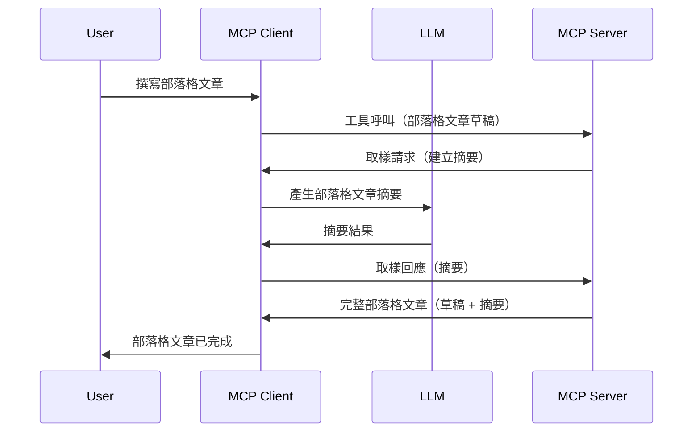

# 取樣 - 將功能委派給客戶端

有時，你需要 MCP 客戶端與 MCP 伺服器協同合作以達成共同目標。你可能遇到伺服器需要客戶端上的大型語言模型（LLM）幫助的情況。針對這種情況，取樣就是你應該使用的功能。

讓我們探索一些使用案例及如何建立一個包含取樣的解決方案。

## 概覽

本課程將著重說明何時以及在哪裡使用取樣，以及如何配置取樣。

## 學習目標

在本章節，我們將：

- 解釋什麼是取樣以及何時使用它。
- 示範如何在 MCP 中配置取樣。
- 提供取樣的實作範例。

## 什麼是取樣及為何使用它？

取樣是一項進階功能，運作方式如下：


### 取樣請求

好，現在我們有了一個可信場景的宏觀視角，讓我們來談談伺服器發送回客戶端的取樣請求。以下是該請求以 JSON-RPC 格式的樣貌：

```json
{
  "jsonrpc": "2.0",
  "id": 1,
  "method": "sampling/createMessage",
  "params": {
    "messages": [
      {
        "role": "user",
        "content": {
          "type": "text",
          "text": "Create a blog post summary of the following blog post: <BLOG POST>"
        }
      }
    ],
    "modelPreferences": {
      "hints": [
        {
          "name": "claude-3-sonnet"
        }
      ],
      "intelligencePriority": 0.8,
      "speedPriority": 0.5
    },
    "systemPrompt": "You are a helpful assistant.",
    "maxTokens": 100
  }
}
```

這裡有幾點值得說明：

- Prompt，在 content -> text 底下，是我們的提示，是指示 LLM 摘要部落格文章內容的指令。

- **modelPreferences**。此部分就是偏好設定，是對使用 LLM 配置的建議。使用者可以選擇是否採納這些建議或自行更改。在這個例子中，建議了要使用的模型以及速度和智能優先度。
- **systemPrompt**，這是你平常的系統提示，用來賦予你的 LLM 一個個性並包含指導指令。
- **maxTokens**，另一個屬性，用來建議此任務應使用的最大代幣數。

### 取樣回應

此回應是 MCP 客戶端最終發送回 MCP 伺服器的訊息，是客戶端呼叫 LLM 並等待回應後所構建的訊息。以下是其 JSON-RPC 格式範例：

```json
{
  "jsonrpc": "2.0",
  "id": 1,
  "result": {
    "role": "assistant",
    "content": {
      "type": "text",
      "text": "Here's your abstract <ABSTRACT>"
    },
    "model": "gpt-5",
    "stopReason": "endTurn"
  }
}
```

注意回應是部落格文章的摘要，正如我們所要求的。另外注意使用的 `model` 並非我們原先請求的，而是「gpt-5」而非「claude-3-sonnet」。這是為了示範使用者可以改變他們想使用的模型，而你的取樣請求只是個建議而已。

好了，既然我們了解主流程以及一個實用任務「部落格文章創作 + 摘要」，讓我們看看要怎麼使它運作。

### 訊息類型

取樣訊息不限於純文字，也可以傳送圖片和音訊。以下是 JSON-RPC 的不同樣貌：

<strong>文字</strong>

```json
{
  "type": "text",
  "text": "The message content"
}
```

<strong>圖片內容</strong>

```json
{
  "type": "image",
  "data": "base64-encoded-image-data",
  "mimeType": "image/jpeg"
}
```

<strong>音訊內容</strong>

```json
{
  "type": "audio",
  "data": "base64-encoded-audio-data",
  "mimeType": "audio/wav"
}
```

> 注意：更多取樣詳細資訊，請參閱 [官方文件](https://modelcontextprotocol.io/specification/2025-06-18/client/sampling)

## 如何在客戶端配置取樣

> 注意：如果你只是在建置伺服器端，這部分無需太多操作。

在客戶端，你需要這樣指定該功能：

```json
{
  "capabilities": {
    "sampling": {}
  }
}
```

當你選擇的客戶端與伺服器初始化時，這項設定就會被採用。

## 取樣實作範例 - 創建部落格文章

讓我們一起編寫一個取樣伺服器，我們將需要完成以下步驟：

1. 在伺服器端建立一個工具。
1. 該工具應建立一個取樣請求。
1. 工具應等待客戶端的取樣回應。
1. 然後工具產生結果。

讓我們一步一步看程式碼：

### -1- 建立工具

**python**

```python
@mcp.tool()
async def create_blog(title: str, content: str, ctx: Context[ServerSession, None]) -> str:
    """Create a blog post and generate a summary"""

```

### -2- 建立取樣請求

將你的工具擴充如下：

**python**

```python
post = BlogPost(
        id=len(posts) + 1,
        title=title,
        content=content,
        abstract=""
    )

prompt = f"Create an abstract of the following blog post: title: {title} and draft: {content} "

result = await ctx.session.create_message(
        messages=[
            SamplingMessage(
                role="user",
                content=TextContent(type="text", text=prompt),
            )
        ],
        max_tokens=100,
)

```

### -3- 等待回應並返回結果

**python**

```python
post.abstract = result.content.text

posts.append(post)

# 返回完整的產品
return json.dumps({
    "id": post.title,
    "abstract": post.abstract
})
```

### -4- 完整程式碼

**python**

```python
from starlette.applications import Starlette
from starlette.routing import Mount, Host

from mcp.server.fastmcp import Context, FastMCP

from mcp.server.session import ServerSession
from mcp.types import SamplingMessage, TextContent

import json


from uuid import uuid4
from typing import List
from pydantic import BaseModel


mcp = FastMCP("Blog post generator")

# app = FastAPI()

posts = []

class BlogPost(BaseModel):
    id: int
    title: str
    content: str
    abstract: str

posts: List[BlogPost] = []

@mcp.tool()
async def create_blog(title: str, content: str, ctx: Context[ServerSession, None]) -> str:
    """Create a blog post and generate a summary"""

    post = BlogPost(
        id=len(posts) + 1,
        title=title,
        content=content,
        abstract=""
    )

    prompt = f"Create an abstract of the following blog post: title: {title} and draft: {content} "

    result = await ctx.session.create_message(
        messages=[
            SamplingMessage(
                role="user",
                content=TextContent(type="text", text=prompt),
            )
        ],
        max_tokens=100,
    )

    post.abstract = result.content.text

    posts.append(post)

    # 返回完整的博客文章
    return json.dumps({
        "id": post.title,
        "abstract": post.abstract
    })

if __name__ == "__main__":
    print("Starting server...")
    # mcp.run()
    mcp.run(transport="streamable-http")

# 使用以下方式運行應用程序：python server.py
```

### -5- 在 Visual Studio Code 中測試

要在 Visual Studio Code 中測試，請執行以下步驟：

1. 在終端機啟動伺服器
1. 將它加入 *mcp.json*（並確保已啟動），如下範例：

   ```json
   "servers": {
      "blog-server": {
        "type": "http",
        "url": "http://localhost:8000/mcp"
      }
   }
   ```

1. 輸入一個提示：

   ```text
   create a blog post named "Where Python comes from", the content is "Python is actually named after Monty Python Flying Circus"
   ```

1. 允許取樣進行。首次測試時，你會看到一個額外的對話框，需要你接受；接著會看到正常的對話框，請求你執行工具。

1. 檢視結果。你會在 GitHub Copilot Chat 中看到美觀的呈現結果，也可以檢查原始 JSON 回應。

<strong>額外提示</strong>。Visual Studio Code 工具有很棒的取樣支援。你可以這樣配置你安裝的伺服器的取樣權限：

1. 進入擴充功能頁面。
1. 在「MCP SERVERS - INSTALLED」區塊選擇你的伺服器設定齒輪圖示。
1. 選取「Configure Model Access」，在此你可選擇 GitHub Copilot 執行取樣時可使用的模型。你也可以透過選擇「Show Sampling requests」了解近期所有取樣請求。

## 作業

本次作業，你將建置一個稍作不同的取樣整合，主要是支持生成產品描述。以下是你的場景：

<strong>場景</strong>：電子商務的後勤人員需要協助，產生產品描述太耗時。因此，你需要建置一個解決方案，可以呼叫一個名為 "create_product" 的工具，帶入「title」和「keywords」作為引數，該工具應產生一份完整的產品資料物件，其中「description」欄位將由客戶端的 LLM 填寫。

提示：使用先前所學來構建此伺服器及其工具，包含一個取樣請求。

## 解答

[解答](./solution/README.md)

## 主要重點

取樣是一項強大的功能，允許伺服器在需要 LLM 協助時將任務委派給客戶端。

## 下一步

- [第四章 - 實務實作](../../04-PracticalImplementation/README.md)

---

<!-- CO-OP TRANSLATOR DISCLAIMER START -->
**免責聲明**：  
本文件由 AI 翻譯服務 [Co-op Translator](https://github.com/Azure/co-op-translator) 翻譯而成。雖然我們致力於確保準確性，但請注意，自動翻譯可能包含錯誤或不準確之處。原文的母語版本應被視為權威資料來源。對於重要資訊，建議尋求專業人工翻譯。我們不對因使用本翻譯而引致的任何誤解或誤譯承擔責任。
<!-- CO-OP TRANSLATOR DISCLAIMER END -->