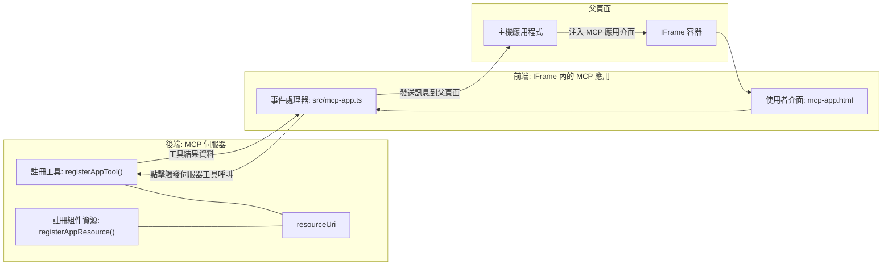

# MCP Apps

MCP Apps 是 MCP 的一個新範式。這個想法不僅是從工具調用返回數據，還提供了關於如何與這些信息互動的資訊。這意味著工具結果現在可以包含 UI 資訊。不過，我們為什麼需要這樣做呢？試想一下你今天是如何操作的。你可能會在 MCP Server 前面放一個前端，來消費它的結果，那是你需要編寫和維護的程式碼。有時候這是你想要的，但有時候如果你能直接引入一段自包含的資訊，裡面包含從數據到使用者界面的一切，那就太好了。

## 概覽

本課程提供有關 MCP Apps 的實用指導，如何開始使用及如何將其整合到你現有的網頁應用中。MCP Apps 是 MCP 標準中新增加的一部分。

## 學習目標

完成本課程後，你將能夠：

- 解釋什麼是 MCP Apps。
- 何時使用 MCP Apps。
- 建立並整合你自己的 MCP Apps。

## MCP Apps — 它如何運作

MCP Apps 的想法是提供一個本質上是一個組件的回應以供呈現。這樣的組件可以擁有視覺效果與互動性，例如按鈕點擊、使用者輸入等等。從伺服器端和我們的 MCP Server 開始。要創建一個 MCP App 組件，你需要建立一個工具，也需要有應用資源。這兩者以 resourceUri 連接。

這裡有個範例。讓我們試著視覺化涉及的部分及各部分的作用：

```text
server.ts -- responsible for registering tools and the component as a UI component
src/
  mcp-app.ts -- wiring up event handlers
mcp-app.html -- the user interface
```

此視覺圖描述了創建組件及其邏輯的架構。


讓我們接著描述後端和前端各自的職責。

### 後端

我們在這裡需要完成兩件事：

- 註冊我們想要互動的工具。
- 定義組件。

<strong>註冊工具</strong>

```typescript
registerAppTool(
    server,
    "get-time",
    {
      title: "Get Time",
      description: "Returns the current server time.",
      inputSchema: {},
      _meta: { ui: { resourceUri } }, // 將此工具連結到其用戶界面資源
    },
    async () => {
      const time = new Date().toISOString();
      return { content: [{ type: "text", text: time }] };
    },
  );

```

前述程式碼描述了行為，暴露了一個名為 `get-time` 的工具。它不接受輸入，但會產生當前時間。我們確實有能力為需要接受使用者輸入的工具定義 `inputSchema`。

<strong>註冊組件</strong>

在同一檔案中，我們也需要註冊組件：

```typescript
const resourceUri = "ui://get-time/mcp-app.html";

// 註冊資源，返回用於用戶界面的捆綁 HTML/JavaScript。
registerAppResource(
  server,
  resourceUri,
  resourceUri,
  { mimeType: RESOURCE_MIME_TYPE },
  async () => {
    const html = await fs.readFile(path.join(DIST_DIR, "mcp-app.html"), "utf-8");

    return {
    contents: [
        { uri: resourceUri, mimeType: RESOURCE_MIME_TYPE, text: html },
    ],
    };
  },
);
```

注意我們提到了 `resourceUri`，用來連接組件和其工具。有趣的是回調函式，我們在裡面載入 UI 檔案並返回組件。

### 組件前端

和後端一樣，前端這邊也有兩部分：

- 使用純 HTML 編寫的前端。
- 處理事件的程式碼，決定該怎麼做，例如呼叫工具或向母視窗傳訊。

<strong>使用者界面</strong>

讓我們看看使用者介面。

```html
<!-- mcp-app.html -->
<!DOCTYPE html>
<html lang="en">
  <head>
    <meta charset="UTF-8" />
    <title>Get Time App</title>
  </head>
  <body>
    <p>
      <strong>Server Time:</strong> <code id="server-time">Loading...</code>
    </p>
    <button id="get-time-btn">Get Server Time</button>
    <script type="module" src="/src/mcp-app.ts"></script>
  </body>
</html>
```

<strong>事件綁定</strong>

最後一部分是事件綁定。也就是我們識別 UI 中哪個部分需要事件處理器，以及事件發生時要執行什麼：

```typescript
// mcp-app.ts

import { App } from "@modelcontextprotocol/ext-apps";

// 獲取元素參考
const serverTimeEl = document.getElementById("server-time")!;
const getTimeBtn = document.getElementById("get-time-btn")!;

// 創建應用實例
const app = new App({ name: "Get Time App", version: "1.0.0" });

// 處理來自伺服器嘅工具結果。喺 `app.connect()` 之前設定以避免
// 錯過初始嘅工具結果。
app.ontoolresult = (result) => {
  const time = result.content?.find((c) => c.type === "text")?.text;
  serverTimeEl.textContent = time ?? "[ERROR]";
};

// 連接按鈕點擊事件
getTimeBtn.addEventListener("click", async () => {
  // `app.callServerTool()` 令用戶介面向伺服器請求最新資料
  const result = await app.callServerTool({ name: "get-time", arguments: {} });
  const time = result.content?.find((c) => c.type === "text")?.text;
  serverTimeEl.textContent = time ?? "[ERROR]";
});

// 連接到主機
app.connect();
```

如你所見，這是一般將 DOM 元素與事件連接的程式碼。值得注意的是呼叫 `callServerTool`，它最後會呼叫後端的工具。

## 處理使用者輸入

到目前為止，我們看到有一個組件按鈕，點擊時調用工具。讓我們看看能否添加更多 UI 元素，比如一個輸入欄位，並將參數傳給工具。我們來實作一個 FAQ 功能。實作方式如下：

- 應該有一個按鈕和一個輸入元素，讓使用者輸入關鍵字來搜尋，例如「Shipping」。這會呼叫後端工具，在 FAQ 資料中搜尋。
- 一個支援上述 FAQ 搜尋的工具。

讓我們先為後端增加需要的支援：

```typescript
const faq: { [key: string]: string } = {
    "shipping": "Our standard shipping time is 3-5 business days.",
    "return policy": "You can return any item within 30 days of purchase.",
    "warranty": "All products come with a 1-year warranty covering manufacturing defects.",
  }

registerAppTool(
    server,
    "get-faq",
    {
      title: "Search FAQ",
      description: "Searches the FAQ for relevant answers.",
      inputSchema: zod.object({
        query: zod.string().default("shipping"),
      }),
      _meta: { ui: { resourceUri: faqResourceUri } }, // 將此工具連結到其用戶界面資源
    },
    async ({ query }) => {
      const answer: string = faq[query.toLowerCase()] || "Sorry, I don't have an answer for that.";
      return { content: [{ type: "text", text: answer }] };
    },
  );
```

這裡展示我們如何填充 `inputSchema`，並給它像這樣的 `zod` 結構：

```typescript
inputSchema: zod.object({
  query: zod.string().default("shipping"),
})
```

在上述 schema 中，我們宣告有一個名為 `query` 的輸入參數，它是可選的，預設值為 "shipping"。

好的，接下來讓我們看看 *mcp-app.html*，它需要創建哪些 UI 元素：

```html
<div class="faq">
    <h1>FAQ response</h1>
    <p>FAQ Response: <code id="faq-response">Loading...</code></p>
    <input type="text" id="faq-query" placeholder="Enter FAQ query" />
    <button id="get-faq-btn">Get FAQ Response</button>
  </div>
```

很好，我們現在有一個輸入元素和一個按鈕。接著到 *mcp-app.ts* 來綁定事件：

```typescript
const getFaqBtn = document.getElementById("get-faq-btn")!;
const faqQueryInput = document.getElementById("faq-query") as HTMLInputElement;

getFaqBtn.addEventListener("click", async () => {
  const query = faqQueryInput.value;
  const result = await app.callServerTool({ name: "get-faq", arguments: { query } });
  const faq = result.content?.find((c) => c.type === "text")?.text;
  faqResponseEl.textContent = faq ?? "[ERROR]";
});
```

在上面程式碼中，我們：

- 建立互動性 UI 元素的參考。
- 處理按鈕點擊以解析輸入框的值，並呼叫 `app.callServerTool()`，提供 `name` 和 `arguments`，其中後者傳遞 `query` 的值。

實際上呼叫 `callServerTool` 是發送訊息到母視窗，該視窗最後會呼叫 MCP Server。

### 嘗試一下

嘗試後，我們應該會看到以下畫面：


這裡是輸入「warranty」嘗試搜尋的畫面


要執行這段程式，請前往 [Code section](./code/README.md)

## 在 Visual Studio Code 測試

Visual Studio Code 對 MCP Apps 有很好的支援，並且可能是測試 MCP Apps 最簡單的方法。要使用 Visual Studio Code，請在 *mcp.json* 增加 server 條目，如下所示：

```json
"my-mcp-server-7178eca7": {
    "url": "http://localhost:3001/mcp",
    "type": "http"
  }
```

然後啟動伺服器，你應該能透過聊天視窗與你的 MCP App 進行溝通，前提是你已安裝 GitHub Copilot。

你可以透過輸入提示觸發，例如輸入 "#get-faq"：


就像你在網頁瀏覽器執行時，它會以相同方式呈現：


## 作業

建立一個猜拳（石頭剪刀布）遊戲，內容應包括以下：

UI：

- 一個帶有選項的下拉清單
- 一個提交選擇的按鈕
- 一個標籤顯示誰出什麼以及誰贏了

伺服器：

- 應有一個接收 "choice" 作為輸入的猜拳工具。它還會顯示電腦的選擇並判斷獲勝者

## 解答

[解答](./assignment/README.md)

## 總結

我們學會了 MCP Apps 這個新範式。這是一個新範式，允許 MCP Servers 不僅對數據有看法，還對該如何呈現這些數據有意見。

此外，我們還了解到這些 MCP Apps 是被嵌入在 IFrame 裡，並且要和 MCP Servers 通信，它們需要向母網頁應用發送訊息。有多個函式庫可用於純 JavaScript、React 等，使這種通信更簡單。

## 主要結論

你學到了：

- MCP Apps 是一個新標準，當你想同時交付數據和 UI 功能時會很有用。
- 這類應用出於安全考量，在 IFrame 裡運行。

## 接下來

- [第 4 章](../../04-PracticalImplementation/README.md)

---

<!-- CO-OP TRANSLATOR DISCLAIMER START -->
**免責聲明**：  
本文件使用人工智能翻譯服務 [Co-op Translator](https://github.com/Azure/co-op-translator) 進行翻譯。雖然我們努力確保準確性，但請注意自動翻譯可能包含錯誤或不準確之處。原始文件的母語版本應被視為權威來源。對於重要資訊，建議尋求專業人工翻譯。我們不對因使用本翻譯而產生的任何誤解或誤釋負責。
<!-- CO-OP TRANSLATOR DISCLAIMER END -->