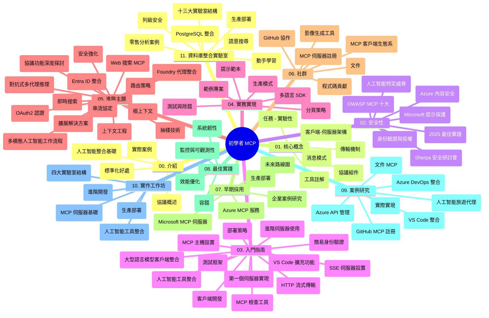

# 面向初學者的模型上下文協議 (MCP) - 學習指南

本學習指南提供了「面向初學者的模型上下文協議 (MCP)」課程的倉庫結構與內容總覽。使用本指南可有效導航倉庫並充分利用現有資源。

## 倉庫總覽

模型上下文協議 (MCP) 是一個 AI 模型與客戶端應用程式交互的標準化框架。最初由 Anthropic 創建，現由更廣泛的 MCP 社群透過官方 GitHub 組織維護。本倉庫提供一套全面課程，包括 C#、Java、JavaScript、Python 與 TypeScript 的實作範例，專為 AI 開發者、系統架構師和軟體工程師設計。

## 視覺課程地圖

## 倉庫結構

本倉庫組織為十一個主要部分，各自聚焦 MCP 的不同面向：

1. **介紹 (00-Introduction/)**
   - 模型上下文協議概述
   - 為何 AI 流程中標準化至關重要
   - 實際應用範例與效益

2. **核心概念 (01-CoreConcepts/)**
   - 客戶端-伺服器架構
   - 主要協議組件
   - MCP 中的訊息傳遞模式

3. **安全性 (02-Security/)**
   - MCP 系統中的安全威脅
   - 安全實作最佳實踐
   - 身份驗證與授權策略
   - <strong>全面安全文件</strong>：
     - MCP 安全最佳實踐 2025
     - Azure 內容安全實施指南
     - MCP 安全控管與技術
     - MCP 最佳實踐快速參考
   - <strong>關鍵安全議題</strong>：
     - 提示注入與工具中毒攻擊
     - 會話劫持與混淆代理問題
     - 令牌直通漏洞
     - 過度權限與存取控制
     - AI 元件供應鏈安全
     - 微軟提示防護整合

4. **入門指南 (03-GettingStarted/)**
   - 環境設置與配置
   - 建立基本 MCP 伺服器與客戶端
   - 與現有應用整合
   - 包含章節：
     - 首個伺服器實作
     - 客戶端開發
     - LLM 客戶端整合
     - VS Code 整合
     - Server-Sent Events (SSE) 伺服器
     - 進階伺服器使用
     - HTTP 串流
     - AI 工具包整合
     - 測試策略
     - 部署指引

5. **實務實作 (04-PracticalImplementation/)**
   - 使用多語言 SDK
   - 除錯、測試與驗證技巧
   - 製作可重用提示模板與工作流程
   - 實作範例專案

6. **進階議題 (05-AdvancedTopics/)**
   - 上下文工程技術
   - Foundry 代理整合
   - 多模態 AI 工作流程
   - OAuth2 驗證示範
   - 即時搜尋功能
   - 即時串流
   - 根上下文實作
   - 路由策略
   - 取樣技巧
   - 擴展方法
   - 安全性注意事項
   - Entra ID 安全整合
   - 網頁搜尋整合
   - 反對抗多代理推理 (辯論模式)

7. **社群貢獻 (06-CommunityContributions/)**
   - 如何貢獻程式碼與文件
   - 透過 GitHub 協作
   - 社群驅動的增強與回饋
   - 使用各種 MCP 客戶端（Claude Desktop、Cline、VSCode）
   - 使用熱門 MCP 伺服器含影像產生

8. **早期採用經驗 (07-LessonsfromEarlyAdoption/)**
   - 實際案例與成功故事
   - 建置並部署 MCP 解決方案
   - 趨勢與未來路線圖
   - **微軟 MCP 伺服器指南**：涵蓋 10 款可生產使用的微軟 MCP 伺服器：
     - Microsoft Learn Docs MCP 伺服器
     - Azure MCP 伺服器（15+ 專用連接器）
     - GitHub MCP 伺服器
     - Azure DevOps MCP 伺服器
     - MarkItDown MCP 伺服器
     - SQL Server MCP 伺服器
     - Playwright MCP 伺服器
     - Dev Box MCP 伺服器
     - Azure AI Foundry MCP 伺服器
     - Microsoft 365 Agents Toolkit MCP 伺服器

9. **最佳實踐 (08-BestPractices/)**
   - 性能調校與優化
   - 容錯設計 MCP 系統
   - 測試與彈性策略

10. **個案研究 (09-CaseStudy/)**
    - <strong>七個完整案例研究</strong>展示 MCP 在多元場景的靈活應用：
    - **Azure AI 旅遊代理**：使用 Azure OpenAI 與 AI 搜尋的多代理編排
    - **Azure DevOps 整合**：用 YouTube 數據更新自動化工作流
    - <strong>實時文件檢索</strong>：Python 控制台客戶端搭配串流 HTTP
    - <strong>互動學習計畫生成器</strong>：Chainlit 網頁應用與對話式 AI
    - <strong>編輯器內文件</strong>：VS Code 整合 GitHub Copilot 工作流程
    - **Azure API 管理**：企業 API 整合與 MCP 伺服器開發
    - **GitHub MCP 登錄**：生態系統開發與代理整合平台
    - 涵蓋企業整合、開發者生產力與生態系統擴展

11. **實作工作坊 (10-StreamliningAIWorkflowsBuildingAnMCPServerWithAIToolkit/)**
    - 結合 MCP 與 AI 工具包的完整實作工作坊
    - 建構連結 AI 模型與現實工具的智慧應用
    - 涵蓋基礎、客製伺服器開發與生產部署模組
    - <strong>實驗室結構</strong>：
      - 實驗室 1：MCP 伺服器基礎
      - 實驗室 2：進階 MCP 伺服器開發
      - 實驗室 3：AI 工具包整合
      - 實驗室 4：生產部署與擴展
    - 基於實驗室的分步學習方式

12. **MCP 伺服器資料庫整合實驗室 (11-MCPServerHandsOnLabs/)**
    - **完整 13 實驗室學習路徑**，涵蓋 PostgreSQL 整合的生產就緒 MCP 伺服器建置
    - <strong>真實零售分析案例</strong>使用 Zava Retail 用例
    - <strong>企業級模式</strong>包含列級安全 (RLS)、語義搜尋與多租戶資料存取
    - <strong>完整實驗室結構</strong>：
      - **實驗室 00-03：基礎** - 介紹、架構、安全性、環境設置
      - **實驗室 04-06：構建 MCP 伺服器** - 資料庫設計、MCP 伺服器實作、工具開發
      - **實驗室 07-09：進階功能** - 語義搜尋、測試與除錯、VS Code 整合
      - **實驗室 10-12：生產與最佳實踐** - 部署、監控、優化
    - <strong>涵蓋技術</strong>：FastMCP 框架、PostgreSQL、Azure OpenAI、Azure Container Apps、Application Insights
    - <strong>學習成果</strong>：生產就緒 MCP 伺服器、資料庫整合模式、AI 驅動分析、企業安全

## 額外資源

倉庫包含支援資源：

- **Images 文件夾**：課程中使用的圖解與插圖
- <strong>多語言翻譯</strong>：文件自動化多語言支持
- **官方 MCP 資源**：
  - [MCP 文件](https://modelcontextprotocol.io/)
  - [MCP 規範](https://spec.modelcontextprotocol.io/)
  - [MCP GitHub 倉庫](https://github.com/modelcontextprotocol)

## 如何使用本倉庫

1. <strong>循序漸進學習</strong>：依章節順序 (00 至 11) 系統學習。
2. <strong>語言導向重點</strong>：若關注特定程式語言，探索 samples 目錄下對應語言的實作。
3. <strong>實務操作</strong>：從「入門指南」開始設置環境並建立首個 MCP 伺服器與客戶端。
4. <strong>進階探索</strong>：熟悉基礎後，進入進階議題擴展知識。
5. <strong>社群參與</strong>：通過 GitHub 討論與 Discord 頻道加入 MCP 社群，交流專業知識與經驗。

## MCP 客戶端與工具

課程涵蓋多種 MCP 客戶端與工具：

1. <strong>官方客戶端</strong>：
   - Visual Studio Code
   - Visual Studio Code 中的 MCP
   - Claude Desktop
   - VSCode 版本的 Claude
   - Claude API

2. <strong>社群客戶端</strong>：
   - Cline (終端機版)
   - Cursor (程式碼編輯器)
   - ChatMCP
   - Windsurf

3. **MCP 管理工具**：
   - MCP CLI
   - MCP Manager
   - MCP Linker
   - MCP Router

## 熱門 MCP 伺服器

倉庫介紹多款 MCP 伺服器，包括：

1. **官方微軟 MCP 伺服器**：
   - Microsoft Learn Docs MCP 伺服器
   - Azure MCP 伺服器 (15+ 專用連接器)
   - GitHub MCP 伺服器
   - Azure DevOps MCP 伺服器
   - MarkItDown MCP 伺服器
   - SQL Server MCP 伺服器
   - Playwright MCP 伺服器
   - Dev Box MCP 伺服器
   - Azure AI Foundry MCP 伺服器
   - Microsoft 365 Agents Toolkit MCP 伺服器

2. <strong>官方參考伺服器</strong>：
   - Filesystem
   - Fetch
   - Memory
   - Sequential Thinking

3. <strong>影像生成</strong>：
   - Azure OpenAI DALL-E 3
   - Stable Diffusion WebUI
   - Replicate

4. <strong>開發工具</strong>：
   - Git MCP
   - Terminal Control
   - Code Assistant

5. <strong>專用伺服器</strong>：
   - Salesforce
   - Microsoft Teams
   - Jira 與 Confluence

## 貢獻

本倉庫歡迎社群貢獻，請參閱社群貢獻章節以獲得如何有效參與 MCP 生態系的指引。

----

*本學習指南最後更新於 2026 年 2 月 5 日，反映最新的 MCP 規範 2025-11-25，並提供當時的倉庫概況。倉庫內容後續可能有更新。*

---

<!-- CO-OP TRANSLATOR DISCLAIMER START -->
**免責聲明**：  
本文件係使用 AI 翻譯服務 [Co-op Translator](https://github.com/Azure/co-op-translator) 進行翻譯。儘管我們致力於確保準確性，但請注意，自動翻譯可能包含錯誤或不準確之處。原始文件之母語版本應被視為權威來源。對於重要資訊，建議採用專業人工翻譯。我們對因使用本翻譯而引起的任何誤解或錯誤詮釋概不負責。
<!-- CO-OP TRANSLATOR DISCLAIMER END -->