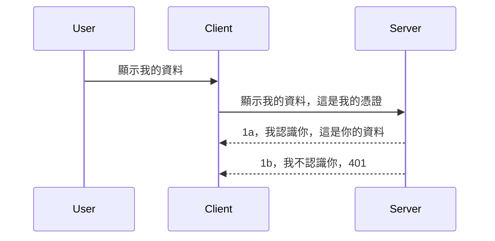

# 簡易認證

MCP SDK 支援使用 OAuth 2.1，說實話這是一個相當繁複的流程，涵蓋了認證伺服器、資源伺服器、發布憑證、取得代碼、交換代碼以取得承載者令牌，直到你終於能取得資源資料。如果你對 OAuth 不熟悉，雖然它是一個很棒的實作方案，建議先從一些基礎的認證開始，然後逐漸建立更完善的安全性。這就是本章存在的原因，幫助你進階到更先進的認證。

## 認證，我們指的是什麼？

認證是 authentication 與 authorization 的縮寫。概念是我們需要做兩件事：

- **Authentication（身份驗證）**，這是判斷我們是否讓一個人進入我們家門的過程，也就是判斷他是否有權限「待在這裡」，即是否能存取我們 MCP Server 功能所在的資源伺服器。
- **Authorization（授權）**，是判斷使用者是否能存取他所要求的特定資源的過程，比如這些訂單、這些商品，或者他是否有權限讀取內容但不能刪除（舉例）。

## 憑證：我們如何告訴系統我們是誰

大部分網頁開發者會想到提供一組憑證給伺服器，通常是一個秘密用來證明他們是否被允許「驗證」通過。這憑證通常是使用 base64 編碼的使用者名稱與密碼組合，或是唯一識別特定使用者的 API 金鑰。

這會透過名為 "Authorization" 的標頭欄位發送，如下：

```json
{ "Authorization": "secret123" }
```

這通常稱為基本認證。整體流程如下：


了解整體流程後，我們該怎麼實作呢？大多數網頁伺服器都具備 middleware（中介軟體）的概念，即一段在請求流程中運行的程式碼，可以用來驗證憑證，若憑證有效即讓請求通行，否則回傳認證錯誤。我們來看看此如何實作：

**Python**

```python
class AuthMiddleware(BaseHTTPMiddleware):
    async def dispatch(self, request, call_next):

        has_header = request.headers.get("Authorization")
        if not has_header:
            print("-> Missing Authorization header!")
            return Response(status_code=401, content="Unauthorized")

        if not valid_token(has_header):
            print("-> Invalid token!")
            return Response(status_code=403, content="Forbidden")

        print("Valid token, proceeding...")
       
        response = await call_next(request)
        # 添加任何客戶端標頭或以某種方式更改回應內容
        return response


starlette_app.add_middleware(CustomHeaderMiddleware)
```

此處我們：

- 建立一個名為 `AuthMiddleware` 的中介軟體，其 `dispatch` 方法由網頁伺服器呼叫。
- 將此中介軟體加入網頁伺服器：

    ```python
    starlette_app.add_middleware(AuthMiddleware)
    ```

- 撰寫驗證邏輯檢查是否帶有 Authorization 標頭及所傳送的秘密是否有效：

    ```python
    has_header = request.headers.get("Authorization")
    if not has_header:
        print("-> Missing Authorization header!")
        return Response(status_code=401, content="Unauthorized")

    if not valid_token(has_header):
        print("-> Invalid token!")
        return Response(status_code=403, content="Forbidden")
    ```

    如果秘密存在且有效，呼叫 `call_next` 讓請求通過並回傳回應。

    ```python
    response = await call_next(request)
    # 在回應中加入任何客戶端標頭或做出一些更改
    return response
    ```

運作方式是若有網頁請求對伺服器發起，中介軟體會被呼叫，依實作內容要麼讓請求通過，要麼回傳不允許用戶繼續的錯誤。

**TypeScript**

此處使用流行框架 Express 建立中介軟體，攔截請求到達 MCP Server 前的流程。程式碼如下：

```typescript
function isValid(secret) {
    return secret === "secret123";
}

app.use((req, res, next) => {
    // 1. 是否存在授權標頭？
    if(!req.headers["Authorization"]) {
        res.status(401).send('Unauthorized');
    }
    
    let token = req.headers["Authorization"];

    // 2. 檢查有效性。
    if(!isValid(token)) {
        res.status(403).send('Forbidden');
    }

   
    console.log('Middleware executed');
    // 3. 將請求傳遞到請求流程的下一步。
    next();
});
```

此程式碼中：

1. 先檢查是否有 Authorization 標頭，無則回傳 401 錯誤。
2. 確認憑證/令牌是否有效，無效則回傳 403 錯誤。
3. 最後讓請求繼續流程並回傳所請求資源。

## 練習：實作認證

讓我們用所學嘗試實作，計劃如下：

伺服器

- 建立網頁伺服器與 MCP 實例。
- 為伺服器實作中介軟體。

用戶端

- 透過標頭帶入憑證發送網路請求。

### -1- 建立網頁伺服器與 MCP 實例

第一步，我們需要建立網頁伺服器實例和 MCP 伺服器。

**Python**

此處建立 MCP Server 實例，建立 starlette 網頁應用並用 uvicorn 主機啟動。

```python
# 建立 MCP 伺服器

app = FastMCP(
    name="MCP Resource Server",
    instructions="Resource Server that validates tokens via Authorization Server introspection",
    host=settings["host"],
    port=settings["port"],
    debug=True
)

# 建立 starlette 網頁應用程式
starlette_app = app.streamable_http_app()

# 透過 uvicorn 提供應用程式服務
async def run(starlette_app):
    import uvicorn
    config = uvicorn.Config(
            starlette_app,
            host=app.settings.host,
            port=app.settings.port,
            log_level=app.settings.log_level.lower(),
        )
    server = uvicorn.Server(config)
    await server.serve()

run(starlette_app)
```

程式中我們：

- 建立 MCP Server。
- 從 MCP Server 建構 starlette 網頁應用 `app.streamable_http_app()`。
- 透過 uvicorn 執行並服務該網頁應用 `server.serve()`。

**TypeScript**

此處建立 MCP Server 實例。

```typescript
const server = new McpServer({
      name: "example-server",
      version: "1.0.0"
    });

    // ... 設置伺服器資源、工具和提示 ...
```

此 MCP Server 建立需發生於 POST /mcp 路由中，因此將上述程式碼移動至此：

```typescript
import express from "express";
import { randomUUID } from "node:crypto";
import { McpServer } from "@modelcontextprotocol/sdk/server/mcp.js";
import { StreamableHTTPServerTransport } from "@modelcontextprotocol/sdk/server/streamableHttp.js";
import { isInitializeRequest } from "@modelcontextprotocol/sdk/types.js"

const app = express();
app.use(express.json());

// 用於以會話 ID 儲存傳輸的映射
const transports: { [sessionId: string]: StreamableHTTPServerTransport } = {};

// 處理客戶端到伺服器的 POST 請求
app.post('/mcp', async (req, res) => {
  // 檢查是否有現有的會話 ID
  const sessionId = req.headers['mcp-session-id'] as string | undefined;
  let transport: StreamableHTTPServerTransport;

  if (sessionId && transports[sessionId]) {
    // 重用現有的傳輸
    transport = transports[sessionId];
  } else if (!sessionId && isInitializeRequest(req.body)) {
    // 新的初始化請求
    transport = new StreamableHTTPServerTransport({
      sessionIdGenerator: () => randomUUID(),
      onsessioninitialized: (sessionId) => {
        // 以會話 ID 儲存傳輸
        transports[sessionId] = transport;
      },
      // DNS 重綁定保護預設為關閉，以保持向後相容性。如果您在本機運行此伺服器
      // 請確保設定：
      // enableDnsRebindingProtection: true,
      // allowedHosts: ['127.0.0.1'],
    });

    // 傳輸關閉時清理資源
    transport.onclose = () => {
      if (transport.sessionId) {
        delete transports[transport.sessionId];
      }
    };
    const server = new McpServer({
      name: "example-server",
      version: "1.0.0"
    });

    // ... 設定伺服器資源、工具及提示 ...

    // 連接至 MCP 伺服器
    await server.connect(transport);
  } else {
    // 無效的請求
    res.status(400).json({
      jsonrpc: '2.0',
      error: {
        code: -32000,
        message: 'Bad Request: No valid session ID provided',
      },
      id: null,
    });
    return;
  }

  // 處理請求
  await transport.handleRequest(req, res, req.body);
});

// GET 和 DELETE 請求的可重用處理器
const handleSessionRequest = async (req: express.Request, res: express.Response) => {
  const sessionId = req.headers['mcp-session-id'] as string | undefined;
  if (!sessionId || !transports[sessionId]) {
    res.status(400).send('Invalid or missing session ID');
    return;
  }
  
  const transport = transports[sessionId];
  await transport.handleRequest(req, res);
};

// 處理透過 SSE 的伺服器到客戶端通知的 GET 請求
app.get('/mcp', handleSessionRequest);

// 處理終止會話的 DELETE 請求
app.delete('/mcp', handleSessionRequest);

app.listen(3000);
```

如你所見 MCP Server 建立是在 `app.post("/mcp")` 內。

接著進入下一步，建立中介軟體以驗證傳入的憑證。

### -2- 為伺服器實作中介軟體

接下來開始處理中介軟體。我們將建立一個中介軟體，尋找 `Authorization` 標頭裡的憑證並驗證。如接受則讓請求繼續（例如列出工具、讀取資源或任何 MCP 功能）。

**Python**

建立中介軟體，我們要繼承 `BaseHTTPMiddleware` 類別。主要有兩個有趣點：

- `request` 請求物件，我們從中讀取標頭資訊。
- `call_next` 回呼函式，當用戶端帶入可接受的憑證時需呼叫。

首先，處理缺少 `Authorization` 標頭情況：

```python
has_header = request.headers.get("Authorization")

# 沒有標頭，回傳 401 錯誤，否則繼續。
if not has_header:
    print("-> Missing Authorization header!")
    return Response(status_code=401, content="Unauthorized")
```

此處回傳 401 未授權訊息，因用戶端驗證失敗。

接著，有提交憑證時，需檢查有效性：

```python
 if not valid_token(has_header):
    print("-> Invalid token!")
    return Response(status_code=403, content="Forbidden")
```

注意此處回傳 403 禁止訪問訊息。下方是完整中介軟體實作，涵蓋以上所有描述：

```python
class AuthMiddleware(BaseHTTPMiddleware):
    async def dispatch(self, request, call_next):

        has_header = request.headers.get("Authorization")
        if not has_header:
            print("-> Missing Authorization header!")
            return Response(status_code=401, content="Unauthorized")

        if not valid_token(has_header):
            print("-> Invalid token!")
            return Response(status_code=403, content="Forbidden")

        print("Valid token, proceeding...")
        print(f"-> Received {request.method} {request.url}")
        response = await call_next(request)
        response.headers['Custom'] = 'Example'
        return response

```

那麼 `valid_token` 函式呢？看下面：

```python
# 不要用於生產環境 - 請改進它 !!
def valid_token(token: str) -> bool:
    # 移除 "Bearer " 前綴
    if token.startswith("Bearer "):
        token = token[7:]
        return token == "secret-token"
    return False
```

當然這部分應該持續改善。

重要：你絕不應該將秘密直接硬編在程式碼裡。理想情況是從資料來源或 IDP（身份識別服務提供者）取得比對值，或更好是交給 IDP 執行驗證。

**TypeScript**

使用 Express 實作需呼叫 `use` 方法加入中介軟體函式。

我們必須：

- 操作請求變數，檢查 `Authorization` 屬性中的憑證。
- 驗證憑證，若合格允許請求繼續，執行用戶端的 MCP 請求（如列出工具、讀取資源或相關功能）。

此處檢查是否有送出 `Authorization` 標頭，若無結束請求：

```typescript
if(!req.headers["authorization"]) {
    res.status(401).send('Unauthorized');
    return;
}
```

無標頭時會回傳 401。

接著檢查憑證有效性，無效則結束但回報稍微不同訊息：

```typescript
if(!isValid(token)) {
    res.status(403).send('Forbidden');
    return;
} 
```

這裡顯示 403 錯誤。

完整程式碼如下：

```typescript
app.use((req, res, next) => {
    console.log('Request received:', req.method, req.url, req.headers);
    console.log('Headers:', req.headers["authorization"]);
    if(!req.headers["authorization"]) {
        res.status(401).send('Unauthorized');
        return;
    }
    
    let token = req.headers["authorization"];

    if(!isValid(token)) {
        res.status(403).send('Forbidden');
        return;
    }  

    console.log('Middleware executed');
    next();
});
```

我們已設定網頁伺服器接受中介軟體檢核用戶端寄送的憑證。那用戶端本身呢？

### -3- 透過標頭帶入憑證發送網頁請求

我們要確保用戶端透過標頭呈遞憑證。因為我們使用 MCP 用戶端，需了解如何操作。

**Python**

用戶端需傳入含憑證的標頭，如：

```python
# 不要將值硬編碼，至少應該放在環境變數或更安全的存儲中
token = "secret-token"

async with streamablehttp_client(
        url = f"http://localhost:{port}/mcp",
        headers = {"Authorization": f"Bearer {token}"}
    ) as (
        read_stream,
        write_stream,
        session_callback,
    ):
        async with ClientSession(
            read_stream,
            write_stream
        ) as session:
            await session.initialize()
      
            # 待辦事項，您希望在客戶端完成的操作，例如列出工具、呼叫工具等。
```

注意我們這裡將 `headers` 設置為 `headers = {"Authorization": f"Bearer {token}"}`。

**TypeScript**

此處分兩步完成：

1. 建立配置物件放入憑證。
2. 將配置物件傳入 transport。

```typescript

// 不要像這裡展示的這樣硬編碼值。至少要將其設為環境變數，並在開發模式下使用類似 dotenv 的工具。
let token = "secret123"

// 定義一個用戶端傳輸選項物件
let options: StreamableHTTPClientTransportOptions = {
  sessionId: sessionId,
  requestInit: {
    headers: {
      "Authorization": "secret123"
    }
  }
};

// 將選項物件傳遞給傳輸層
async function main() {
   const transport = new StreamableHTTPClientTransport(
      new URL(serverUrl),
      options
   );
```

如上面可見，我們建立 `options` 物件於 `requestInit` 屬性下帶入標頭。

重要：那如何將此改進呢？現行做法有些問題，最重要的是在沒有 HTTPS 的狀況下，憑證傳遞相當危險。即使有 HTTPS，憑證仍有可能被竊取，因此需要一套可輕易撤銷令牌及附加檢查系統，例如確認令牌來自哪裡，是否請求頻率過高（類似機器人行為）。簡言之，要面對許多安全問題。

不過，對於簡單的 API ，不希望有人未經身份驗證就呼叫 API，這樣的開始是相當不錯的。

那麼，我們來嘗試使用標準格式 JSON Web Token，也稱 JWT 或 JOT 令牌，來加強安全性。

## JSON Web Tokens，JWT

我們嘗試改進簡單憑證的做法。採用 JWT 的直接好處是？

- <strong>安全提升</strong>。基本認證中，你不斷傳送 base64 編碼的使用者名稱與密碼（或 API 金鑰），風險較高。而 JWT 會在驗證一次後回傳一個令牌，且該令牌有期限，會過期。JWT 也支援細緻的存取控制，如角色、範圍與權限。
- <strong>無狀態與可擴充性</strong>。JWT 自包含用戶資訊，免去伺服器需要維護會話狀態，也能本地驗證令牌。
- <strong>相容性與聯邦認證</strong>。JWT 是 Open ID Connect 的核心，廣泛用於知名身份供應商如 Entra ID、Google Identity 和 Auth0。也支持單點登入與更多企業級功能。
- <strong>模組化與彈性</strong>。JWT 可搭配 API Gateway（如 Azure API Management、NGINX 等）使用，支援身份驗證場景與伺服器對伺服器通訊，包括冒充與委派。
- <strong>效能與快取</strong>。JWT 可在解碼後被快取，減少每次驗證都須解析的成本，有效提升高流量應用的吞吐量與下游架構負載。
- <strong>進階功能</strong>。支持令牌內省（在伺服器端檢查有效性）與撤銷（使令牌失效）。

擁有以上優點，我們來看看如何把實作推進到下一個層級。

## 將基本認證改成 JWT

主要要做的改動大致為：

- **學會構造 JWT 令牌**，讓令牌可由用戶端傳送給伺服器。
- **驗證 JWT 令牌**，若有效，允許用戶端存取資源。
- <strong>安全存放令牌</strong>。如何妥善儲存令牌。
- <strong>保護路由</strong>。保護路由及特定 MCP 功能。
- <strong>加入刷新令牌</strong>。確保有短期有效令牌與長期有效刷新令牌，供令牌過期時換發新令牌，並實作刷新端點及輪替策略。

### -1- 建構 JWT 令牌

首先，JWT 令牌包含以下部分：

- <strong>標頭</strong>，使用的演算法與令牌類型。
- <strong>有效載荷</strong>，宣告內容，如 sub（代表令牌使用者或實體，通常為使用者 ID）、exp（過期時間）、role（角色）。
- <strong>簽名</strong>，透過密鑰或私鑰簽名。

我們將構造標頭、有效載荷並編碼令牌。

**Python**

```python

import jwt
import jwt
from jwt.exceptions import ExpiredSignatureError, InvalidTokenError
import datetime

# 用於簽署 JWT 的秘密金鑰
secret_key = 'your-secret-key'

header = {
    "alg": "HS256",
    "typ": "JWT"
}

# 使用者資訊及其聲明與到期時間
payload = {
    "sub": "1234567890",               # 主題（使用者 ID）
    "name": "User Userson",                # 自訂聲明
    "admin": True,                     # 自訂聲明
    "iat": datetime.datetime.utcnow(),# 發行時間
    "exp": datetime.datetime.utcnow() + datetime.timedelta(hours=1)  # 到期時間
}

# 編碼它
encoded_jwt = jwt.encode(payload, secret_key, algorithm="HS256", headers=header)
```

上述程式碼中：

- 定義使用 HS256 演算法及 JWT 令牌類型的標頭。
- 建立有效載荷（payload），包含主體（使用者 ID）、使用者名稱、角色、簽發時間和過期時間，實現前述的時間限制。

**TypeScript**

此處需要安裝一些協助構造 JWT 的套件。

依賴套件

```sh

npm install jsonwebtoken
npm install --save-dev @types/jsonwebtoken
```

安裝完成後，我們建立標頭、有效載荷並生成編碼令牌。

```typescript
import jwt from 'jsonwebtoken';

const secretKey = 'your-secret-key'; // 在生產環境中使用環境變數

// 定義有效載荷
const payload = {
  sub: '1234567890',
  name: 'User usersson',
  admin: true,
  iat: Math.floor(Date.now() / 1000), // 發行時間
  exp: Math.floor(Date.now() / 1000) + 60 * 60 // 一小時後過期
};

// 定義標頭（可選，jsonwebtoken 預設會設定）
const header = {
  alg: 'HS256',
  typ: 'JWT'
};

// 創建令牌
const token = jwt.sign(payload, secretKey, {
  algorithm: 'HS256',
  header: header
});

console.log('JWT:', token);
```

該令牌：

使用 HS256 簽名
有效期為 1 小時
包含 sub、name、admin、iat 與 exp 等宣告。

### -2- 驗證令牌

我們也必須驗證令牌，這通常在伺服器端執行以確保用戶端送來的內容有效。我們應檢查結構及有效性，可額外加入其他檢查（例如用戶是否存在於系統、是否有授權等）。

驗證令牌需先解碼以讀取資料，接著判定其有效：

**Python**

```python

# 解碼並驗證 JWT
try:
    decoded = jwt.decode(token, secret_key, algorithms=["HS256"])
    print("✅ Token is valid.")
    print("Decoded claims:")
    for key, value in decoded.items():
        print(f"  {key}: {value}")
except ExpiredSignatureError:
    print("❌ Token has expired.")
except InvalidTokenError as e:
    print(f"❌ Invalid token: {e}")

```

程式碼中，我們透過 `jwt.decode` 呼叫，把令牌、密鑰與演算法傳入。注意使用 try-catch 結構，因驗證失敗會擲出例外。

**TypeScript**

此處呼叫 `jwt.verify` 取得已解碼的令牌，以供進一步分析。若呼叫失敗，代表令牌結構不正確或已失效。

```typescript

try {
  const decoded = jwt.verify(token, secretKey);
  console.log('Decoded Payload:', decoded);
} catch (err) {
  console.error('Token verification failed:', err);
}
```

注意：如前所述，建議增加額外檢查，確保令牌指向的用戶存在且具備其宣稱的權利。

接著，我們來看基於角色的存取控制（RBAC）。
## 新增基於角色的存取控制

我們的想法是想要表達不同角色具有不同的權限。例如，我們假設管理員可以執行所有操作，普通用戶可以讀寫，而訪客只能讀取。因此，這裡有一些可能的權限層級：

- Admin.Write
- User.Read
- Guest.Read

讓我們看看如何用中介軟體實作這類控制。中介軟體可以每條路由添加，也可以對所有路由添加。

**Python**

```python
from starlette.middleware.base import BaseHTTPMiddleware
from starlette.responses import JSONResponse
import jwt

# 不要將密鑰寫在程式碼中，這僅供示範用。請從安全的地方讀取它。
SECRET_KEY = "your-secret-key" # 將此放在環境變數中
REQUIRED_PERMISSION = "User.Read"

class JWTPermissionMiddleware(BaseHTTPMiddleware):
    async def dispatch(self, request, call_next):
        auth_header = request.headers.get("Authorization")
        if not auth_header or not auth_header.startswith("Bearer "):
            return JSONResponse({"error": "Missing or invalid Authorization header"}, status_code=401)

        token = auth_header.split(" ")[1]
        try:
            decoded = jwt.decode(token, SECRET_KEY, algorithms=["HS256"])
        except jwt.ExpiredSignatureError:
            return JSONResponse({"error": "Token expired"}, status_code=401)
        except jwt.InvalidTokenError:
            return JSONResponse({"error": "Invalid token"}, status_code=401)

        permissions = decoded.get("permissions", [])
        if REQUIRED_PERMISSION not in permissions:
            return JSONResponse({"error": "Permission denied"}, status_code=403)

        request.state.user = decoded
        return await call_next(request)


```

下面有幾種不同的方法可以添加中介軟體：

```python

# 方案 1：在構建 starlette 應用時添加中介軟體
middleware = [
    Middleware(JWTPermissionMiddleware)
]

app = Starlette(routes=routes, middleware=middleware)

# 方案 2：在 starlette 應用已構建後添加中介軟體
starlette_app.add_middleware(JWTPermissionMiddleware)

# 方案 3：對每個路由添加中介軟體
routes = [
    Route(
        "/mcp",
        endpoint=..., # 處理程序
        middleware=[Middleware(JWTPermissionMiddleware)]
    )
]
```

**TypeScript**

我們可以使用 `app.use` 與一個會針對所有請求執行的中介軟體。

```typescript
app.use((req, res, next) => {
    console.log('Request received:', req.method, req.url, req.headers);
    console.log('Headers:', req.headers["authorization"]);

    // 1. 檢查是否已發送授權標頭

    if(!req.headers["authorization"]) {
        res.status(401).send('Unauthorized');
        return;
    }
    
    let token = req.headers["authorization"];

    // 2. 檢查令牌是否有效
    if(!isValid(token)) {
        res.status(403).send('Forbidden');
        return;
    }  

    // 3. 檢查令牌使用者是否存在於我們的系統中
    if(!isExistingUser(token)) {
        res.status(403).send('Forbidden');
        console.log("User does not exist");
        return;
    }
    console.log("User exists");

    // 4. 驗證令牌是否具有正確的權限
    if(!hasScopes(token, ["User.Read"])){
        res.status(403).send('Forbidden - insufficient scopes');
    }

    console.log("User has required scopes");

    console.log('Middleware executed');
    next();
});

```

我們可以讓中介軟體做很多事情，且中介軟體應該要做這些事情，具體為：

1. 檢查授權標頭是否存在
2. 檢查令牌是否有效，我們調用 `isValid`，這是我們寫的用來檢查 JWT 令牌的完整性和有效性的方法。
3. 驗證該使用者是否存在於我們的系統，我們應該要檢查這點。

   ```typescript
    // 資料庫中的使用者
   const users = [
     "user1",
     "User usersson",
   ]

   function isExistingUser(token) {
     let decodedToken = verifyToken(token);

     // 待辦，檢查使用者是否存在於資料庫中
     return users.includes(decodedToken?.name || "");
   }
   ```

   上述，我們建立了非常簡單的 `users` 清單，顯然應該存在資料庫中。

4. 此外，我們還應該檢查令牌是否擁有正確的權限。

   ```typescript
   if(!hasScopes(token, ["User.Read"])){
        res.status(403).send('Forbidden - insufficient scopes');
   }
   ```

   在上面中介軟體的程式碼中，我們檢查令牌是否包含 User.Read 權限，如無則回傳 403 錯誤。以下是 `hasScopes` 輔助方法。

   ```typescript
   function hasScopes(scope: string, requiredScopes: string[]) {
     let decodedToken = verifyToken(scope);
    return requiredScopes.every(scope => decodedToken?.scopes.includes(scope));
  }
   ```

Have a think which additional checks you should be doing, but these are the absolute minimum of checks you should be doing.

Using Express as a web framework is a common choice. There are helpers library when you use JWT so you can write less code.

- `express-jwt`, helper library that provides a middleware that helps decode your token.
- `express-jwt-permissions`, this provides a middleware `guard` that helps check if a certain permission is on the token.

Here's what these libraries can look like when used:

```typescript
const express = require('express');
const jwt = require('express-jwt');
const guard = require('express-jwt-permissions')();

const app = express();
const secretKey = 'your-secret-key'; // put this in env variable

// Decode JWT and attach to req.user
app.use(jwt({ secret: secretKey, algorithms: ['HS256'] }));

// Check for User.Read permission
app.use(guard.check('User.Read'));

// multiple permissions
// app.use(guard.check(['User.Read', 'Admin.Access']));

app.get('/protected', (req, res) => {
  res.json({ message: `Welcome ${req.user.name}` });
});

// Error handler
app.use((err, req, res, next) => {
  if (err.code === 'permission_denied') {
    return res.status(403).send('Forbidden');
  }
  next(err);
});

```

現在你已經看到中介軟體如何同時用於身份驗證與授權，那 MCP 呢？它會改變我們進行身份驗證的方式嗎？讓我們在下一節中探索。

### -3- 為 MCP 新增 RBAC

到目前為止，你已經看過如何透過中介軟體新增 RBAC，但對於 MCP，沒有簡單方法可以按 MCP 功能新增 RBAC，那我們該怎麼做？答案是，我們必須加入類似的程式碼來檢查用戶端是否有權限調用特定工具：

你有幾種不同的選擇來達成每個功能的 RBAC，以下列出幾種：

- 在每個需要檢查權限等級的工具、資源、提示中新增檢查。

   **python**

   ```python
   @tool()
   def delete_product(id: int):
      try:
          check_permissions(role="Admin.Write", request)
      catch:
        pass # 用戶端授權失敗，拋出授權錯誤
   ```

   **typescript**

   ```typescript
   server.registerTool(
    "delete-product",
    {
      title: Delete a product",
      description: "Deletes a product",
      inputSchema: { id: z.number() }
    },
    async ({ id }) => {
      
      try {
        checkPermissions("Admin.Write", request);
        // 待辦，將 ID 傳送到 productService 和遠端入口
      } catch(Exception e) {
        console.log("Authorization error, you're not allowed");  
      }

      return {
        content: [{ type: "text", text: `Deletected product with id ${id}` }]
      };
    }
   );
   ```


- 使用進階伺服器方法和請求處理器，盡量減少要做檢查的地方數量。

   **Python**

   ```python
   
   tool_permission = {
      "create_product": ["User.Write", "Admin.Write"],
      "delete_product": ["Admin.Write"]
   }

   def has_permission(user_permissions, required_permissions) -> bool:
      # user_permissions: 使用者擁有的權限列表
      # required_permissions: 工具所需的權限列表
      return any(perm in user_permissions for perm in required_permissions)

   @server.call_tool()
   async def handle_call_tool(
     name: str, arguments: dict[str, str] | None
   ) -> list[types.TextContent]:
    # 假設 request.user.permissions 是使用者權限的列表
     user_permissions = request.user.permissions
     required_permissions = tool_permission.get(name, [])
     if not has_permission(user_permissions, required_permissions):
        # 拋出錯誤「您沒有權限呼叫工具 {name}」
        raise Exception(f"You don't have permission to call tool {name}")
     # 繼續並呼叫工具
     # ...
   ```   
   

   **TypeScript**

   ```typescript
   function hasPermission(userPermissions: string[], requiredPermissions: string[]): boolean {
       if (!Array.isArray(userPermissions) || !Array.isArray(requiredPermissions)) return false;
       // 如果使用者擁有至少一項必要權限，則回傳真
       
       return requiredPermissions.some(perm => userPermissions.includes(perm));
   }
  
   server.setRequestHandler(CallToolRequestSchema, async (request) => {
      const { params: { name } } = request;
  
      let permissions = request.user.permissions;
  
      if (!hasPermission(permissions, toolPermissions[name])) {
         return new Error(`You don't have permission to call ${name}`);
      }
  
      // 繼續進行..
   });
   ```

   注意，你需要確保中介軟體會將解碼後的令牌指派給請求的 user 屬性，這樣上述程式碼才能簡化。

### 小結

現在我們討論了如何新增 RBAC 支援，尤其是 MCP 的實作，是時候嘗試自己實作安全機制，以確保你理解所介紹的概念。

## 作業 1：使用基本身份驗證建置 mcp 伺服器和 mcp 用戶端

這裡你將運用你學到的透過標頭傳送憑證。

## 解答 1

[解答 1](./code/basic/README.md)

## 作業 2：將作業 1 的解答升級為使用 JWT

採用第一個解答，但這次我們要改善它。

改用 JWT 取代基本身份驗證。

## 解答 2

[解答 2](./solution/jwt-solution/README.md)

## 挑戰

新增「新增 RBAC 至 MCP」章節中描述的每工具 RBAC。

## 總結

希望你在本章學到了很多，從沒有安全保護、基本安全性到 JWT 及其如何整合到 MCP。

我們已建立了以自訂 JWT 為基礎的堅實基礎，但隨著擴展，我們正朝向標準化的身份模型發展。採用像 Entra 或 Keycloak 這樣的 IdP，讓我們將令牌的簽發、驗證與生命週期管理卸載給受信任的平台，從而專注在應用邏輯與使用者體驗上。

關於這方面，我們有一個更[進階的 Entra 章節](../../05-AdvancedTopics/mcp-security-entra/README.md)。

## 下一步

- 下一章：[設定 MCP 主機](../12-mcp-hosts/README.md)

---

<!-- CO-OP TRANSLATOR DISCLAIMER START -->
**免責聲明**：  
本文件使用 AI 翻譯服務 [Co-op Translator](https://github.com/Azure/co-op-translator) 進行翻譯。雖然我們力求準確，但請注意自動翻譯可能包含錯誤或不準確之處。原始文件的母語版本應視為權威來源。對於重要資訊，建議尋求專業人工翻譯。我們不對因使用本翻譯而產生的任何誤解或錯誤詮釋負責。
<!-- CO-OP TRANSLATOR DISCLAIMER END -->