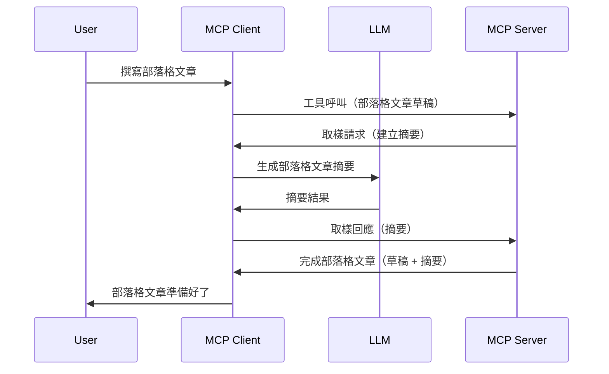

# 採樣 - 將功能委派給客戶端

有時候，您需要 MCP 客戶端和 MCP 伺服器合作以達成共同目標。您可能會遇到伺服器需要坐落於客戶端的 LLM 協助的情況。針對這種情況，採樣就是您應該使用的功能。

讓我們探索一些使用案例以及如何建立涉及採樣的解決方案。

## 概述

本課程將專注於說明何時以及在哪裡使用採樣，以及如何配置採樣。

## 學習目標

在本章節中，我們將：

- 解釋什麼是採樣以及何時使用。
- 展示如何在 MCP 中配置採樣。
- 提供採樣實際應用的範例。

## 什麼是採樣及為什麼要使用它？

採樣是一項進階功能，其運作方式如下：


### 採樣請求

好的，現在我們已經有了一個可信場景的高層視圖，讓我們來談談伺服器回傳給客戶端的採樣請求。以下是在 JSON-RPC 格式下，這類請求的範例：

```json
{
  "jsonrpc": "2.0",
  "id": 1,
  "method": "sampling/createMessage",
  "params": {
    "messages": [
      {
        "role": "user",
        "content": {
          "type": "text",
          "text": "Create a blog post summary of the following blog post: <BLOG POST>"
        }
      }
    ],
    "modelPreferences": {
      "hints": [
        {
          "name": "claude-3-sonnet"
        }
      ],
      "intelligencePriority": 0.8,
      "speedPriority": 0.5
    },
    "systemPrompt": "You are a helpful assistant.",
    "maxTokens": 100
  }
}
```

這裡有幾點值得說明：

- Prompt，在 content -> text 底下，是我們的提示，這是針對 LLM 用來總結部落格文章內容的指令。

- **modelPreferences**。這段是偏好設定，是針對 LLM 要使用的配置建議，用戶可以選擇採用這些建議或自行更改。在這個案例中，建議了要使用的模型以及速度與智慧優先順序。
- **systemPrompt**，這是您的常規系統提示，賦予 LLM 個性並包含指導說明。
- **maxTokens**，這是另一個屬性，說明推薦用於此任務的最大 token 數。

### 採樣回應

此回應是 MCP 客戶端最終回傳給 MCP 伺服器的訊息，是客戶端呼叫 LLM、等待回應後組成的訊息。以下是它在 JSON-RPC 格式下的樣貌：

```json
{
  "jsonrpc": "2.0",
  "id": 1,
  "result": {
    "role": "assistant",
    "content": {
      "type": "text",
      "text": "Here's your abstract <ABSTRACT>"
    },
    "model": "gpt-5",
    "stopReason": "endTurn"
  }
}
```

請注意回應是部落格文章摘要，符合我們的請求。另外注意使用的 `model` 並非我們要求的，而是由「claude-3-sonnet」改為「gpt-5」。這說明使用者可以改變想法，您的採樣請求只是建議而已。

好的，既然我們了解主要流程，且此有用任務為「部落格文章創作 + 摘要」，接著來看看如何操作使其能運作。

### 訊息類型

採樣訊息不僅限於純文字，您也可以傳送圖片和音訊。以下是 JSON-RPC 的差異呈現：

<strong>文字</strong>

```json
{
  "type": "text",
  "text": "The message content"
}
```

<strong>圖片內容</strong>

```json
{
  "type": "image",
  "data": "base64-encoded-image-data",
  "mimeType": "image/jpeg"
}
```

<strong>音訊內容</strong>

```json
{
  "type": "audio",
  "data": "base64-encoded-audio-data",
  "mimeType": "audio/wav"
}
```

> 注意：有關採樣的詳細資訊，請參閱[官方文件](https://modelcontextprotocol.io/specification/2025-06-18/client/sampling)

## 如何在客戶端配置採樣

> 注意：如果您只是在建置伺服器，這部分不需做太多。

在客戶端，您需指定以下功能，如此：

```json
{
  "capabilities": {
    "sampling": {}
  }
}
```

當選擇的客戶端與伺服器初始化時，該配置才會被載入。

## 採樣實例 - 建立部落格文章

我們一起編寫一個採樣伺服器，我們需要做以下工作：

1. 在伺服器上建立一個工具。
1. 該工具應該建立一個採樣請求。
1. 工具應等待客戶端的採樣請求得到回應。
1. 然後產生該工具的結果。

讓我們分步看程式碼：

### -1- 建立工具

**python**

```python
@mcp.tool()
async def create_blog(title: str, content: str, ctx: Context[ServerSession, None]) -> str:
    """Create a blog post and generate a summary"""

```

### -2- 建立採樣請求

在工具裡擴充以下程式碼：

**python**

```python
post = BlogPost(
        id=len(posts) + 1,
        title=title,
        content=content,
        abstract=""
    )

prompt = f"Create an abstract of the following blog post: title: {title} and draft: {content} "

result = await ctx.session.create_message(
        messages=[
            SamplingMessage(
                role="user",
                content=TextContent(type="text", text=prompt),
            )
        ],
        max_tokens=100,
)

```

### -3- 等待回應並回傳

**python**

```python
post.abstract = result.content.text

posts.append(post)

# 返回完整的產品
return json.dumps({
    "id": post.title,
    "abstract": post.abstract
})
```

### -4- 完整程式碼

**python**

```python
from starlette.applications import Starlette
from starlette.routing import Mount, Host

from mcp.server.fastmcp import Context, FastMCP

from mcp.server.session import ServerSession
from mcp.types import SamplingMessage, TextContent

import json


from uuid import uuid4
from typing import List
from pydantic import BaseModel


mcp = FastMCP("Blog post generator")

# app = FastAPI()

posts = []

class BlogPost(BaseModel):
    id: int
    title: str
    content: str
    abstract: str

posts: List[BlogPost] = []

@mcp.tool()
async def create_blog(title: str, content: str, ctx: Context[ServerSession, None]) -> str:
    """Create a blog post and generate a summary"""

    post = BlogPost(
        id=len(posts) + 1,
        title=title,
        content=content,
        abstract=""
    )

    prompt = f"Create an abstract of the following blog post: title: {title} and draft: {content} "

    result = await ctx.session.create_message(
        messages=[
            SamplingMessage(
                role="user",
                content=TextContent(type="text", text=prompt),
            )
        ],
        max_tokens=100,
    )

    post.abstract = result.content.text

    posts.append(post)

    # 返回完整的部落格文章
    return json.dumps({
        "id": post.title,
        "abstract": post.abstract
    })

if __name__ == "__main__":
    print("Starting server...")
    # mcp.run()
    mcp.run(transport="streamable-http")

# 使用 python server.py 執行應用程式
```

### -5- 在 Visual Studio Code 中測試

要在 Visual Studio Code 中測試，請執行以下步驟：

1. 於終端機啟動伺服器
1. 把它加入 *mcp.json* （並確保已啟動），例如如下：

   ```json
   "servers": {
      "blog-server": {
        "type": "http",
        "url": "http://localhost:8000/mcp"
      }
   }
   ```

1. 輸入提示字串：

   ```text
   create a blog post named "Where Python comes from", the content is "Python is actually named after Monty Python Flying Circus"
   ```

1. 允許採樣發生。第一次測試時，您會看到一個額外對話框需要接受，接著會看到要求您執行工具的正常對話框。

1. 檢查結果。您可以在 GitHub Copilot Chat 中看到漂亮的呈現結果，也可以檢視原始 JSON 回應。

<strong>額外提示</strong>。Visual Studio Code 的工具對採樣具有良好支援。您能從已安裝伺服器的設定頁面配置採樣存取：

1. 前往擴充功能區塊。
1. 在「MCP SERVERS - INSTALLED」區段找到已安裝的伺服器，點選齒輪圖示。
1. 選擇「Configure Model Access」，在此您可以選擇 GitHub Copilot 執行採樣時允許使用的模型。您也可以點選「Show Sampling requests」查看近期所有採樣請求。

## 作業

本作業中，您將建立一個稍有不同的採樣，也就是支援產生產品描述的採樣整合。場景如下：

<strong>情境</strong>：一位電子商務後台工作人員需要幫助，產生商品描述花太多時間。因此，您將建立一個解決方案，可以呼叫一個名為「create_product」的工具，帶入「title」與「keywords」參數，這工具應回傳一個完整商品，其中「description」欄位需由客戶端的 LLM 填寫。

提示：使用之前學到的方法，利用採樣請求建構伺服器與工具。

## 解答

[解答](./solution/README.md)

## 重要重點

採樣是一項強大功能，讓伺服器在需要 LLM 協助時，將任務委派給客戶端。

## 接下來要學習什麼

- [第 4 章 - 實務實作](../../04-PracticalImplementation/README.md)

---

<!-- CO-OP TRANSLATOR DISCLAIMER START -->
**免責聲明**：  
本文件使用 AI 翻譯服務 [Co-op Translator](https://github.com/Azure/co-op-translator) 進行翻譯。雖然我們力求準確，但請注意自動翻譯可能包含錯誤或不準確之處。原始文件的母語版本應視為權威來源。對於重要資訊，建議尋求專業人工翻譯。我們不對因使用此翻譯而產生的任何誤解或誤譯負責。
<!-- CO-OP TRANSLATOR DISCLAIMER END -->