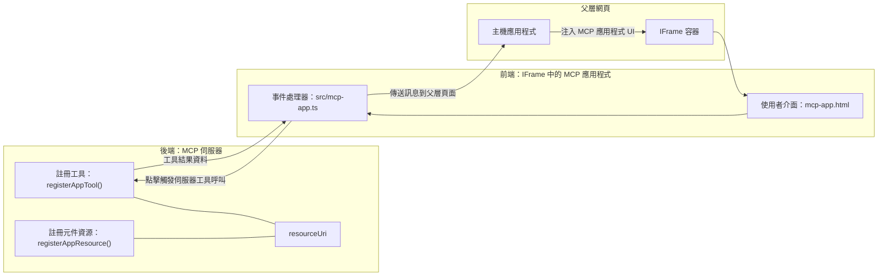

# MCP 應用程式

MCP 應用程式是 MCP 中的一種新範式。這個想法不僅是回傳工具調用的資料，還提供如何與這些資訊互動的資訊。這意味著工具結果現在可以包含 UI 資訊。為什麼我們要這麼做呢？想想你現在的作法。你可能是透過在 MCP 伺服器前面放置某種類型的前端來使用伺服器的結果，這是一段你需要撰寫和維護的程式碼。有時候這是你想要的，但有時候如果你能帶入一段自包含的資訊片段，裡面包含從資料到使用者介面的一切，那會很棒。

## 概述

本課程提供有關 MCP 應用程式的實作指導，包括如何開始及如何將其整合進你現有的 Web 應用程式。MCP 應用程式是 MCP 標準中的一個非常新的新增功能。

## 學習目標

在本課程結束時，你將能夠：

- 解釋什麼是 MCP 應用程式。
- 何時使用 MCP 應用程式。
- 建立和整合你自己的 MCP 應用程式。

## MCP 應用程式 - 它如何運作

MCP 應用程式的想法是提供一個本質上是可被渲染的元件回應。這樣的元件可以有視覺效果與互動性，例如：按鈕點擊、使用者輸入等等。我們先從伺服器端和 MCP 伺服器開始。要建立一個 MCP 應用元件，你需要建立一個工具以及應用程式資源。這兩個部分透過 resourceUri 連結。

以下是一個範例。讓我們試著視覺化所涉及的內容以及各部分的責任：

```text
server.ts -- responsible for registering tools and the component as a UI component
src/
  mcp-app.ts -- wiring up event handlers
mcp-app.html -- the user interface
```

此視覺描述建立元件及其邏輯的架構。


接著讓我們說明後端和前端各自的責任。

### 後端

我們需要完成兩件事：

- 註冊我們想要互動的工具。
- 定義元件。

<strong>註冊工具</strong>

```typescript
registerAppTool(
    server,
    "get-time",
    {
      title: "Get Time",
      description: "Returns the current server time.",
      inputSchema: {},
      _meta: { ui: { resourceUri } }, // 將此工具連結到其使用者介面資源
    },
    async () => {
      const time = new Date().toISOString();
      return { content: [{ type: "text", text: time }] };
    },
  );

```

上述程式碼描述了行為，其中公開了一個名為 `get-time` 的工具。它不需要輸入參數，但會產生當前時間。我們也可以定義 `inputSchema`，用於需要接受使用者輸入的工具。

<strong>註冊元件</strong>

在同一個檔案中，也需要註冊元件：

```typescript
const resourceUri = "ui://get-time/mcp-app.html";

// 註冊資源，回傳用於 UI 的打包 HTML/JavaScript。
registerAppResource(
  server,
  resourceUri,
  resourceUri,
  { mimeType: RESOURCE_MIME_TYPE },
  async () => {
    const html = await fs.readFile(path.join(DIST_DIR, "mcp-app.html"), "utf-8");

    return {
    contents: [
        { uri: resourceUri, mimeType: RESOURCE_MIME_TYPE, text: html },
    ],
    };
  },
);
```

請注意我們如何使用 `resourceUri` 將元件與工具連結。另一個重要部分是回呼函式，其中載入 UI 檔案並回傳元件。

### 元件前端

與後端一樣，這裡也有兩部分：

- 純 HTML 寫成的前端。
- 處理事件與對應動作的程式碼，例如調用工具或與父視窗通訊。

<strong>使用者介面</strong>

先來看看使用者介面。

```html
<!-- mcp-app.html -->
<!DOCTYPE html>
<html lang="en">
  <head>
    <meta charset="UTF-8" />
    <title>Get Time App</title>
  </head>
  <body>
    <p>
      <strong>Server Time:</strong> <code id="server-time">Loading...</code>
    </p>
    <button id="get-time-btn">Get Server Time</button>
    <script type="module" src="/src/mcp-app.ts"></script>
  </body>
</html>
```

<strong>事件綁定</strong>

最後一個部分是事件綁定。也就是我們找出 UI 中需要事件處理的部分，並定義事件觸發時要做什麼：

```typescript
// mcp-app.ts

import { App } from "@modelcontextprotocol/ext-apps";

// 取得元素參考
const serverTimeEl = document.getElementById("server-time")!;
const getTimeBtn = document.getElementById("get-time-btn")!;

// 建立應用程式實例
const app = new App({ name: "Get Time App", version: "1.0.0" });

// 處理來自伺服器的工具結果。放在 `app.connect()` 之前以避免
// 遺漏初始的工具結果。
app.ontoolresult = (result) => {
  const time = result.content?.find((c) => c.type === "text")?.text;
  serverTimeEl.textContent = time ?? "[ERROR]";
};

// 連接按鈕點擊事件
getTimeBtn.addEventListener("click", async () => {
  // `app.callServerTool()` 讓 UI 向伺服器請求最新資料
  const result = await app.callServerTool({ name: "get-time", arguments: {} });
  const time = result.content?.find((c) => c.type === "text")?.text;
  serverTimeEl.textContent = time ?? "[ERROR]";
});

// 連接到主機
app.connect();
```

從上面可以看出，這是標準的程式碼用來將 DOM 元素與事件掛勾。值得一提的是呼叫 `callServerTool`，這會呼叫後端的工具。

## 處理使用者輸入

目前，我們見到的元件是一個按鈕，點擊時會呼叫工具。接著試著加入更多 UI 元素，例如輸入欄位，並看看是否能向工具傳送參數。我們來實作一個 FAQ 功能。運作方式如下：

- 應該有一個按鈕和一個輸入欄位，使用者可以輸入關鍵字搜尋，例如「Shipping」。這會呼叫後端的一個工具，該工具會在 FAQ 資料中搜尋。
- 支援上述 FAQ 搜尋的工具。

先為後端加入所需支援：

```typescript
const faq: { [key: string]: string } = {
    "shipping": "Our standard shipping time is 3-5 business days.",
    "return policy": "You can return any item within 30 days of purchase.",
    "warranty": "All products come with a 1-year warranty covering manufacturing defects.",
  }

registerAppTool(
    server,
    "get-faq",
    {
      title: "Search FAQ",
      description: "Searches the FAQ for relevant answers.",
      inputSchema: zod.object({
        query: zod.string().default("shipping"),
      }),
      _meta: { ui: { resourceUri: faqResourceUri } }, // 將此工具連結到其 UI 資源
    },
    async ({ query }) => {
      const answer: string = faq[query.toLowerCase()] || "Sorry, I don't have an answer for that.";
      return { content: [{ type: "text", text: answer }] };
    },
  );
```

這裡看到我們如何填充 `inputSchema` 並提供一個類似 `zod` 的結構：

```typescript
inputSchema: zod.object({
  query: zod.string().default("shipping"),
})
```

在上述結構中，我們宣告有一個名為 `query` 的輸入參數，為選填且預設值為 "shipping"。

接下來，看 *mcp-app.html* 來建立所需的 UI：

```html
<div class="faq">
    <h1>FAQ response</h1>
    <p>FAQ Response: <code id="faq-response">Loading...</code></p>
    <input type="text" id="faq-query" placeholder="Enter FAQ query" />
    <button id="get-faq-btn">Get FAQ Response</button>
  </div>
```

很好，現在有了輸入欄位與按鈕。接著查看 *mcp-app.ts*，綁定這些事件：

```typescript
const getFaqBtn = document.getElementById("get-faq-btn")!;
const faqQueryInput = document.getElementById("faq-query") as HTMLInputElement;

getFaqBtn.addEventListener("click", async () => {
  const query = faqQueryInput.value;
  const result = await app.callServerTool({ name: "get-faq", arguments: { query } });
  const faq = result.content?.find((c) => c.type === "text")?.text;
  faqResponseEl.textContent = faq ?? "[ERROR]";
});
```

程式碼中我們：

- 建立對互動 UI 元素的參考。
- 處理按鈕點擊事件，解析輸入欄位的值，並呼叫 `app.callServerTool()`，帶入工具名稱與參數，其中以 `query` 作為參數值。

呼叫 `callServerTool` 會向父視窗傳送訊息，父視窗最後呼叫 MCP 伺服器。

### 試試看

試用後應該會看到以下畫面：


這是用輸入為 "warranty" 試看的畫面：


若要執行此程式碼，請前往 [程式碼區段](./code/README.md)

## 在 Visual Studio Code 測試

Visual Studio Code 對 MCP 應用程式有良好支援，可能是測試 MCP 應用程式最簡單的方式。使用 Visual Studio Code 時，在 *mcp.json* 新增伺服器條目如下：

```json
"my-mcp-server-7178eca7": {
    "url": "http://localhost:3001/mcp",
    "type": "http"
  }
```

然後啟動伺服器，如此應能透過聊天視窗與 MCP 應用程式通訊，前提是你已安裝 GitHub Copilot。

可透過命令觸發，例如 "#get-faq"：


就像在瀏覽器中執行一樣，呈現相同樣貌：


## 作業

建立一個石頭剪刀布遊戲。應包括以下：

UI：

- 一個包含選項的下拉清單
- 一個提交選擇的按鈕
- 一個顯示誰選了什麼及誰獲勝的標籤

伺服器端：

- 應有一個石頭剪刀布工具，接受 "choice" 作為輸入。也應產生電腦的選擇並判定勝者。

## 解答

[解答](./assignment/README.md)

## 總結

我們學習了 MCP 應用程式這種新範式。它讓 MCP 伺服器不僅可以控制資料，還能控制資料如何呈現。

此外，我們瞭解 MCP 應用程式被托管在 IFrame 中，與 MCP 伺服器通訊需要向父網頁應用程式傳送訊息。市面上有多種針對純 JavaScript、React 等的函式庫，可以簡化此通訊工作。

## 重要重點

你學到了：

- MCP 應用程式是當你想同時傳送資料與 UI 功能時，很有用的一個新標準。
- 這類應用以安全為由，會在 IFrame 中運行。

## 下一步

- [第 4 章](../../04-PracticalImplementation/README.md)

---

<!-- CO-OP TRANSLATOR DISCLAIMER START -->
**免責聲明**：  
本文件使用 AI 翻譯服務 [Co-op Translator](https://github.com/Azure/co-op-translator) 進行翻譯。雖然我們力求準確，但請注意，自動翻譯可能包含錯誤或不準確之處。文件的原始語言版本應視為權威來源。對於重要資訊，建議採用專業人工翻譯。我們不對因使用本翻譯所產生的任何誤解或誤釋承擔責任。
<!-- CO-OP TRANSLATOR DISCLAIMER END -->