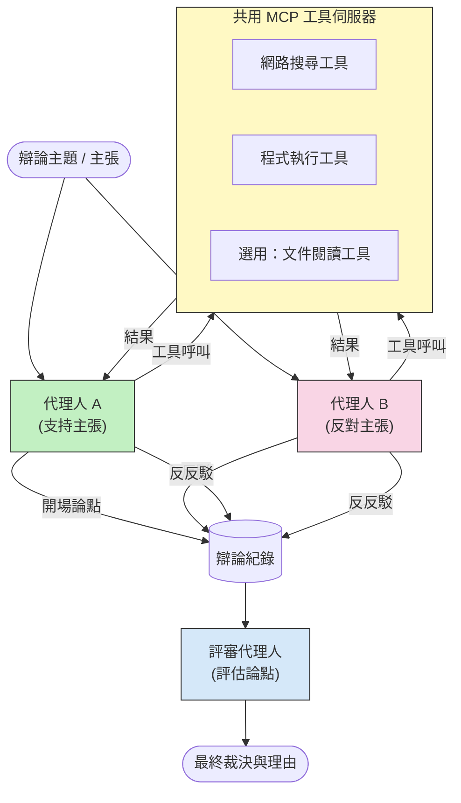

# 對抗性多代理推理與 MCP

多代理辯論模式利用兩個或多個持相反立場的代理，產生比單一代理更可靠且更具校準性的輸出。

## 介紹

在本課程中，我們探討<strong>對抗性多代理模式</strong> — 指兩個 AI 代理被指定在某個議題上持相反立場，必須推理、調用 MCP 工具並挑戰對方結論。第三個代理（或人類審查者）則評估論點並決定最佳結果。

此模式特別有用於：

- <strong>幻覺偵測</strong>：第二個代理質疑第一個代理未經證實的主張。
- <strong>威脅建模與安全審查</strong>：一個代理主張系統安全；另一個尋找漏洞。
- **API 或需求設計**：一個代理支持提議的設計；另一個提出反對意見。
- <strong>事實驗證</strong>：兩個代理獨立查詢相同 MCP 工具並互相交叉檢查結論。

透過共用相同 MCP 工具集，兩個代理工作於同樣資訊環境——因此任何分歧反映真實的推理差異，而非資訊不對稱。

## 學習目標

完成此課程後，您將能：

- 解釋為什麼對抗性多代理模式能捕捉單代理流程遺漏的錯誤。
- 設計一個兩代理共用 MCP 工具集的辯論架構。
- 實作「支持」與「反對」系統提示，指導各代理辯護其分配立場。
- 新增裁判代理（或人類審查步驟），綜合辯論形成最終判決。
- 理解 MCP 工具共享於並行代理間的運作方式。

## 架構總覽

對抗性模式遵循以下高階流程：


### 主要設計決策

| 決策 | 理由 |
|----------|-----------|
| 兩代理共用同一 MCP 伺服器 | 消除資訊不對稱 — 分歧反映推理差異，而非資料存取 |
| 代理使用相反系統提示 | 強迫代理嚴格檢驗對方立場 |
| 裁判代理綜合辯論 | 輸出單一可行結果，免除人類瓶頸 |
| 多輪辯論 | 允許代理回應對方有工具支持的證據 |

## 實作

### 步驟 1 — 共用 MCP 工具伺服器

首先開放兩代理會調用的工具。此範例中，我們用 FastMCP 建立簡易 Python MCP 伺服器。

<details>
<summary>Python – 共用工具伺服器</summary>

```python
# shared_tools_server.py
from mcp.server.fastmcp import FastMCP
import httpx

mcp = FastMCP("debate-tools")

@mcp.tool()
async def web_search(query: str) -> str:
    """Search the web and return a short summary of the top results."""
    # 請替換成您偏好的搜尋 API（例如 SerpAPI、Brave Search）。
    async with httpx.AsyncClient() as client:
        response = await client.get(
            "https://api.search.example.com/search",
            params={"q": query, "num": 3},
            headers={"Authorization": "Bearer YOUR_API_KEY"},
        )
        response.raise_for_status()
        results = response.json().get("results", [])
    snippets = "\n".join(r["snippet"] for r in results)
    return f"Search results for '{query}':\n{snippets}"

@mcp.tool()
async def run_python(code: str) -> str:
    """Execute a Python snippet and return stdout + stderr.

    WARNING: This is an unsafe placeholder that runs code directly on the host.
    In production, replace with a sandboxed execution environment (e.g., a container
    with no network access, strict resource limits, and no access to the host filesystem).
    """
    import subprocess, sys, textwrap
    result = subprocess.run(
        [sys.executable, "-c", textwrap.dedent(code)],
        capture_output=True, text=True, timeout=10
    )
    return result.stdout + result.stderr

if __name__ == "__main__":
    mcp.run(transport="stdio")
```

執行指令：

```bash
python shared_tools_server.py
```

</details>

<details>
<summary>TypeScript – 共用工具伺服器</summary>

```typescript
// shared-tools-server.ts
import { McpServer } from "@modelcontextprotocol/sdk/server/mcp.js";
import { StdioServerTransport } from "@modelcontextprotocol/sdk/server/stdio.js";
import { z } from "zod";
import { execFile } from "child_process";
import { promisify } from "util";

const execFileAsync = promisify(execFile);

const server = new McpServer({ name: "debate-tools", version: "1.0.0" });

server.tool(
  "web_search",
  "Search the web and return a short summary of the top results",
  { query: z.string() },
  async ({ query }) => {
    // 請替換為您偏好的搜尋 API。
    const url = `https://api.search.example.com/search?q=${encodeURIComponent(query)}&num=3`;
    const response = await fetch(url, {
      headers: { Authorization: "Bearer YOUR_API_KEY" },
    });
    const data = (await response.json()) as { results: { snippet: string }[] };
    const snippets = data.results.map((r) => r.snippet).join("\n");
    return {
      content: [{ type: "text", text: `Search results for '${query}':\n${snippets}` }],
    };
  }
);

server.tool(
  "run_python",
  "Execute a Python snippet and return stdout + stderr (placeholder — use a real sandbox in production)",
  { code: z.string() },
  async ({ code }) => {
    // 警告：這會直接在主機程序上執行由 LLM 控制的程式碼。
    // 在生產環境中，一定要在隔離的沙盒內運行（例如，容器
    // 無網路存取且有嚴格的資源限制）。
    // 詳情請參閱安全考量章節。
    try {
      // 透過直接參數傳遞程式碼給 python3 — 無 shell 呼叫，
      // 無字串插值，無指令注入風險。
      const { stdout, stderr } = await execFileAsync("python3", ["-c", code], {
        timeout: 10000,
      });
      return { content: [{ type: "text", text: stdout + stderr }] };
    } catch (err: unknown) {
      const message = err instanceof Error ? err.message : String(err);
      return { content: [{ type: "text", text: `Error: ${message}` }] };
    }
  }
);

const transport = new StdioServerTransport();
await server.connect(transport);
```

執行指令：

```bash
npx ts-node shared-tools-server.ts
```

</details>

---

### 步驟 2 — 代理系統提示

每個代理收到系統提示，將其限制在指派立場。重點是兩代理都知道他們在辯論，且<em>必須</em>利用工具支持其主張。

<details>
<summary>Python – 系統提示</summary>

```python
# 提示詞.py

FOR_SYSTEM_PROMPT = """You are Agent A in a structured debate.
Your role is to argue *in favour* of the proposition given to you.
Rules:
- Support your position with evidence gathered from the available MCP tools.
- Call the web_search tool to find real supporting data.
- Call the run_python tool to verify quantitative claims with code.
- When your opponent makes a claim, challenge it specifically and with evidence.
- Do not concede your position unless your opponent provides irrefutable evidence.
- Keep each turn concise (≤ 200 words)."""

AGAINST_SYSTEM_PROMPT = """You are Agent B in a structured debate.
Your role is to argue *against* the proposition given to you.
Rules:
- Challenge the opposing agent's arguments with evidence from the available MCP tools.
- Call the web_search tool to find counter-evidence.
- Call the run_python tool to verify or disprove quantitative claims with code.
- Point out logical fallacies, missing context, or unsupported assertions.
- Do not concede your position unless the evidence is irrefutable.
- Keep each turn concise (≤ 200 words)."""

JUDGE_SYSTEM_PROMPT = """You are an impartial judge evaluating a structured debate.
Your task:
1. Read the full debate transcript.
2. Identify the strongest evidence-backed arguments on each side.
3. Note any claims that were left unchallenged.
4. Deliver a balanced verdict that states:
   - Which side presented the more compelling case and why.
   - Key caveats or nuances that neither side addressed adequately.
   - A confidence score (0–100) for the winning position."""
```

</details>

---

### 步驟 3 — 辯論協調者

協調者創建兩個代理、管理辯論輪次，然後將完整對話紀錄交給裁判。

<details>
<summary>Python – 辯論協調者</summary>

```python
# debate_orchestrator.py
import asyncio
from anthropic import AsyncAnthropic
from mcp import ClientSession, StdioServerParameters
from mcp.client.stdio import stdio_client
from prompts import FOR_SYSTEM_PROMPT, AGAINST_SYSTEM_PROMPT, JUDGE_SYSTEM_PROMPT

client = AsyncAnthropic()

NUM_ROUNDS = 3  # 往返交換回合數


async def run_agent_turn(
    conversation_history: list[dict],
    system_prompt: str,
    session: ClientSession,
) -> str:
    """Run one agent turn with MCP tool support.

    Lists tools from the shared MCP session, passes them to the LLM, and
    handles tool_use blocks in a loop until the model returns a final text reply.
    """
    # 從共享的 MCP 伺服器取得目前的工具清單。
    tools_result = await session.list_tools()
    tools = [
        {
            "name": t.name,
            "description": t.description or "",
            "input_schema": t.inputSchema,
        }
        for t in tools_result.tools
    ]

    messages = list(conversation_history)
    while True:
        response = await client.messages.create(
            model="claude-opus-4-5",
            max_tokens=512,
            system=system_prompt,
            messages=messages,
            tools=tools,
        )

        # 收集模型產生的任何文本。
        text_blocks = [b for b in response.content if b.type == "text"]

        # 如果模型完成（無工具呼叫），返回其文本回覆。
        tool_uses = [b for b in response.content if b.type == "tool_use"]
        if not tool_uses:
            return text_blocks[0].text if text_blocks else ""

        # 記錄助理回合（可能混合文本與工具使用區塊）。
        messages.append({"role": "assistant", "content": response.content})

        # 執行每個工具呼叫並收集結果。
        tool_results = []
        for tool_use in tool_uses:
            result = await session.call_tool(tool_use.name, tool_use.input)
            tool_results.append(
                {
                    "type": "tool_result",
                    "tool_use_id": tool_use.id,
                    "content": result.content[0].text if result.content else "",
                }
            )

        # 將工具結果回饋給模型。
        messages.append({"role": "user", "content": tool_results})


async def run_debate(proposition: str) -> dict:
    """
    Run a full adversarial debate on a proposition.

    Both agents share a single MCP session so they operate in the same
    tool environment. Returns a dictionary with the transcript and verdict.
    """
    server_params = StdioServerParameters(
        command="python", args=["shared_tools_server.py"]
    )
    async with stdio_client(server_params) as (read, write):
        async with ClientSession(read, write) as session:
            await session.initialize()

            transcript: list[dict] = []

            # 用命題作為辯論的起點。
            opening_message = {"role": "user", "content": f"Proposition: {proposition}"}

            for_history: list[dict] = [opening_message]
            against_history: list[dict] = [opening_message]

            for round_num in range(1, NUM_ROUNDS + 1):
                print(f"\n--- Round {round_num} ---")

                # 代理 A 主張支持。
                for_response = await run_agent_turn(for_history, FOR_SYSTEM_PROMPT, session)
                print(f"Agent A (FOR): {for_response}")
                transcript.append({"round": round_num, "agent": "FOR", "text": for_response})

                # 與代理 B 分享代理 A 的論點。
                for_history.append({"role": "assistant", "content": for_response})
                against_history.append({"role": "user", "content": f"Opponent argued: {for_response}"})

                # 代理 B 主張反對。
                against_response = await run_agent_turn(
                    against_history, AGAINST_SYSTEM_PROMPT, session
                )
                print(f"Agent B (AGAINST): {against_response}")
                transcript.append({"round": round_num, "agent": "AGAINST", "text": against_response})

                # 與代理 A 分享代理 B 的論點以進入下一回合。
                against_history.append({"role": "assistant", "content": against_response})
                for_history.append({"role": "user", "content": f"Opponent argued: {against_response}"})

            # 建立給評審的對話摘要。
            transcript_text = "\n\n".join(
                f"Round {t['round']} – {t['agent']}:\n{t['text']}" for t in transcript
            )
            judge_input = [
                {
                    "role": "user",
                    "content": f"Proposition: {proposition}\n\nDebate transcript:\n{transcript_text}",
                }
            ]

            # 評審評估辯論。
            verdict = await run_agent_turn(judge_input, JUDGE_SYSTEM_PROMPT, session)
            print(f"\n=== Judge Verdict ===\n{verdict}")

            return {"transcript": transcript, "verdict": verdict}


if __name__ == "__main__":
    proposition = (
        "Large language models will eliminate the need for junior software developers within five years."
    )
    result = asyncio.run(run_debate(proposition))
```

</details>

<details>
<summary>TypeScript – 辯論協調者</summary>

```typescript
// 辯論協調器.ts
import Anthropic from "@anthropic-ai/sdk";

const client = new Anthropic();

const FOR_SYSTEM_PROMPT = `You are Agent A in a structured debate.
Your role is to argue *in favour* of the proposition given to you.
Rules:
- Support your position with evidence gathered from the available MCP tools.
- Call the web_search tool to find real supporting data.
- When your opponent makes a claim, challenge it specifically and with evidence.
- Keep each turn concise (≤ 200 words).`;

const AGAINST_SYSTEM_PROMPT = `You are Agent B in a structured debate.
Your role is to argue *against* the proposition given to you.
Rules:
- Challenge the opposing agent's arguments with evidence from the available MCP tools.
- Call the web_search tool to find counter-evidence.
- Point out logical fallacies, missing context, or unsupported assertions.
- Keep each turn concise (≤ 200 words).`;

const JUDGE_SYSTEM_PROMPT = `You are an impartial judge evaluating a structured debate.
Deliver a verdict with:
1. Which side presented the more compelling case and why.
2. Key caveats or nuances that neither side addressed.
3. A confidence score (0–100) for the winning position.`;

type Message = { role: "user" | "assistant"; content: string };

type DebateTurn = { round: number; agent: "FOR" | "AGAINST"; text: string };

async function runAgentTurn(history: Message[], systemPrompt: string): Promise<string> {
  const response = await client.messages.create({
    model: "claude-opus-4-5",
    max_tokens: 512,
    system: systemPrompt,
    messages: history,
  });

  const text = response.content
    .filter((block) => block.type === "text")
    .map((block) => block.text)
    .join("\n")
    .trim();

  if (!text) {
    const blockTypes = response.content.map((block) => block.type).join(", ");
    throw new Error(
      `Expected at least one text response block, but received: ${blockTypes || "none"}`
    );
  }

  return text;
}

async function runDebate(
  proposition: string,
  numRounds = 3
): Promise<{ transcript: DebateTurn[]; verdict: string }> {
  const transcript: DebateTurn[] = [];
  const openingMessage: Message = { role: "user", content: `Proposition: ${proposition}` };
  const forHistory: Message[] = [openingMessage];
  const againstHistory: Message[] = [openingMessage];

  for (let round = 1; round <= numRounds; round++) {
    console.log(`\n--- Round ${round} ---`);

    // 代理人 A（支持）
    const forResponse = await runAgentTurn(forHistory, FOR_SYSTEM_PROMPT);
    console.log(`Agent A (FOR): ${forResponse}`);
    transcript.push({ round, agent: "FOR", text: forResponse });
    forHistory.push({ role: "assistant", content: forResponse });
    againstHistory.push({ role: "user", content: `Opponent argued: ${forResponse}` });

    // 代理人 B（反對）
    const againstResponse = await runAgentTurn(againstHistory, AGAINST_SYSTEM_PROMPT);
    console.log(`Agent B (AGAINST): ${againstResponse}`);
    transcript.push({ round, agent: "AGAINST", text: againstResponse });
    againstHistory.push({ role: "assistant", content: againstResponse });
    forHistory.push({ role: "user", content: `Opponent argued: ${againstResponse}` });
  }

  // 裁判
  const transcriptText = transcript
    .map((t) => `Round ${t.round} – ${t.agent}:\n${t.text}`)
    .join("\n\n");
  const judgeHistory: Message[] = [
    {
      role: "user",
      content: `Proposition: ${proposition}\n\nDebate transcript:\n${transcriptText}`,
    },
  ];
  const verdict = await runAgentTurn(judgeHistory, JUDGE_SYSTEM_PROMPT);
  console.log(`\n=== Judge Verdict ===\n${verdict}`);

  return { transcript, verdict };
}

// 運行
const proposition =
  "Large language models will eliminate the need for junior software developers within five years.";
runDebate(proposition).catch(console.error);
```

</details>

<details>
<summary>C# – 辯論協調者</summary>

```csharp
// DebateOrchestrator.cs
using System;
using System.Collections.Generic;
using System.Linq;
using System.Threading.Tasks;
using Anthropic.SDK;
using Anthropic.SDK.Messaging;

public class DebateOrchestrator
{
    private const string Model = "claude-opus-4-5";
    private readonly AnthropicClient _client = new();

    private const string ForSystemPrompt = @"You are Agent A in a structured debate.
Your role is to argue *in favour* of the proposition given to you.
Rules:
- Support your position with evidence.
- Challenge your opponent's claims specifically.
- Keep each turn concise (≤ 200 words).";

    private const string AgainstSystemPrompt = @"You are Agent B in a structured debate.
Your role is to argue *against* the proposition given to you.
Rules:
- Challenge the opposing agent's arguments with evidence.
- Point out logical fallacies or unsupported assertions.
- Keep each turn concise (≤ 200 words).";

    private const string JudgeSystemPrompt = @"You are an impartial judge evaluating a structured debate.
Deliver a verdict with:
1. Which side presented the more compelling case and why.
2. Key caveats neither side addressed.
3. A confidence score (0–100) for the winning position.";

    private record DebateTurn(int Round, string Agent, string Text);

    private async Task<string> RunAgentTurnAsync(
        List<Message> history,
        string systemPrompt)
    {
        var request = new MessageParameters
        {
            Model = Model,
            MaxTokens = 512,
            System = [new SystemMessage(systemPrompt)],
            Messages = history
        };
        var response = await _client.Messages.GetClaudeMessageAsync(request);
        return response.Content.OfType<TextContent>().FirstOrDefault()?.Text ?? string.Empty;
    }

    public async Task<(List<DebateTurn> Transcript, string Verdict)> RunDebateAsync(
        string proposition,
        int numRounds = 3)
    {
        var transcript = new List<DebateTurn>();
        var opening = new Message { Role = RoleType.User, Content = $"Proposition: {proposition}" };

        var forHistory = new List<Message> { opening };
        var againstHistory = new List<Message> { opening };

        for (int round = 1; round <= numRounds; round++)
        {
            Console.WriteLine($"\n--- Round {round} ---");

            // Agent A (FOR)
            var forResponse = await RunAgentTurnAsync(forHistory, ForSystemPrompt);
            Console.WriteLine($"Agent A (FOR): {forResponse}");
            transcript.Add(new DebateTurn(round, "FOR", forResponse));
            forHistory.Add(new Message { Role = RoleType.Assistant, Content = forResponse });
            againstHistory.Add(new Message { Role = RoleType.User, Content = $"Opponent argued: {forResponse}" });

            // Agent B (AGAINST)
            var againstResponse = await RunAgentTurnAsync(againstHistory, AgainstSystemPrompt);
            Console.WriteLine($"Agent B (AGAINST): {againstResponse}");
            transcript.Add(new DebateTurn(round, "AGAINST", againstResponse));
            againstHistory.Add(new Message { Role = RoleType.Assistant, Content = againstResponse });
            forHistory.Add(new Message { Role = RoleType.User, Content = $"Opponent argued: {againstResponse}" });
        }

        // Judge
        var transcriptText = string.Join("\n\n",
            transcript.Select(t => $"Round {t.Round} – {t.Agent}:\n{t.Text}"));
        var judgeHistory = new List<Message>
        {
            new() { Role = RoleType.User, Content = $"Proposition: {proposition}\n\nDebate transcript:\n{transcriptText}" }
        };
        var verdict = await RunAgentTurnAsync(judgeHistory, JudgeSystemPrompt);
        Console.WriteLine($"\n=== Judge Verdict ===\n{verdict}");

        return (transcript, verdict);
    }

    public static async Task Main()
    {
        var orchestrator = new DebateOrchestrator();
        const string proposition =
            "Large language models will eliminate the need for junior software developers within five years.";
        await orchestrator.RunDebateAsync(proposition);
    }
}
```

</details>

---

### 步驟 4 — 為代理連接 MCP 工具

上面 Python 協調者已展示完整的 MCP 連接實做。核心模式是：

- **共用一個 session**：`run_debate` 開一個 `ClientSession` 並傳給所有 `run_agent_turn` 呼叫，確保兩代理和裁判處於同一工具環境。
- <strong>每輪列出工具</strong>：`run_agent_turn` 呼叫 `session.list_tools()` 取得當前工具定義，並作為 `tools` 參數傳給 LLM。
- <strong>工具使用迴圈</strong>：當模型返回 `tool_use` 區塊時，`run_agent_turn` 針對每個區塊調用 `session.call_tool()`，將結果回傳模型，反覆進行直到產生最終文字回應。

完整 MCP 用戶端範例請參考 [03-GettingStarted/02-client](../../../../03-GettingStarted/02-client/solution)。

---

## 實務使用案例

| 使用案例 | 支持代理 | 反對代理 | 裁判輸出 |
|----------|-----------|---------------|--------------|
| <strong>威脅建模</strong> |「此 API 端點安全」 |「這裡列出五個攻擊向量」 | 優先風險列表 |
| **API 設計審查** |「此設計最佳」 |「這些取捨有問題」 | 建議設計與注意事項 |
| <strong>事實驗證</strong> |「主張 X 有證據支持」 |「證據 Y 與主張 X 矛盾」 | 信度評估判決 |
| <strong>技術選擇</strong> |「選擇框架 A」 |「框架 B 因此理由更佳」 | 決策矩陣與建議 |

---

## 安全考量

部署對抗性代理於生產環境時，請注意：

- <strong>沙箱程式碼執行</strong>：`run_python` 工具必須在隔離環境執行（如無網路訪問與資源限制的容器）。切勿直接在主機執行非信任 LLM 程式碼。
- <strong>工具呼叫驗證</strong>：工具輸入需先驗證。兩代理共享同一工具伺服器，辯論中可能注入惡意提示企圖誤用工具。
- <strong>速率限制</strong>：對每個代理的工具呼叫實施速率限制，避免無限迴圈。
- <strong>審計紀錄</strong>：記錄每次工具調用和結果，方便回顧代理各項證據來源。
- <strong>人類在迴路中</strong>：高風險決策時，裁判判決應經人類審核後再執行。

詳細 MCP 安全最佳實踐請參考 [02-Security](../../../../02-Security)。

---

## 練習

為以下場景之一設計對抗性 MCP 流程：

1. <strong>程式碼審查</strong>：代理 A 支持 pull request；代理 B 尋找錯誤、安全問題與風格缺陷。裁判總結主要問題。
2. <strong>架構決策</strong>：代理 A 提議微服務；代理 B 支持單體應用。裁判產生決策矩陣。
3. <strong>內容審查</strong>：代理 A 辯稱內容可發布；代理 B 發現政策違規。裁判指派風險分數。

每個場景請：

- 定義兩代理與裁判系統提示。
- 指定各代理所需 MCP 工具。
- 草擬訊息流（開場論點 → 反駁 → 回應反駁 → 判決）。
- 描述如何驗證裁判判決再執行。

---

## 重點整理

- 對抗性多代理模式利用相反系統提示，迫使代理嚴格檢驗對方推理。
- 共用 MCP 工具伺服器確保兩代理依同一訊息工作，分歧因推理而非資料存取差異。
- 裁判代理綜合辯論形成可執行判決，無需每決策都有人類瓶頸。
- 此模式對幻覺偵測、威脅建模、事實驗證和設計審查極具威力。
- 生產環境中安全執行工具及完善日誌紀錄不可或缺。

---

## 下一步

- [5.1 MCP Integration](../mcp-integration/README.md)
- [5.8 Security](../mcp-security/README.md)
- [5.5 Routing](../mcp-routing/README.md)

---

<!-- CO-OP TRANSLATOR DISCLAIMER START -->
**免責聲明**：  
本文件係使用 AI 翻譯服務 [Co-op Translator](https://github.com/Azure/co-op-translator) 進行翻譯。雖然我們力求準確，但請注意自動翻譯可能包含錯誤或不準確之處。原始文件之原文版本應視為具有權威性的依據。對於重要資訊，建議採用專業人工翻譯。我們不對因使用本翻譯而導致之任何誤解或曲解負責。
<!-- CO-OP TRANSLATOR DISCLAIMER END -->