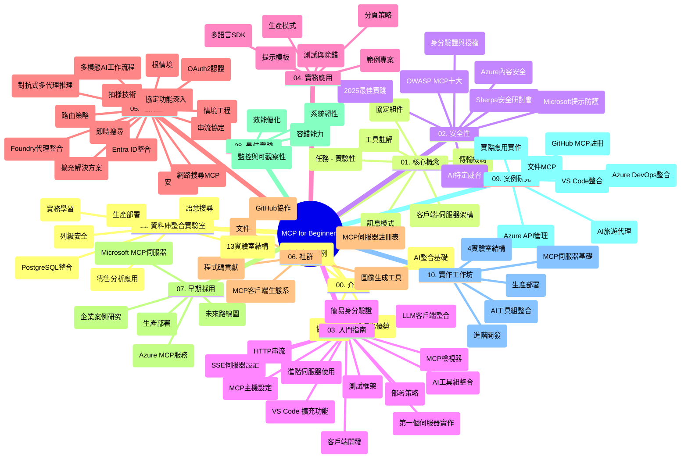

# Model Context Protocol (MCP) 初學者學習指南

本學習指南提供「Model Context Protocol (MCP) 初學者」課程的版本結構與內容概覽。使用此指南以有效率地瀏覽此資料庫，並善用可用資源。

## 資料庫概覽

Model Context Protocol (MCP) 是一套AI模型與客戶端應用程式之間互動的標準化框架。最初由Anthropic建立，現由更廣泛的MCP社群通過官方GitHub組織維護。本資料庫提供完整課程，附有C#、Java、JavaScript、Python及TypeScript等實作範例，專為AI開發者、系統架構師與軟體工程師設計。

## 視覺課程地圖

## 資料庫結構

資料庫分為十一個主要部分，每部分聚焦於MCP的不同面向：

1. **介紹 (00-Introduction/)**
   - Model Context Protocol 概述
   - 為何在AI流程中標準化至關重要
   - 實務案例與效益

2. **核心概念 (01-CoreConcepts/)**
   - 客戶端-伺服器架構
   - 重要協定元件
   - MCP中的訊息傳遞模式

3. **安全性 (02-Security/)**
   - 基於MCP系統的安全威脅
   - 實作安全的最佳做法
   - 認證與授權策略
   - <strong>完整安全文件</strong>：
     - MCP 2025年安全最佳實踐
     - Azure 內容安全實作指南
     - MCP安全控管與技術
     - MCP最佳實踐快速參考
   - <strong>重要安全議題</strong>：
     - 提示注入與工具中毒攻擊
     - 會話劫持與混淆代理問題
     - 權杖轉送漏洞
     - 過度權限與存取控制
     - AI元件的供應鏈安全
     - Microsoft提示保護整合

4. **快速入門 (03-GettingStarted/)**
   - 環境設定與組態
   - 建立基本MCP伺服器與客戶端
   - 與現有應用程式整合
   - 含以下章節：
     - 首個伺服器實作
     - 客戶端開發
     - LLM客戶端整合
     - VS Code 整合
     - 伺服器推送事件 (SSE) 伺服器
     - 進階伺服器使用
     - HTTP 串流
     - AI工具包整合
     - 測試策略
     - 部署指南

5. **實作應用 (04-PracticalImplementation/)**
   - 跨語言SDK使用
   - 偵錯、測試與驗證技術
   - 編寫可重用提示範本與工作流
   - 範例專案與程式碼示範

6. **進階主題 (05-AdvancedTopics/)**
   - 上下文工程技術
   - Foundry代理整合
   - 多模態AI工作流
   - OAuth2認證示範
   - 即時搜尋能力
   - 即時串流
   - 根上下文實作
   - 路由策略
   - 採樣技術
   - 規模擴充方法
   - 安全考量
   - Entra ID安全整合
   - 網路搜尋整合
   - 對抗式多代理推理（辯論模式）

7. **社群貢獻 (06-CommunityContributions/)**
   - 如何參與程式碼與文件貢獻
   - 透過GitHub協作
   - 社群導向的強化與回饋
   - 使用多種MCP客戶端（Claude Desktop、Cline、VSCode）
   - 使用熱門MCP伺服器包含影像生成

8. **早期採用經驗 (07-LessonsfromEarlyAdoption/)**
   - 實務落地案例與成功故事
   - 建立與部署基於MCP的解決方案
   - 趨勢與未來路線圖
   - **Microsoft MCP 伺服器指南**：完整介紹10個Microsoft生產級MCP伺服器，包括：
     - Microsoft Learn Docs MCP伺服器
     - Azure MCP伺服器（15+專用連接器）
     - GitHub MCP伺服器
     - Azure DevOps MCP伺服器
     - MarkItDown MCP伺服器
     - SQL Server MCP伺服器
     - Playwright MCP伺服器
     - Dev Box MCP伺服器
     - Azure AI Foundry MCP伺服器
     - Microsoft 365 Agents Toolkit MCP伺服器

9. **最佳實踐 (08-BestPractices/)**
   - 效能調校與優化
   - 設計容錯MCP系統
   - 測試與韌性策略

10. **案例研究 (09-CaseStudy/)**
    - <strong>七個完整案例研究</strong>，展示MCP在多樣場景下的彈性應用：
    - **Azure AI 旅遊代理人**：Azure OpenAI 與 AI 搜尋的多代理編排
    - **Azure DevOps 整合**：透過YouTube資料更新自動化工作流程
    - <strong>即時文件檢索</strong>：Python主控台客戶端與HTTP串流
    - <strong>互動式學習計畫產生器</strong>：Chainlit網頁應用與對話AI
    - <strong>編輯器內文件</strong>：VS Code 與 GitHub Copilot 工作流程整合
    - **Azure API 管理**：企業API整合與MCP伺服器建立
    - **GitHub MCP Registry**：生態系建構與智能代理整合平臺
    - 涵蓋企業整合、開發者生產力與生態系發展實作示例

11. **實作工坊 (10-StreamliningAIWorkflowsBuildingAnMCPServerWithAIToolkit/)**
    - 融合MCP與AI工具包的全面實作工坊
    - 建置連結AI模型與實務工具的智能應用
    - 實作單元涵蓋基礎知識、自訂伺服器開發與生產部署策略
    - <strong>實驗結構</strong>：
      - 實驗 1：MCP伺服器基礎
      - 實驗 2：進階MCP伺服器開發
      - 實驗 3：AI工具包整合
      - 實驗 4：生產部署與擴展
    - 以實驗為基礎，逐步指導學習

12. **MCP 伺服器資料庫整合實驗室 (11-MCPServerHandsOnLabs/)**
    - **完整13實驗學習路徑**，打造可投入生產的MCP伺服器，並整合PostgreSQL
    - <strong>實務零售分析</strong>：以Zava Retail案例實作
    - <strong>企業級模式</strong>：含行級安全 (RLS)、語意搜尋與多租戶數據存取
    - <strong>完整實驗結構</strong>：
      - **實驗 00-03：基礎** - 介紹、架構、安全性、環境設定
      - **實驗 04-06：建構MCP伺服器** - 資料庫設計、MCP伺服器實作、工具開發
      - **實驗 07-09：進階功能** - 語意搜尋、測試調試、VS Code 整合
      - **實驗 10-12：生產與最佳實踐** - 部署、監控、優化
    - <strong>涵蓋技術</strong>：FastMCP 框架、PostgreSQL、Azure OpenAI、Azure Container Apps、Application Insights
    - <strong>學習成果</strong>：生產等級MCP伺服器、資料庫整合模式、AI驅動分析、企業安全

## 額外資源

資料庫包含輔助資源：

- **Images資料夾**：存放課程中使用的架構圖與插圖
- <strong>翻譯</strong>：多語言支援及自動文件翻譯
- **官方MCP資源**：
  - [MCP文件](https://modelcontextprotocol.io/)
  - [MCP規範](https://spec.modelcontextprotocol.io/)
  - [MCP GitHub資料庫](https://github.com/modelcontextprotocol)

## 如何使用本資料庫

1. <strong>依序學習</strong>：按章節順序（00到11）學習，獲得結構化體驗。
2. <strong>語言專注</strong>：若想專精特定語言，瀏覽對應目錄中的範例實作。
3. <strong>實作起步</strong>：從「快速入門」開始，設定環境並建立第一個MCP伺服器與客戶端。
4. <strong>進階探索</strong>：熟悉基礎後，深入進階主題拓展知識。
5. <strong>社群參與</strong>：透過GitHub討論與Discord頻道加入MCP社群，與專家及同好交流。

## MCP客戶端與工具

課程涵蓋各類MCP客戶端與工具：

1. <strong>官方客戶端</strong>：
   - Visual Studio Code
   - Visual Studio Code中的MCP
   - Claude Desktop
   - VSCode中的Claude
   - Claude API

2. <strong>社群客戶端</strong>：
   - Cline（終端機型）
   - Cursor（程式碼編輯器）
   - ChatMCP
   - Windsurf

3. **MCP管理工具**：
   - MCP CLI
   - MCP Manager
   - MCP Linker
   - MCP Router

## 熱門MCP伺服器

資料庫介紹多種MCP伺服器，包括：

1. **Microsoft官方MCP伺服器**：
   - Microsoft Learn Docs MCP伺服器
   - Azure MCP伺服器（含15+專用連線器）
   - GitHub MCP伺服器
   - Azure DevOps MCP伺服器
   - MarkItDown MCP伺服器
   - SQL Server MCP伺服器
   - Playwright MCP伺服器
   - Dev Box MCP伺服器
   - Azure AI Foundry MCP伺服器
   - Microsoft 365 Agents Toolkit MCP伺服器

2. <strong>官方參考伺服器</strong>：
   - 檔案系統
   - Fetch
   - 記憶體
   - 順序思考

3. <strong>影像生成</strong>：
   - Azure OpenAI DALL-E 3
   - Stable Diffusion WebUI
   - Replicate

4. <strong>開發工具</strong>：
   - Git MCP
   - 終端控制
   - 程式碼助理

5. <strong>專用伺服器</strong>：
   - Salesforce
   - Microsoft Teams
   - Jira & Confluence

## 貢獻

本資料庫歡迎社群貢獻。請參照社群貢獻章節，瞭解如何有效參與MCP生態系建設。

----

*本學習指南最後更新於2026年2月5日，反映最新MCP規範2025-11-25，提供該日期的資料庫概覽。資料庫內容可能於此日期後更新。*

---

<!-- CO-OP TRANSLATOR DISCLAIMER START -->
**免責聲明**：  
本文件是使用 AI 翻譯服務 [Co-op Translator](https://github.com/Azure/co-op-translator) 進行翻譯。雖然我們致力於確保準確性，但請注意自動翻譯可能包含錯誤或不準確之處。原始文件的母語版本應視為最具權威性的來源。對於關鍵資訊，建議採用專業人工翻譯。我們不對因使用本翻譯而導致的任何誤解或誤釋負責。
<!-- CO-OP TRANSLATOR DISCLAIMER END -->